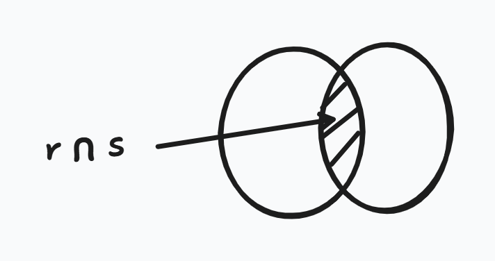

Overall, there are three Formal Relational Query Languages : 

1. Relational Algebra
2. Tuple Relational Calculus
3. Domain Relational Calculus

## Relational Algebra 

Relational Algebra was created by E.Codd at IBM in 1970. It is a procedural language.

There are six operators. The operators may be unary or binary , the result will always result in a new relation.

### Selection 

In selection operation, there is a *predicate*. 

$$ p $$ is a formula in propositional calculus, connected by AND , OR and NOT. 

where operators : =, !=, >,<,>=,<= .
A = B ^ D > 5   

- Selection operation performs a filter operation on the attributes and results a new relation.

### Projection 

The Projection Operation results the specific columns without any duplicates, following the set theory.
It takes out specific columns.

### Union Operation

The conditions to perform union operation are : 

1. Both the relations must have the same number of attributes / same number of columns.
2. The attribute domains must be of the same datatype.

### Difference Operation 

This operation gives the result of the first set and not the second set. It takes all the tuples in R and removes the common tuples in both the relations.

### Intersection 

Intersection takes the common tuples b/w both the relations R and S.

- r = r - (r - s)

### Cartesian Product 

Cartesian Product attributes are disjoint. The same attributes does not occur to both relations.
If they are not disjoint, then will use renaming.

### Rename 

**E** is the expression. Rename requires all the attributes for 

## Division Operation 

