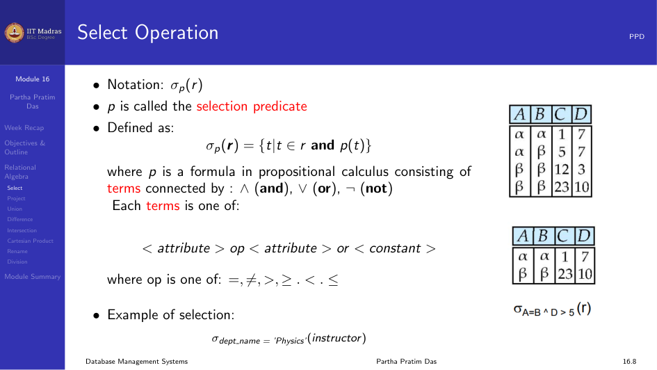
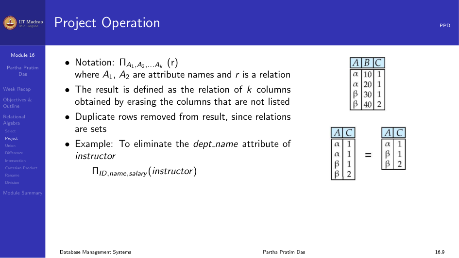
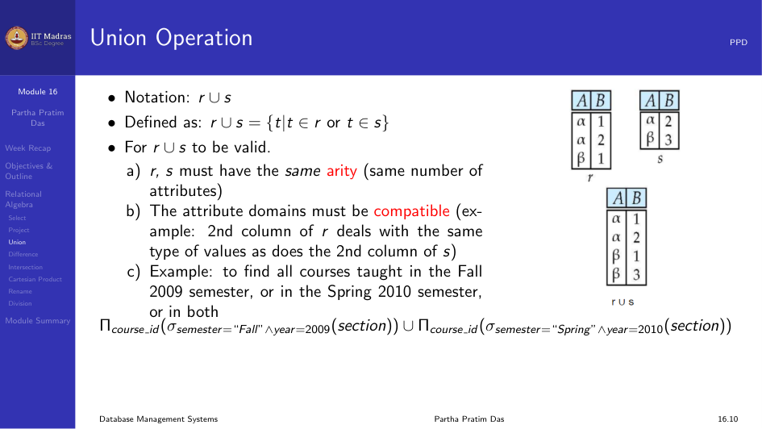
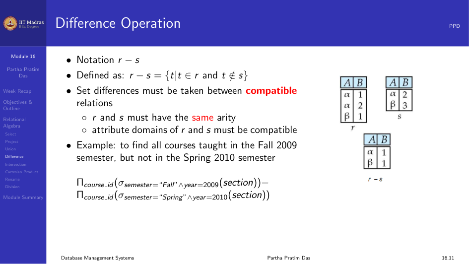
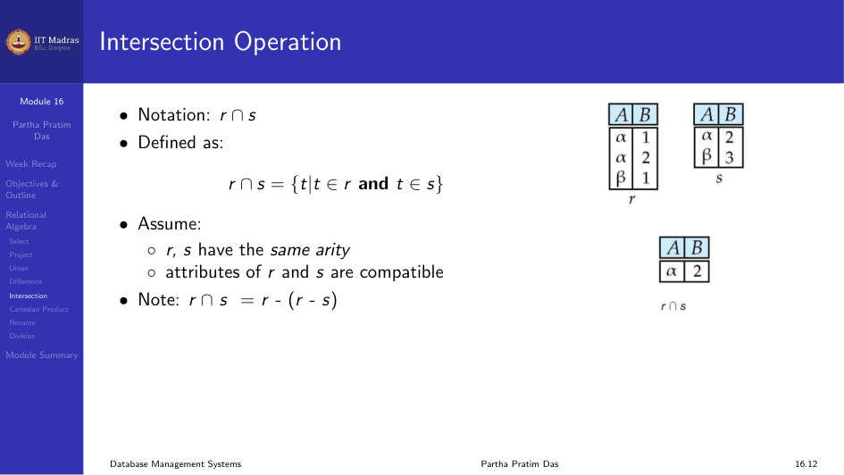
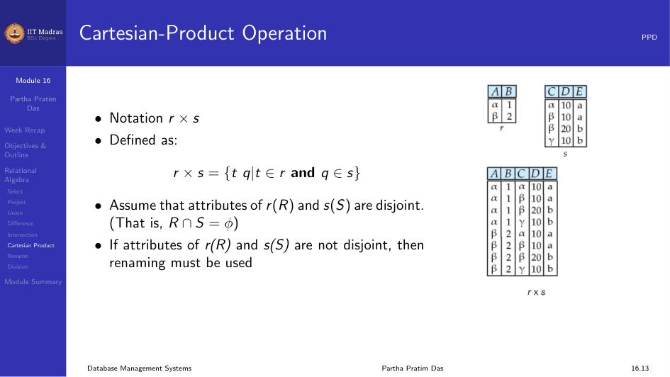
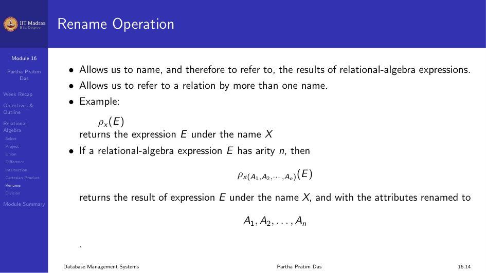
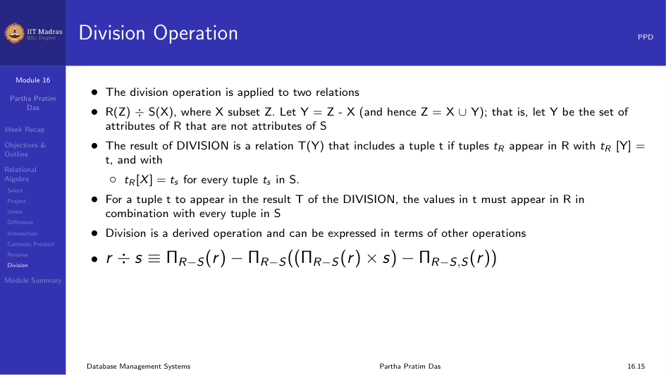
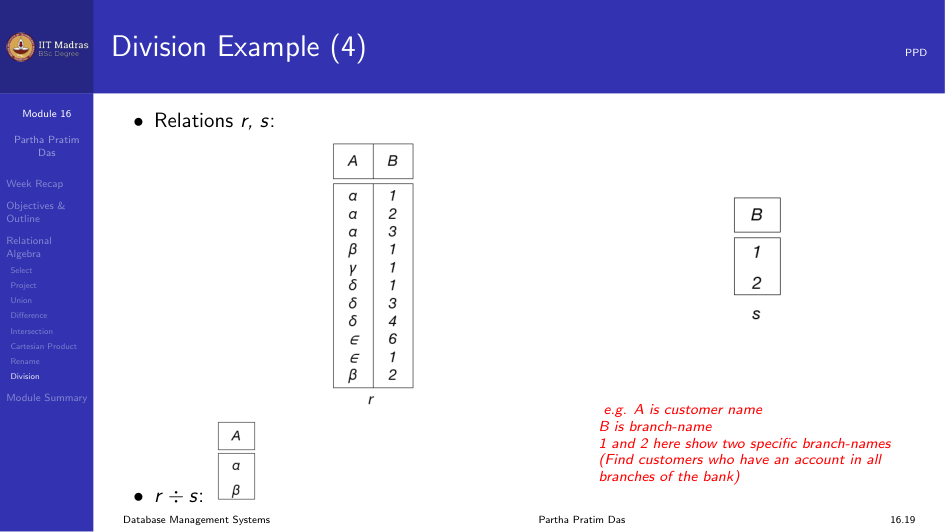
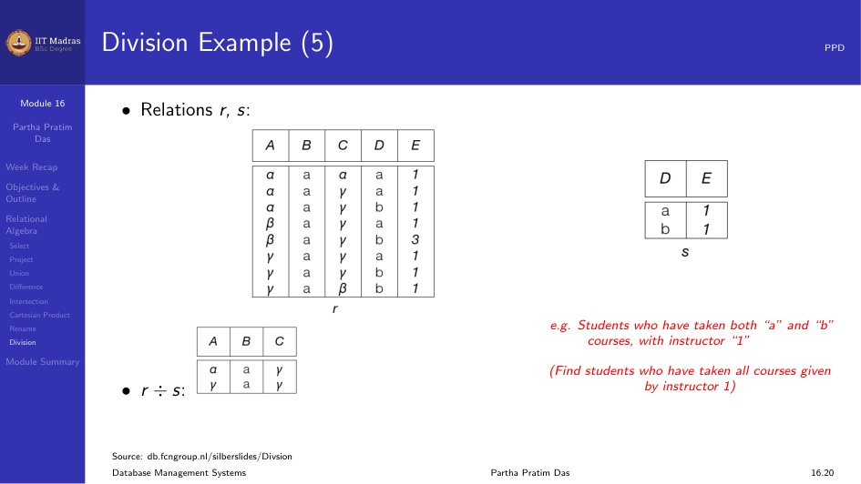

Relational Algebra and Relational Calculus are the foundational theoretical
parts which tell how data is retrieved from a DBMS. SQL's inner working is
derived from these two core ideas.

When we type a query:

```sql
SELECT * FROM Student;
```

the database converts it into a relational algebra expression.

What SQL can do, Relational Algebra and Relational Calculus can also do.

### What is Relational Algebra?

Relational Algebra was created by Edgar F. Codd at IBM in 1970. It is a
**procedural** language. In a procedural language, we mention clearly what
the predicate should be, what the condition is, what should be selected or
projected, and what result should be computed.

Relational Algebra has two main operations: Selection and Projection. There
are six basic operators in total. The operators may be unary or binary. The
result of any operation is always a new relation.

<div class="callout callout-important">
**Important for GATE.** In Week 12, we will see exactly how a query is
converted into Relational Algebra.
</div>

### Selection Operation

A `SELECT` query in SQL returns columns. The Selection Operation returns the
rows of a relation.

Notation:

$$
\sigma_p(r)
$$

where $p$ is called the selection predicate. It is defined as:

$$
\sigma_p(r) = \{ t \mid t \in r \text{ and } p(t) \}
$$

where $p$ is a formula in propositional calculus consisting of terms connected
by $\land$ (and), $\lor$ (or), $\lnot$ (not). Each term is one of:

<attribute> op <attribute> or <constant>

where op is one of: $=, \neq, >, \ge, <, \le$.

Example:

$$
\sigma_{\text{dept\_name} = \text{'Physics'}} (\text{instructor})
$$

This returns all instructors whose department name is Physics. The queries
won't be this simple. They will be combined with Projection and other
operations.



### Projection Operation

Projection operation is used to display columns. In Projection Operation,
duplicate values are removed because relations are sets.

Notation:

$$
\Pi_{A_1, A_2, \dots, A_k} (r)
$$

where $A_1, A_2$ are attribute names and $r$ is a relation.

Example: To eliminate the dept_name attribute of instructor:

$$
\Pi_{\text{ID}, \text{name}, \text{salary}} (\text{instructor})
$$

<div class="callout callout-important">
Every query we write in SQL can be written using these two operations of
Relational Algebra.
</div>



### Union Operation

Union Operation is used to return all the unique tuples from both relations.

Notation:

$$
r \cup s
$$

Defined as:

$$
r \cup s = \{ t \mid t \in r \text{ or } t \in s \}
$$

**Union Compatibility.** For $r \cup s$ to be valid, the following three
rules must apply:

1. Both relations must have the same datatype.
2. Both relations must have the same arity (same number of attributes).
3. The order of the attribute datatypes must be the same. For example, if
   the first relation has an attribute `Name` of type `varchar`, then the
   second relation's first attribute must also be of type `varchar`.

Example: Find all courses taught in the Fall 2009 semester, or in the Spring
2010 semester, or in both.

$$
\Pi_{\text{course\_id}}(\sigma_{\text{semester}=\text{"Fall"} \land \text{year}=2009}(\text{section}))
\;\cup\;
\Pi_{\text{course\_id}}(\sigma_{\text{semester}=\text{"Spring"} \land \text{year}=2010}(\text{section}))
$$



### Difference Operation

Notation:

$$
r - s
$$

Defined as:

$$
r - s = \{ t \mid t \in r \text{ and } t \notin s \}
$$

The compatibility rules for union apply for difference operation also.

<div class="callout callout-important">
First check if the question follows the compatibility rule and then solve
the question.
</div>

If we take two relations $r$ and $s$, the difference operation will display
the tuples of all elements in $r$ and remove the common elements of $s$ in
$r$.

Example: Find all courses taught in the Fall 2009 semester but not in the
Spring 2010 semester.

$$
\Pi_{\text{course\_id}}(\sigma_{\text{semester}=\text{"Fall"} \land \text{year}=2009}(\text{section}))
\;-\;
\Pi_{\text{course\_id}}(\sigma_{\text{semester}=\text{"Spring"} \land \text{year}=2010}(\text{section}))
$$



### Intersection Operation

Notation:

$$
r \cap s
$$

Defined as:

$$
r \cap s = \{ t \mid t \in r \text{ and } t \in s \}
$$

The same compatibility rules apply. Intersection can be derived from set
difference:

$$
r \cap s = r - (r - s)
$$

Intersection returns only the common tuples present in both relations.



### Cartesian Product

Notation:

$$
r \times s
$$

Defined as:

$$
r \times s = \{ t \, q \mid t \in r \text{ and } q \in s \}
$$

Cartesian Product is used to give all the possible combinations of both the
relations. This assumes that the attributes of $r(R)$ and $s(S)$ are
disjoint. If both relations have the same attributes when performing a
Cartesian Product, then we denote the attributes with the relation prefix.



### Rename Operation

The rename operation allows us to refer to a relation by more than one name.
We can also rename the attributes of a relation.

Example:

$$
\rho_X(E)
$$

returns the expression $E$ under the name $X$.

If a relational-algebra expression $E$ has arity $n$, then:

$$
\rho_{X(A_1, A_2, \dots, A_n)}(E)
$$

returns the result of expression $E$ under the name $X$, with the attributes
renamed to $A_1, A_2, \dots, A_n$.



### Division Operation

Division Operation is used to return the values of $R$ that have both the
values of $S$ in $R$.

$R(Z) \div S(X)$, where $X \subseteq Z$. Let $Y = Z - X$. The result of
division is a relation $T(Y)$ that includes a tuple $t$ if tuples $t_R$
appear in $R$ with $t_R[Y] = t$, and with $t_R[X] = t_s$ for every tuple
$t_s$ in $S$.

Division is a derived operation and can be expressed in terms of other
operations:

$$
r \div s \equiv \Pi_{R-S}(r) - \Pi_{R-S}((\Pi_{R-S}(r) \times s) - \Pi_{R-S,S}(r))
$$



#### Division Examples

Find customers who have an account in all branches of the bank.



Find students who have taken all courses given by instructor 1.



## Module Summary

In this module we discussed relational algebra. Relational Algebra is a
procedural language where we specify how to compute a query using operators
like select, project, union, difference, intersection, cartesian product,
rename, and division.
