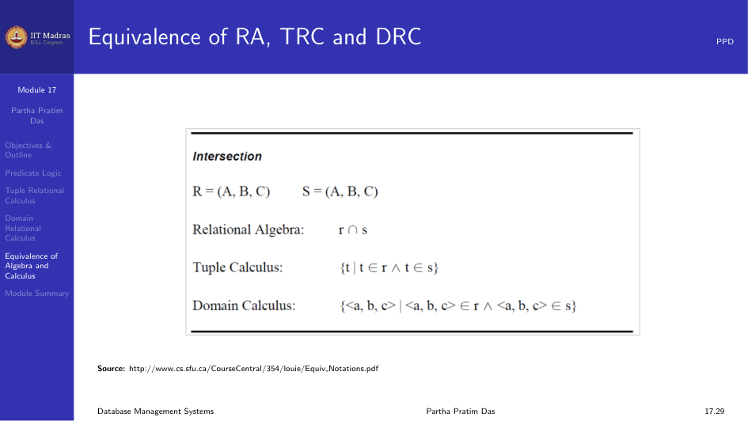
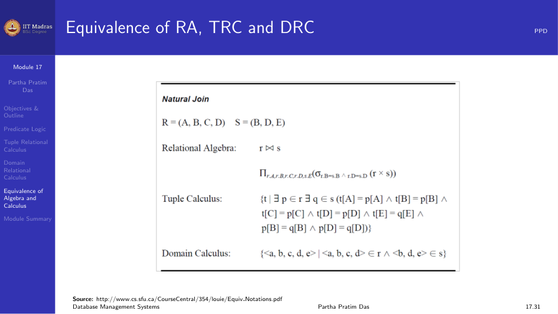

## Predicate Logic

Predicate Logic, also called Predicate Calculus, is an extension of
Propositional Logic or Boolean Algebra. In Boolean Algebra, we have
propositions or variables that take True or False values.

Predicate Logic adds the concept of predicates and quantifiers. This makes
the logic more expressive.

### Predicates

A predicate is a statement with a variable. For example, "x is greater than
3." Here x is a variable and "is greater than 3" is a property. This is
called a predicate.

It is denoted as $P(x)$. If we put a value, it becomes a proposition. For
example, $P(5)$ becomes a proposition that returns True or False.

We can think of the predicate value as a function. We can have any number
of variables.

Propositional Logic has limitations. From the statements "Socrates is
mortal" and "Plato is mortal", we cannot conclude that all humans are
mortal. Propositional Logic cannot be generalized and does not have
patterns or relationships. Predicate Logic solves this by breaking the
statement down into objects, relations, and properties.

### Quantifiers

Quantifiers are used to talk about properties that hold over the entire
domain in a certain way. There are two types.

1. **Universal Quantifier** ($\forall$). It means "for all".

$$
\forall x (\text{Human}(x) \rightarrow \text{Mortal}(x))
$$

For every $x$, if $x$ is Human then $x$ is mortal.

2. **Existential Quantifier** ($\exists$). It means "there exists".

$$
\exists x \; \text{Student}(x)
$$

There exists an $x$ such that $x$ is a Student.

Relational Logic is also called First-Order Logic.

## Tuple Relational Calculus

Tuple Relational Calculus is a non-procedural query language. In a
non-procedural language, you only describe what the output should be like.
It is the job of the DBMS to figure out how to get the result.

Each query is in the form:

$$
\{ t \mid P(t) \}
$$

$P(t)$ may have various logical connectives such as $\land$ (and),
$\lor$ (or), $\lnot$ (not), and $\Rightarrow$ (implication).

The components of the predicate are:
- Set of attributes.
- Set of comparison operators.
- Set of connectives.
- Implication.
- Set of quantifiers.

### Examples

Find the first names of students whose age is greater than 21.

$$
\{ t.\text{fname} \mid \text{Student}(t) \land t.\text{age} > 21 \}
$$

There are various ways to represent the same query:

$$
\{ t.\text{Fname} \mid \text{Student}(t) \land t.\text{age} > 21 \}
$$

$$
\{ t.\text{Fname} \mid t \in \text{Student} \land t.\text{age} > 21 \}
$$

$$
\{ t \mid \exists s \in \text{Student} (s.\text{age} > 21 \land t.\text{Fname} = s.\text{Fname}) \}
$$

If there are multiple attributes to project, we connect them using the
$\land$ connective.

## Domain Relational Calculus

Domain Relational Calculus treats a tuple as a collection of domain values.
Each attribute is a domain variable.

The form is:

$$
\{ \langle x_1, x_2, \dots, x_n \rangle \mid P(x_1, x_2, \dots, x_n) \}
$$

## Equivalence of Algebra and Calculus

Relational Algebra and Relational Calculus are equivalent in expressive
power. Every query that can be expressed in Relational Algebra can also be
expressed in Relational Calculus, and the other way around.

## Module Summary

Predicate Logic extends propositional logic with predicates and quantifiers.
Tuple Relational Calculus and Domain Relational Calculus are both
non-procedural languages based on Predicate Calculus. They are equivalent in
power to Relational Algebra.
