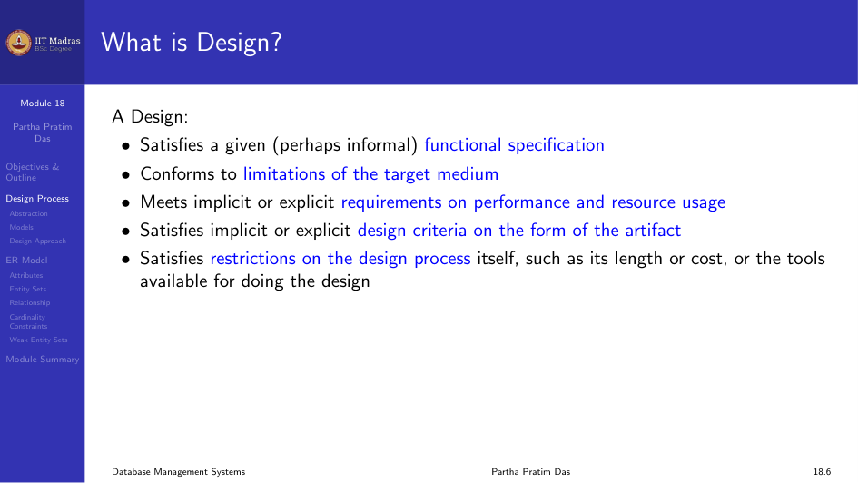
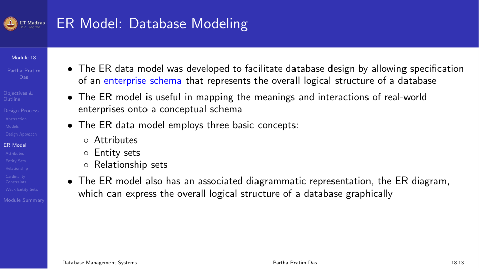
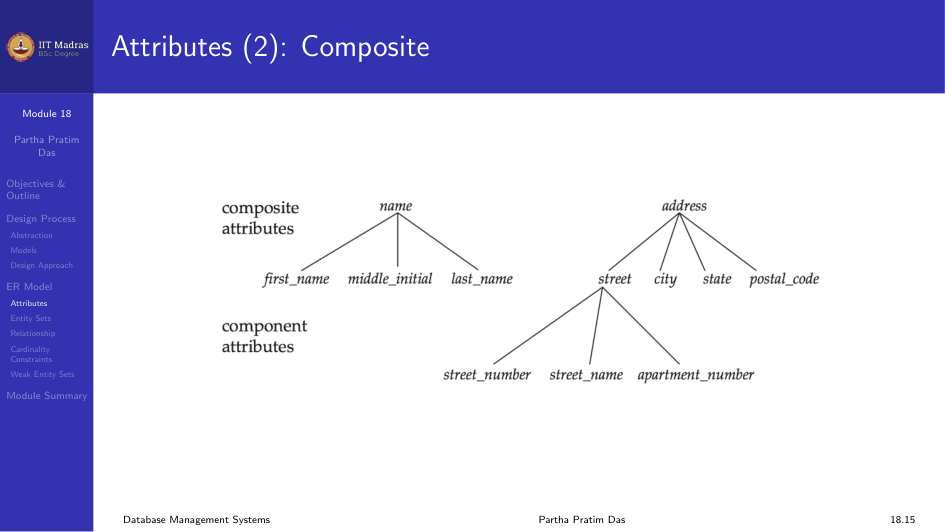
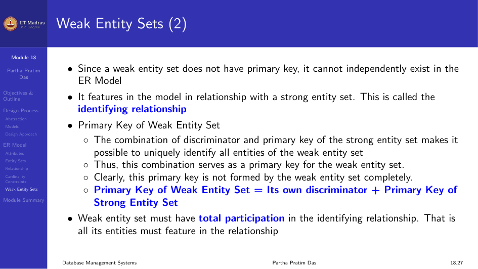
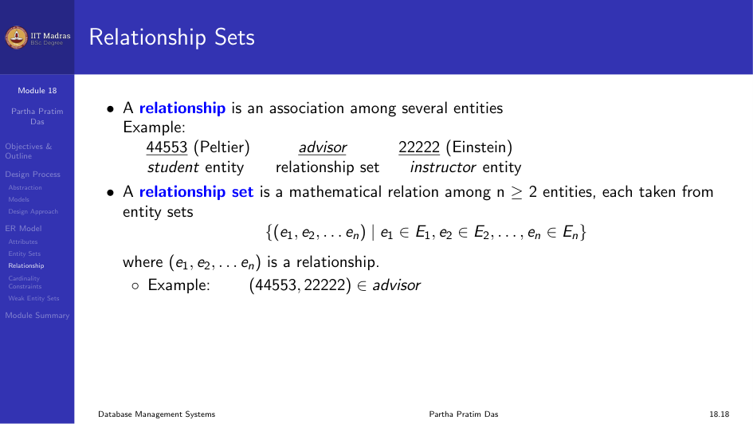
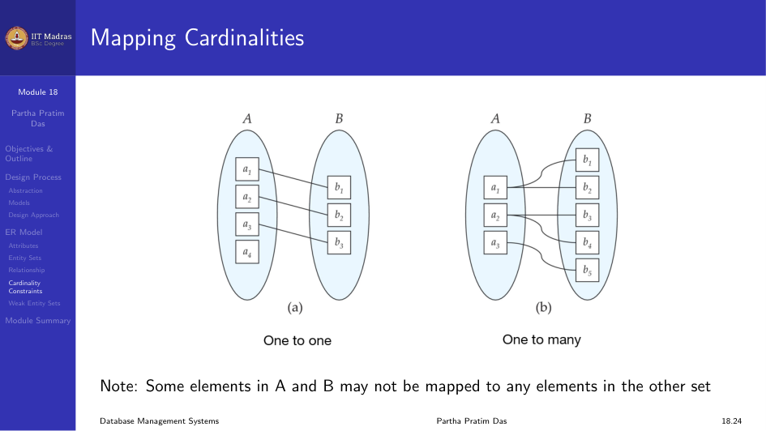

The Entity-Relationship (E-R) Model is used in the designing phase of a
database. It is a model that helps us visualize the data as a set of
entities and the relations that exist between them.

## Design Process

Database design follows a process of abstraction. We start from the real
world and move to a conceptual model, then to a logical model, and finally
to a physical schema.

## Entities and Entity Sets

An entity is a real-world object. In a student database, entities are
students, instructors, and departments.

An entity set is a collection of similar entities. It can be taken as a
relation with a set of entities that share the same attributes.

## Attributes

An attribute is a property associated with an entity. There are several
types of attributes.

1. **Simple and Composite (Compound) attributes.** A simple attribute cannot
   be divided further. A composite attribute can be divided into sub-units.
   For example, the attribute `name` can be divided into `first_name`,
   `middle_initial`, and `last_name`.

2. **Single-valued and Multi-valued attributes.** A single-valued attribute
   takes only one value. A multi-valued attribute takes multiple values,
   such as phone numbers.

3. **Derived attributes.** An attribute that can be computed from other
   stored attributes. For example, `age` can be calculated from `date_of_birth`.

The domain is the set of all values that an attribute can take.

## Entity Sets

### Strong Entity Set

A strong entity set contains sufficient attributes to uniquely identify all
its entities. In other words, a primary key exists for a strong entity set.
The primary key is shown by underlining it.

### Weak Entity Set

A weak entity set does not contain sufficient attributes to uniquely
identify its entities. It does not have a primary key. However, it contains
a partial key called a discriminator. The discriminator is shown by
underlining with a dashed line.

Since a weak entity set does not have a primary key, it cannot independently
exist in the ER Model. It appears in a relationship with a strong entity
set. This is called the identifying relationship.

The primary key of a weak entity set is:

$$
\text{Primary Key} = \text{Discriminator} + \text{Primary Key of Strong Entity Set}
$$

A weak entity set must have total participation in the identifying
relationship. All its entities must feature in the relationship.

#### Example

Strong entity set: Building(building_no, building_name, address). Here
`building_no` is the primary key.

Weak entity set: Apartment(door_no, floor). Here `door_no` is the
discriminator because door number alone cannot identify an apartment
uniquely. There may be several other buildings with the same door number.

Relationship: BA between Building and Apartment.

By total participation in BA, each apartment must be present in at least one
building. Building has partial participation because there may be buildings
with no apartments.

Primary key of Apartment = building_no + door_no

## Relationship Sets

A relationship is an association among entities. A relationship set is a
set of relationships of the same type.

For example, the relationship `advisor` associates a student with an
instructor.

### Degree of a Relationship

Most relationship sets are binary (involving two entity sets). Relationships
between more than two entity sets are rare. For example, the project_guide
relationship is a ternary relationship between instructor, student, and
project.

## Mapping Cardinality Constraints

Mapping cardinality expresses the number of entities to which another entity
can be associated through a relationship set. For a binary relationship set,
the mapping cardinality must be one of the following types.

### One-to-One Relationship

Each instructor has at most one student. Each student has at most one
instructor.

### One-to-Many Relationship

Each instructor has one or many students. Each student has at most one
instructor.

### Many-to-One Relationship

Each instructor has at most one student. Each student has one or many
instructors.

### Many-to-Many Relationship

Each instructor has one or many students. Each student has one or many
instructors. For a many-to-many relationship, we need three tables to
represent the entity set. There is an intermediate table that references
the many-to-many relationship between two tables.

## Participation Constraints

Total participation (indicated by a double line) means that every entity in
the entity set participates in at least one relationship in the relationship
set. For example, the participation of `student` in the `advisor` relation
is total because every student must have an associated instructor.

Partial participation means some entities may not participate in any
relationship in the relationship set. For example, the participation of
`instructor` in the `advisor` relation is partial.

## Module Summary

We introduced the design process for database systems and the E-R Model for
real-world representation with entities, entity sets, attributes, and
relationships.
