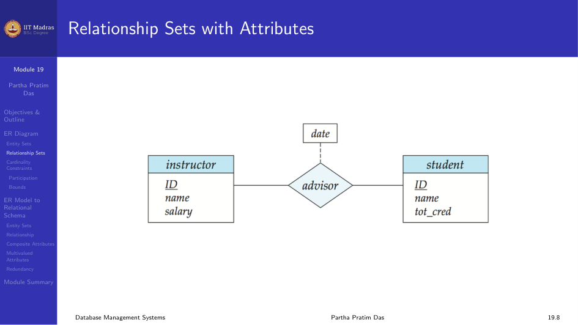
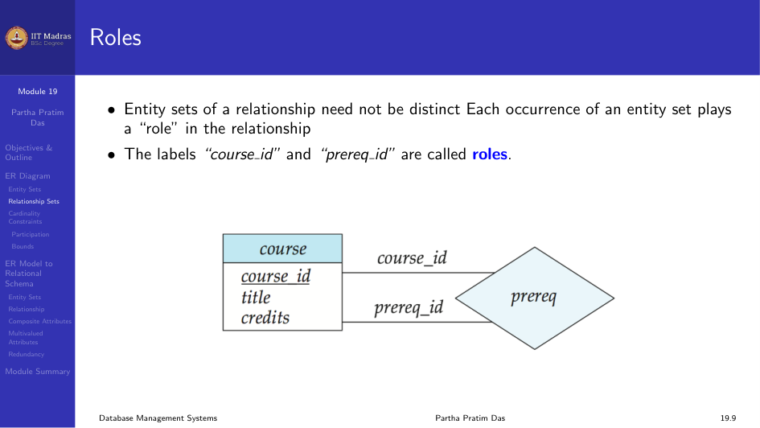
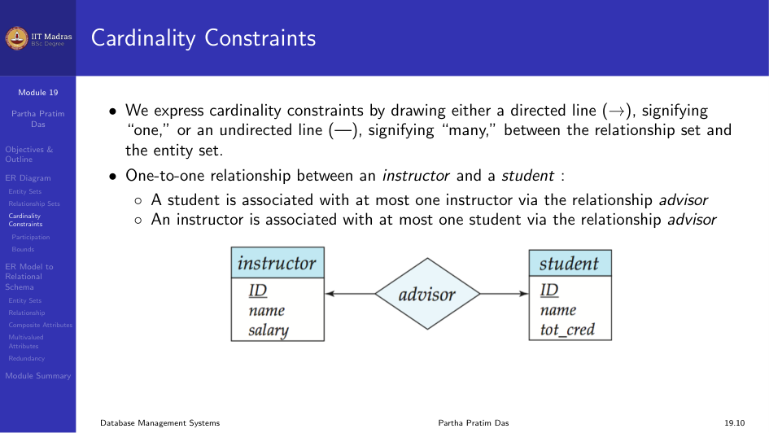
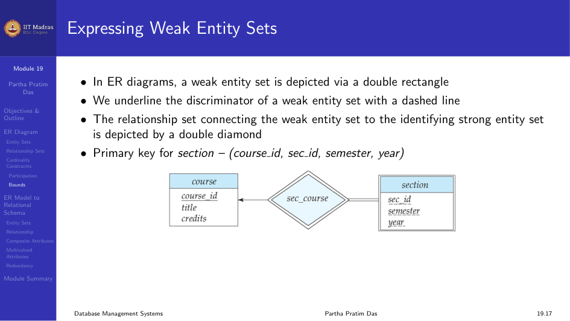
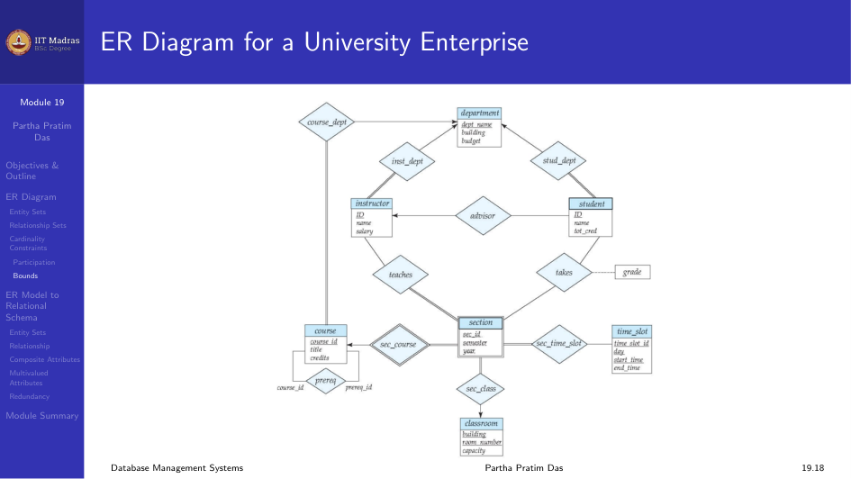
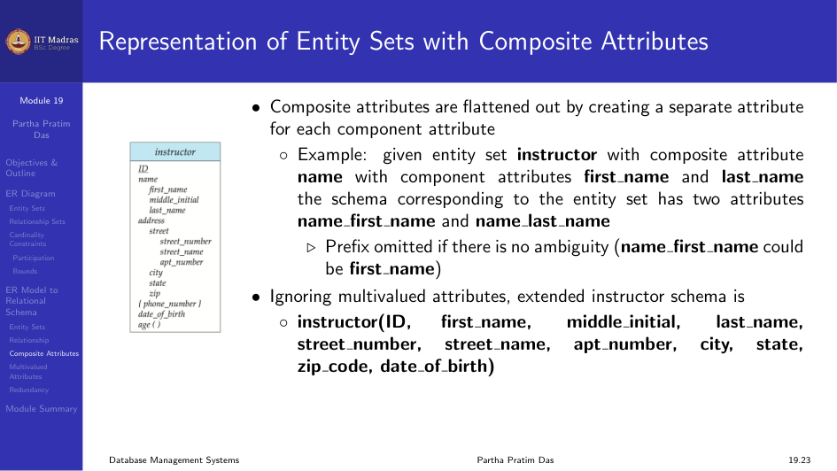
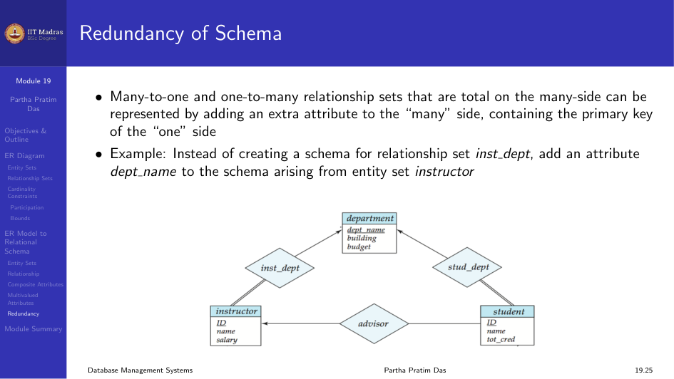

In this module we look at ER Diagram notation and how to translate ER Models
into relational schemas.

## ER Diagram Notation

Entity sets and relationship sets can be represented graphically using
standard symbols.

- Rectangles represent entity sets.
- Attributes are listed inside the entity rectangle.
- An underline indicates the primary key attribute.
- Diamonds represent relationship sets.

### Relationship Sets with Attributes

Relationship sets can also have descriptive attributes. For example, the
`advisor` relationship may have a `date` attribute.

### Roles

Entity sets in a relationship need not be distinct. Each occurrence of an
entity set plays a role in the relationship. For example, in the `prereq`
relationship, the labels `course_id` and `prereq_id` are called roles.

### Cardinality Constraints in ER Diagrams

We express cardinality constraints by drawing either a directed line
($\rightarrow$), signifying "one", or an undirected line ($-$), signifying
"many", between the relationship set and the entity set.

- One-to-one: arrow on both sides.
- One-to-many: arrow on the "one" side.
- Many-to-many: no arrows.

### Expressing More Complex Constraints

A line may have an associated minimum and maximum cardinality, shown in the
form $l..h$, where $l$ is the minimum and $h$ is the maximum cardinality.

- A minimum value of 1 indicates total participation.
- A maximum value of 1 indicates that the entity participates in at most one
  relationship.
- A maximum value of $*$ indicates no limit.

For example, an instructor can advise 0 or more students. A student must
have 1 advisor and cannot have multiple advisors.

### Weak Entity Sets in ER Diagrams

- A weak entity set is shown with a double rectangle.
- The discriminator is underlined with a dashed line.
- The identifying relationship is shown with a double diamond.
- Primary key for `section` is (course_id, sec_id, semester, year).

### Complete ER Diagram for a University Enterprise

## Reduction to Relational Schema

Entity sets and relationship sets can be expressed uniformly as relation
schemas that represent the contents of the database. For each entity set
and relationship set, there is a unique schema that is assigned the name of
the corresponding entity set or relationship set.

### Representing Strong Entity Sets

A strong entity set reduces to a schema with the same attributes.

$$
\text{student}(\text{ID}, \text{name}, \text{tot\_cred})
$$

### Representing Weak Entity Sets

A weak entity set becomes a table that includes a column for the primary key
of the identifying strong entity set.

$$
\text{section}(\text{course\_id}, \text{sec\_id}, \text{sem}, \text{year})
$$

### Representing Relationship Sets

A many-to-many relationship set is represented as a schema with attributes
for the primary keys of the two participating entity sets and any
descriptive attributes.

Example: schema for relationship set `advisor`:

$$
\text{advisor} = (\text{s\_id}, \text{i\_id})
$$

### Composite Attributes

Composite attributes are flattened out by creating a separate attribute for
each component attribute.

Example: given entity set `instructor` with composite attribute `name` with
component attributes `first_name` and `last_name`, the schema has two
attributes: `name_first_name` and `name_last_name`.

### Multivalued Attributes

A multivalued attribute $M$ of an entity $E$ is represented by a separate
schema $E_M$. Schema $E_M$ has attributes corresponding to the primary key
of $E$ and an attribute corresponding to the multivalued attribute $M$.

Example: multivalued attribute `phone_number` of `instructor` is represented
by a schema:

$$
\text{inst\_phone} = (\text{ID}, \text{phone\_number})
$$

Each value of the multivalued attribute maps to a separate tuple of the
relation on schema $E_M$.

### Redundancy of Schema for Relationships

Many-to-one and one-to-many relationship sets that are total on the
many-side can be represented by adding an extra attribute to the "many"
side, containing the primary key of the "one" side.

Example: Instead of creating a schema for relationship set `inst_dept`, add
an attribute `dept_name` to the schema arising from entity set `instructor`.

For one-to-one relationship sets, either side can be chosen to act as the
"many" side.

If participation is partial on the "many" side, replacing a schema by an
extra attribute in the schema corresponding to the "many" side could result
in null values.

The schema corresponding to a relationship set linking a weak entity set to
its identifying strong entity set is redundant. For example, the `section`
schema already contains the attributes that would appear in the `sec_course`
schema.

## Module Summary

We illustrated ER Diagram notation for ER Models and discussed the
translation of ER Models to relational schemas.
