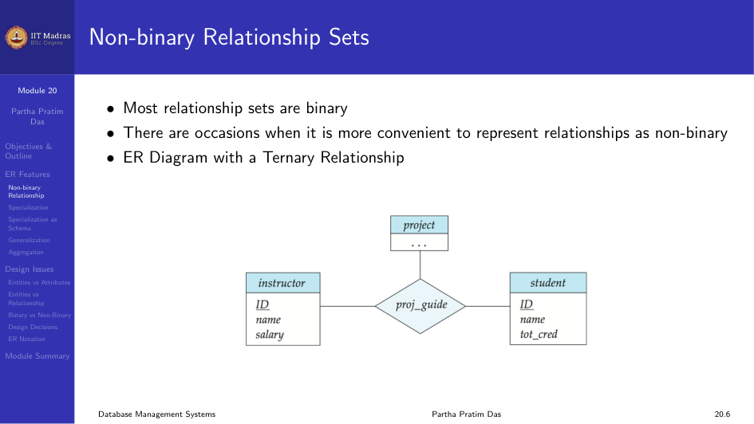
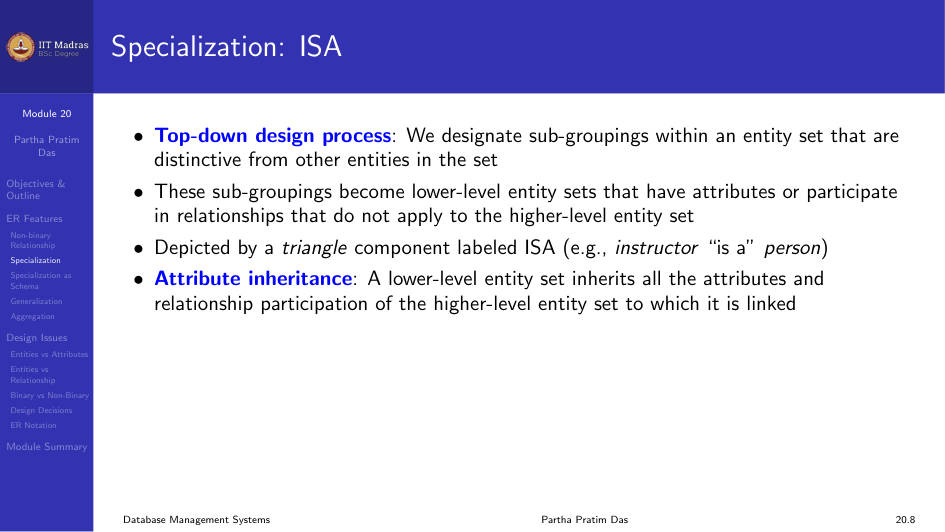
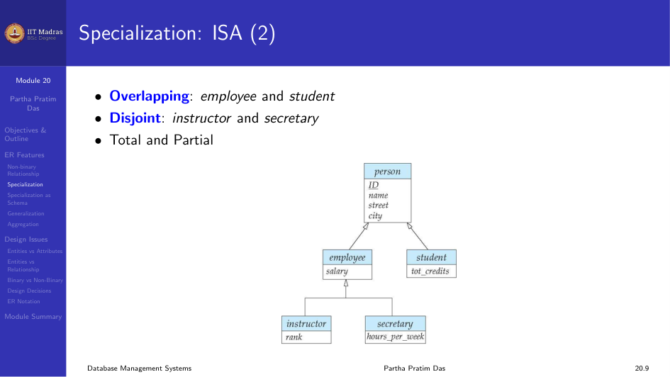
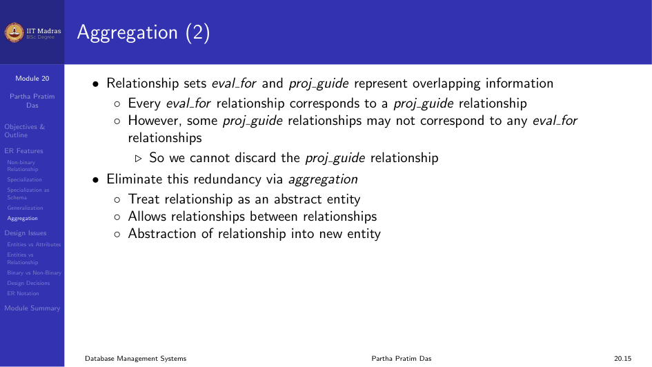
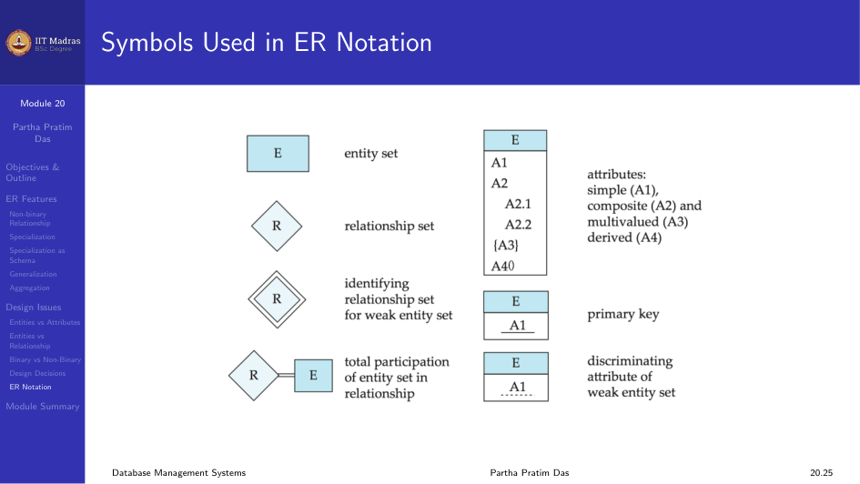

In this module we look at extended features of the ER Model and discuss
various design issues.

## Extended ER Features

### Non-binary Relationship Sets

Most relationship sets are binary. There are occasions when it is more
convenient to represent relationships as non-binary (ternary or higher).

#### Cardinality Constraints on Ternary Relationships

We allow at most one arrow out of a ternary or higher-degree relationship
to indicate a cardinality constraint. For example, an arrow from
`proj_guide` to `instructor` indicates each student has at most one guide
for a project.

If there is more than one arrow, there are two ways of defining the
meaning, which can cause confusion. To avoid this, we allow at most one
arrow.

### Specialization (ISA)

Specialization is a top-down design process. We designate sub-groupings
within an entity set that are distinctive from other entities in the set.

These sub-groupings become lower-level entity sets that have attributes or
participate in relationships that do not apply to the higher-level entity
set. It is depicted by a triangle component labeled ISA (meaning "is a").

**Attribute inheritance.** A lower-level entity set inherits all the
attributes and relationship participation of the higher-level entity set to
which it is linked.

**Overlapping vs Disjoint.** In overlapping specialization, an entity can
belong to more than one lower-level entity set (for example, a person can be
both an employee and a student). In disjoint specialization, an entity can
belong to at most one lower-level entity set (for example, an instructor or
a secretary).

**Total vs Partial.** Total specialization means every higher-level entity
must belong to one of the lower-level entity sets. Partial means some
higher-level entities may not belong to any lower-level set.

#### Representing Specialization via Schema

There are two methods.

**Method 1.** Form a schema for the higher-level entity. Form a schema for
each lower-level entity set, include the primary key of the higher-level
entity set and local attributes. The drawback is that getting information
about an employee requires accessing two relations.

**Method 2.** Form a schema for each entity set with all local and inherited
attributes. The drawback is that attributes like name, street, and city may
be stored redundantly for people who are both students and employees.

### Generalization

Generalization is a bottom-up design process. We combine a number of entity
sets that share the same features into a higher-level entity set.

Specialization and generalization are simple inversions of each other. They
are represented in an ER diagram in the same way.

#### Completeness Constraint

The completeness constraint specifies whether or not an entity in the
higher-level entity set must belong to at least one of the lower-level
entity sets within a generalization.

- **Total.** An entity must belong to one of the lower-level entity sets.
- **Partial.** An entity need not belong to one of the lower-level entity
  sets. This is the default.

### Aggregation

Aggregation treats a relationship as an abstract entity. It allows
relationships between relationships.

Consider the ternary relationship `proj_guide`. Suppose we want to record
evaluations of a student by a guide on a project. The relationship sets
`eval_for` and `proj_guide` represent overlapping information. Every
`eval_for` relationship corresponds to a `proj_guide` relationship, but
some `proj_guide` relationships may not correspond to any `eval_for`
relationship. So we cannot discard the `proj_guide` relationship.

We eliminate this redundancy through aggregation. We treat the relationship
as an abstract entity.

#### Representing Aggregation via Schema

To represent aggregation, create a schema containing:
- The primary key of the aggregated relationship.
- The primary key of the associated entity set.
- Any descriptive attributes.

In our example:

$$
\text{eval\_for} = (\text{s\_ID}, \text{project\_id}, \text{i\_ID}, \text{evaluation\_id})
$$

The schema `proj_guide` is redundant.

## Design Issues

### Entities vs Attributes

When designing a schema, you must decide whether a concept is better
represented as an entity or an attribute. For example, using phone as an
entity allows extra information about phone numbers and supports multiple
phone numbers.

### Entities vs Relationship Sets

A relationship set describes an action that occurs between entities. You
also need to decide where to place relationship attributes. For example,
should `date` be an attribute of `advisor` or of `student`?

### Binary vs Non-binary Relationships

Although it is possible to replace any non-binary relationship set by a
number of distinct binary relationship sets, an n-ary relationship set shows
more clearly that several entities participate in a single relationship.

Some relationships that appear to be non-binary may be better represented
using binary relationships. For example, a ternary relationship `parents`,
relating a child to father and mother, is better replaced by two binary
relationships `father` and `mother`. This allows partial information like
only the mother being known.

But some relationships are naturally non-binary, such as `proj_guide`.

#### Converting Non-binary to Binary

In general, any non-binary relationship can be represented using binary
relationships by creating an artificial entity set.

Replace relationship $R$ between entity sets $A$, $B$, $C$ by an entity set
$E$ and three relationship sets $R_A$, $R_B$, $R_C$. Create an identifying
attribute for $E$ and add any attributes of $R$ to $E$.

For each relationship $(a_i, b_i, c_i)$ in $R$, create a new entity $e_i$ in
$E$ and add $(e_i, a_i)$ to $R_A$, $(e_i, b_i)$ to $R_B$, and $(e_i, c_i)$
to $R_C$.

Translating all constraints may not be possible. There may be instances in
the translated schema that cannot correspond to any instance of $R$.

### Other Design Decisions

- Whether to use a strong or weak entity set.
- Whether to use specialization or generalization. This contributes to
  modularity in the design.
- Whether to use aggregation. You can treat the aggregate entity set as a
  single unit without concern for the details of its internal structure.

## Symbols Used in ER Notation

Different notations exist for ER diagrams. The most common ones are Chen
notation and IDE1FX (Crows feet notation).

## Module Summary

We discussed the extended features of the ER Model and examined various
design issues that come up when building ER diagrams.
