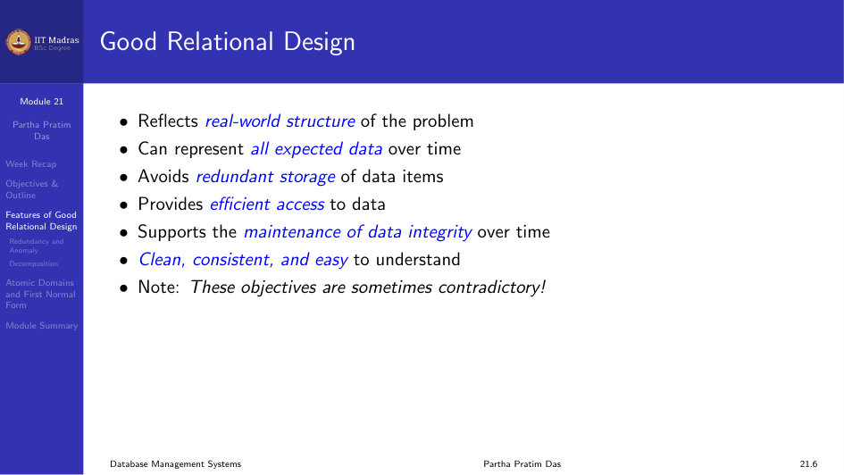
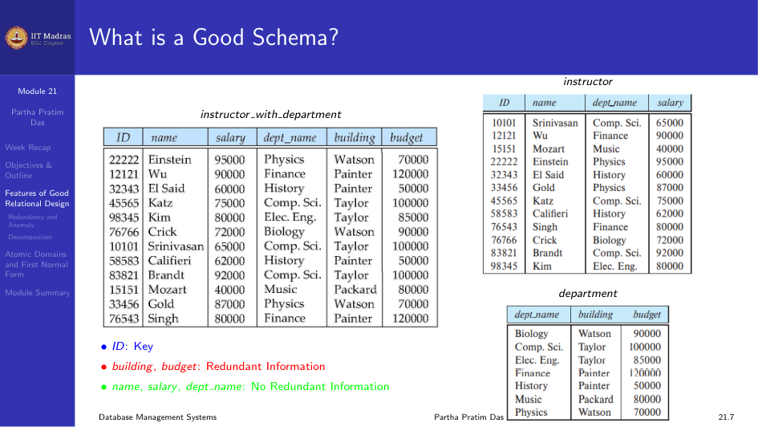
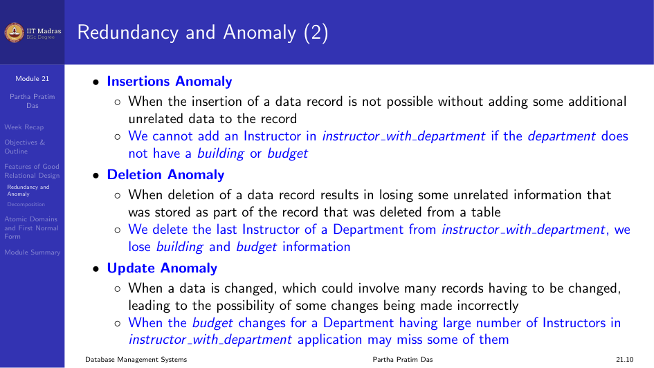
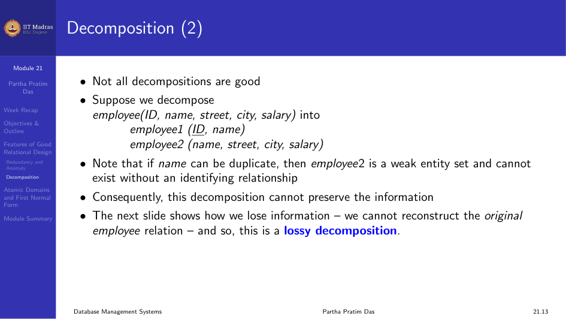
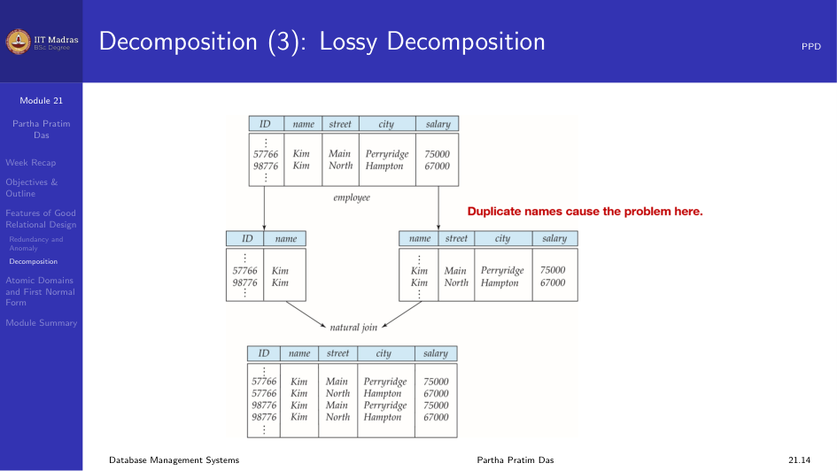
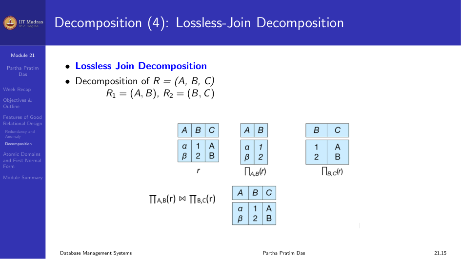
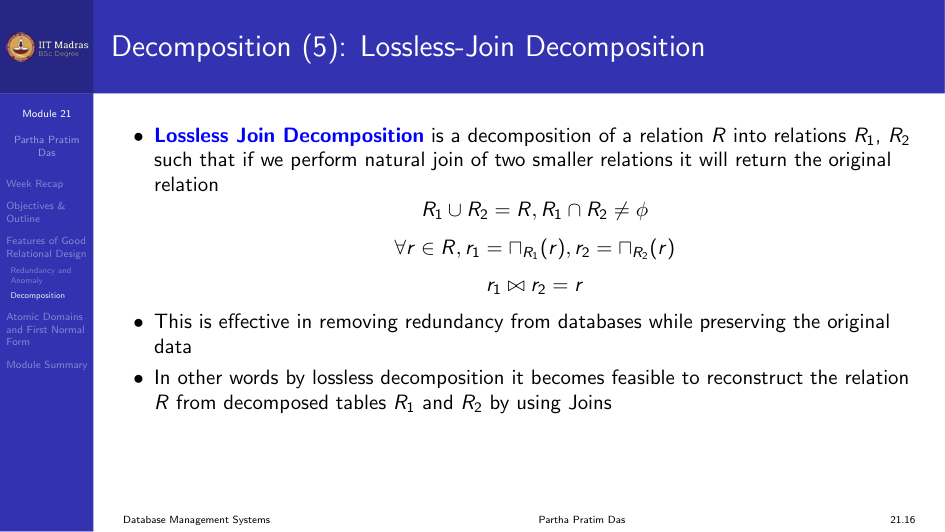
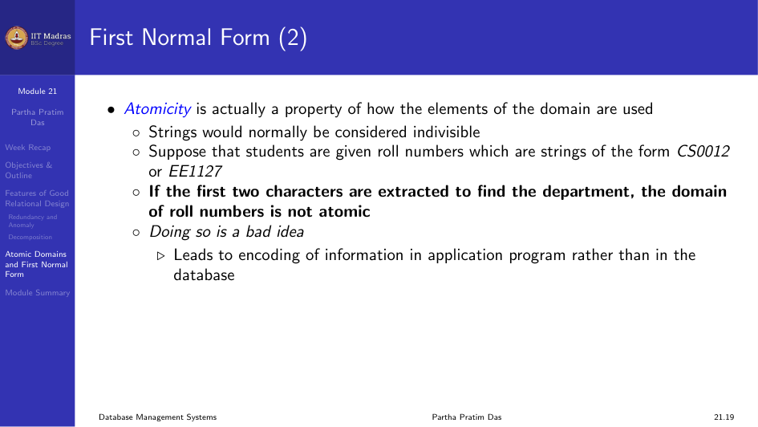
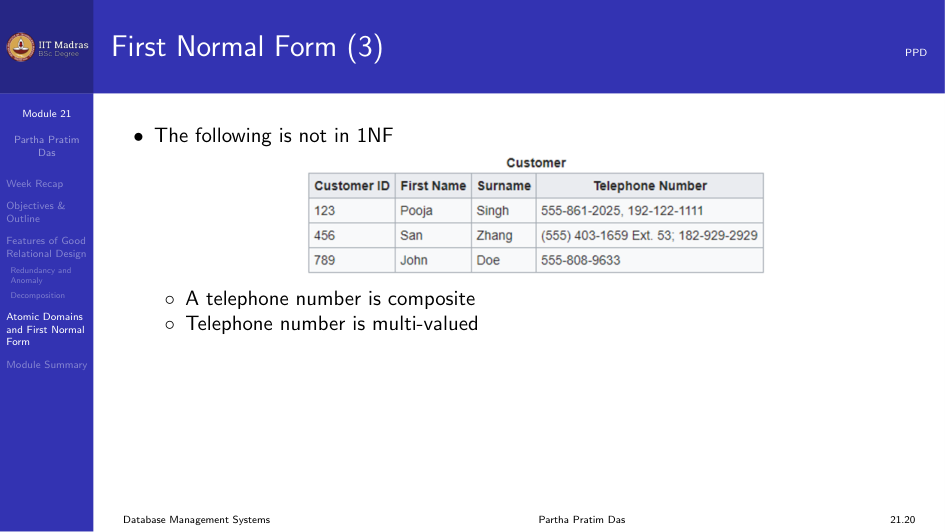

## Good DB Design

A good database design should meet three goals. First, it should
appropriately reflect the real world structure. It should represent all
kinds of data that we want to represent about a particular entity. Second,
it should avoid storing redundant data items across the database. Third, it
should be easy to access, maintain, and ensure that data integrity is
maintained throughout the database.

### Redundancy

Redundancy means having multiple copies of the same data. If a relation has
two attributes whose values are redundant, we split the table into two.

For example, consider a table where the values of `building` and `budget`
are repeated. Both Einstein and Gold belong to the Physics department.
Wherever we have multiple instructors belonging to the same department, we
get redundant information.

### What is a Good Schema?

Consider combining relations `sec_class(sec_id, building, room_number)` and
`section(course_id, sec_id, semester, year)` into one relation
`section(course_id, sec_id, semester, year, building, room_number)`. In this
case there is no repetition, so combining is fine.

## Redundancy and Anomaly

Redundancy leads to more storage in the database and mainly causes
anomalies. Anomalies are inconsistencies that arise when we change data in a
database that has redundant data. This happens when the data is not
normalized.

There are three types of anomalies.

### Insertion Anomaly

An insertion anomaly occurs when inserting some data requires inserting
unrelated data. For example, in a supplier relation, you cannot insert a new
supplier S5 located in Chennai until the supplier has supplied at least one
part, because PID is part of the key.

### Deletion Anomaly

A deletion anomaly occurs when deleting a data record results in the loss of
unrelated data. For example, if you delete the only record for a supplier
who is in Kota, you lose the information that Kota has status 40.

### Update Anomaly

An update anomaly occurs when updating data that is redundant in multiple
places, and some inconsistency arises. For example, if a supplier moves from
Delhi to Kanpur, you must update every record where that supplier appears.
If there are multiple records, inconsistency can come up easily.

## How to Reduce or Remove Redundancy

We divide the relation into smaller relations. This is called decomposition.

The chain of reasoning is:

- Redundancy causes anomalies.
- Dependencies cause redundancy.
- Good decomposition minimizes dependencies.
- Normalization gives us good decomposition.

## Normal Forms

Normal forms are a set of conditions that a relational schema must satisfy
based on its constraints. The common normal forms are 1NF, 2NF, 3NF, BCNF,
4NF, 5NF, and 6NF.

### First Normal Form (1NF)

Every domain is considered indivisible. A relation is in First Normal Form
if:
- The domains of all attributes of $R$ are atomic.
- Each value of an attribute must only be a single value from that domain.

The following table is not atomic and not in 1NF:

The telephone number is both composite (area code, number) and multi-valued.
Whenever we have a one-to-many relationship between attributes, we have this
problem. The solution is to decompose.

### First Normal Form: The Supplier Example

Consider the relation:

**Supplier(SID, Status, City, PID, Qty)**

Functional dependencies:
- SID $\rightarrow$ City (each supplier is in one city)
- City $\rightarrow$ Status (each city has a fixed status)
- (SID, PID) $\rightarrow$ Qty (a supplier supplies a specific quantity of a part)

The key is {SID, PID}.

This relation is in 1NF because all values are atomic. But it has a lot of
redundancy and the anomalies we described earlier.

### Second Normal Form (2NF)

A relation is in 2NF if:
1. It is in 1NF.
2. There is no partial dependency. A non-prime attribute does not depend on
   a proper subset of any candidate key.

A prime attribute is an attribute that is part of some candidate key. A
non-prime attribute is an attribute that does not belong to any candidate
key.

A partial dependency occurs when $Y \rightarrow A$, where $Y$ is a proper
subset of some candidate key and $A$ is a non-prime attribute.

#### Example: STUDENT(Sid, Sname, Cname)

Functional dependencies:
- Sid $\rightarrow$ Sname
- (Sid, Cname) $\rightarrow$ (all attributes)

Candidate key: {Sid, Cname}. Here, Sid is a proper subset of the candidate
key. Sname is a non-prime attribute. The FD Sid $\rightarrow$ Sname is a
partial dependency, so STUDENT is not in 2NF.

**Decomposition to 2NF:**
- R1(Sid, Sname): Sid is the key.
- R2(Sid, Cname): Sid and Cname together form the key.

#### Supplier Example Decomposed to 2NF

The original supplier relation had partial dependencies:
- SID $\rightarrow$ City (SID is a proper subset of {SID, PID})
- SID $\rightarrow$ Status (derived through transitivity: SID $\rightarrow$ City $\rightarrow$ Status)

**Decomposition to 2NF:**
- R1(SID, City, Status): Key is SID.
- R2(SID, PID, Qty): Key is {SID, PID}.

Now each supplier's city and status appear only once. The insertion,
deletion, and update anomalies for city and status are gone.

But even after 2NF, there may still be redundancy from transitive
dependencies.

### Third Normal Form (3NF)

A relation is in 3NF if:
1. It is in 2NF.
2. There is no transitive dependency. A non-prime attribute does not depend
   on another non-prime attribute.

A transitive dependency occurs when $A \rightarrow B$, $B \nrightarrow A$,
and $B \rightarrow C$, giving $A \rightarrow C$ through transitivity.

#### Example: Book(Title, Author, Author_Nationality)

- Title $\rightarrow$ Author
- Author $\nrightarrow$ Title
- Author $\rightarrow$ Author_Nationality

Then Title $\rightarrow$ Author_Nationality is a transitive dependency. If
the same author writes multiple books, the nationality is repeated.

#### The SUP_CITY Example after 2NF

After achieving 2NF, we have R1(SID, City, Status) with FDs:
- SID $\rightarrow$ City
- City $\rightarrow$ Status

Here SID $\rightarrow$ Status is a transitive dependency.

**Decomposition to 3NF:**
- SC(SID, City): Key is SID.
- CS(City, Status): Key is City.

Now the transitive dependency is broken.

### The Accepted Definition of 3NF

A relation $R$ is in 3NF if for every non-trivial FD $X \rightarrow A$:
1. $X$ is a superkey of $R$, or
2. $A$ is part of some candidate key of $R$ (a prime attribute).

If $X$ is not a superkey, there will be redundancy. But 3NF allows some
redundancy when $A$ is prime.

### Can 3NF Still Have Redundancy?

Yes. 3NF does not remove all redundancy. Consider a relation with attributes
$J$, $K$, $L$ and FDs:
- $JK \rightarrow L$
- $L \rightarrow K$

Here {J, K} is a candidate key. For the FD $L \rightarrow K$: $L$ is not a
superkey, but $K$ is a prime attribute. So this is in 3NF. However, if the
same value of $L$ appears in multiple tuples, $K$ is determined the same
way, causing redundancy. Removing this kind of redundancy needs BCNF.

## Module Summary

Normalization removes redundancy through decomposition. 1NF makes sure all
attribute values are atomic. 2NF removes partial dependencies. 3NF removes
transitive dependencies. Normal forms are hierarchical. Every decomposition
should have lossless join and dependency preservation.
