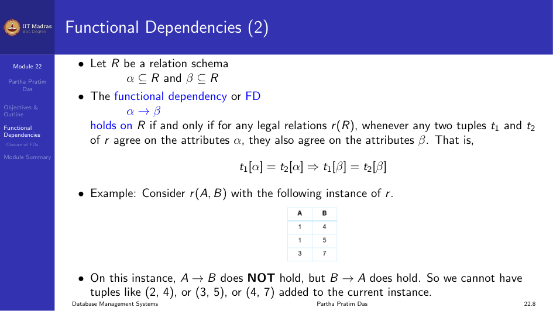

## Functional Dependencies

Functional dependencies are required to develop a formal mathematical theory
for good relations. A functional dependency is a generalization of the
notion of a key.

Let $R$ be a relation schema. Let $\alpha \subseteq R$ and $\beta \subseteq R$.

The functional dependency $\alpha \rightarrow \beta$ holds on $R$ if and
only if for any legal relations $r(R)$, whenever any two tuples $t_1$ and
$t_2$ of $r$ agree on the attributes $\alpha$, they also agree on the
attributes $\beta$. That is:

$$
t_1[\alpha] = t_2[\alpha] \Rightarrow t_1[\beta] = t_2[\beta]
$$

### Example

Consider $r(A, B)$ with the following instance:

If $A \rightarrow B$ does NOT hold but $B \rightarrow A$ does hold, then we
cannot have tuples like (2, 4) or (3, 5) added to the current instance.

### Superkeys and Candidate Keys

$K$ is a superkey for relation schema $R$ if and only if $K \rightarrow R$.

$K$ is a candidate key for $R$ if and only if:
- $K \rightarrow R$
- For no $\alpha \subset K$, $\alpha \rightarrow R$

### Expressing Constraints with FDs

Functional dependencies allow us to express constraints that cannot be
expressed using superkeys.

Consider the schema:

$$
\text{inst\_dept}(\text{ID}, \text{name}, \text{salary}, \text{dept\_name}, \text{building}, \text{budget})
$$

We expect these functional dependencies to hold:
- $\text{dept\_name} \rightarrow \text{building}$
- $\text{dept\_name} \rightarrow \text{budget}$
- $\text{ID} \rightarrow \text{budget}$

But we would not expect the following to hold:
- $\text{dept\_name} \rightarrow \text{salary}$

### Uses of Functional Dependencies

We use functional dependencies to:
1. Test relations to see if they are legal under a given set of functional
   dependencies. If a relation $r$ is legal under a set $F$ of functional
   dependencies, we say that $r$ satisfies $F$.
2. Specify constraints on the set of legal relations. We say that $F$ holds
   on $R$ if all legal relations on $R$ satisfy the set of functional
   dependencies $F$.

Note that a specific instance of a relation schema may satisfy a functional
dependency even if the functional dependency does not hold on all legal
instances. For example, a specific instance of `instructor` may, by chance,
satisfy $\text{name} \rightarrow \text{ID}$. In such cases we do not say
that the FD holds on $R$.

### Trivial Functional Dependencies

A functional dependency is trivial if it is satisfied by all instances of a
relation.

Examples:
- $\text{ID}, \text{name} \rightarrow \text{ID}$
- $\text{name} \rightarrow \text{name}$

In general, $\alpha \rightarrow \beta$ is trivial if $\beta \subseteq \alpha$.

### More Examples of Functional Dependencies

Functional dependencies can involve multiple attributes:

$$
\text{StudentID} \rightarrow \text{Semester}
$$

$$
\text{StudentID}, \text{Lecture} \rightarrow \text{TA}
$$

$$
\{\text{StudentID}, \text{Lecture}\} \rightarrow \{\text{TA}, \text{Semester}\}
$$

And in an employee context:

$$
\text{EmployeeID} \rightarrow \text{EmployeeName}
$$

$$
\text{EmployeeID} \rightarrow \text{DepartmentID}
$$

$$
\text{DepartmentID} \rightarrow \text{DepartmentName}
$$

## Closure of a Set of Functional Dependencies

Given a set $F$ of functional dependencies, we can infer new dependencies.
The closure of $F$, denoted $F^+$, is the set of all functional
dependencies logically implied by $F$.

Example: If $F = \{A \rightarrow B, B \rightarrow C\}$, then
$F^+ = \{A \rightarrow B, B \rightarrow C, A \rightarrow C\}$.

## Module Summary

We introduced the notion of functional dependencies. A functional dependency
$\alpha \rightarrow \beta$ means that if two tuples agree on $\alpha$, they
must agree on $\beta$. FDs generalize the concept of keys and allow us to
express constraints on the data.
