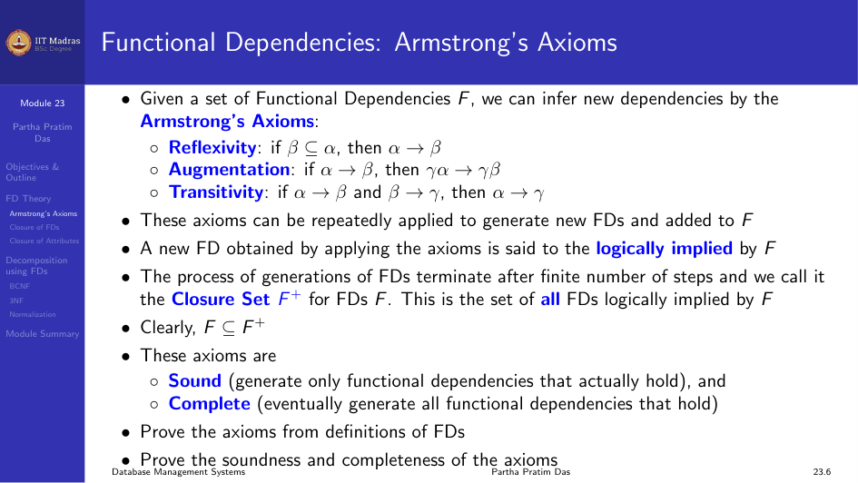
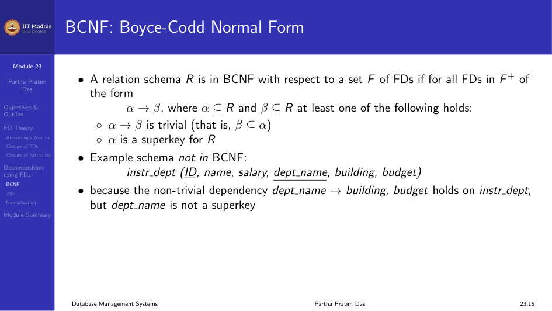
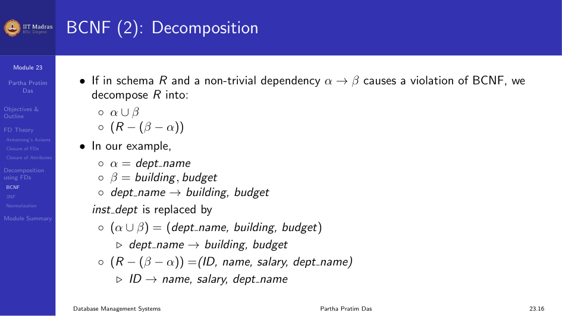

## Functional Dependency Theory

### Armstrong's Axioms

Given a set of functional dependencies $F$, we can infer new dependencies
using Armstrong's Axioms. These axioms are sound (they generate only FDs
that actually hold) and complete (they eventually generate all FDs that
hold).

1. **Reflexivity.** If $\beta \subseteq \alpha$, then $\alpha \rightarrow \beta$.
2. **Augmentation.** If $\alpha \rightarrow \beta$, then $\gamma\alpha \rightarrow \gamma\beta$.
3. **Transitivity.** If $\alpha \rightarrow \beta$ and $\beta \rightarrow \gamma$, then $\alpha \rightarrow \gamma$.

A new FD obtained by applying the axioms is said to be logically implied by
$F$. The process of generation terminates after a finite number of steps,
and we call the result the closure set $F^+$ for FDs $F$. This is the set of
all FDs logically implied by $F$.

### Derived Rules

- **Union.** If $\alpha \rightarrow \beta$ holds and $\alpha \rightarrow \gamma$
  holds, then $\alpha \rightarrow \beta\gamma$ holds.
- **Decomposition.** If $\alpha \rightarrow \beta\gamma$ holds, then
  $\alpha \rightarrow \beta$ holds and $\alpha \rightarrow \gamma$ holds.
- **Pseudotransitivity.** If $\alpha \rightarrow \beta$ holds and
  $\gamma\beta \rightarrow \delta$ holds, then $\alpha\gamma \rightarrow \delta$
  holds.

These derived rules can be proven from the basic Armstrong axioms.



### Example: Computing $F^+$

Let $R = (A, B, C, G, H, I)$ and
$F = \{A \rightarrow B, A \rightarrow C, CG \rightarrow H, CG \rightarrow I, B \rightarrow H\}$.

Some members of $F^+$:
- $A \rightarrow H$ by transitivity from $A \rightarrow B$ and $B \rightarrow H$.
- $AG \rightarrow I$ by augmenting $A \rightarrow C$ with $G$ to get
  $AG \rightarrow CG$, then transitivity with $CG \rightarrow I$.
- $CG \rightarrow HI$ by augmenting $CG \rightarrow I$ with $CG$ to get
  $CG \rightarrow CGI$, augmenting $CG \rightarrow H$ with $I$ to get
  $CGI \rightarrow HI$, then transitivity.

### Algorithm to Compute $F^+$

```
F+ := F
repeat
  for each FD f in F+:
    apply reflexivity and augmentation rules on f
    add resulting FDs to F+
  for each pair of FDs f1, f2 in F+:
    if f1 and f2 can be combined using transitivity
      add resulting FD to F+
until F+ does not change
```

## Closure of Attribute Sets

Given a set of attributes $\alpha$, the closure of $\alpha$ under $F$,
denoted $\alpha^+$, is the set of attributes that are functionally
determined by $\alpha$ under $F$.

### Algorithm to Compute $\alpha^+$

```
result := alpha
while (changes to result) do
  for each beta -> gamma in F do
    if beta ⊆ result then
      result := result ∪ gamma
```

### Example

$R = (A, B, C, G, H, I)$ and
$F = \{A \rightarrow B, A \rightarrow C, CG \rightarrow H, CG \rightarrow I, B \rightarrow H\}$.

Compute $(AG)^+$:

1. result = AG
2. result = ABCG (using $A \rightarrow C$ and $A \rightarrow B$)
3. result = ABCGH (using $CG \rightarrow H$ as $CG \subseteq ABCG$)
4. result = ABCGHI (using $CG \rightarrow I$)

So $(AG)^+ = ABCGHI$.

Is AG a candidate key?
- Is AG a superkey? Does $(AG)^+ \supseteq R$? Yes.
- Is any subset of AG a superkey? Does $A^+ \supseteq R$? Does $G^+ \supseteq R$?

### Uses of Attribute Closure

1. **Testing for superkey.** To test if $\alpha$ is a superkey, compute
   $\alpha^+$ and check if it contains all attributes of $R$.
2. **Testing functional dependencies.** To check if $\alpha \rightarrow \beta$
   holds, check if $\beta \subseteq \alpha^+$.
3. **Computing closure of $F$.** For each $\gamma \subseteq R$, find
   $\gamma^+$, and for each $S \subseteq \gamma^+$, output
   $\gamma \rightarrow S$.

## Decomposition Using Functional Dependencies

### BCNF: Boyce-Codd Normal Form

A relation schema $R$ is in BCNF with respect to a set $F$ of FDs if for all
FDs in $F^+$ of the form $\alpha \rightarrow \beta$, at least one of the
following holds:
- $\alpha \rightarrow \beta$ is trivial ($\beta \subseteq \alpha$)
- $\alpha$ is a superkey for $R$

#### Example Schema Not in BCNF

`instr_dept(ID, name, salary, dept_name, building, budget)` is not in BCNF
because the non-trivial dependency `dept_name -> building, budget` holds,
but `dept_name` is not a superkey.



#### BCNF Decomposition

If in schema $R$ a non-trivial dependency $\alpha \rightarrow \beta$ causes a
violation of BCNF, we decompose $R$ into:
- $\alpha \cup \beta$
- $R - (\beta - \alpha)$

In our example:
- $\alpha = \text{dept\_name}$
- $\beta = \text{building, budget}$
- $R_1 = (\text{dept\_name, building, budget})$
- $R_2 = (\text{ID, name, salary, dept\_name})$

#### Lossless Join in BCNF

If we decompose $R$ into $R_1$ and $R_2$:
- $R_1 \cup R_2 = R$ (Union of attributes must be the same)
- $R_1 \cap R_2 \neq \emptyset$ (Intersection must not be null)
- $R_1 \cap R_2 \rightarrow R_1$ or $R_1 \cap R_2 \rightarrow R_2$ (Common
  attribute must be a key for at least one relation)

BCNF ensures a lossless join.



#### Dependency Preservation in BCNF

It is not always possible to achieve both BCNF and dependency preservation.

Consider $R = CSZ$, $F = \{CS \rightarrow Z, Z \rightarrow C\}$.
- Key = CS
- $CS \rightarrow Z$ satisfies BCNF, but $Z \rightarrow C$ violates.
- Decompose as $R_1 = ZC$, $R_2 = SZ$. This is lossless join.
- However, we cannot check $CS \rightarrow Z$ without doing a join. So it
  is not dependency preserving.

We consider a weaker normal form, 3NF, to handle this.

### Third Normal Form (3NF)

A relation schema $R$ is in 3NF if for all $\alpha \rightarrow \beta \in F^+$,
at least one of the following holds:
- $\alpha \rightarrow \beta$ is trivial ($\beta \subseteq \alpha$)
- $\alpha$ is a superkey for $R$
- Each attribute $A$ in $\beta - \alpha$ is contained in a candidate key
  for $R$ (a prime attribute)

The third condition is a minimal relaxation of BCNF to ensure dependency
preservation.

If a relation is in BCNF, it is also in 3NF.

## Goals of Normalization

Let $R$ be a relation schema with a set $F$ of functional dependencies. The
goals are:
1. Decide whether $R$ is in good form.
2. If not, decompose it into a set of relation schemas $\{R_1, R_2, \dots, R_n\}$
   such that:
   - Each relation schema is in good form.
   - The decomposition is lossless join.
   - Preferably, the decomposition is dependency preserving.

### Problems with Decomposition

There are three potential problems:
- May be impossible to reconstruct the original relation (lossiness).
- Dependency checking may require joins.
- Some queries become more expensive.

You must consider these issues against the benefit of reduced redundancy.

## How Good is BCNF?

There are database schemas in BCNF that still have problems. Consider:

`inst_info(ID, child_name, phone)`

An instructor may have more than one phone and can have multiple children.
There are no non-trivial functional dependencies, so the relation is in
BCNF. But insertion anomalies still exist. If we add a phone
981-992-3443 to instructor 99999, we need to add two tuples:

```
(99999, David, 981-992-3443)
(99999, William, 981-992-3443)
```

It is better to decompose `inst_info` into `inst_child` and `inst_phone`.
This suggests the need for higher normal forms such as 4NF.

## Module Summary

We introduced the theory of functional dependencies including Armstrong's
Axioms, closure of attribute sets, and decomposition using FDs. We discussed
BCNF and 3NF, and the goals and problems of normalization.
