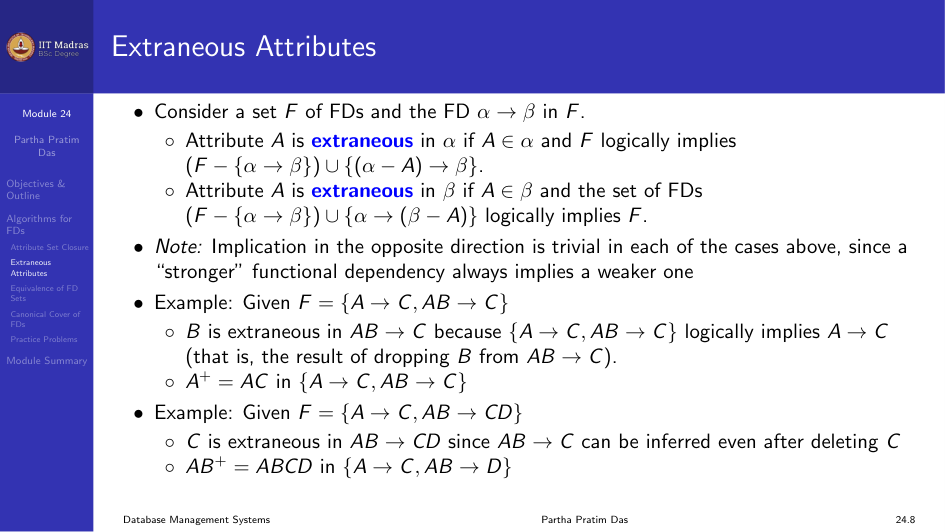
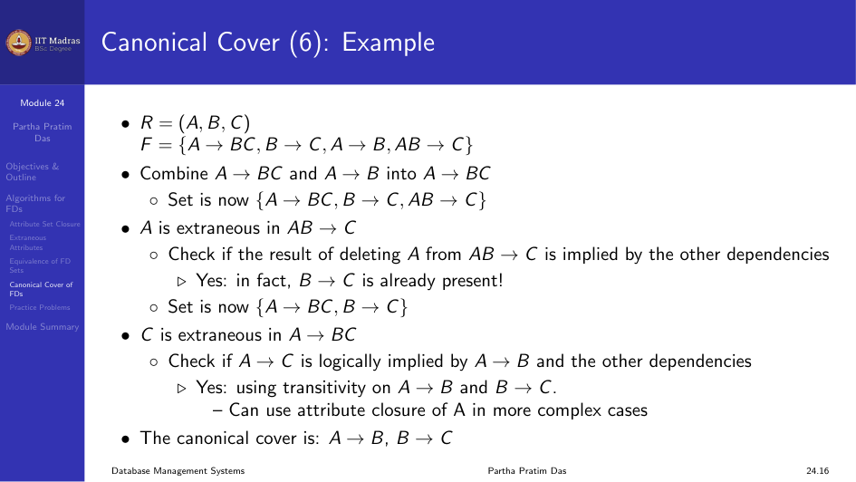

This module covers algorithms for working with functional dependencies,
including attribute set closure, extraneous attributes, equivalence of FD
sets, and canonical covers.

## Attribute Set Closure

We already saw the algorithm for computing $\alpha^+$ in the previous module.
Here we review its uses.

### Uses of Attribute Set Closure

1. **Testing for superkey.** To test if $\alpha$ is a superkey, compute
   $\alpha^+$ and check if it contains all attributes of $R$.
2. **Testing functional dependencies.** To check if $\alpha \rightarrow \beta$
   holds, check if $\beta \subseteq \alpha^+$.
3. **Computing closure of $F$.** For each $\gamma \subseteq R$, find
   $\gamma^+$, and for each $S \subseteq \gamma^+$, output
   $\gamma \rightarrow S$.

## Extraneous Attributes

An attribute is said to be extraneous if we can remove it from a functional
dependency without changing the closure of the dependency set.

Consider a set $F$ of FDs and the FD $\alpha \rightarrow \beta$ in $F$:

- Attribute $A$ is extraneous in $\alpha$ if $A \in \alpha$ and $F$ logically
  implies $(F - \{\alpha \rightarrow \beta\}) \cup \{(\alpha - A) \rightarrow \beta\}$.
- Attribute $A$ is extraneous in $\beta$ if $A \in \beta$ and the set of FDs
  $(F - \{\alpha \rightarrow \beta\}) \cup \{\alpha \rightarrow (\beta - A)\}$
  logically implies $F$.

### Testing for Extraneous Attributes

To test if attribute $A \in \alpha$ is extraneous in $\alpha$:
1. Compute $(\{\alpha\} - \{A\})^+$ using the dependencies in $F$.
2. Check that $(\{\alpha\} - \{A\})^+$ contains $\beta$. If it does, $A$ is
   extraneous in $\alpha$.

To test if attribute $A \in \beta$ is extraneous in $\beta$:
1. Compute $\alpha^+$ using only the dependencies in
   $F' = (F - \{\alpha \rightarrow \beta\}) \cup \{\alpha \rightarrow (\beta - A)\}$.
2. Check that $\alpha^+$ contains $A$. If it does, $A$ is extraneous in
   $\beta$.

### Examples

Given $F = \{A \rightarrow C, AB \rightarrow C\}$:

$B$ is extraneous in $AB \rightarrow C$ because $\{A \rightarrow C, AB \rightarrow C\}$
logically implies $A \rightarrow C$ (the result of dropping $B$ from
$AB \rightarrow C$).

Given $F = \{A \rightarrow C, AB \rightarrow CD\}$:

$C$ is extraneous in $AB \rightarrow CD$ since $AB \rightarrow C$ can be
inferred even after deleting $C$. $AB^+ = ABCD$ in $\{A \rightarrow C, AB \rightarrow D\}$.



## Equivalence of Sets of Functional Dependencies

Let $F$ and $G$ be two functional dependency sets. These two sets are
equivalent if $F^+ = G^+$.

- $F$ covers $G$: All functional dependencies of $G$ are logically members
  of functional dependency set $F$, which means $F^+ \supseteq G$.
- $G$ covers $F$: All functional dependencies of $F$ are logically members
  of functional dependency set $G$, which means $G^+ \supseteq F$.

## Canonical Cover

A canonical cover $F_c$ for a set $F$ of functional dependencies is a
minimal set of FDs such that:
1. $F^+ = F_c^+$ ($F$ logically implies all dependencies in $F_c$ and
   $F_c$ logically implies all dependencies in $F$).
2. No functional dependency in $F_c$ contains an extraneous attribute.
3. Each left side of a functional dependency in $F_c$ is unique. There are
   no two dependencies $\alpha_1 \rightarrow \beta_1$ and
   $\alpha_2 \rightarrow \beta_2$ in $F_c$ such that $\alpha_1 = \alpha_2$.

A canonical cover is also called a minimal or irreducible set of FDs.

### Algorithm to Compute Canonical Cover

```
repeat
  Use the union rule to replace any dependencies in F
    alpha1 -> beta1 and alpha1 -> beta2 with alpha1 -> beta1 beta2
  Find a functional dependency alpha -> beta with an
    extraneous attribute either in alpha or in beta
  If an extraneous attribute is found, delete it from alpha -> beta
until F does not change
```

Note: The union rule may become applicable after some extraneous attributes
have been deleted, so it has to be reapplied.

### Example

$R = (A, B, C)$, $F = \{A \rightarrow BC, B \rightarrow C, A \rightarrow B, AB \rightarrow C\}$

1. Combine $A \rightarrow BC$ and $A \rightarrow B$ into $A \rightarrow BC$.
   Set: $\{A \rightarrow BC, B \rightarrow C, AB \rightarrow C\}$.
2. $A$ is extraneous in $AB \rightarrow C$. Check if $B \rightarrow C$ is
   implied by the other dependencies. Yes, $B \rightarrow C$ is already
   present. Set: $\{A \rightarrow BC, B \rightarrow C\}$.
3. $C$ is extraneous in $A \rightarrow BC$. Check if $A \rightarrow C$ is
   implied by $A \rightarrow B$ and $B \rightarrow C$. Yes, using transitivity.

The canonical cover is: $A \rightarrow B$, $B \rightarrow C$.



## Practice Problems

### Check if a Given FD is Implied

For $A \rightarrow BC$, $CD \rightarrow E$, $E \rightarrow C$,
$D \rightarrow AEH$, $ABH \rightarrow BD$, $DH \rightarrow BC$:
- Check if $BCD \rightarrow H$ holds.
- Check if $AED \rightarrow C$ holds.

### Find Super Keys

Relational Schema $R(ABCDE)$ with FDs $AB \rightarrow C$, $DE \rightarrow B$,
$CD \rightarrow E$.

### Find Candidate Keys

Relational Schema $R(ABCDE)$ with FDs $AB \rightarrow C$, $C \rightarrow D$,
$B \rightarrow EA$.

### Find Prime and Non-Prime Attributes

For $R(ABCDEF)$ with FDs $\{AB \rightarrow C, C \rightarrow D, D \rightarrow E,
F \rightarrow B, E \rightarrow F\}$.

### Check Equivalence of FD Sets

Consider the two sets:
- $F: A \rightarrow C, AC \rightarrow D, E \rightarrow AD, E \rightarrow H$
- $G: A \rightarrow CD, E \rightarrow AH$

### Find Canonical Cover

For $\{ABCD \rightarrow E, E \rightarrow D, AC \rightarrow D, A \rightarrow B\}$.

## Module Summary

We studied algorithms for the properties of functional dependencies,
including attribute set closure, extraneous attributes, equivalence of FD
sets, and canonical covers.
