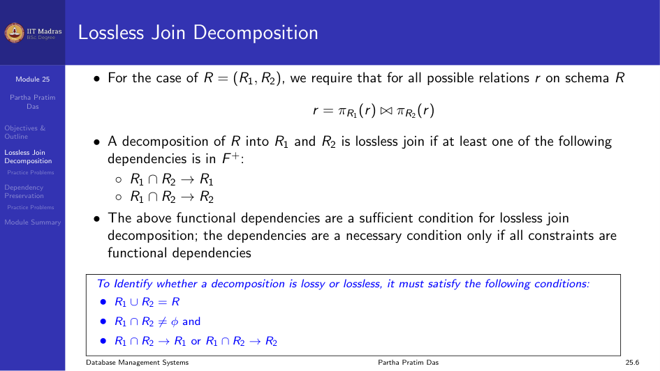
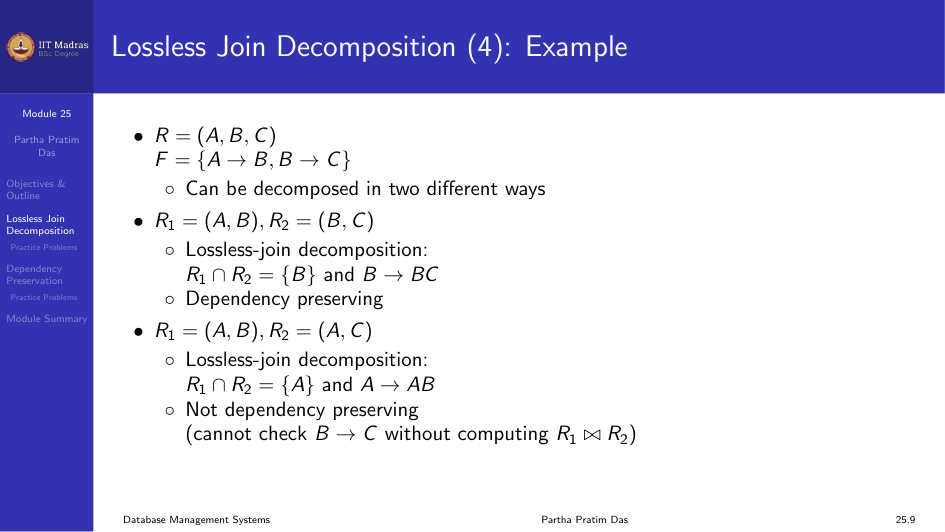

## Lossless Join Decomposition

When we decompose a relation into smaller relations, we need to be able to
reconstruct the original relation by performing a natural join. If the join
produces extra tuples that were not present in the original data, the
decomposition is called lossy. If we get back exactly the original relation,
it is called lossless.

### Conditions for Lossless Join

For the case of $R = (R_1, R_2)$, a decomposition of $R$ into $R_1$ and
$R_2$ is lossless join if at least one of the following dependencies is in
$F^+$:

- $R_1 \cap R_2 \rightarrow R_1$
- $R_1 \cap R_2 \rightarrow R_2$

In simpler terms, the three conditions are:
1. $R_1 \cup R_2 = R$ (the union of attributes reconstructs the original set).
2. $R_1 \cap R_2 \neq \emptyset$ (there is at least one common attribute).
3. $R_1 \cap R_2 \rightarrow R_1$ or $R_1 \cap R_2 \rightarrow R_2$ (the
   common attribute is a key for at least one of the relations).



### Example: Lossy Decomposition

Consider the Supplier Parts schema:

`Supplier_Parts(S#, Sname, City, P#, Qty)`

Functional dependencies:
- S# $\rightarrow$ Sname
- S# $\rightarrow$ City
- (S#, P#) $\rightarrow$ Qty

Decompose as: `Supplier(S#, Sname, City, Qty)` and `Parts(P#, Qty)`.

Take the natural join: `Supplier $\bowtie$ Parts`. We get extra tuples.
The join is lossy. The common attribute Qty is not a superkey in either
Supplier or Parts. The decomposition does not preserve (S#, P#) $\rightarrow$ Qty.

### Example: Lossless Decomposition

Same schema, but decompose as:
`Supplier(S#, Sname, City)` and `Parts(S#, P#, Qty)`.

Take the natural join: `Supplier $\bowtie$ Parts`. We get back the original
relation. The join is lossless. The common attribute S# is a superkey in
Supplier. All dependencies are preserved.

### Another Example

$R = (A, B, C)$, $F = \{A \rightarrow B, B \rightarrow C\}$.

**Decomposition 1:** $R_1 = (A, B)$, $R_2 = (B, C)$.
- Lossless join: $R_1 \cap R_2 = \{B\}$ and $B \rightarrow BC$.
- Dependency preserving.

**Decomposition 2:** $R_1 = (A, B)$, $R_2 = (A, C)$.
- Lossless join: $R_1 \cap R_2 = \{A\}$ and $A \rightarrow AB$.
- Not dependency preserving because we cannot check $B \rightarrow C$ without
  computing $R_1 \bowtie R_2$.



### Practice Problems: Lossless Join

Check if the decomposition of $R$ into $D$ is lossless:

1. $R(ABC)$: $F = \{A \rightarrow B, A \rightarrow C\}$.
   $D = \{R_1(AB), R_2(BC)\}$.

2. $R(ABCDEF)$: $F = \{A \rightarrow B, B \rightarrow C, C \rightarrow D, E \rightarrow F\}$.
   $D = \{R_1(AB), R_2(BCD), R_3(DEF)\}$.

## Dependency Preservation

When a relation is decomposed, it is important to ensure that functional
dependencies that held in the original relation are still maintained.

### Definition

Let $F_i$ be the set of dependencies in $F^+$ that include only attributes
in $R_i$. A decomposition is dependency preserving if:

$$
(F_1 \cup F_2 \cup \dots \cup F_n)^+ = F^+
$$

If it is not, checking updates for violation of functional dependencies may
require computing joins, which is expensive.

In terms of $F$ and the decomposed relations:
- If $F_1 \cup F_2 \equiv F$, the decomposition preserves dependencies.
- If $F_1 \cup F_2 \subset F$, the decomposition does NOT preserve dependencies.
- $F_1 \cup F_2 \supset F$ is not possible.

### Testing Dependency Preservation (Exponential Time)

```
compute F+;
for each schema Ri in D do
begin
  Fi = the restriction of F+ to Ri;
end
F' = empty;
for each restriction Fi do
begin
  F' = F' ∪ Fi;
end
compute F'+;
if (F'+ = F+) then return true;
else return false;
```

This procedure takes exponential time because it requires computing $F^+$
and $(F_1 \cup F_2 \cup \dots \cup F_n)^+$.

### Testing Dependency Preservation (Polynomial Time)

To check if a dependency $\alpha \rightarrow \beta$ is preserved in a
decomposition of $R$ into $R_1, R_2, \dots, R_n$, apply the following test:

```
result = alpha;
while (changes to result) do
  for each Ri in the decomposition
    t = (result ∩ Ri)+ ∩ Ri;
    result = result ∪ t;
If result contains all attributes in beta,
  then the functional dependency alpha -> beta is preserved.
```

We apply this test on all dependencies in $F$ to check if a decomposition
is dependency preserving. This procedure takes polynomial time.

### Example: Dependency Preservation

$R(A, B, C, D, E, F)$,
$F = \{A \rightarrow BCD, A \rightarrow EF, BC \rightarrow AD, BC \rightarrow E,
BC \rightarrow F, B \rightarrow F, D \rightarrow E\}$.

Decomposition: $R_1(A, B, C, D)$, $R_2(B, F)$, $R_3(D, E)$.

Restrictions:
- $F_1$: includes $A \rightarrow BCD$, $BC \rightarrow AD$, and all implied
  FDs on $\{A, B, C, D\}$.
- $F_2$: includes $B \rightarrow F$.
- $F_3$: includes $D \rightarrow E$.

Check $A \rightarrow E$: $A \rightarrow D$ (from $R_1$), $D \rightarrow E$
(from $R_3$). So $A \rightarrow E$ by transitivity. Preserved.

Check $A \rightarrow F$: $A \rightarrow B$ (from $R_1$), $B \rightarrow F$
(from $R_2$). So $A \rightarrow F$ by transitivity. Preserved.

Check $BC \rightarrow E$: $BC \rightarrow D$ (from $R_1$), $D \rightarrow E$
(from $R_3$). So $BC \rightarrow E$ by transitivity. Preserved.

Check $BC \rightarrow F$: $B \rightarrow F$ (from $R_2$), augmented with $C$
gives $BC \rightarrow F$. Preserved.

All dependencies are preserved.

### Another Example

$R(A, B, C, D)$, $F = \{A \rightarrow B, B \rightarrow C, C \rightarrow D, D \rightarrow A\}$.

Decomposition: $R_1(A, B)$, $R_2(B, C)$, $R_3(C, D)$.

Check $D \rightarrow A$: $D \rightarrow C$ (from $R_3$), $C \rightarrow B$
(from $R_2$), $B \rightarrow A$ (from $R_1$). So $D \rightarrow A$ by
transitivity. Preserved.

### Practice Problems: Dependency Preservation

Check whether the decomposition of $R$ into $D$ preserves dependencies:

1. $R(ABCD)$: $F = \{A \rightarrow B, B \rightarrow C, C \rightarrow D, D \rightarrow A\}$.
   $D = \{AB, BC, CD\}$.

2. $R(ABCDEF)$: $F = \{AB \rightarrow CD, C \rightarrow D, D \rightarrow E, E \rightarrow F\}$.
   $D = \{AB, CDE, EF\}$.

3. $R(ABCDEG)$: $F = \{AB \rightarrow C, AC \rightarrow B, BC \rightarrow A,
   AD \rightarrow E, B \rightarrow D, E \rightarrow G\}$.
   $D = \{ABC, ACDE, ADG\}$.

4. $R(ABCD)$: $F = \{A \rightarrow B, B \rightarrow C, C \rightarrow D, D \rightarrow B\}$.
   $D = \{AB, BC, BD\}$.

5. $R(ABCDE)$: $F = \{A \rightarrow BC, CD \rightarrow E, B \rightarrow D, E \rightarrow A\}$.
   $D = \{ABCE, BD\}$.

## Module Summary

We understood the characterization for and determination of lossless join
decomposition. We also understood the characterization for and determination
of dependency preservation. A good decomposition must be lossless and should
preferably preserve dependencies.
