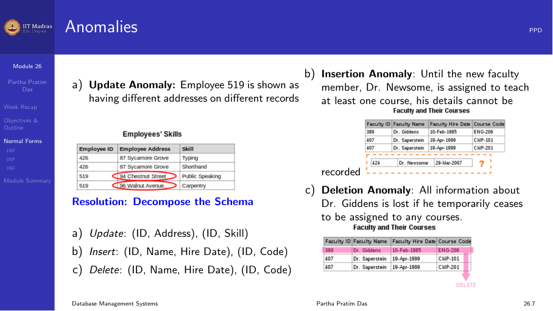
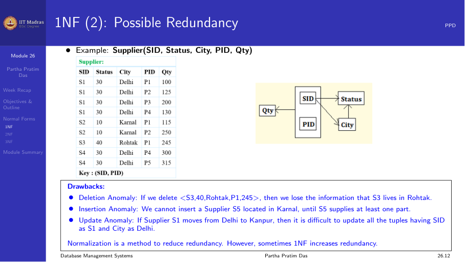
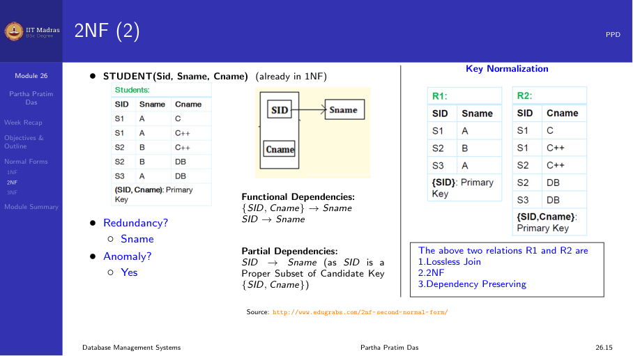
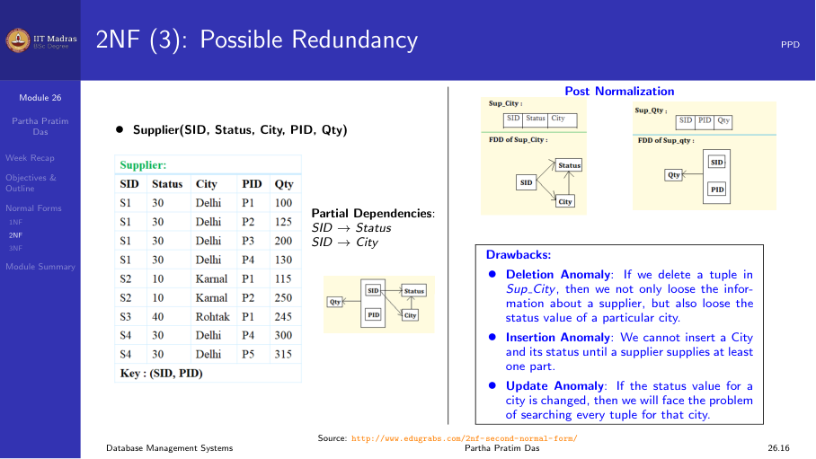
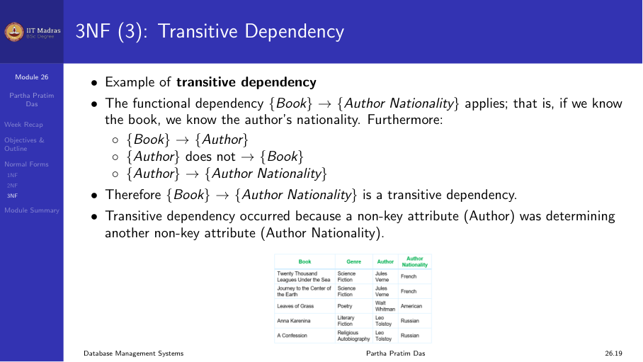
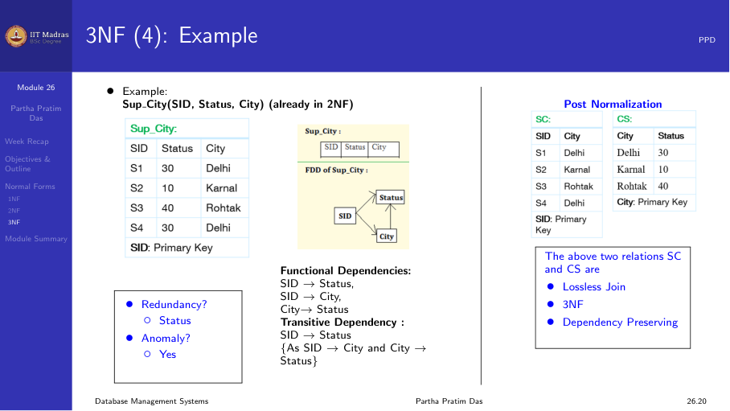
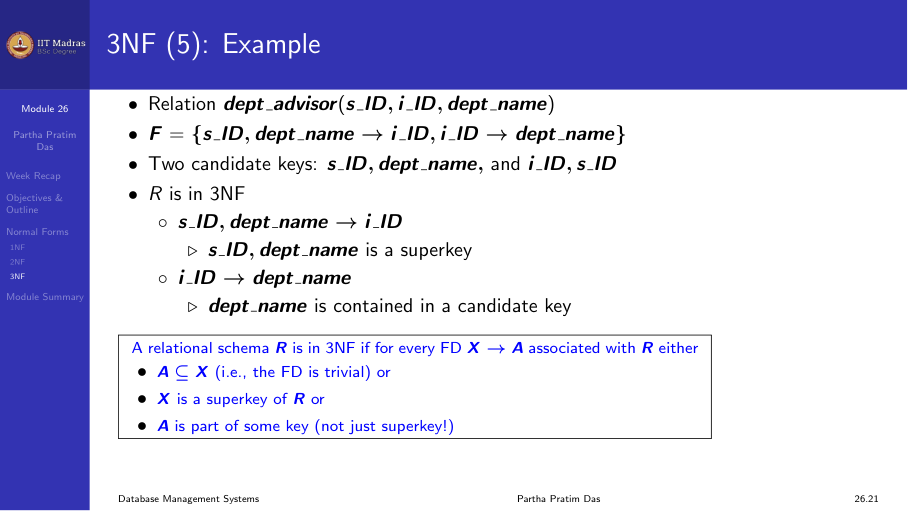
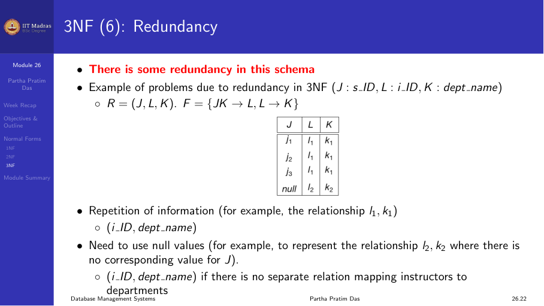

## Goal of normalization

Normalization is a way to organize data in a database. Its single goal is to
remove redundancy, which is the duplication of data across multiple places in
the database.

We use a decomposition approach. We start with an original schema and break it
into smaller schemas. Each smaller schema must meet some desired properties. If
there is still redundancy after decomposition, we add more conditions and
decompose further. The process repeats until the redundancy is gone.

## Key properties of decomposition

As we decompose, two properties are critical.

1. **Lossless join.** It must be possible to rebuild the original data by
   joining the decomposed relations. We covered this in depth last week.

2. **Dependency preservation.** We must still be able to check all functional
   dependencies in the decomposed relations without computing a join of the
   data.

## Anomalies

Normalization gives us good decomposition, and good decomposition reduces
redundancy. Reducing redundancy means removing or reducing anomalies. There are
three kinds.

### Insertion anomaly

You cannot insert a fact about one entity unless you also have information
about another entity. For example, in a supplier relation, you cannot insert a
new supplier S5 located in Chennai until the supplier has supplied at least one
part. That is because PID is part of the key.

### Deletion anomaly

When you delete a record, you may lose other information by accident. For
example, if you delete the only record for a supplier who is in Kota, you lose
the information that Kota has status 40.

### Update anomaly

If a supplier moves from Delhi to Kanpur, you must update every record where
that supplier appears. If there are multiple records, you have to change each
one. Inconsistency can come up easily.

## Normal forms overview

Normal forms are a set of conditions that a relational schema must satisfy
based on its constraints. The common normal forms are:

- First Normal Form (1NF)
- Second Normal Form (2NF)
- Third Normal Form (3NF)
- Boyce-Codd Normal Form (BCNF)
- Fourth Normal Form (4NF)
- Fifth Normal Form (5NF)
- Sixth Normal Form (6NF)
- Elementary Key Normal Form (EKNF)

In practice, when someone says "a normalized database" without naming a normal
form, they almost always mean Third Normal Form (3NF). 3NF is the most common
target for normalization in real database design.

Normal forms follow a hierarchy. Any relation in a higher normal form also
meets all the conditions of the normal forms below it.

## First Normal Form (1NF)

The basic rule for 1NF is that every attribute value must be atomic and
indivisible. Two things are taken together to mean atomic:

1. The domain contains atomic values. Each attribute holds a single value, not
   a set or a list.

2. No attribute can be multi-valued. If there are multiple values in the same
   field, the value has components and is not atomic.

If we have a relation STUDENT(Sid, Sname, Cname) where a student can take
multiple courses and we list all courses in one Cname field, that violates 1NF.
The fix is to make each course a separate row. That puts the data in 1NF,
though it may cause other redundancy problems.

### The supplier example

Consider the relation:

**Supplier(SID, Status, City, PID, Qty)**

Functional dependencies:
- SID -> City (each supplier is in one city)
- City -> Status (each city has a fixed status)
- SID, PID -> Qty (a supplier supplies a specific quantity of a part)

The key is {SID, PID}.

The values in the table are repeated. S1 has Status 30 and City Delhi repeated
for each part. This is the redundancy we want to remove.

This relation is in 1NF because all values are atomic. But it has a lot of
redundancy and anomalies.

- The city and status of a supplier are repeated for every part they supply.
- If we delete the only record for supplier S3 who is in Kota, we lose the
  information that Kota has status 40.
- We cannot insert a new supplier until they supply at least one part.
- If S1 moves from Delhi to Kanpur, we must update every record for S1.

From a functional dependency view, redundancy happens when there is a
non-trivial FD X -> Y over R where X is not a superkey of R. When X is not a
superkey, X can appear with duplicate values. Since X determines Y, Y will
also have duplicate values.

## Second Normal Form (2NF)

A relation is in 2NF if:
1. It is in 1NF.
2. There is no partial dependency.
   A non-prime attribute does not depend on a proper subset of any candidate key.

### Prime versus non-prime attributes

- **Prime attribute.** An attribute that is part of some candidate key of the
  relation.
- **Non-prime attribute.** An attribute that does not belong to any candidate
  key of the relation.

### Partial dependency definition

For a relational schema R, let X be some candidate key. Let Y be a proper
subset of some candidate key, and let A be a non-prime attribute. Then:

$$ Y \rightarrow A $$

is a **partial dependency** if both of these hold:
- Y is a proper subset of some candidate key.
- A is a non-prime attribute (not part of any candidate key).

If a partial dependency exists, the relation violates 2NF.

### Example: STUDENT(Sid, Sname, Cname)

Functional dependencies:
- Sid -> Sname
- Sid, Cname -> (all attributes)

Candidate key: {Sid, Cname}.

Here, Sid is a proper subset of the candidate key. Sname is a non-prime
attribute (it is not part of any candidate key). The FD Sid -> Sname is a
partial dependency, so STUDENT is not in 2NF.

Why is this a problem? Sid appears multiple times, once for each course a
student takes. Since Sid determines Sname, we get repeated Sname values. That
causes redundancy.

**Decomposition to 2NF.** We break it into:
- R1(Sid, Sname): Sid is the key, no partial dependency.
- R2(Sid, Cname): Sid and Cname together form the key.

This decomposition is lossless join (Sid is the common attribute and a key of
R1) and dependency preserving.

### The supplier example decomposed to 2NF

The original Supplier relation had partial dependencies:
- SID -> City (SID is a proper subset of the key {SID, PID})
- SID -> Status (derived transitivity: SID -> City -> Status)

**Decomposition to 2NF:**
- R1(SID, City, Status): Key is SID.
- R2(SID, PID, Qty): Key is {SID, PID}.

Now each supplier's city and status appears only once. The insertion, deletion,
and update anomalies for city and status are gone. R1 uses SID as key (no
partial dependencies). R2 uses the full key {SID, PID} (no partial
dependencies).

But even after 2NF, there may still be redundancy from transitive
dependencies.

## Third Normal Form (3NF)

A relation is in 3NF if:
1. It is in 2NF.
2. There is no transitive dependency.
   A non-prime attribute does not depend on another non-prime attribute.

### Transitive dependency

A transitive dependency is a functional dependency that holds because of
transitivity (Armstrong's Axiom). It can only happen in a relation with three
or more attributes or attribute sets. If:

- A -> B (A determines B)
- B does NOT determine A (B -/> A). This condition is critical.
- B -> C

then A -> C holds by transitivity, and this A -> C is a transitive dependency.

The condition "B does not determine A" matters because if A -> B and B -> A,
then A and B are equivalent. They are tied together strongly. A -> C would be
a direct dependency, not just a transitive one.

### Example: Book -> Author -> Author_Nationality

Consider a relation Book(Title, Author, Author_Nationality) where each book
has one author.

- Title -> Author (each book has one author)
- Author -/> Title (an author may have written many books)
- Author -> Author_Nationality

Then Title -> Author_Nationality is a transitive dependency. The problem is
that a non-key attribute (Author) determines another non-key attribute
(Author_Nationality). If the same author writes multiple books, the
nationality is repeated for each book entry.

### The SUP_CITY example

After achieving 2NF, we have:
**R1(SID, City, Status)** with FDs: SID -> City, City -> Status

Here SID -> Status is a transitive dependency because:
- SID -> City
- City -/> SID (multiple suppliers can be in the same city)
- City -> Status

**Decomposition to 3NF.** Break R1 into:
- SC(SID, City): Key is SID.
- CS(City, Status): Key is City.

Now the transitive dependency is broken. SC can check SID -> City. CS can
check City -> Status. By closure, SID -> Status can be checked too. The common
attribute City ensures a lossless join.

### The simple 3NF definition

The accepted modern definition of 3NF is:

A relation R is in 3NF if for every non-trivial FD X -> A (where A is a
single attribute):
1. X is a superkey of R, or
2. A is part of some candidate key of R. That is, A is a prime attribute.

If X is not a superkey, there will be redundancy. But 3NF allows some
redundancy when A is prime (part of a candidate key).

### The dept_advisor example

Consider dept_advisor(SID, IID, DeptName) where:
- A student has one advisor per department.
- An advisor belongs to one department.

FDs:
1. SID, DeptName -> IID
2. IID -> DeptName

Candidate keys: {SID, DeptName} and {SID, IID}.

Is this in 3NF? Let us check.
- IID -> DeptName: IID is not a superkey, but DeptName is a prime attribute.
  DeptName is part of the candidate key {SID, DeptName}. So this meets
  condition 2 of 3NF.
- Therefore, the relation is in 3NF.

### Can 3NF still have redundancy?

Yes, 3NF does not remove all redundancy. Consider a relation with attributes
J, K, L and FDs:
- JK -> L
- L -> K

Here {J, K} is a candidate key. For the FD L -> K:
- L is not a superkey.
- But K is a prime attribute (part of the candidate key {J, K}).
- So this is in 3NF.

However, if the same value of L appears in multiple tuples, K is determined
the same way. That causes redundancy. This kind of redundancy needs BCNF to
remove. We will discuss BCNF in a later module.

## Module summary

- Normalization removes redundancy through decomposition.
- 1NF makes sure all attribute values are atomic.
- 2NF removes partial dependencies. A non-prime attribute cannot depend on a
  proper subset of a candidate key.
- 3NF removes transitive dependencies. A non-prime attribute cannot depend on
  another non-prime attribute.
- Normal forms are hierarchical: 1NF covers 2NF, and 2NF covers 3NF.
- 3NF is the most common normal form used in practice.
- Every decomposition should have lossless join and dependency preservation.
- 3NF allows some controlled redundancy when the dependent attribute is prime.
  Removing that extra redundancy needs BCNF.
