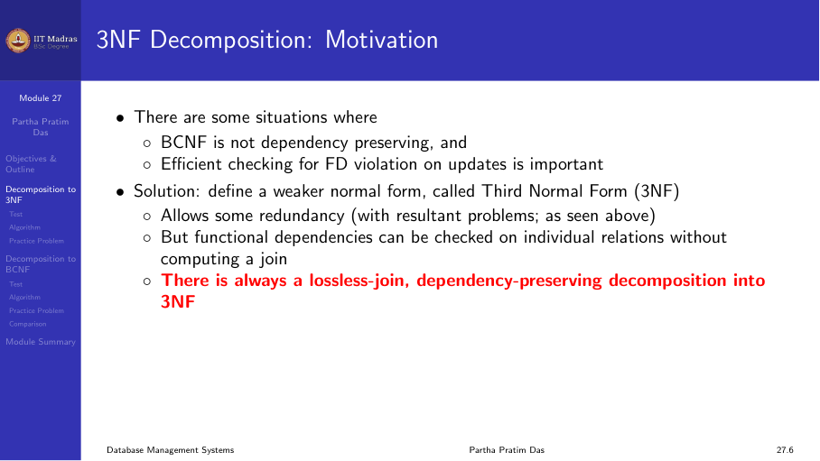
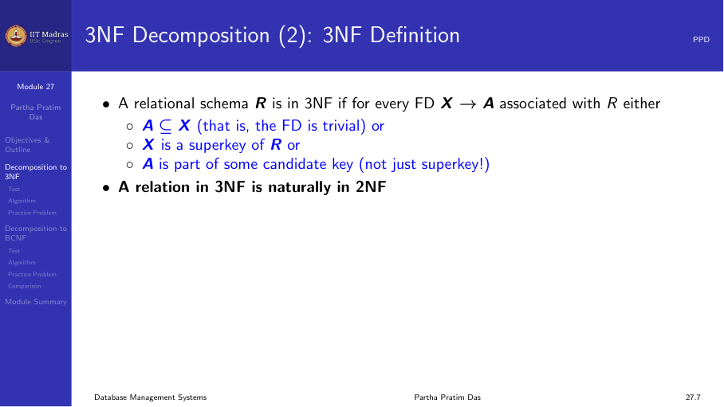
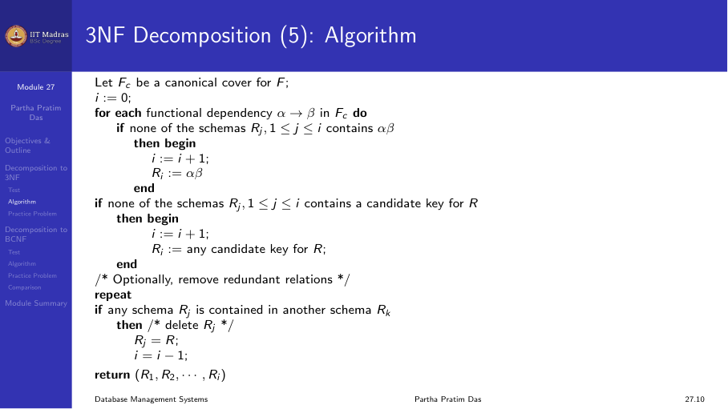
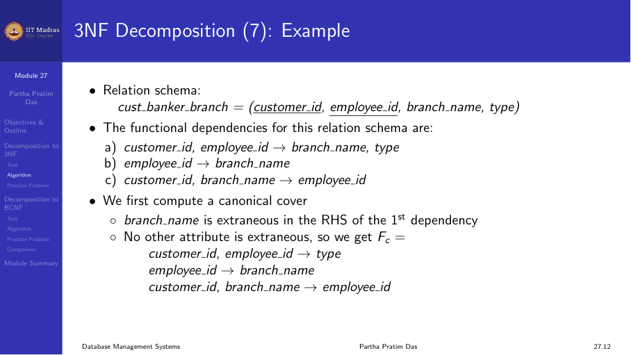
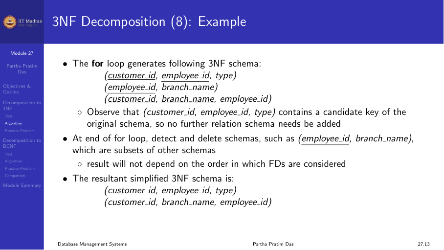
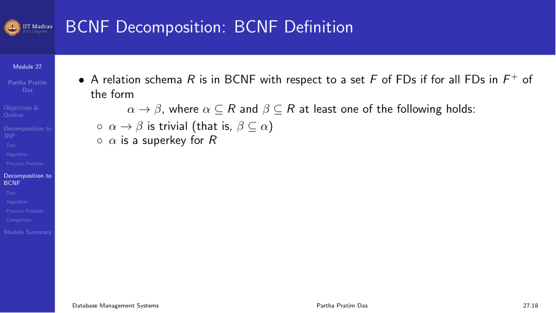
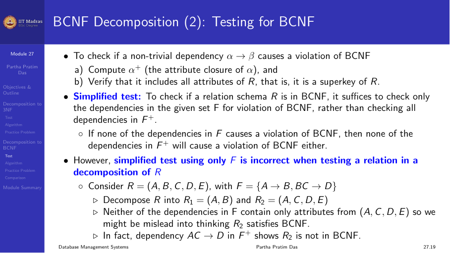
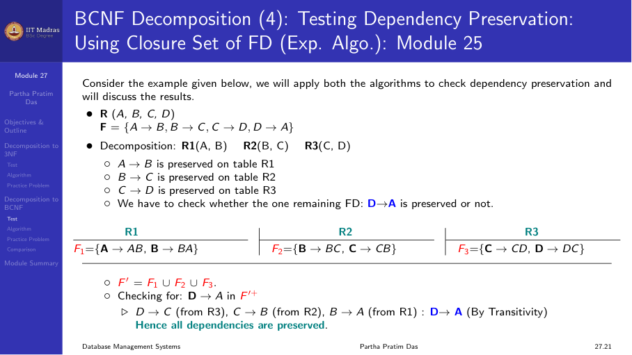
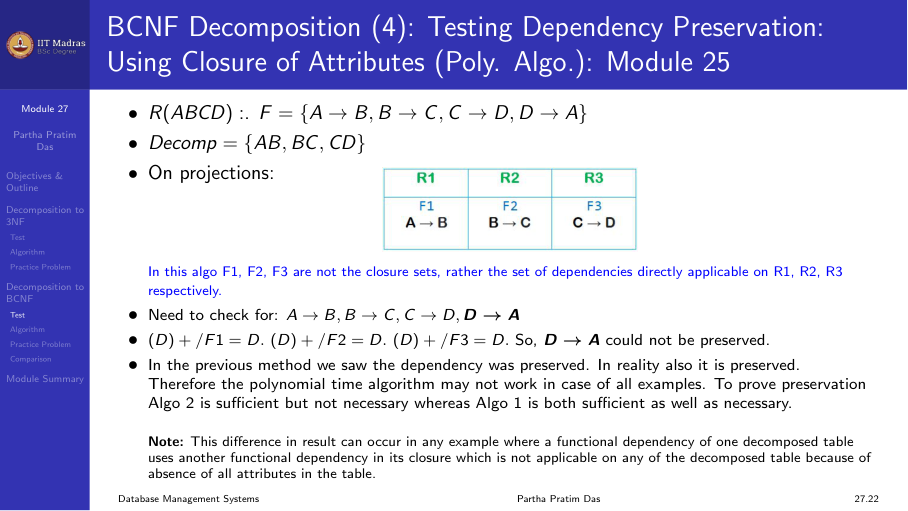
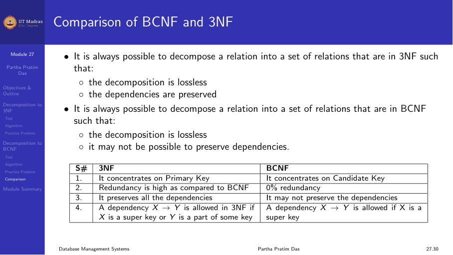

## Why we need decomposition algorithms

In the previous module, we defined normal forms. But we did not discuss how to
transform a relation that is not in a given normal form into one that is. This
module covers two algorithms. One decomposes a relation into 3NF. The other
decomposes a relation into BCNF.

The key difference between 3NF and BCNF is about dependency preservation.

- BCNF removes almost all redundancy caused by functional dependencies.
- But BCNF decomposition may lose some dependencies. We cannot check those
  dependencies on the decomposed relations without computing a join.
- 3NF is weaker than BCNF. It allows some redundancy. But 3NF decomposition
  always preserves all dependencies.

In practice, dependency preservation is very important. When we update the
database, we must check that constraints hold. If we cannot check a dependency
on a single relation, we must join two or more relations to verify it. That
join is expensive.

So there is a trade off. BCNF gives better redundancy removal but may lose
dependencies. 3NF keeps all dependencies but may leave some redundancy.

## Checking whether a relation is already in 3NF

Before we decompose, we might want to check if the relation is already in 3NF.
The definition says: for every non-trivial FD X -> A, either X is a superkey
or A is a prime attribute (part of some candidate key).

If X is a superkey, the check is easy. We compute the attribute closure of
X. If the closure is the whole relation, X is a superkey.

If X is not a superkey, we must verify that each attribute in the right-hand
side is part of some candidate key. Finding all candidate keys of a relation
is expensive. There could be many candidate keys. This problem has been shown
to be NP-hard. That means there is no known algorithm that runs in polynomial
time to test 3NF.

Fortunately, we do not need to test 3NF. We can decompose directly into 3NF
using a polynomial time algorithm. That algorithm always produces a 3NF
schema.

## The 3NF decomposition algorithm

The 3NF decomposition algorithm has three steps.

The three steps are explained below.

### Step 1: Compute the canonical cover

The canonical cover Fc is a minimal representation of the functional
dependencies. It has three properties.

1. Every FD in Fc has a single attribute on the right side.
2. No FD in Fc has any extraneous attributes on the left side.
3. No FD in Fc is redundant. That is, removing any FD from Fc changes the
   closure.

We already learned how to compute the canonical cover in an earlier module.
The algorithm checks each FD for extraneous attributes and removes redundant
FDs.

### Step 2: Create one relation for each FD in the canonical cover

For each functional dependency X -> Y in Fc, we create a relation schema with
attributes X ∪ Y. The left-hand side X becomes a key of this relation.

For example, if Fc has three dependencies:
- X -> Y
- Z -> W
- P -> Q

Then we create three relations:
- R1(X, Y)
- R2(Z, W)
- R3(P, Q)

### Step 3: Add the key if needed

If none of the decomposed relations contains a candidate key of the original
relation, we add one more relation. This extra relation contains only the
attributes of that candidate key.

We need this step to ensure lossless join. Without a relation that contains a
key, we may not be able to reconstruct the original relation by joining.

### Properties of the 3NF decomposition

**Each Ri is in 3NF.** Every FD in Fc becomes a relation where the left-hand
side is the key. By construction, the conditions of 3NF are satisfied on each
Ri.

**Dependency preservation.** Every FD in the canonical cover can be checked on
its corresponding relation directly. Since Fc covers all FDs (Fc is equivalent
to F), all dependencies are preserved.

**Lossless join.** The decomposition has the lossless join property. One way
to see this is that every step preserves lossless join. The intersection of
any two decomposed relations contains a key of one of them.

### Example: customer_banker_branch

Consider the relation:

**customer_banker_branch(cust_ID, emp_ID, branch_name, type)**

Functional dependencies:
- cust_ID, emp_ID -> branch_name, type (a customer working with an employee
  determines the branch and account type)
- emp_ID -> branch_name (an employee works in one branch)
- cust_ID, branch_name -> emp_ID (a customer at a given branch has a fixed
  employee)

The key of the original relation is {cust_ID, emp_ID}.

**Step 1: Compute canonical cover.**

First, we check for extraneous attributes. In the FD cust_ID, emp_ID ->
branch_name, type, the attribute branch_name is extraneous. Why? Because
emp_ID already determines branch_name (from emp_ID -> branch_name). If we
remove branch_name from the right side, the closure of the left side stays the
same. So we can remove branch_name.

After removing the extraneous attribute, the FDs become:
- cust_ID, emp_ID -> type
- emp_ID -> branch_name
- cust_ID, branch_name -> emp_ID

We also check for redundant FDs. None are redundant in this set. So the
canonical cover Fc has these three FDs.

**Step 2: Create one relation for each FD.**

From the three FDs in Fc, we create three relations:
- R1(cust_ID, emp_ID, type)
- R2(emp_ID, branch_name)
- R3(cust_ID, branch_name, emp_ID)

Check the keys:
- R1: {cust_ID, emp_ID} is the key (matches the original key).
- R2: emp_ID is the key.
- R3: {cust_ID, branch_name} is the key.

**Step 3: Check if the key is covered.**

The original key {cust_ID, emp_ID} is contained in R1. So we do not need to
add a separate relation.

Next, we check if any relation is a subset of another. R2(emp_ID, branch_name)
has all its attributes in R3(cust_ID, branch_name, emp_ID). So R2 is a subset
of R3. We can drop R2.

The final 3NF decomposition is:
- R1(cust_ID, emp_ID, type)
- R3(cust_ID, branch_name, emp_ID)

Both relations are in 3NF. All FDs can be checked directly. The decomposition
has lossless join.

## The BCNF decomposition algorithm

BCNF has a simpler definition than 3NF. Every non-trivial FD X -> A must have
X as a superkey of the relation.

### BCNF decomposition step

The BCNF decomposition algorithm works as follows:

1. Find a non-trivial FD X -> Y that violates BCNF. That is, X is not a
   superkey of R.

2. Decompose R into two relations:
   - R1 = X ∪ Y
   - R2 = R - (Y - X)

   Note: R2 keeps X plus all attributes of R that are not in Y.

3. Check if each resulting relation is in BCNF. If not, decompose it further
   using the same rule.

4. Stop when all relations are in BCNF.

This decomposition is always lossless join. The common attribute X between R1
and R2 is a key of R1. That guarantees lossless join.

But BCNF decomposition may not preserve dependencies, as we will see.

### Example: A -> B, B -> C

Consider R(A, B, C) with FDs:
- A -> B
- B -> C

The key is A. The FD B -> C violates BCNF because B is not a superkey.

**Step 1: Decompose using B -> C.**
- R1 = B ∪ C = (B, C)
- R2 = R - (C - B) = R - C = (A, B)

Now check each:
- R1(B, C): The only non-trivial FD that holds here is B -> C. B is a
  superkey of R1 (the key is B). So R1 is in BCNF.
- R2(A, B): The only non-trivial FD that holds here is A -> B. A is a
  superkey of R2 (the key is A). So R2 is in BCNF.

The decomposition {(B, C), (A, B)} is in BCNF and is lossless join. It also
preserves both dependencies.

### BCNF that loses dependencies

Consider R(J, K, L) with FDs:
- JK -> L
- L -> K

Candidate keys: {J, K} and {J, L}.

The FD L -> K violates BCNF because L is not a superkey.

**Decompose using L -> K:**
- R1 = L ∪ K = (L, K)
- R2 = R - (K - L) = R - K = (J, L)

Now check:
- R1(L, K): The FD L -> K holds. L is a superkey (the key). So R1 is in BCNF.
- R2(J, L): What FDs hold here? JK -> L projected onto (J, L) gives nothing
  because we need all three attributes. The only FD is the trivial one. The
  key is {J, L}. R2 is in BCNF.

Both relations are in BCNF. But the FD JK -> L cannot be checked on either
relation alone. To check JK -> L, we must join R1 and R2 on L.

This is the problem with BCNF. The decomposition is lossless join. Each
relation is in BCNF. But we lost the ability to check JK -> L efficiently.

## Testing whether a decomposed relation is in BCNF

After we decompose, we must check if each resulting relation is in BCNF. There
is an important subtlety here.

If we check only the FDs in the original set F, we might wrongly conclude that
a decomposed relation is in BCNF. The reason is that F+ may contain additional
FDs that become active in the decomposed relation.

### Example of the pitfall

Consider R(A, B, C, D, E) with FDs:
- A -> B
- BC -> D

The key of R is {A, C, E}.

The FD A -> B violates BCNF because A is not a superkey.

**Decompose using A -> B:**
- R1 = (A, B)
- R2 = (A, C, D, E)

Now check R2 using only F in F. The FD BC -> D involves attributes {B, C, D}.
But B is not in R2. So BC -> D does not seem to apply to R2. We might think
R2 is in BCNF.

But this is wrong. Look at F+. From A -> B, we can derive AC -> BC (by
augmentation). And BC -> D. So AC -> D holds (by transitivity). In R2, the
attributes {A, C, D} are all present. So AC -> D holds on R2. But AC is not a
superkey of R2 because E is also in R2 and AC does not determine E. So R2
violates BCNF.

The pitfall is that we checked only F, not F+. We missed the FD AC -> D which
comes from closure.

### Correct method to test a decomposed relation for BCNF

To check if a decomposed relation Ri is in BCNF:

1. Compute the restriction of F onto Ri. This means we take F+, and then keep
   only those FDs whose attributes are all in Ri. Since computing F+ is
   expensive, we can use an alternative.

2. Use the attribute closure method. For every subset α of attributes of Ri,
   compute α+. Either:
   - α+ contains no attributes from Ri besides α (meaning α determines nothing
     new in Ri), or
   - α+ contains all attributes of Ri (meaning α is a superkey of Ri).

   If α+ includes some but not all attributes of Ri, then α -> (α+ - α) is a
   violation of BCNF in Ri.

This method is more expensive than checking just F. But it is the correct way
to verify BCNF for decomposed relations.

## Testing dependency preservation for BCNF

When we have a BCNF decomposition, we may want to check whether dependencies
are preserved. There are two approaches.

### Exponential time algorithm

The exponential algorithm uses F+. For each FD X -> Y in F, we check if it is
preserved in the decomposition.

The algorithm works as follows. Let the decomposition be {R1, R2, ..., Rn}.
For each FD X -> Y, we compute:

result = X
repeat
    for each Ri in the decomposition:
        t = (result ∩ Ri)+ ∩ Ri   (closure computed under F)
        result = result ∪ t
until result stops changing

If the final result contains all attributes of Y, then X -> Y is preserved.

This algorithm is correct. But it requires computing closures multiple times,
and it may be exponential in the worst case.

### Polynomial time algorithm (conservative)

The polynomial time algorithm does not use F+. Instead, it only checks if each
FD in F can be checked directly on some Ri. An FD X -> Y is considered
preserved if there exists a Ri such that X ∪ Y ⊆ Ri.

This algorithm is faster. But it is conservative. It may say a dependency is
not preserved when it actually is preserved through transitivity across
multiple relations.

The polynomial time algorithm never gives a false positive. If it says a
decomposition is dependency preserving, that is always correct. If it says a
decomposition is not dependency preserving, it could be wrong. The actual
answer may still be that dependencies are preserved.

### The cyclic dependency example

Consider the classic example of cyclic dependencies:
- A -> B
- B -> C
- C -> D
- D -> A

A BCNF decomposition might split these into separate relations. Each
individual FD might seem lost because no single relation contains both sides.
But by transitivity across all four relations, D -> A can still be checked.
The polynomial time algorithm would miss this. The exponential algorithm would
catch it.

## Comparison: 3NF versus BCNF

The practical takeaway is this. If dependency preservation is critical, use
3NF. If removing all redundancy is critical and losing some dependencies is
acceptable, use BCNF. In most real databases, 3NF is the preferred choice.

## Summary

- The 3NF decomposition algorithm computes a canonical cover, creates one
  relation per FD, and adds a key relation if needed.
- 3NF decomposition always has lossless join and dependency preservation.
- The BCNF decomposition algorithm finds a violating FD, splits the relation
  into two, and recurses.
- BCNF decomposition always has lossless join but may lose dependencies.
- Testing whether a decomposed relation is in BCNF requires checking F+, not
  just F.
- The polynomial test for dependency preservation is conservative and may give
  false negatives.
- 3NF is the more practical choice for real applications because it guarantees
  dependency preservation.
