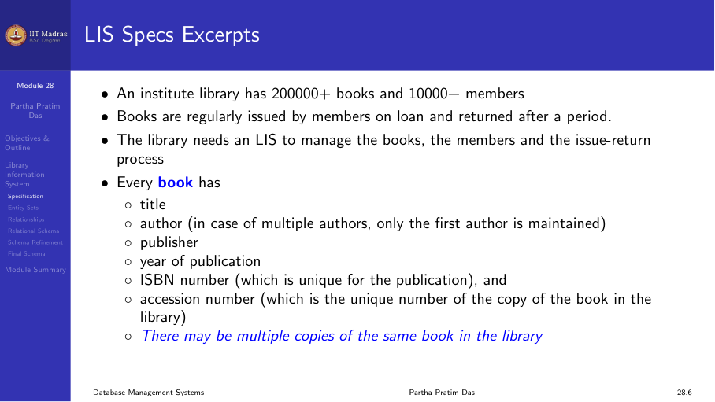
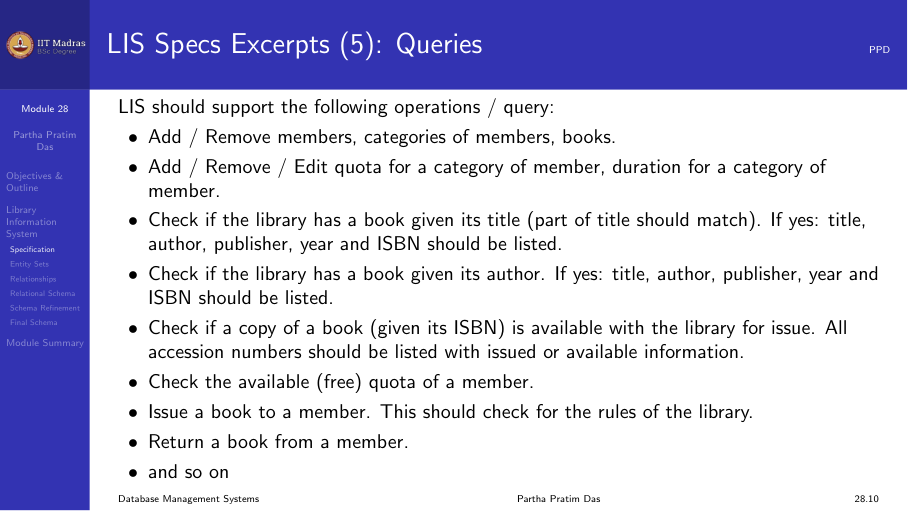
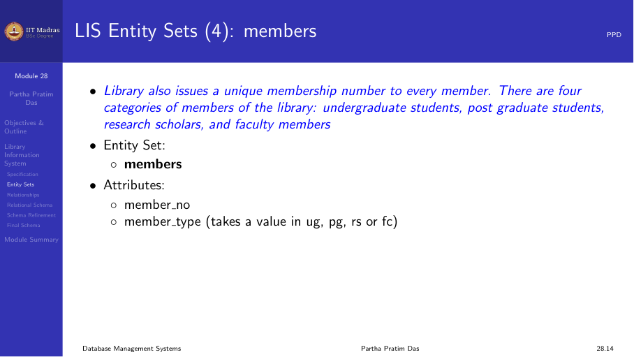
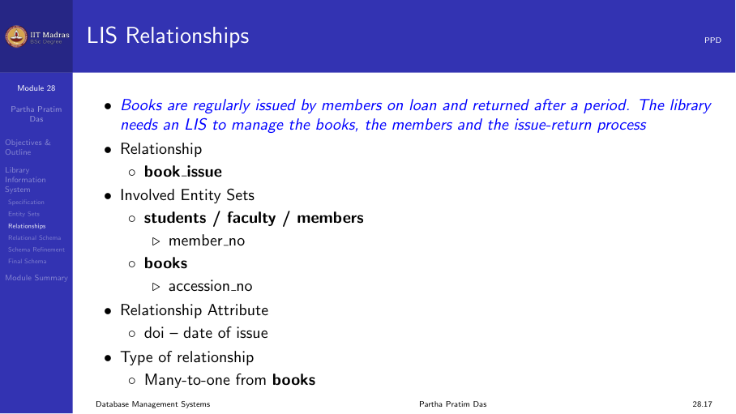
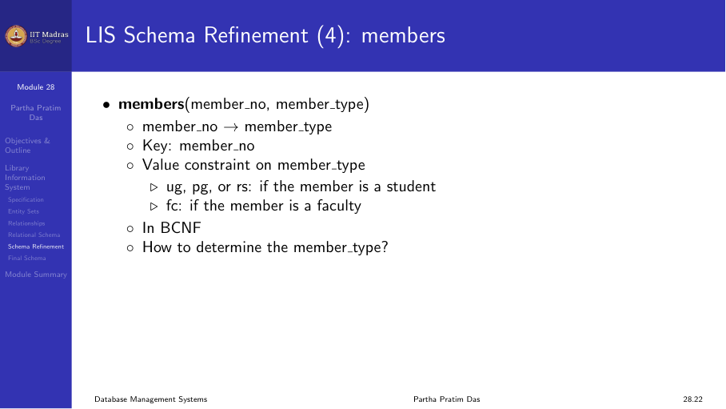
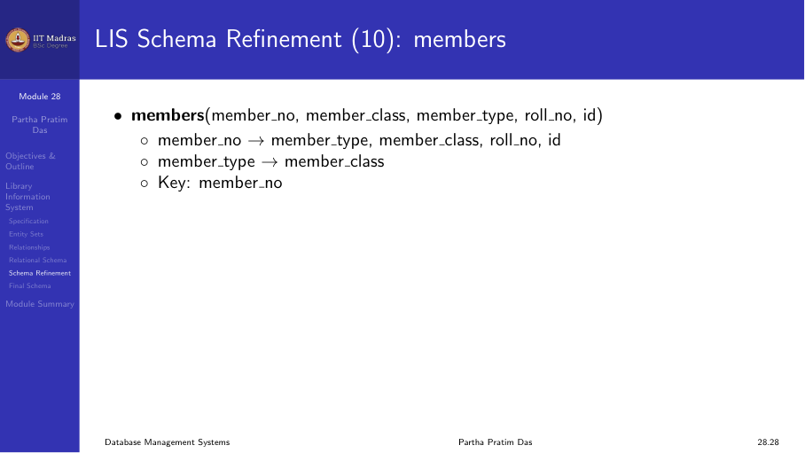

## Overview

In this module, we apply everything we have learned about relational database
design to a real-world case study. We design a complete database schema for a
Library Information System (LIS). The process goes through these steps:

1. Understand the specification document.
2. Identify entity sets and their attributes.
3. Identify relationships between entities.
4. Create an Entity-Relationship (ER) model.
5. Transform the ER model into an initial set of relational schemas.
6. Identify functional dependencies hidden in the specification.
7. Normalize each schema to BCNF (or 3NF if BCNF is not possible).
8. Refine the design based on query requirements.

This case study shows that database design is not just about theory. A good
designer must read between the lines, find hidden requirements, and adjust the
design to make queries efficient.

## The specification

The institute library has a large number of books and a large number of
members. Books are regularly issued to members and returned after a period.
The library needs an information system to manage this.

### Books

Every book has:
- Title
- Author (first author only; single value)
- Publisher
- Year of publication
- ISBN number (unique for a publication)
- Accession number (unique for each copy)

Multiple copies of the same book exist. Each copy has the same ISBN but a
different accession number.

### Members

There are four categories of members:
- Undergraduate students
- Postgraduate students
- Research scholars
- Faculty members

Every member gets a unique membership number. Each member has a maximum quota
for how many books they can issue at a time and for how long. The quota
depends on the member type, not the individual member.

### Ground rules for issue

A book may be issued to a member only if:
- It is not already issued to someone else.
- Another copy of the same book is not already issued to the same member.
- The member has not exceeded their quota.
- The member has no overdue books.

## Identifying entity sets

From the specification, we identify these entity sets:

**Books.** Attributes: ISBN, Title, Author_First, Author_Last, Publisher,
Year, Accession_No. Key: Accession_No (unique per copy).

**Students.** Attributes: Roll_No, Member_No, First_Name, Last_Name, Degree,
Date_of_Birth, Date_of_Joining, Mobile. Keys: Roll_No, Member_No.

**Faculty.** Attributes: ID, Member_No, First_Name, Last_Name, Department,
Date_of_Joining, Mobile. Keys: ID, Member_No.

**Staff.** Not mentioned in the specification, but a good designer realizes
the library needs staff to run it. The staff should also be able to use the
library. This is an example of reading between the lines.

**Quota.** An intangible entity. Attributes: Member_Type, Max_Books,
Max_Duration. Key: Member_Type.

**Members.** A generalization of Students, Faculty, and Staff. Attributes:
Member_No, Member_Type, Roll_No (nullable), ID (nullable), etc. Key:
Member_No.

## Identifying relationships

The main relationship is **Book_Issue** between Members and Books.

- A member can issue many books.
- A book can be issued to only one member at a time.
- The relationship has an attribute: Date_of_Issue.
- This is a many-to-one relationship from Book to Member.

## Initial relational schema

From the ER model, we create the initial set of relational schemas.

**Books**(Accession_No, ISBN, Title, Author_First, Author_Last, Publisher,
Year). Key: Accession_No.

**Book_Issue**(Accession_No, Member_No, Date_of_Issue). Key:
{Accession_No, Member_No}.

**Members**(Member_No, Member_Type, ...). Key: Member_No.

**Students**(Roll_No, Member_No, First_Name, Last_Name, Degree, DOB, DOJ,
Mobile). Keys: Roll_No, Member_No.

**Faculty**(ID, Member_No, First_Name, Last_Name, Department, DOJ, Mobile).
Keys: ID, Member_No.

**Quota**(Member_Type, Max_Books, Max_Duration). Key: Member_Type.

## Normalization

Now we identify functional dependencies hidden in the specification and
normalize each schema.

### Books normalization

Functional dependencies in Books:
1. Accession_No -> ISBN, Title, Author_First, Author_Last, Publisher, Year
2. ISBN -> Title, Author_First, Author_Last, Publisher, Year

FD 1 holds because each copy has a unique accession number. FD 2 holds because
each publication has a unique ISBN.

Accession_No is a superkey, so FD 1 does not violate BCNF. But ISBN is not a
superkey, so FD 2 violates BCNF.

**BCNF decomposition of Books:**
- **Book_Copy**(Accession_No, ISBN). Key: Accession_No.
- **Book_Title**(ISBN, Title, Author_First, Author_Last, Publisher, Year).
  Key: ISBN.

Both relations are now in BCNF. The decomposition is lossless join and
dependency preserving.

### Other relations

**Book_Issue**(Accession_No, Member_No, Date_of_Issue). Key:
{Accession_No, Member_No}. The only FD is the key determining Date_of_Issue.
This is in BCNF.

**Quota**(Member_Type, Max_Books, Max_Duration). Key: Member_Type. The only
FD is Member_Type determining Max_Books and Max_Duration. This is in BCNF.

**Students**(Roll_No, Member_No, ...). FDs:
- Roll_No -> (all other attributes)
- Member_No -> Roll_No

Both Roll_No and Member_No are keys. This is in BCNF.

**Faculty**(ID, Member_No, ...). Same structure as Students. Both ID and
Member_No are keys. This is in BCNF.

## Query-driven refinement

After normalization, we have a theoretically correct design. But when we try
to write real queries, we find a problem.

Consider this query: "Find the name of the member who issued the book with
accession number X."

From Book_Issue, we get the Member_No. But Member_No alone does not tell us
whether the member is a Student, Faculty, or Staff. We would have to search
all three tables to find the name. That is inefficient and makes the query
complex.

The problem is that we missed the generalization hierarchy. A member is a
general concept, and Student, Faculty, and Staff are specializations.

### The refined design

We refine the Members relation to include a member class indicator.

**Members**(Member_No, Member_Class, Member_Type, Roll_No, ID, ...). Key:
Member_No.

- Member_Class tells us whether this member is a Student, Faculty, or Staff.
- Roll_No is non-null only for Students.
- ID is non-null only for Faculty and Staff.

Now the query is simple. From Book_Issue, we get Member_No. We look up
Members to get Member_Class. Depending on the class, we join with the
appropriate table to get the name.

## Final schema

After all refinements, the final relational schema is:

**Book_Title**(ISBN, Title, Author_First, Author_Last, Publisher, Year).
Key: ISBN.

**Book_Copy**(Accession_No, ISBN). Key: Accession_No.

**Book_Issue**(Accession_No, Member_No, Date_of_Issue).
Key: {Accession_No, Member_No}.

**Members**(Member_No, Member_Class, Member_Type, Roll_No, ID, First_Name,
Last_Name, ...). Key: Member_No.

**Students**(Roll_No, First_Name, Last_Name, Degree, DOB, DOJ, Mobile).
Key: Roll_No.

**Faculty**(ID, First_Name, Last_Name, Department, DOJ, Mobile).
Key: ID.

**Quota**(Member_Type, Max_Books, Max_Duration).
Key: Member_Type.

Every relation is in BCNF. The design has lossless join and dependency
preservation. Queries can be written efficiently.

## Lessons learned

- Database design starts from a specification in natural language.
- The designer must identify entities, attributes, and relationships.
- Functional dependencies are hidden in the description and must be extracted
  by understanding the domain.
- Normalization removes redundancy but may not always give a practical design.
- Query requirements may force refinements that the theory alone does not
  suggest.
- Reading between the lines is an essential skill. The specification may miss
  important entities like Staff.
- Generalization hierarchies (like Member generalizing Student, Faculty, and
  Staff) need careful handling in the relational model.
