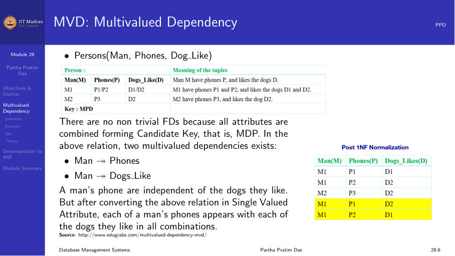
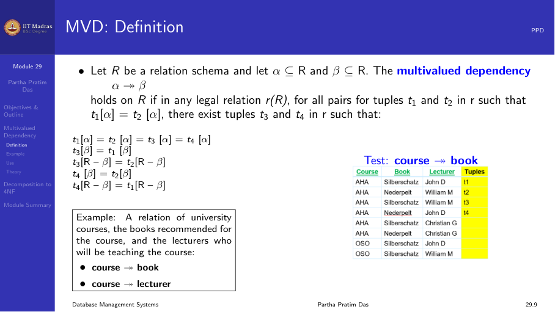
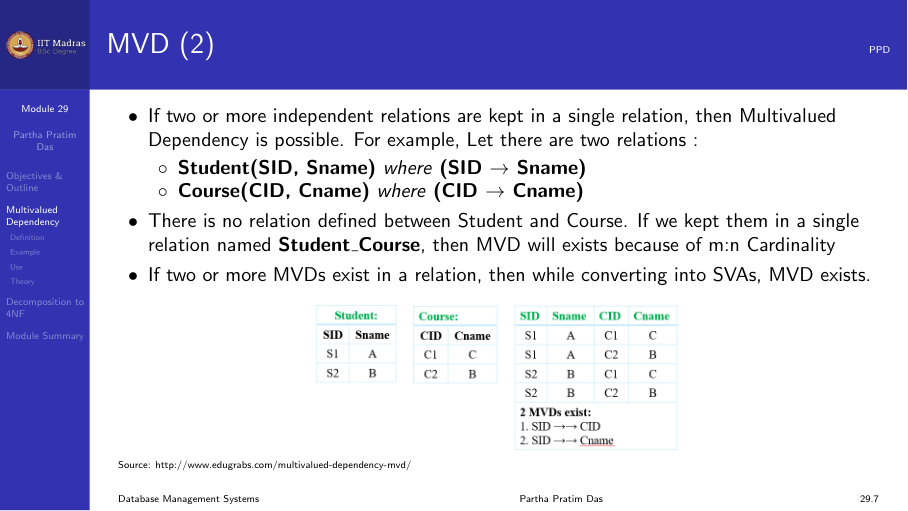
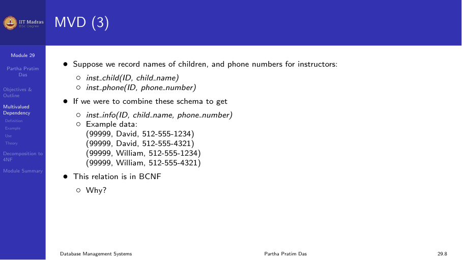
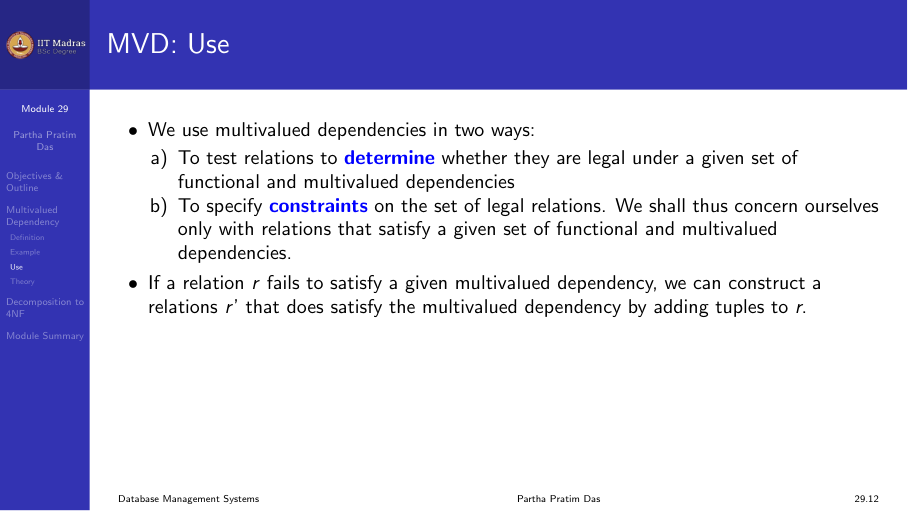
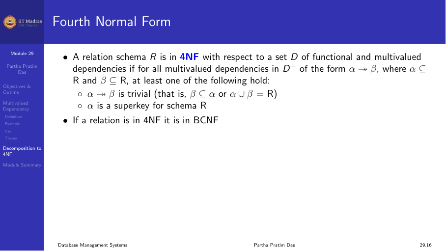

## The limitation of functional dependencies

Functional dependencies handle situations where one set of attributes uniquely
determines another set. But there are cases where no functional dependency
exists, yet there is still redundancy. This happens when attributes can have
multiple independent values.

Consider a person who has multiple phone numbers and likes multiple dogs. The
schema Person(Name, Phone, Dog_Like) has no non-trivial functional
dependencies. The only key is all three attributes together. By the BCNF
definition, this schema is in BCNF. But there is a different kind of problem.

To make the data fit 1NF, we flatten the multiple values. If a person has two
phones (P1, P2) and likes two dogs (D1, D2), we get all four combinations:

| Name | Phone | Dog_Like |
|------|-------|----------|
| Mani | P1    | D1       |
| Mani | P1    | D2       |
| Mani | P2    | D1       |
| Mani | P2    | D2       |

The relation is in BCNF because there is no non-trivial FD. But we have a
tremendous amount of redundancy. The phone P1 is repeated twice. The dog D1
is repeated twice. This redundancy comes from the fact that Phone and Dog_Like
are independent of each other. They both depend on Name, but they do not
depend on each other.

Functional dependencies cannot capture this kind of redundancy. We need a new
kind of dependency: the multivalued dependency.

## Multivalued dependency definition

A multivalued dependency (MVD) is written as:

$$ X \twoheadrightarrow Y $$

It is read as "X multi-determines Y". It holds on a relation R if whenever two
tuples t1 and t2 agree on all attributes in X, then there must also exist a
tuple t3 (and by symmetry, t4) such that:
- t3 agrees with t1 and t2 on X.
- t3 agrees with t1 on Y.
- t3 agrees with t2 on all attributes of R that are not in X or Y.

In simpler terms, an MVD X ->-> Y means that the set of Y values associated
with a given X value is independent of the other attributes (R - X - Y).

### MVD from independent relations

If two relations are independent and we combine them into one table, we get
MVDs. For example, consider Student(SID, Sname) and Course(CID, Cname). These
are independent. If we combine them into a single table, we get a Cartesian
product. The MVD SID ->-> CID holds because for a given student, all course
combinations appear.

### MVD from multivalued attributes

The classic example is an instructor who has multiple children and multiple
phone numbers.

**Instructor(ID, Child_Name, Phone)**

There is no FD. If ID 101 has children David and William and phones 555-1234
and 555-5678, we get all four combinations. The MVDs are:
- ID ->-> Child_Name
- ID ->-> Phone

This is exactly the same pattern as the Person example.

### Relationship between FD and MVD

Every functional dependency is also a multivalued dependency. If
X -> Y holds, then X ->-> Y also holds. But the reverse is not true. A
multivalued dependency does not imply a functional dependency.

## Inference rules for MVDs

Like Armstrong's axioms for FDs, there are inference rules for MVDs.

**Complement rule.** If X ->-> Y, then X ->-> (R - X - Y). This means that
if X multi-determines Y, it also multi-determines the remaining attributes.

**Augmentation rule.** If X ->-> Y and W ⊆ Z, then XZ ->-> YW. Unlike the
FD augmentation rule, the left and right sides can be augmented differently.

**Transitivity rule.** If X ->-> Y and Y ->-> Z, then X ->-> (Z - Y).

**Replication rule.** If X -> Y, then X ->-> Y. Every FD is an MVD.

**Coalescence rule.** If X ->-> Y and there exists a Z such that Z ⊆ Y and
there is a W disjoint from Y with W -> Z, then X -> Z.

## Fourth Normal Form (4NF)

A relation schema R is in 4NF with respect to a set of functional and
multivalued dependencies D if for every non-trivial MVD X ->-> Y in D+:

1. X is a superkey of R, or
2. The MVD is trivial (Y ⊆ X or X ∪ Y = R).

Notice that this is exactly the same shape as the BCNF definition. The only
difference is that we check MVDs instead of FDs.

Since every FD is an MVD, any relation in 4NF is automatically in BCNF. The
hierarchy is:

4NF ⊂ BCNF ⊂ 3NF ⊂ 2NF ⊂ 1NF

## 4NF decomposition algorithm

The 4NF decomposition algorithm is almost identical to the BCNF algorithm.

1. Find a non-trivial MVD X ->-> Y that violates 4NF. That is, X is not a
   superkey.

2. Decompose R into two relations:
   - R1 = X ∪ Y
   - R2 = R - Y

   Note: Unlike BCNF where we remove only Y - X, in 4NF we remove all of Y.

3. Check if each resulting relation is in 4NF. If not, decompose further.

4. Stop when all relations are in 4NF.

The decomposition is always lossless join. The common attribute X is a key of
R1.

## Example: Person relation

Consider Person(Name, Phone, Dog_Like, Address) where:
- Name ->-> Phone (MVD)
- Name ->-> Dog_Like (MVD)
- Name -> Address (FD)

The key is {Name, Phone, Dog_Like} (all three together since no FD gives a
smaller key).

All MVDs and the FD violate 4NF because the left-hand side Name is not a
superkey.

**Step 1: Decompose using Name ->-> Phone.**
- R1 = (Name, Phone)
- R2 = (Name, Dog_Like, Address)

Now check R2. It still has Name ->-> Dog_Like (MVD) and Name -> Address (FD).

**Step 2: Decompose R2 using Name ->-> Dog_Like.**
- R3 = (Name, Dog_Like)
- R4 = (Name, Address)

Now all three relations are in 4NF:
- R1(Name, Phone): Only FD Name ->-> Phone, and Name is the key.
- R3(Name, Dog_Like): Only MVD Name ->-> Dog_Like, and Name is the key.
- R4(Name, Address): Only FD Name -> Address, and Name is the key.

The decomposition is lossless join and dependency preserving.

## When to use 4NF

Multivalued dependencies are less common than functional dependencies in
practice. Situations that need 4NF typically involve:

- Multiple phone numbers for a person.
- Multiple addresses for a person.
- Multiple skills for an employee.
- Any case where two sets of multivalued attributes are independent.

In many real designs, these situations are handled by creating separate tables
during the ER modeling phase, long before 4NF is needed. But the formal theory
of MVDs and 4NF provides a systematic way to reason about and resolve these
cases.

## Beyond 4NF

Even 4NF does not remove all kinds of redundancy. There are higher normal
forms:

- **Fifth Normal Form (5NF).** Also called Project-Join Normal Form (PJNF).
  Handles join dependencies where a relation can be decomposed into three or
  more relations.

- **Domain-Key Normal Form (DKNF).** A relation is in DKNF if every
  constraint is a logical consequence of the domain constraints and key
  constraints. This is the ultimate normal form but is rarely achievable in
  practice.

- **Sixth Normal Form (6NF).** Handles temporal data by decomposing until no
  further non-key dependencies exist.

These higher normal forms are rarely used in practical database design. Most
real databases target 3NF or BCNF.

## Summary

- Multivalued dependencies capture redundancy that functional dependencies
  cannot.
- An MVD X ->-> Y means the Y values of an X are independent of the other
  attributes.
- Every FD is an MVD, but not every MVD is an FD.
- 4NF requires that every non-trivial MVD has a superkey on the left side.
- 4NF decomposition is like BCNF decomposition, applied to MVDs instead of
  FDs.
- 4NF implies BCNF, which implies 3NF, and so on.
- 4NF is less frequently needed in practice because multivalued attributes
  are often handled during ER design.
