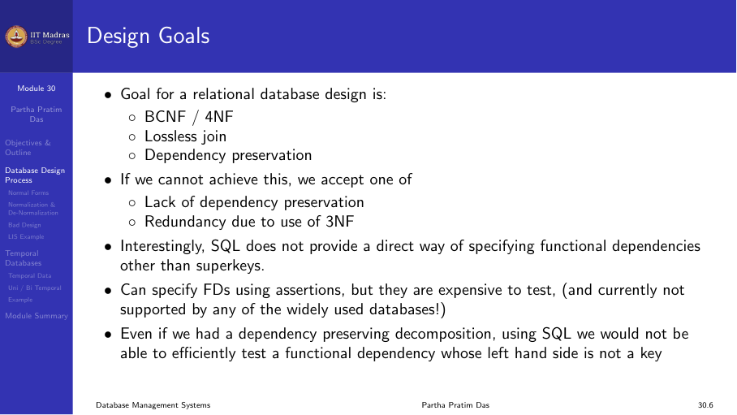
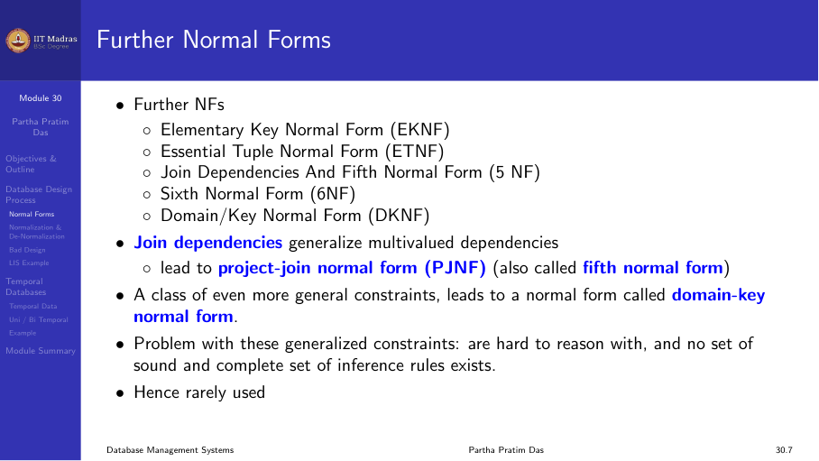
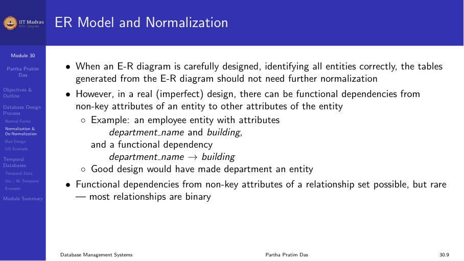
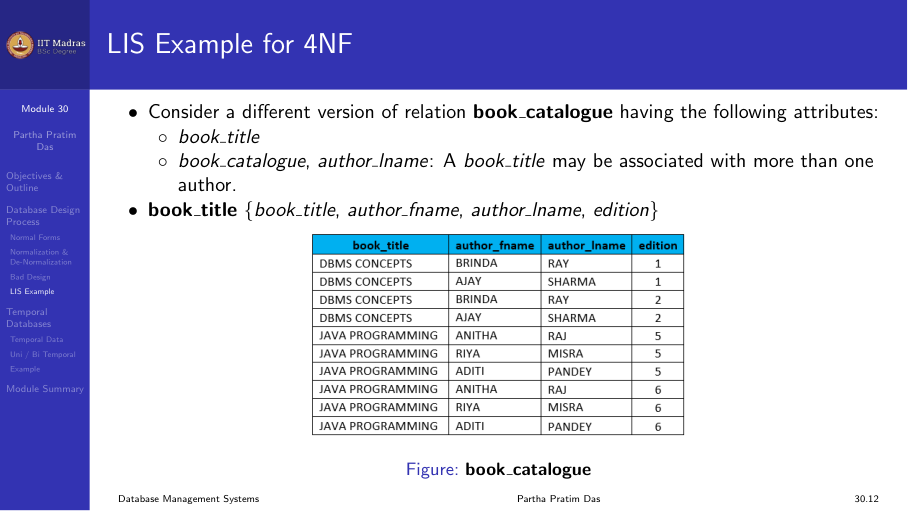
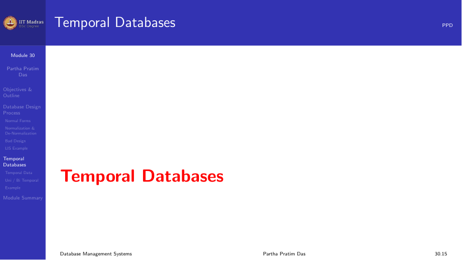
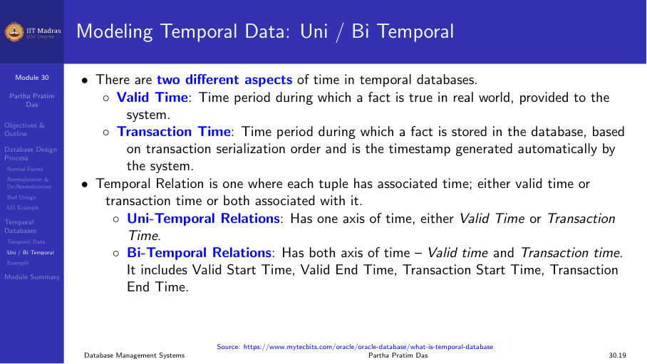
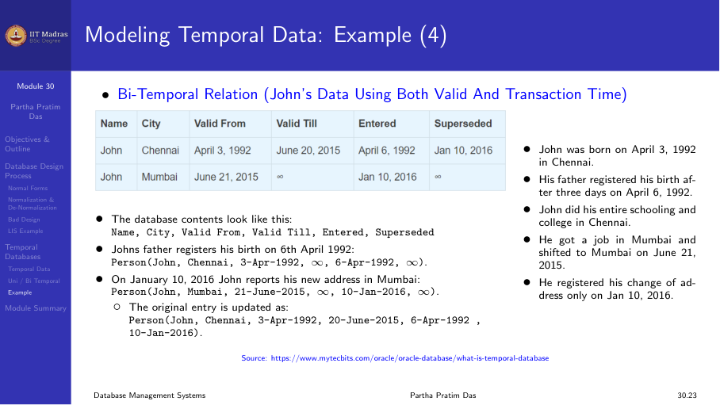

## Summary of the design journey

We have covered a long journey through relational database design. This module
summarizes the entire process and introduces one final topic: temporal data.

The design goals are:
- Produce a relational schema in BCNF or 4NF.
- Ensure lossless join for every decomposition.
- Preserve dependencies wherever possible.
- If BCNF is not possible while preserving dependencies, fall back to 3NF.
- If 4NF is needed, decompose using multivalued dependencies.

## The complete design process

The database design process has these stages:

1. **Requirements analysis.** Understand what the users need. This comes from
   a specification document, interviews, or existing systems.

2. **Conceptual design.** Create an ER model that captures entities,
   attributes, and relationships. This is independent of any specific DBMS.

3. **Logical design.** Transform the ER model into a set of relational
   schemas. This is the initial set of tables.

4. **Normalization.** Identify functional dependencies (and multivalued
   dependencies) hidden in the requirements. Decompose each schema into 3NF,
   BCNF, or 4NF as needed.

5. **Query-driven refinement.** Test the design against real queries. Adjust
   the schema if certain queries are hard to write or slow to execute.

6. **Physical design.** Decide on indexing, storage, and other physical
   parameters. This is outside the scope of this module.

### Starting points for design

The starting point for normalization can come from different sources:

- **ER-to-relational mapping.** Like the Library Information System case
  study. The ER model produces an initial set of tables.
- **Universal relation.** A single large relation containing all attributes.
  Normalization breaks it into smaller relations.
- **Adhoc design.** Tables created without formal methodology. These need to
  be checked and normalized.

## SQL and functional dependencies

SQL does not provide a direct way to specify functional dependencies. It only
supports superkey constraints through PRIMARY KEY and UNIQUE specifications.
Other functional dependencies must be checked using assertions or triggers,
which are expensive.

This means that even after a well-normalized design, it is possible to insert
data that violates functional dependencies through application code. The
designer must be aware of this limitation.

## Denormalization

Normalization reduces redundancy. But redundancy is not always bad. There is a
trade off between normalization and query performance.

Consider a query that needs to join two large tables frequently. If the query
runs many times per second, the join cost may be unacceptable. One solution is
to denormalize: combine the two tables into one, accepting some redundancy in
exchange for faster reads.

Denormalization is a deliberate choice after normalization, not a replacement
for it. The steps are:
1. Normalize to remove redundancy.
2. Measure query performance.
3. Denormalize selectively where performance is critical.
4. Handle the extra redundancy in the application layer.

Alternative approaches include using materialized views, which provide the
same performance benefit without changing the logical schema.

## Bad design practices

There are several design practices to avoid.

### Year-wise tables

Some designers create separate tables for each year:
- Earnings_2004(Company_ID, Amount)
- Earnings_2005(Company_ID, Amount)
- Earnings_2006(Company_ID, Amount)

This makes queries that span multiple years very difficult. A better design is
a single table with a year attribute:
- Earnings(Company_ID, Year, Amount)

### Cross-tab schemas

Some designers use attributes to represent values of another attribute, like
creating columns Year_2004, Year_2005, Year_2006 in a single table. This leads
to many null values and makes the schema inflexible. The proper design is to
keep year as a row value, not a column.

### Ignoring generalization

In the LIS case study, treating Students, Faculty, and Staff as completely
separate without a common Members table made it impossible to write simple
queries. Always look for generalization hierarchies in the data.

## Extending the LIS design with MVDs

The LIS design from Module 28 assumed each book has only one author (the first
author). In reality, books have multiple authors. This introduces multivalued
dependencies.

The Book_Title relation had:
- ISBN -> Title, Author_First, Author_Last, Publisher, Year

If we allow multiple authors, we need:
- ISBN ->-> Author (a book can have multiple authors)
- ISBN ->-> Edition (a book can have multiple editions)

The 4NF decomposition gives:
- Book_Author(ISBN, Author_First, Author_Last)
- Book_Edition(ISBN, Edition, Year, Publisher)
- Book_Title(ISBN, Title)

Each of these is in 4NF. The design now supports multiple authors and multiple
editions.

## Temporal data

All the design theory we have covered assumes data is a snapshot at the
current time. But much real-world data is time-varying. Medical records,
share prices, exchange rates, and judiciary records all change over time. The
database must keep history, not just the current value.

### Types of time

There are two important time dimensions:

**Valid time.** The time period during which a fact is true in the real world.
For example, John lived in Chennai from April 3, 1992 to June 20, 2015. He
lived in Mumbai from June 21, 2015 onwards.

**Transaction time.** The time period during which a fact is stored in the
database. For example, John's birth was registered on April 6, 1992 (not on
the actual birth date). His change of address was registered on January 10,
2016 (months after he actually moved).

### Temporal relation types

**Uni-temporal relation.** Stores either valid time or transaction time, but
not both.

**Bi-temporal relation.** Stores both valid time and transaction time. This is
the most powerful approach.

### Challenges with temporal data

- **Modeling time.** Time is linear and moves forward. But it can be discrete,
  dense, bounded, or unbounded. Different applications need different time
  models.

- **Temporal ER models.** Standard ER models do not capture time. Attributes
  need lifetimes. Entities exist for specific durations. The ER model must be
  extended.

- **Temporal functional dependencies.** An FD may hold at one time but not at
  another. Temporal FDs require a more complex theory.

- **Temporal query languages.** SQL has limited temporal support. Proposals
  like SQL/Temporal (from 1997) exist but have not been fully standardized.

- **Storage and performance.** Bi-temporal relations need more storage. Query
  processing becomes more complex with range checks on time intervals.

### Practical approach

In the absence of standardized temporal database support, most designers model
time explicitly in the relational schema by adding start and end timestamp
attributes. For example:

**Employee_Salary( Emp_ID, Salary, Start_Date, End_Date )**

Here, Start_Date and End_Date define the valid time for which the salary is
in effect. Queries filter on these date columns to get historical data.

## Final thoughts

Database design is a balance between theory and practice.

- Use normalization to remove redundancy systematically.
- Use the ER model to capture real-world concepts.
- Decompose to BCNF or 4NF with lossless join and dependency preservation
  where possible.
- Fall back to 3NF when BCNF loses dependencies.
- Consider denormalization for performance when needed.
- Model time explicitly when data is time-varying.
- Always test the design against real queries.

With these tools, you can design relational databases that are consistent,
efficient, and maintainable.
