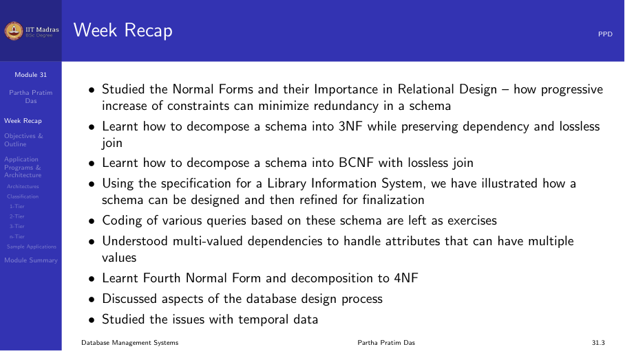
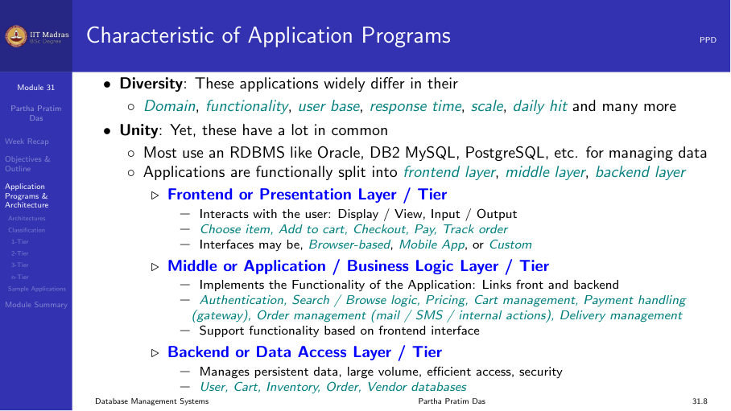
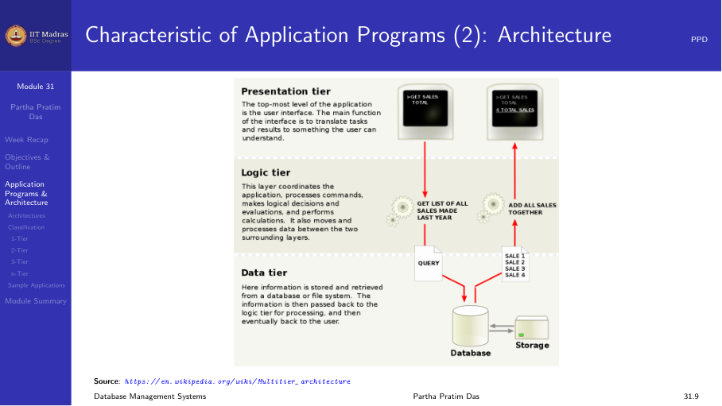
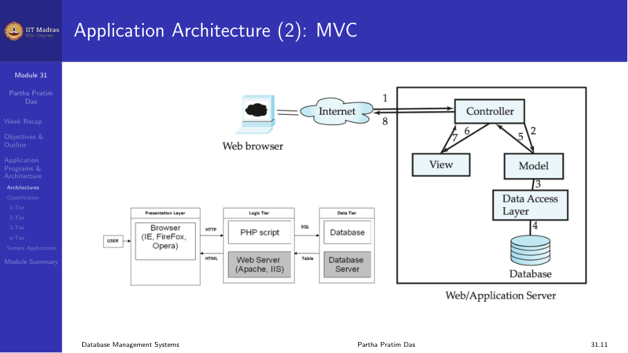
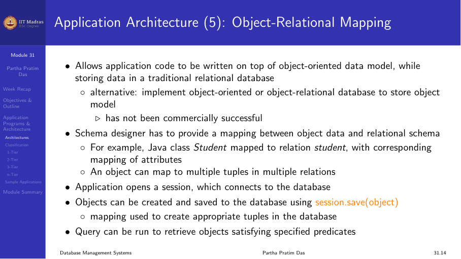
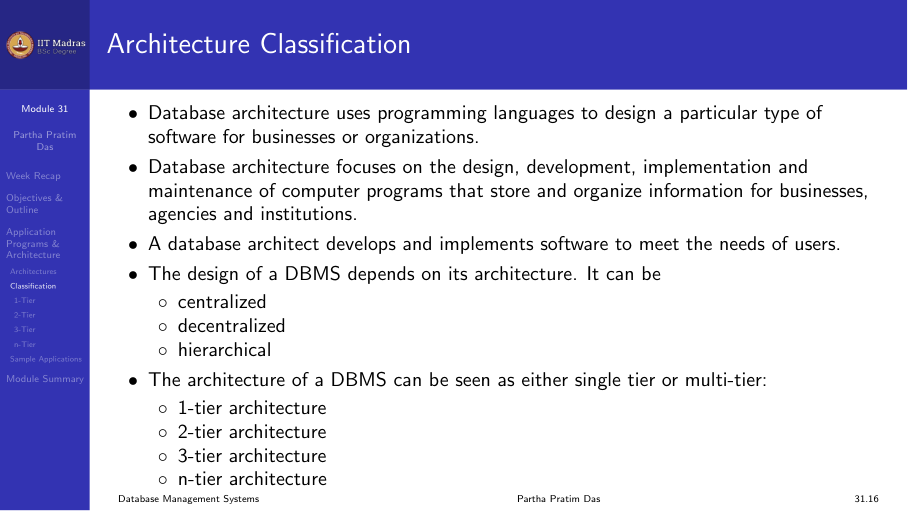
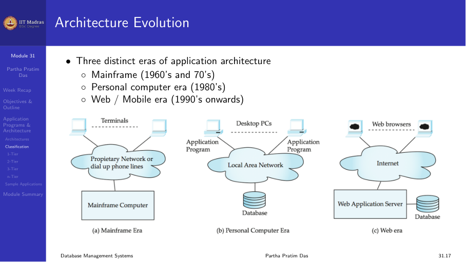
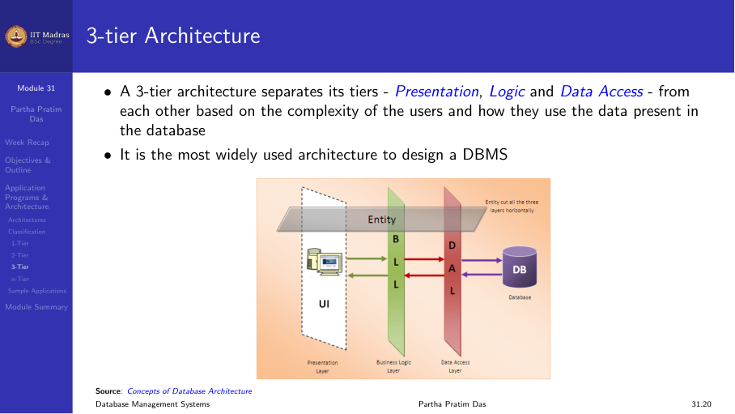
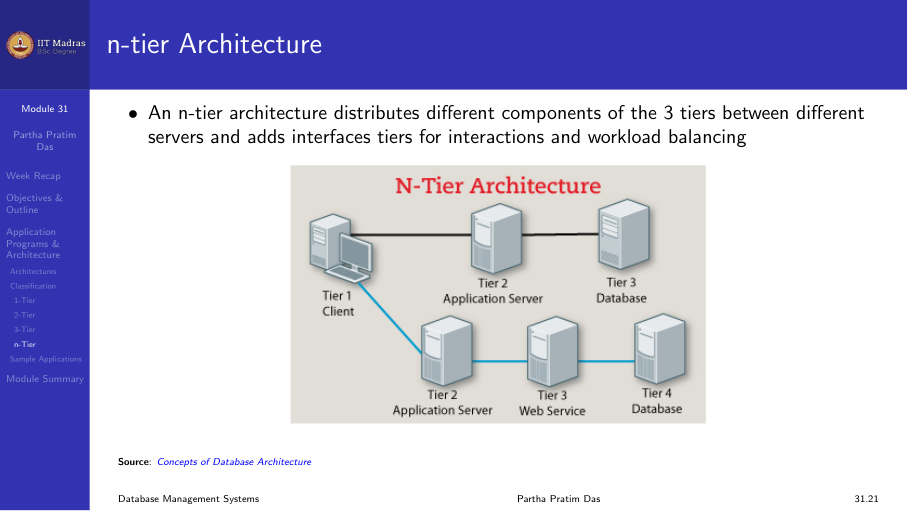

## Introduction

We have covered the entire gamut of relational databases — how to get to a good
design, how to normalize, how to reduce redundancy. Now we move forward to the
applications that are built with these databases in the backend.

The end goal of all database design is to build efficient, secure, and scalable
applications. Despite the wide variety of application domains, there is a strong
commonality in architecture across all of them.

## The three-layer architecture

Every web application can be split into three conceptual layers:

1. **Frontend (presentation layer).** The layer that interacts directly with
   the user through a browser or mobile app. It handles user input, displays
   results, and manages workflows like login, search, checkout, and payment.

2. **Middle layer (application / business logic layer).** Implements the
   functionality of the application. It links the frontend and backend layers.
   This includes authentication, search logic, pricing, cart management,
   payment gateway handling, order management, and delivery tracking.

3. **Backend (data access layer).** Manages persistent data in a database
   (Oracle, MySQL, PostgreSQL, etc.). This is the part of the database that
   we have been learning so far — tables, indexes, queries, normalization.

### How the layers work together

The frontend makes a request (e.g. through HTTP). This goes to the application
layer, which translates it into SQL queries for the database. The database
returns table results, which the application layer converts into a format the
frontend can display (e.g. HTML).

## Presentation layer: MVC architecture

The frontend layer typically follows the MVC (Model-View-Controller)
architecture:

- **Model.** The part of business logic that has to be presented in the
  frontend, e.g., authentication checks, data validation.
- **View.** How information is displayed on the screen — checkboxes, edit
  boxes, radio buttons, static text.
- **Controller.** Manages the view and model by receiving messages, executing
  actions, and returning a view to the user.

## Business logic layer

This layer provides a high-level view of the data. It keeps an object data
model corresponding to the relational tables and relationships. It hides the
details of the storage schema and can implement complex business rules that
cannot be implemented in the database alone.

For example, a business rule like "a student can enroll in a class only if
she has completed prerequisites and paid her tuition fees" is implemented here.
The database knows the prerequisites and fee status, but cannot make the
business decision — that belongs in the business logic layer.

### Object-relational mapping

The business logic layer needs an object-oriented view of data, while the
database has a relational view. This requires object-relational mapping (ORM),
where each entity (e.g., Student, Instructor, Course) has a corresponding
class in the programming language and a corresponding table in the database.

## Data access layer

The data access layer interfaces between the business logic layer and the
underlying database. It provides a mapping between the object models in the
business logic layer and the relational model that the database maintains.

There is a paradigm mismatch: the business logic uses an object-oriented
language (Java, Python, C++), while the database uses SQL. The data access
layer bridges this gap.

## Evolution of architectures

The three-tier architecture did not happen overnight. It evolved over decades:

- **1970s: Mainframes.** Everything was centralized in a single huge, expensive
  computer. This was one-tier.
- **1980s: Personal computers + LAN.** Basic data distribution concepts emerged.
  This introduced two-tier client-server architecture.
- **1990s onward: Internet / Web.** Three-tier and N-tier architectures became
  the norm, with separate presentation, application, and database servers.
- **2000s onward: Mobile.** Heavy shift to mobile-based access with Android
  and iOS platforms.

### One-tier architecture

All three layers run on the same computer. Simple but not very useful for
real-world applications.

### Two-tier architecture (client-server)

The client tier has the frontend, and the database tier has the database
layer. The application layer is distributed between them. This is better than
one-tier but does not give clean separation.

### Three-tier architecture

The presentation, business logic, and data access layers are separated into
distinct tiers. This is the standard for most modern web applications.

### N-tier architecture

Functionally similar to three-tier, but in implementation there can be
multiple application servers, multiple database servers, web services, and
other components. The tiering is done from an implementation and technology
perspective.

## Sample applications

Every application — web mail, e-commerce, net banking, ride sharing — follows
the same three-tier architecture. For example, in web mail:

- **Presentation layer:** login, mail list, view mail, compose, filter.
- **Business logic layer:** user authentication, connect to mail server,
  encryption/decryption.
- **Data layer:** mail users table, address book, mail items.

## Summary

All data-intensive web applications share the same fundamental three-tier
architecture: presentation, business logic, and data access. The database
architect designs and implements this architecture, and the specific details
are filled in by application developers.
