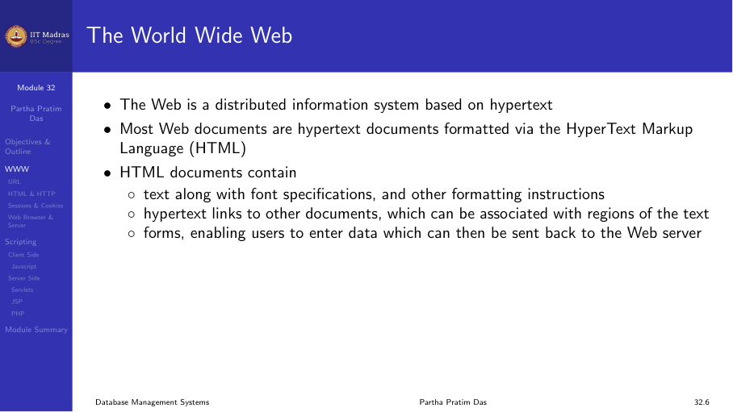
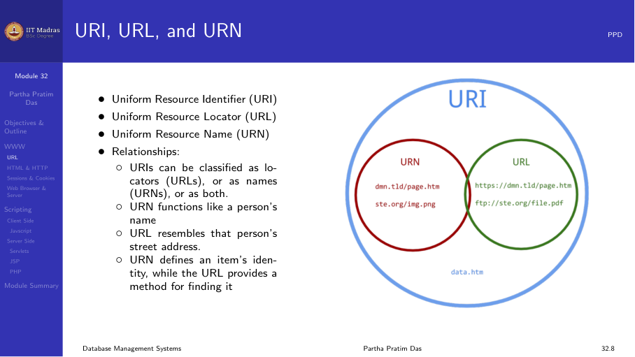
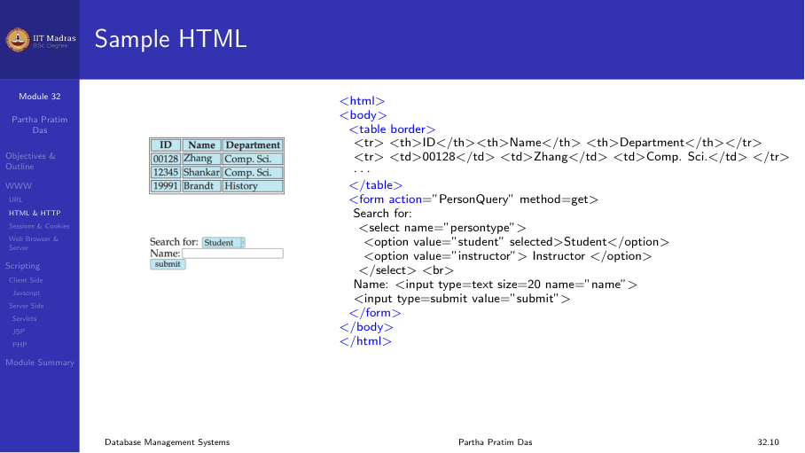
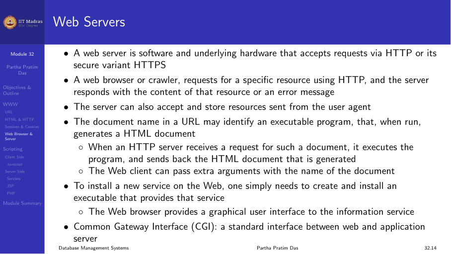
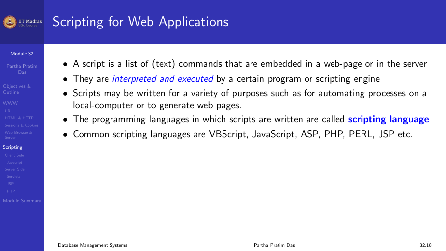
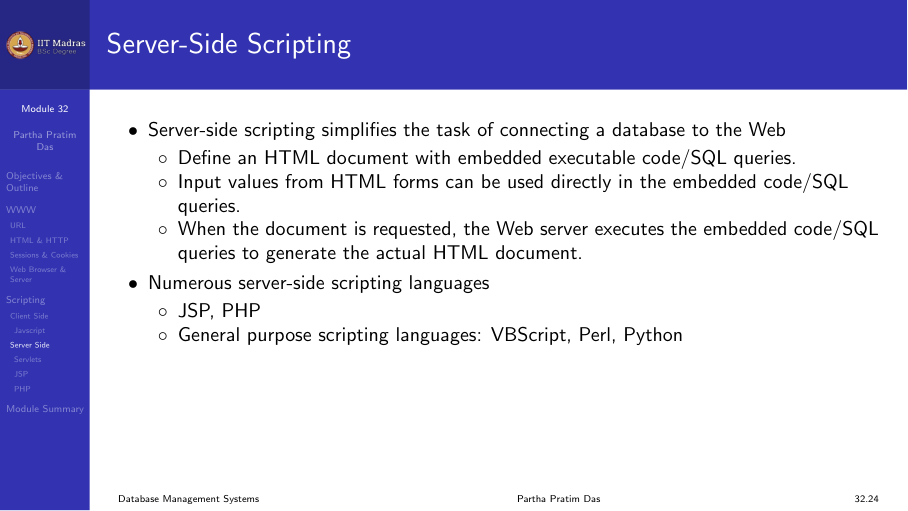

## The World Wide Web

The Web is the platform for modern database applications. Understanding its
fundamental technologies is essential for building database-backed web
applications.

### URL

A Uniform Resource Locator (URL) identifies a resource on the web. It has
three parts: the protocol (e.g., http, https), the host (e.g.,
www.example.com), and the path (e.g., /products/details).



### HTML

HTML (HyperText Markup Language) is the standard language for creating web
pages. It uses tags to structure content — headings, paragraphs, links,
images, tables, and forms.

Forms are particularly important for database applications. They collect user
input (text fields, checkboxes, radio buttons, dropdowns) and send it to the
server for processing.



### HTTP

HTTP (HyperText Transfer Protocol) is the protocol used for communication
between a web browser and a web server.

- **GET.** Requests data from the server. Parameters are appended to the URL.
  Used for simple retrievals like viewing a page or searching.
- **POST.** Submits data to the server. Parameters are in the request body.
  Used for form submissions, login, and data modifications.

HTTP is stateless — each request is independent. The server does not remember
past requests by default.

### Sessions and cookies

Because HTTP is stateless, we need mechanisms to maintain state across
requests:

- **Cookies.** Small pieces of data stored in the browser. The server sends a
  cookie, and the browser sends it back with every subsequent request. Used
  for session IDs, preferences, and tracking.
- **Sessions.** Server-side storage of user state. A session is identified by
  a unique ID, typically stored in a cookie. The session object can hold
  data like login status, cart contents, and user preferences.



### Web browser and web server

- **Web browser.** The client-side application (Chrome, Firefox, Safari) that
  renders HTML, executes JavaScript, and manages cookies and sessions.
- **Web server.** The server-side application (Apache, Nginx) that handles
  HTTP requests, serves static files, and passes dynamic requests to
  application code.

## Client-side scripting

Client-side scripting runs in the browser, not on the server. The primary
language for client-side scripting is **JavaScript**.

JavaScript enables:
- Form validation before submission
- Dynamic content updates without page reload (AJAX)
- Interactive UI elements (dropdowns, modals, sliders)
- Client-side data storage (localStorage)

This reduces server load and improves user experience by providing instant
feedback.



## Server-side scripting

Server-side scripting runs on the web server. It has access to databases,
file systems, and other server resources.

Common server-side technologies include:
- **Servlets.** Java-based server-side components that handle HTTP requests
  and generate dynamic HTML. They have full access to Java libraries and
  JDBC for database connectivity.
- **JSP (Java Server Pages).** A technology that allows embedding Java code in
  HTML pages. JSP pages are compiled into servlets and executed on the server.
- **PHP.** A widely used scripting language designed for web development. PHP
  code is embedded in HTML and executed on the server.
- **ASP.NET.** Microsoft's server-side framework.
- **Node.js.** JavaScript-based server-side runtime.



### Servlets

A servlet is a Java class that extends the capabilities of a server. It
receives HTTP requests and generates responses, typically in HTML.

The servlet lifecycle:
1. **init()** — called when the servlet is loaded.
2. **service()** — handles each request (doGet, doPost, etc.).
3. **destroy()** — called when the servlet is unloaded.

Servlets use JDBC to connect to databases, execute queries, and return
results as HTML.

### JSP (Java Server Pages)

JSP allows mixing HTML with Java code using special tags:
- `<% ... %>` — scriptlet (Java code)
- `<%= ... %>` — expression (output value)
- `<%@ ... %>` — directive (page settings, imports)

JSP pages are compiled into servlets, so they have the same capabilities as
servlets but are easier to write.



### PHP

PHP is a server-side scripting language that is particularly suited for web
development. PHP code is embedded in HTML and executed on the server.

```php
<?php
  $conn = mysqli_connect("localhost", "user", "pass", "db");
  $result = mysqli_query($conn, "SELECT * FROM users");
  while ($row = mysqli_fetch_assoc($result)) {
    echo $row["name"] . "<br>";
  }
?>
```

PHP has built-in support for many databases including MySQL, PostgreSQL, and
Oracle.

## Comparison of server-side technologies

| Technology | Language | Platform | Database access |
|------------|----------|----------|-----------------|
| Servlets | Java | Cross-platform | JDBC |
| JSP | Java | Cross-platform | JDBC |
| PHP | PHP | Cross-platform | mysqli, PDO |
| ASP.NET | C#, VB.NET | Windows (.NET) | ADO.NET |
| Node.js | JavaScript | Cross-platform | Various drivers |

## Module summary

Web applications rely on a stack of technologies: HTML for structure, HTTP
for communication, cookies and sessions for state management, JavaScript for
client-side interactivity, and server-side technologies (Servlets, JSP, PHP,
etc.) for business logic and database access.
