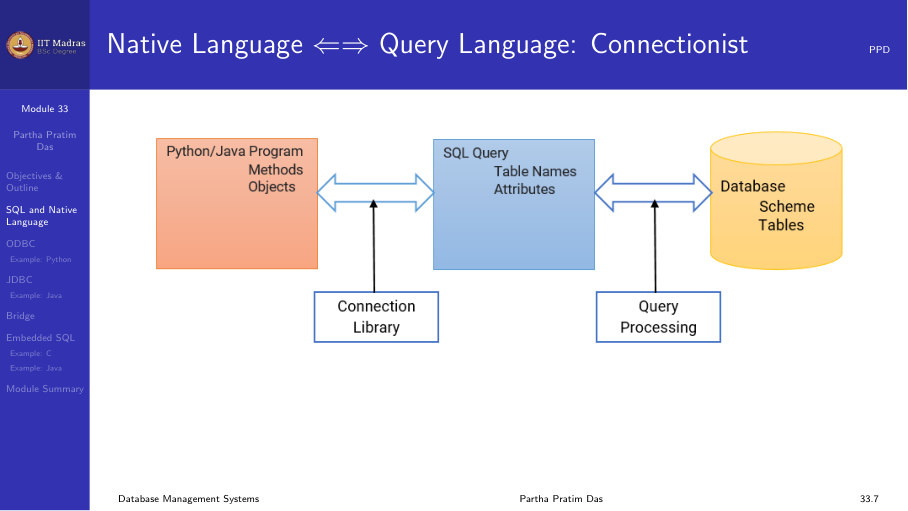
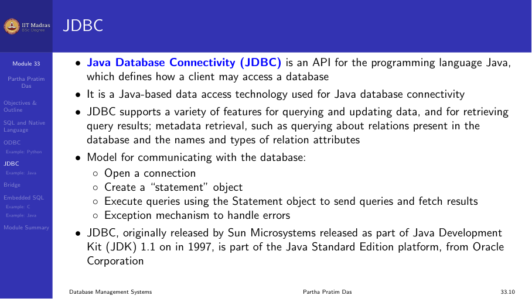
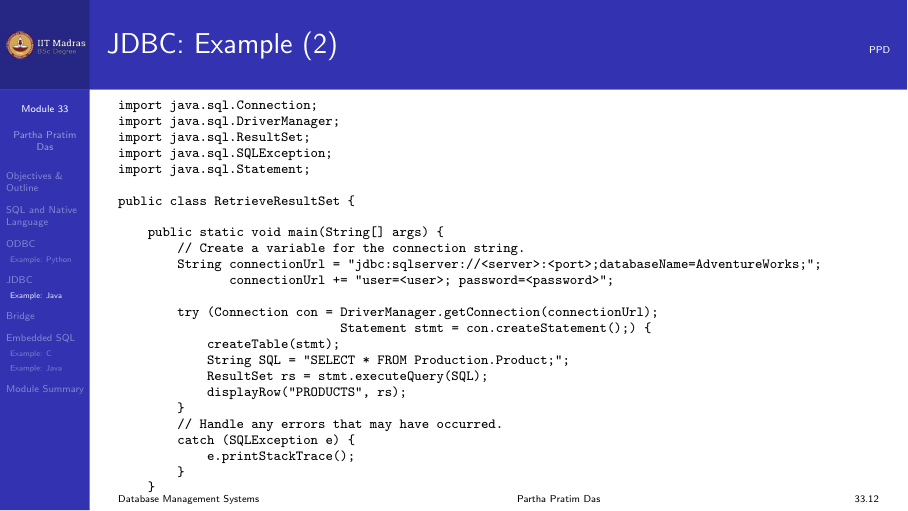

## The paradigm mismatch

Applications are written in general-purpose programming languages (Java,
Python, C++), while databases use SQL. These are two different paradigms:
object-oriented or procedural languages on one side, and the relational model
with SQL on the other.

To build a database-backed application, we need a bridge between the two.
There are several approaches:

1. **Database API libraries** — ODBC, JDBC, Python DB-API
2. **Embedded SQL** — SQL statements embedded directly in a host language
3. **ORM (Object-Relational Mapping)** — automatic mapping of objects to
   tables

## ODBC (Open Database Connectivity)

ODBC is a standard API for accessing databases, developed by Microsoft in the
early 1990s. It provides a uniform interface to different database systems.

**Architecture:**
- **Application.** The program that needs database access.
- **ODBC Driver Manager.** Manages communication between the application and
  drivers.
- **ODBC Driver.** A DLL specific to each database (e.g., Oracle driver, MySQL
  driver, PostgreSQL driver).
- **Data Source.** The actual database and its configuration.

The application uses the same ODBC calls regardless of the underlying
database. The driver manager routes the calls to the appropriate driver.



**ODBC workflow:**
1. Allocate an environment handle.
2. Allocate a connection handle and connect to the data source.
3. Allocate a statement handle.
4. Execute SQL statements.
5. Fetch results.
6. Free handles and disconnect.

## JDBC (Java Database Connectivity)

JDBC is the Java equivalent of ODBC. It provides a standard API for Java
programs to access databases.

**JDBC drivers come in four types:**
1. **JDBC-ODBC bridge.** Translates JDBC calls to ODBC calls. Useful for
   databases that only have ODBC drivers, but has performance overhead.
2. **Native-API driver.** Converts JDBC calls to the database's native API
   (e.g., Oracle OCI). Requires client-side libraries.
3. **Network protocol driver.** Uses a middleware server that converts JDBC
   calls to the database protocol. No client libraries needed.
4. **Thin driver.** Converts JDBC calls directly to the database's wire
   protocol. Pure Java, no client libraries needed.



**JDBC workflow:**
```java
// 1. Load driver
Class.forName("org.postgresql.Driver");

// 2. Connect
Connection conn = DriverManager.getConnection(
    "jdbc:postgresql://localhost/db", "user", "pass");

// 3. Create statement
Statement stmt = conn.createStatement();

// 4. Execute query
ResultSet rs = stmt.executeQuery("SELECT * FROM students");

// 5. Process results
while (rs.next()) {
    System.out.println(rs.getString("name"));
}

// 6. Clean up
rs.close();
stmt.close();
conn.close();
```



**Prepared statements** are a better alternative to Statement. They precompile
the SQL, prevent SQL injection, and handle parameter substitution:

```java
PreparedStatement pstmt = conn.prepareStatement(
    "INSERT INTO students (id, name) VALUES (?, ?)");
pstmt.setInt(1, 101);
pstmt.setString(2, "Alice");
pstmt.executeUpdate();
```

## Python DB-API

Python has its own database API specification, PEP 249 (DB-API 2.0). It
defines a standard interface that all Python database drivers follow.

```python
import psycopg2

# Connect
conn = psycopg2.connect(
    host="localhost",
    database="mydb",
    user="user",
    password="pass"
)

# Create cursor
cur = conn.cursor()

# Execute query
cur.execute("SELECT * FROM students")
rows = cur.fetchall()
for row in rows:
    print(row)

# Execute with parameters (SQL injection safe)
cur.execute(
    "INSERT INTO students (id, name) VALUES (%s, %s)",
    (101, "Alice")
)
conn.commit()

# Clean up
cur.close()
conn.close()
```

The DB-API workflow mirrors ODBC/JDBC:
1. Connect to the database.
2. Create a cursor.
3. Execute SQL through the cursor.
4. Fetch results.
5. Commit or rollback transactions.
6. Close cursor and connection.

## Bridge: Direct database access vs. ORM

Database API libraries give direct access to SQL. An alternative is
**Object-Relational Mapping (ORM)**, which maps database tables to
programming language objects automatically.

| Aspect | Direct API (JDBC/ODBC) | ORM (Hibernate, SQLAlchemy) |
|--------|----------------------|-----------------------------|
| Control | Full control over SQL | Abstraction over SQL |
| Performance | Optimized queries | May generate inefficient queries |
| Complexity | More boilerplate code | Less code, but complex setup |
| Learning curve | Need SQL knowledge | Need to learn ORM framework |

## Embedded SQL

Embedded SQL allows writing SQL statements directly inside a host language
program (C, C++, Java). A preprocessor (precompiler) converts embedded SQL
into function calls to the database API.

**Example in C:**
```c
EXEC SQL INCLUDE SQLCA;

EXEC SQL BEGIN DECLARE SECTION;
    int emp_id;
    char emp_name[50];
    float salary;
EXEC SQL END DECLARE SECTION;

EXEC SQL CONNECT TO 'mydb' USER 'user';

EXEC SQL DECLARE emp_cursor CURSOR FOR
    SELECT id, name, salary FROM employees;

EXEC SQL OPEN emp_cursor;

while (1) {
    EXEC SQL FETCH emp_cursor INTO :emp_id, :emp_name, :salary;
    if (SQLCODE != 0) break;
    printf("%d %s %f\n", emp_id, emp_name, salary);
}

EXEC SQL CLOSE emp_cursor;
EXEC SQL DISCONNECT;
```

**Advantages of embedded SQL:**
- SQL is explicit and visible in the code.
- The precompiler can perform type checking and optimization.
- Good performance for simple queries.

**Disadvantages:**
- Mixes two languages in one file.
- Requires a precompilation step.
- Not portable across different databases.

Embedded SQL is less common today. Most modern applications use JDBC/ODBC
directly or use an ORM framework.

## Summary

| Technology | Language | Standard | Key feature |
|------------|----------|----------|-------------|
| ODBC | C/C++ | Microsoft standard | Driver-based, cross-database |
| JDBC | Java | Java standard | Type 1-4 drivers, prepared statements |
| Python DB-API | Python | PEP 249 | Consistent interface, parameterized queries |
| Embedded SQL | C/C++, Java, COBOL | SQL standard | SQL in source code, precompiler needed |

The choice depends on the application requirements, the programming language
used, and the specific database system.
