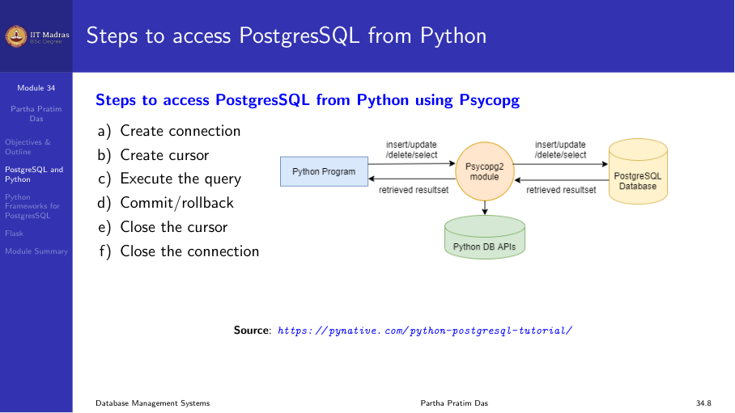

## Working with PostgreSQL and Python

Python has several modules to work with a PostgreSQL database. The most
popular is **psycopg2**.

**Advantages of psycopg2:**
- Most popular and stable module
- Actively maintained, supports Python 2.x and 3.x
- Thread-safe, designed for multi-threaded applications

Installation:
```bash
pip install psycopg2
```

## Steps to access PostgreSQL from Python

The workflow follows a standard pattern:

1. Create a connection.
2. Create a cursor.
3. Execute SQL queries.
4. Commit or rollback changes.
5. Close the cursor.
6. Close the connection.



## Connection and cursor APIs

### Connection

```python
import psycopg2

def connectDb(dbname, user, password, host, port):
    conn = None
    try:
        conn = psycopg2.connect(
            database=dbname,
            user=user,
            password=password,
            host=host,
            port=port
        )
        print("Connected")
    except Exception as e:
        print(f"Error: {e}")
    finally:
        if conn:
            conn.close()
```

### Cursor

Once connected, create a cursor to execute queries:

```python
cur = conn.cursor()
```

### Execute

Execute SQL with optional parameterized placeholders:

```python
cur.execute("INSERT INTO table VALUES (%s, %s)", (val1, val2))
```

### Fetch results

- `cursor.fetchone()` — returns the next row.
- `cursor.fetchmany(size)` — returns `size` rows as a list.
- `cursor.fetchall()` — returns all remaining rows as a list.
- `cursor.rowcount` — read-only attribute returning the number of rows
  modified, inserted, or deleted.

### Commit and rollback

```python
conn.commit()     # make changes permanent
conn.rollback()   # undo changes since last commit
```

## Examples

### CREATE table

```python
def createTable():
    conn = None
    try:
        conn = psycopg2.connect(database="testdb", user="postgres",
                                password="pass", host="127.0.0.1", port="5432")
        cur = conn.cursor()
        cur.execute('''
            CREATE TABLE candidate (
                email_id  VARCHAR(255) PRIMARY KEY,
                first_name VARCHAR(100),
                last_name  VARCHAR(100)
            )
        ''')
        conn.commit()
        print("Table created successfully")
        cur.close()
    except Exception as e:
        print(f"Error: {e}")
    finally:
        if conn:
            conn.close()
```

### INSERT

```python
def insertRecord(num, name):
    conn = None
    try:
        conn = psycopg2.connect(database="testdb", user="postgres",
                                password="pass", host="127.0.0.1", port="5432")
        cur = conn.cursor()
        cur.execute(
            "INSERT INTO candidate (num, name) VALUES (%s, %s)",
            (num, name)
        )
        conn.commit()
        print("Record inserted successfully")
        cur.close()
    except Exception as e:
        print(f"Error: {e}")
    finally:
        if conn:
            conn.close()
```

### DELETE

```python
def deleteRecord(num):
    conn = None
    try:
        conn = psycopg2.connect(database="testdb", user="postgres",
                                password="pass", host="127.0.0.1", port="5432")
        cur = conn.cursor()
        cur.execute("DELETE FROM candidate WHERE num = %s", (num,))
        conn.commit()
        print(f"{cur.rowcount} row(s) deleted")
        cur.close()
    except Exception as e:
        print(f"Error: {e}")
    finally:
        if conn:
            conn.close()
```

### UPDATE

```python
def updateRecord(num, name):
    conn = None
    try:
        conn = psycopg2.connect(database="testdb", user="postgres",
                                password="pass", host="127.0.0.1", port="5432")
        cur = conn.cursor()
        cur.execute(
            "UPDATE candidate SET name = %s WHERE num = %s",
            (name, num)
        )
        conn.commit()
        print(f"{cur.rowcount} row(s) updated")
        cur.close()
    except Exception as e:
        print(f"Error: {e}")
    finally:
        if conn:
            conn.close()
```

### SELECT

```python
def selectAll():
    conn = None
    try:
        conn = psycopg2.connect(database="testdb", user="postgres",
                                password="pass", host="127.0.0.1", port="5432")
        cur = conn.cursor()
        cur.execute("SELECT * FROM candidate")
        rows = cur.fetchall()
        for row in rows:
            print(f"{row[0]} {row[1]} {row[2]}")
        cur.close()
    except Exception as e:
        print(f"Error: {e}")
    finally:
        if conn:
            conn.close()
```

## Flask web framework

Flask is a lightweight WSGI micro-framework for Python. It provides a
convenient way to build web applications that connect to a database.

### Installation

```bash
pip install Flask
```

### Simple example

```python
from flask import Flask
app = Flask(__name__)

@app.route("/")
def hello_world():
    return "<p>Hello, World!</p>"

if __name__ == "__main__":
    app.run(host="127.0.0.1", port=5000)
```

### A complete application with PostgreSQL

Consider the `candidate` table in PostgreSQL. The application provides:
- A home page with links to add and view emails.
- A form to add a new candidate.
- A page to view all candidates.

**index.html:**
```html
<!DOCTYPE html>
<html>
<head><title>Candidate Email</title></head>
<body>
    <h1>Candidate Email Database</h1>
    <a href="/add">Add Email</a><br>
    <a href="/viewall">View Email</a>
</body>
</html>
```

**Python application:**
```python
from flask import Flask, request, render_template
import psycopg2

app = Flask(__name__)

def get_connection():
    return psycopg2.connect(database="testdb", user="postgres",
                            password="pass", host="127.0.0.1", port="5432")

@app.route("/")
def index():
    return render_template("index.html")

@app.route("/add")
def add():
    return render_template("add.html")

@app.route("/savedetails", methods=["POST"])
def saveDetails():
    conn = get_connection()
    cur = conn.cursor()
    email = request.form["email"]
    first_name = request.form["first_name"]
    last_name = request.form["last_name"]
    cur.execute(
        "INSERT INTO candidate (email_id, first_name, last_name) VALUES (%s, %s, %s)",
        (email, first_name, last_name)
    )
    conn.commit()
    cur.close()
    conn.close()
    return "Record saved successfully"

@app.route("/viewall")
def viewAll():
    conn = get_connection()
    cur = conn.cursor()
    cur.execute("SELECT * FROM candidate")
    results = cur.fetchall()
    cur.close()
    conn.close()
    return render_template("viewall.html", rows=results)

if __name__ == "__main__":
    app.run(host="127.0.0.1", port=5000, debug=True)
```

**add.html:**
```html
<!DOCTYPE html>
<html>
<body>
    <h1>Add Email Information</h1>
    <form action="/savedetails" method="post">
        <table>
            <tr><td>Email ID:</td><td><input type="text" name="email"></td></tr>
            <tr><td>First Name:</td><td><input type="text" name="first_name"></td></tr>
            <tr><td>Last Name:</td><td><input type="text" name="last_name"></td></tr>
            <tr><td colspan="2"><input type="submit" value="Submit"></td></tr>
        </table>
    </form>
</body>
</html>
```

**viewall.html:**
```html
<!DOCTYPE html>
<html>
<body>
    <h1>Email List</h1>
    <table border="1">
        <tr><th>Email ID</th><th>First Name</th><th>Last Name</th></tr>
        
        <tr>
            <td>{{ row[0] }}</td>
            <td>{{ row[1] }}</td>
            <td>{{ row[2] }}</td>
        </tr>
        
    </table>
    <br><a href="/">Go Home</a>
</body>
</html>
```

## Summary

- psycopg2 is the standard Python module for accessing PostgreSQL.
- The workflow is: connect → cursor → execute → commit/rollback → close.
- Flask is a lightweight framework for building web applications with
  database connectivity.
- Flask handles routing, templates, and HTTP methods, so you can focus on
  the application logic and database access.
