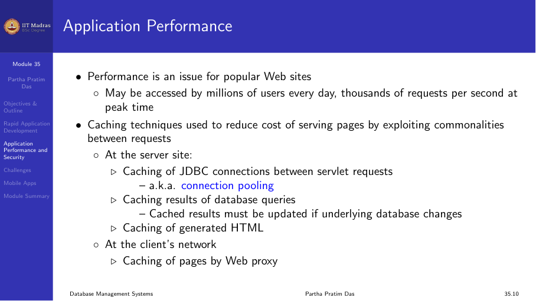
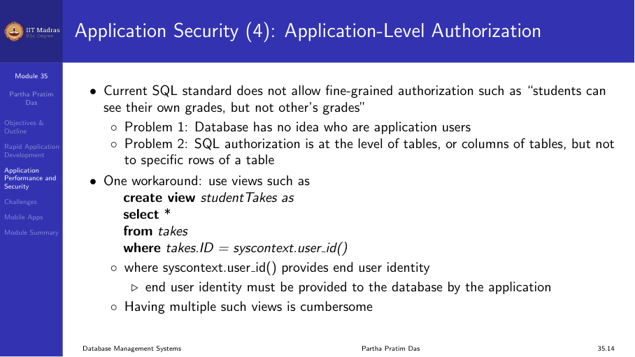
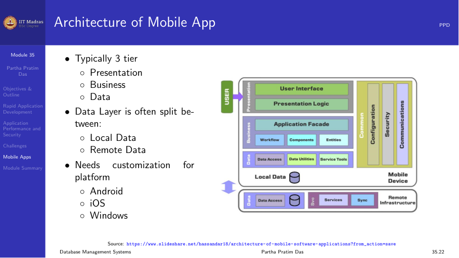

## Rapid application development (RAD)

Building a production-grade database application from scratch takes time.
Rapid application development uses frameworks and tools to speed up the
process.

### Key principles of RAD

1. **Use of frameworks.** Leverage existing frameworks (Django, Ruby on Rails,
   Spring) that provide built-in database integration, authentication, and
   templating.
2. **Code generation.** Use tools that generate boilerplate code for common
   operations (CRUD, authentication, forms).
3. **Reusable components.** Build and reuse modular components across projects.
4. **Iterative development.** Build prototypes quickly, get feedback, and
   iterate.

### RAD frameworks

Python offers several frameworks for rapid web application development:
- **Flask.** Lightweight, minimal, good for small to medium applications.
- **Django.** Full-featured, includes ORM, admin interface, and authentication.
- **Pyramid.** Flexible, scales from small to large applications.

## Application performance

Performance of a database application depends on all three tiers.

### Frontend performance

- **Minimize HTTP requests.** Combine CSS and JavaScript files, use CSS
  sprites for images.
- **Caching.** Use browser caching for static resources. Use CDN for assets.
- **Lazy loading.** Load images and content only when needed.
- **Minification.** Remove whitespace and comments from HTML, CSS, and
  JavaScript.

### Backend/application layer performance

- **Connection pooling.** Reuse database connections instead of creating new
  ones for every request.
- **Caching frequently accessed data.** Use in-memory caches like Redis or
  Memcached.
- **Asynchronous processing.** Move long-running tasks (email, report
  generation) to background jobs.
- **Load balancing.** Distribute requests across multiple application servers.

### Database performance

- **Indexing.** Create appropriate indexes on columns used in WHERE, JOIN, and
  ORDER BY clauses.
- **Query optimization.** Use EXPLAIN to analyze query plans. Avoid SELECT *.
- **Denormalization.** Add controlled redundancy for read-heavy queries (as
  discussed in week 6).
- **Connection limits.** Configure the database to handle the expected number
  of concurrent connections.



## Application security

Security must be considered at every layer of the application.

### Authentication and authorization

- **Authentication.** Verifying who the user is. Use secure password hashing
  (bcrypt, Argon2), multi-factor authentication, and OAuth for third-party
  logins.
- **Authorization.** Verifying what the user can do. Implement role-based
  access control (RBAC) at the application layer.

### SQL injection

SQL injection occurs when user input is directly concatenated into SQL
queries. Always use parameterized queries or prepared statements.

**Vulnerable code:**
```python
# String interpolation — DANGEROUS
query = f"SELECT * FROM users WHERE name = '{user_input}'"
```

**Safe code:**
```python
# Parameterized query — SAFE
cur.execute("SELECT * FROM users WHERE name = %s", (user_input,))
```

### Cross-site scripting (XSS)

XSS occurs when user input is displayed without sanitization, allowing
attackers to inject JavaScript. Sanitize all user input before displaying
it in HTML.

### CSRF (Cross-site request forgery)

CSRF attacks trick authenticated users into performing actions they did not
intend. Use CSRF tokens in forms to prevent this. Most web frameworks (Django,
Rails, Spring) include CSRF protection by default.

### HTTPS

Always use HTTPS (TLS) for all communication between the browser and the
server. This encrypts data in transit and prevents eavesdropping.

### Data validation

Validate all input on both the client side (for user experience) and the
server side (for security). Never trust client-side validation alone.



### Environment-specific configuration

- **Development.** Debug mode on, detailed error messages, local database.
- **Staging.** Mimics production, uses separate database.
- **Production.** Debug mode off, detailed logging, hardened security,
  connection pooling, load balancing.

Never use development settings in production.

## Challenges

### Session management

Web applications need to maintain session state across HTTP requests. Common
approaches:
- **Server-side sessions.** Store session data in memory or a session table in
  the database.
- **Token-based authentication (JWT).** The client stores a token and sends it
  with every request. No server-side session storage needed.

### Concurrency

Multiple users accessing the same data simultaneously can cause race
conditions. Use database transactions with appropriate isolation levels (as
will be discussed in week 10).

### Scalability

As the user base grows, the application must scale:
- **Vertical scaling.** Add more resources (CPU, RAM) to the existing server.
- **Horizontal scaling.** Add more servers and distribute the load.

Horizontal scaling is more complex because the database must handle
distributed data. Techniques include replication, sharding, and caching.

## Mobile applications

Most database applications today have mobile counterparts. The mobile app
communicates with the same backend API and database.

### Mobile architecture

- **Native apps.** Built for a specific platform (Android with Java/Kotlin,
  iOS with Swift/Objective-C). They provide the best performance and access
  to device features.
- **Hybrid apps.** Built with web technologies (HTML, CSS, JavaScript) and
  wrapped in a native container (Cordova, Ionic).
- **Cross-platform frameworks.** Use a single codebase for both platforms
  (Flutter, React Native).

All of these communicate with the backend through REST APIs or GraphQL,
which in turn access the database.



### API design for mobile

Mobile apps have different requirements from web apps:
- **Smaller payloads.** Mobile networks are slower. Send only necessary data.
- **Offline support.** Cache data locally and sync when the network is
  available.
- **Push notifications.** Alert users without them having to open the app.
- **Battery efficiency.** Minimize background network calls.

## Module summary

Building a production database application involves:

1. **Choosing the right framework** for rapid development.
2. **Optimizing performance** at all three tiers (frontend, application,
   database).
3. **Implementing security** at every layer (authentication, SQL injection
   prevention, XSS protection, HTTPS).
4. **Handling challenges** like session management, concurrency, and
   scalability.
5. **Supporting mobile clients** through well-designed APIs.

This concludes the application development week. The next weeks will cover
storage management, indexing, and other advanced topics.
