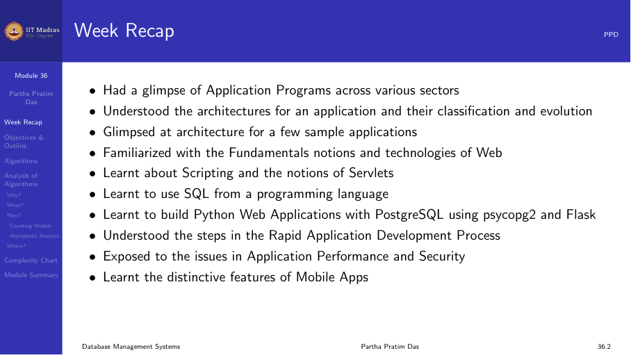
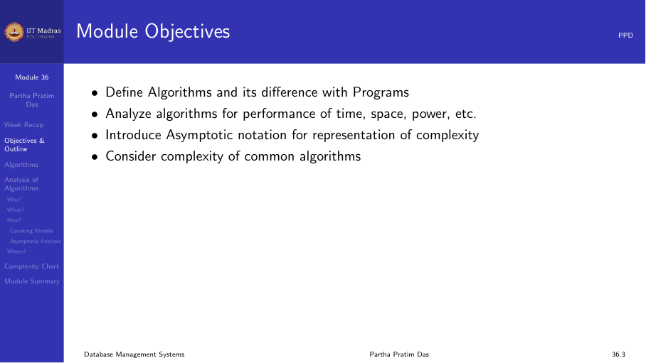
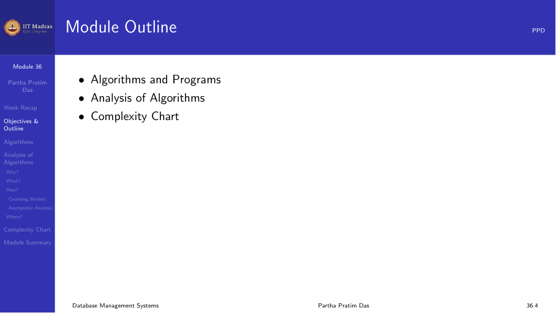
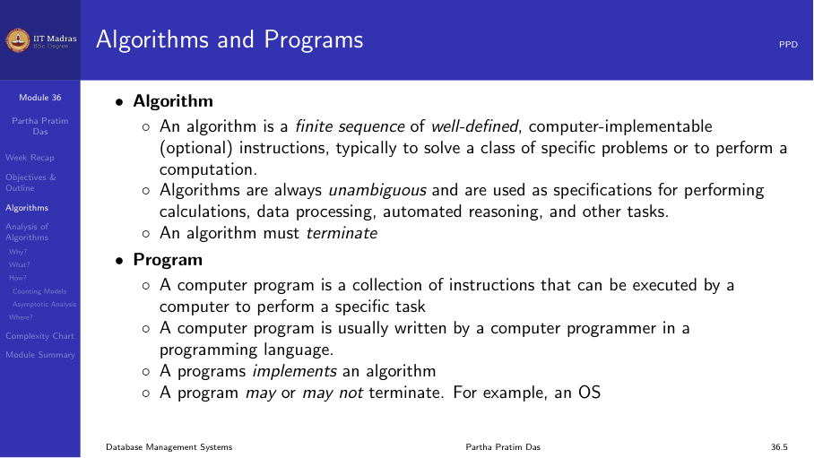
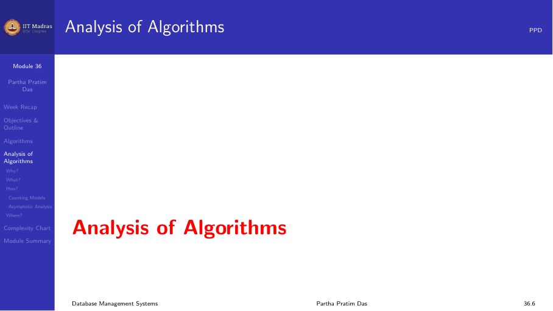
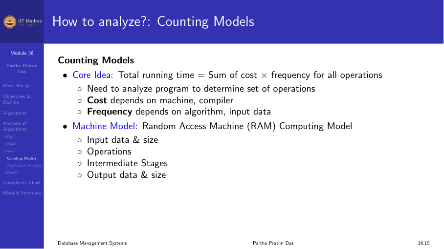
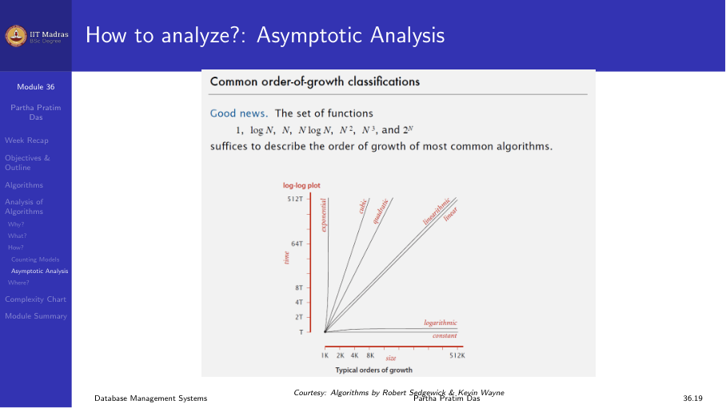
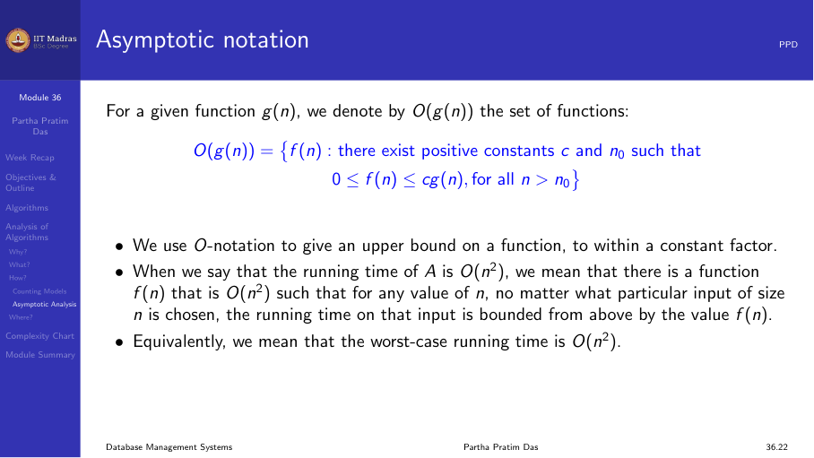

## Introduction

Data in a database must be stored somewhere. The performance of a database
system depends heavily on how and where data is stored, how it moves between
storage levels, and how the storage hardware works.

## Storage hierarchy

Computer storage is organized as a hierarchy. As you go down the hierarchy,
capacity increases, cost per byte decreases, and access speed decreases.

1. **Cache memory.** Small, fast, expensive. Located on the CPU chip. Access
   time is a few nanoseconds.
2. **Main memory (RAM).** Larger than cache (gigabytes). Access time is tens
   of nanoseconds. Volatile — data is lost on power failure.
3. **Flash memory (SSD).** Non-volatile, faster than HDD. Used in laptops,
   servers, and phones.
4. **Magnetic disk (HDD).** Large capacity (terabytes). Access time is
   milliseconds. Non-volatile.
5. **Tape / archival storage.** Very large capacity. Sequential access only.
   Used for backups.

The hierarchy matters because a database cannot keep all its data in main
memory. Most data lives on disk. When a query needs data, the system moves
it from disk to memory. The time to read from disk is orders of magnitude
larger than the time to read from memory.

### Volatile versus non-volatile storage

- **Volatile storage.** Cache and main memory lose their contents when power
  is lost or the system crashes.
- **Non-volatile storage.** Disks, SSDs, and tape retain data across power
  failures and crashes.

Database systems must ensure that committed data is written to non-volatile
storage. This is the durability requirement of ACID.

## Magnetic disk

A magnetic disk stores data on spinning platters coated with magnetic
material. Each platter has concentric rings called tracks. Each track is
divided into sectors. A set of tracks at the same radius across all platters
is called a cylinder.

A read-write head floats above each platter surface. All heads move together
on a single arm assembly.

### Disk access time

The time to read or write a block on disk has three components:

1. **Seek time.** The time to move the read-write head to the correct track.
   This is the largest component, typically 4–10 milliseconds.
2. **Rotational latency.** The time for the desired sector to rotate under
   the head. On average, this is half the rotation time. For a 7200 RPM disk,
   average rotational latency is about 4.17 milliseconds.
3. **Transfer time.** The time to move data from the disk surface to the
   controller. This depends on the rotational speed and the number of bytes
   transferred.

Total access time = seek time + rotational latency + transfer time.

### Sequential versus random access

- **Sequential access.** Reading consecutive blocks. The seek happens once,
  then blocks pass under the head as the disk rotates. Very fast.
- **Random access.** Reading blocks at arbitrary locations. Each block
  requires a new seek and rotational delay. Much slower than sequential
  access by a factor of 10 to 100.

Database systems try to organize data so that most access is sequential.
Indexes and file organization methods are designed with this in mind.

### Performance metrics of disks

| Metric | Typical value |
|--------|---------------|
| Capacity | 1–20 TB |
| Rotation speed | 5400–15000 RPM |
| Average seek time | 4–10 ms |
| Average rotational latency | 2–6 ms |
| Transfer rate | 100–600 MB/s |
| Mean time to failure | 1–1.5 million hours |

## Flash memory (SSD)

Solid-state drives use NAND flash memory. They have no moving parts, so
there is no seek time or rotational latency. Access times are in the range
of tens to hundreds of microseconds, orders of magnitude faster than HDDs.

However, SSDs have two important limitations:

1. **Write cycles are limited.** Each flash cell can be written a finite
   number of times (typically 10,000 to 100,000). The drive uses wear
   leveling to spread writes across all cells.
2. **Writes are slow.** Writing to flash requires erasing an entire block
   first. Random writes are particularly slow compared to reads.

Most modern database systems are designed with both HDD and SSD
characteristics in mind. SSDs are often used for high-performance
workloads, while HDDs are used for bulk storage.

## RAID

RAID (Redundant Array of Independent Disks) combines multiple physical
disks into a single logical unit. The goals are:

- **Performance.** Multiple disks can be accessed in parallel.
- **Reliability.** Redundancy allows recovery from disk failures.

### RAID levels

Different RAID levels offer different trade-offs between performance,
capacity, and reliability.

**RAID 0 (Striping).** Data is split across multiple disks. Any disk failure
destroys all data. No redundancy.

**RAID 1 (Mirroring).** Each disk has an identical copy. Reads can be served
from either disk, improving read performance. Write performance is slower
because both disks must be updated.

**RAID 5 (Striping with parity).** Data and parity information are striped
across all disks. A single disk failure can be tolerated by recomputing the
lost data from the remaining disks and parity. Parity requires at least 3
disks.

**RAID 6 (Striping with dual parity).** Similar to RAID 5 but uses two
parity blocks. Can tolerate two simultaneous disk failures. Requires at
least 4 disks.

**RAID 10 (RAID 1 + 0).** Combines mirroring and striping. Disks are
mirrored in pairs, then striped across the pairs. Good performance and good
reliability, but only 50% capacity utilization.

## Buffer management

The database buffer manager is responsible for moving data between disk
and main memory. It manages a pool of memory pages called the buffer pool.

When a page is requested:

1. If the page is already in the buffer pool, it is returned immediately.
2. If the page is not in the buffer pool, the buffer manager reads it from
   disk into a free buffer frame.
3. If no free frame is available, a page is evicted using a replacement
   policy.

### Buffer replacement policies

- **LRU (Least Recently Used).** Evict the page that has not been accessed
  for the longest time. Works well for many workloads.
- **Clock policy.** An approximation of LRU that avoids the overhead of
  maintaining a precise LRU order. Each page has a reference bit. When a
  page is accessed, its bit is set to 1. The clock hand sweeps through
  pages, clearing bits until it finds a page with bit 0 to evict.
- **MRU (Most Recently Used).** Evict the most recently used page. Useful
  for scans where pages are unlikely to be re-referenced.
- **LRU-k.** Tracks the last k accesses to each page. More accurate than
  LRU for database workloads.

### Pinned pages

Some pages must stay in the buffer pool and cannot be evicted. These are
called pinned pages. For example, pages that are currently being updated or
pages that contain index root nodes are pinned.

### Buffer management and performance

The hit ratio of the buffer pool has a large impact on performance. If 90%
of page requests are served from the buffer pool, the effective access time
is close to main memory speed. If the hit ratio drops to 50%, performance
is dominated by disk access times.

The size of the buffer pool and the replacement policy determine the hit
ratio. Database administrators tune these parameters based on the workload.

## Summary

- Data in a database lives on non-volatile storage (disk or SSD).
- Storage is organized hierarchically: cache → memory → disk → tape.
- Disk access involves seek, rotational latency, and transfer.
- RAID provides performance and reliability through disk arrays.
- The buffer manager manages data movement between disk and memory.
- Buffer replacement policies (LRU, Clock, MRU) affect performance.
