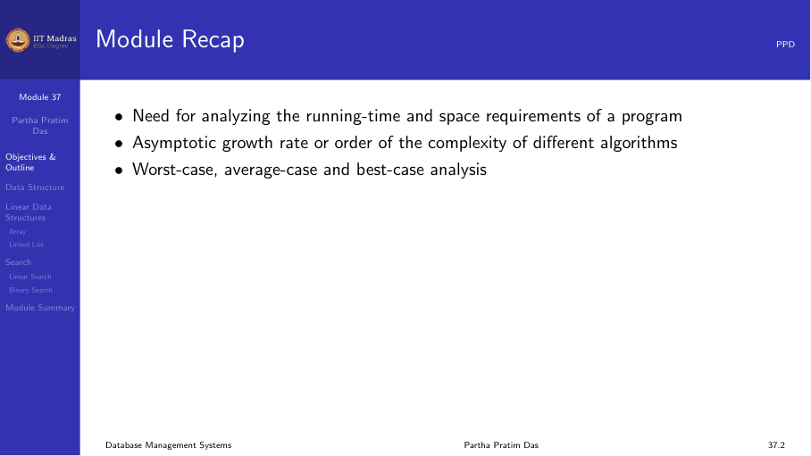
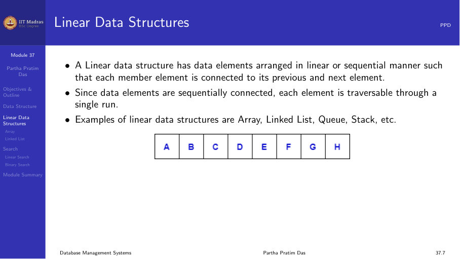
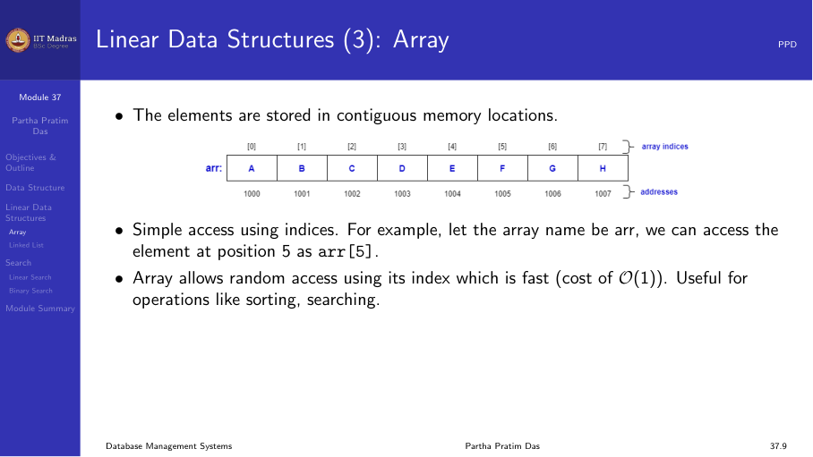
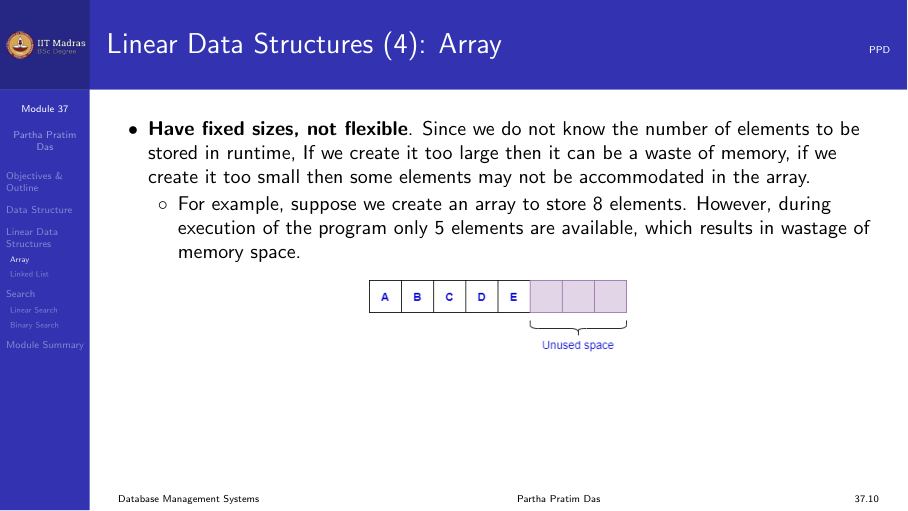
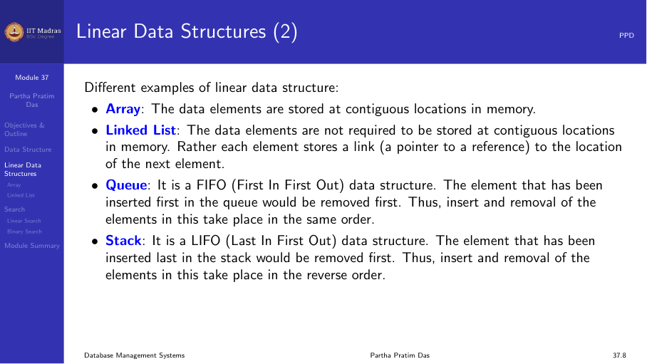
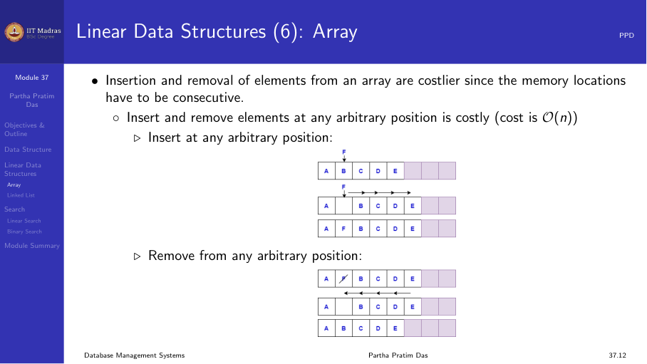
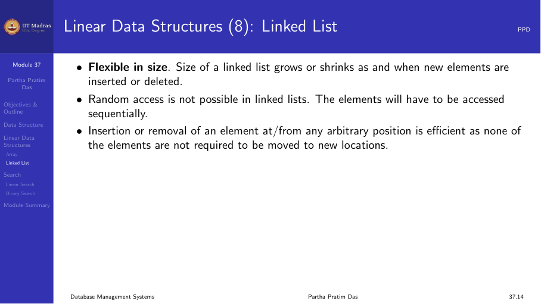
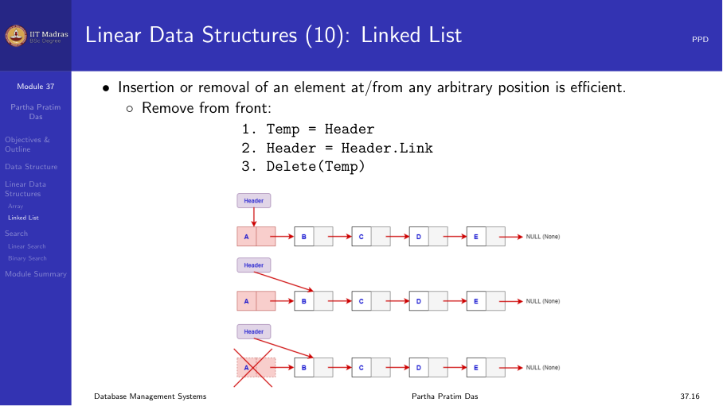
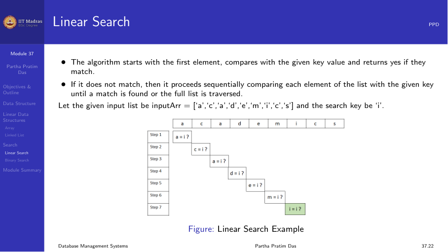

## Introduction

A database stores a large collection of data. This data is organized as
records that are stored in files on disk. How these records are arranged
inside files — the file organization — determines how quickly the system
can insert, delete, update, and search for records.

The choice of file organization depends on the workload. A relation that
is frequently queried with range conditions needs a different organization
from one that is mostly used for insertions.

## Fixed-length records

When the schema of a relation has only fixed-length attributes — integers,
fixed-length strings, dates — every record has exactly the same size. This
is the simplest case for file organization.

Suppose each record is R bytes long and there are N records. The i-th
record is stored at byte offset i × R from the start of the file. The
system can compute the location of any record directly without scanning.

### Advantages

- Simple offset calculation. Accessing the n-th record takes O(1) by
  computing the offset.
- No fragmentation within records.
- Easy to implement free lists because every slot is the same size.

### Disadvantages

- Wasted space when fields are optional (e.g., a VARCHAR column that is
  usually short but must be allocated the maximum possible length).
- Schema changes that alter the record size require rewriting the entire
  file.

### Deleting records

When a fixed-length record is deleted, the space becomes a hole. There are
three strategies to handle this:

1. **Move the last record into the hole.** Simple but changes the order of
   records.
2. **Mark the record as deleted.** A flag in the record header indicates
   the slot is available. The system does not reorganize immediately.
3. **Maintain a free list.** The deleted slot is added to a linked list of
   free slots. New records are placed in the first free slot.

## Variable-length records

Most real databases have variable-length attributes like VARCHAR, TEXT, or
BLOB. When records have variable length, the system cannot compute offsets
directly. It must store metadata to locate fields.

There are two common approaches.

### Pointer-based approach

Each record begins with a header that contains a pointer (offset) for each
field. The pointers allow the system to jump directly to the start of each
field. When fields are updated and their length changes, only the pointers
need adjustment.

### Directory-based approach

A fixed-size directory at the start of the record holds pointers to each
field. The directory is stored as an array of offsets. Field i is located
at the offset stored in directory entry i.

This approach allows random access to any field in O(1) time, but the
directory itself takes space. For a record with many fields, the directory
can be large.

## Free lists

When records are deleted, the space they occupied should be reused. A free
list is a linked list that connects all free slots or blocks in the file.

The free list works as follows:

- Each free slot contains a pointer to the next free slot.
- A file header stores the pointer to the first free slot.
- When a new record is inserted, the system removes the first free slot
  from the list and uses it.
- When a record is deleted, its slot is added to the front of the free
  list.

Free lists are efficient because insertion and deletion from the front of
the list are O(1). However, the order of records in the file becomes
unpredictable over time, which can hurt sequential scan performance.

## Slotted page structure

File blocks are usually 4 KB to 16 KB in size. Within a block, multiple
records are stored. The slotted page structure is a common way to organize
variable-length records within a block.

### Structure

A slotted page has three parts:

1. **Page header.** Stores metadata: the number of records in the page, the
   offset of the free space, and a slot array.
2. **Slot array.** An array of (offset, length) pairs. Each entry points to
   one record in the page.
3. **Free space / record area.** Records are stored starting from the end
   of the page and growing backward toward the slot array.

The slot array grows from the front of the page. The record area grows
from the back. When they meet, the page is full.

### Operations

- **Insert.** Append the record to the free area. Add a new entry to the
  slot array.
- **Delete.** Mark the slot entry as invalid (e.g., set length to -1). The
  space is not reclaimed immediately.
- **Compact.** When the free space becomes fragmented, the system slides
  all active records to one end of the page and updates their slot entries.
  This reclaims fragmented space.

Slotted pages are used in most database systems, including PostgreSQL,
Oracle, and MySQL. They handle variable-length records within a block
without wasting space.

## Sequential file organization

In a sequential file, records are stored in the order of a key attribute.
The key could be a student ID, an employee number, or any other attribute
that orders the records meaningfully.

### Advantages

- Range queries on the key are very fast. For example, "find all employees
  with salary between 50000 and 70000" reads a contiguous block of records.
- Sequential scans are efficient because blocks are read in order.
- Merging sorted data into the file is straightforward.

### Disadvantages

- Insertions are expensive. A new record must be placed in the correct
  position to maintain sort order. This may require shifting all subsequent
  records or using overflow blocks.
- Deletions leave holes that must be managed.

### Insertion with overflow blocks

To avoid shifting records on every insertion, the system can use overflow
blocks. When a new record belongs between two existing records, it is
placed in an overflow block. A pointer chain connects the main block to
the overflow chain.

Overflow blocks are efficient in the short term, but over time the chain
grows long and degrades query performance. Periodic reorganization is
needed.

### When to use sequential files

- Relations that are queried frequently with range conditions.
- Relations where the key is a natural ordering attribute (date, ID).
- Relations that are bulk-loaded in sorted order and rarely updated.

## Heap file organization

In a heap file, records are stored in no particular order. When a new
record arrives, it is placed at the end of the file or in the first
available free slot.

### Advantages

- Insertions are very fast. The system simply appends to the end of the
  file.
- No need to maintain a sorted order.

### Disadvantages

- Searching requires a full scan of the file. Every block must be read to
  find matching records.
- Heap files are rarely used as the primary organization for large tables
  that are queried frequently.

### When to use heap files

- Temporary tables created during query processing.
- Tables that are bulk-loaded and then indexed.
- Log tables where data is written sequentially and rarely queried.

## Choosing a file organization

The choice between sequential, heap, and other organizations depends on
the workload:

| Organization | Insert | Search | Range query | Delete |
|-------------|--------|--------|-------------|--------|
| Sequential | Slow | Fast (if key) | Very fast | Slow |
| Heap | Fast | Slow (full scan) | Slow | Fast |
| Hash (next module) | Fast | Fast (equality) | Slow | Fast |

Most database systems combine organizations. For example, a heap file may
have one or more indexes on it. The index provides fast search, while the
heap provides fast insertion.

## Summary

- File organization determines how records are placed in files on disk.
- Fixed-length records are simple but wasteful for variable data.
- Variable-length records use pointers or directories to locate fields.
- Free lists manage the reuse of space from deleted records.
- Slotted pages organize variable-length records within a block.
- Sequential files store records in key order for fast range queries.
- Heap files store records without order for fast insertion.
- The choice of organization depends on the workload pattern.
