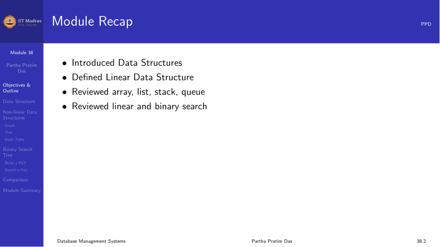
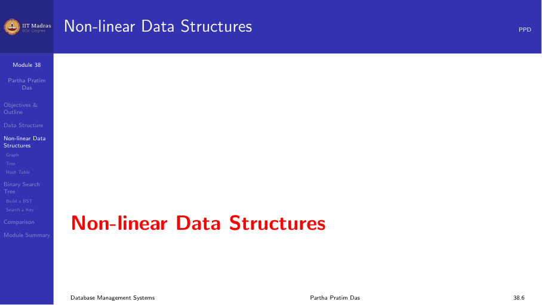
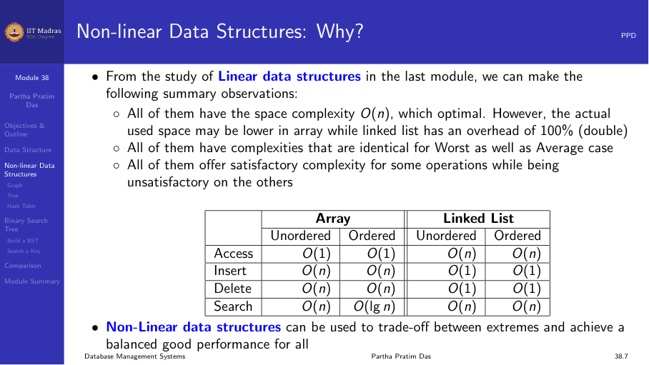
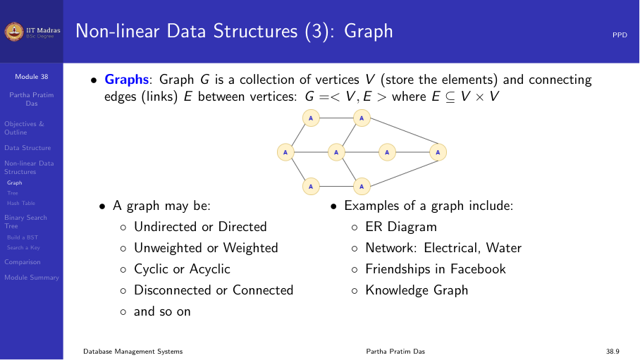
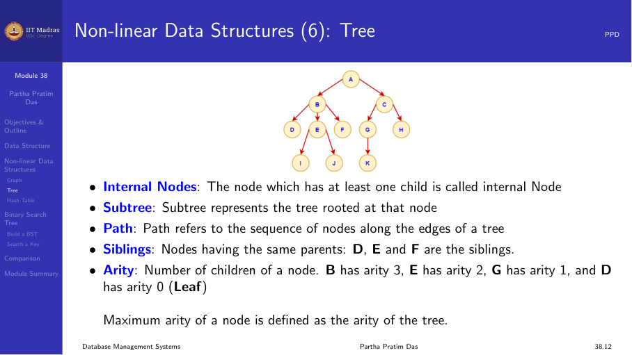
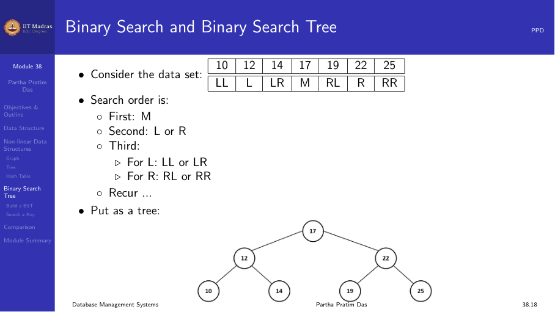

## Introduction

An index is a data structure that speeds up data retrieval. Think of it like
the index at the back of a textbook. Instead of scanning every page to find
a topic, you look up the topic in the index and go directly to the right
page.

In a database, an index on a relation is a separate structure that stores
a mapping from search key values to the physical locations of records.
Without an index, the database must scan the entire table — a full table
scan — to find matching rows. With an index, it can jump directly to the
relevant records.

## Why indexes matter

Consider a table with 10 million records. A full table scan might read tens
of thousands of disk blocks, taking minutes. An index on the search key can
reduce this to a few dozen block reads — a speedup of several orders of
magnitude.

However, indexes come with costs:

- **Storage space.** An index occupies its own disk space.
- **Write overhead.** Every insert, delete, or update on the table must also
  update the index.

The decision of which indexes to create is a trade-off between query
performance and write performance.

## Dense versus sparse indexes

Indexes can be categorized by how many records they point to.

### Dense index

A dense index has one index entry for every record in the table. The index
entry contains the search key value and a pointer to the record.

- **Advantage.** Can directly locate any record.
- **Disadvantage.** Large index size, especially for large tables.

### Sparse index

A sparse index has one index entry per block of records. The index entry
contains the search key value of the first record in the block and a
pointer to the block.

- **Advantage.** Much smaller than a dense index.
- **Disadvantage.** Must scan the block to find the exact record.

### When to use each

Sparse indexes can only be used with sequential file organization (records
sorted by the search key). If records are not sorted by the search key, a
sparse index would not work because the target record could be anywhere.

Dense indexes can be used with any file organization, including heap files.

## Primary versus secondary indexes

### Primary index

A primary index is defined on the same attribute that determines the
physical ordering of records in the file. If the file is sorted by the
key, a primary index on that key is a sparse index (one entry per block).

Every table can have at most one primary index because records can be
physically sorted in only one order.

### Secondary index

A secondary index is defined on an attribute that is not the physical sort
order. Secondary indexes are always dense indexes because records are not
ordered by the secondary key.

A table can have many secondary indexes — one on each attribute that is
frequently used in search conditions.

### Example

Consider a table Employee(ID, Name, Salary) sorted by ID.

- A primary index on ID is a sparse index with one entry per block.
- A secondary index on Name is a dense index with one entry per record.
- A secondary index on Salary is also dense.

Queries like "find employee by name" benefit from the secondary index on
Name, even though the file is sorted by ID.

## Single-level versus multi-level indexes

### Single-level index

A single-level index is a simple mapping from search key to record
locations. It is stored as a sorted list of (key, pointer) pairs.

If the index itself is large (millions of entries), searching it linearly
is slow. The index can be searched using binary search, but even binary
search on disk is expensive because the index must be read block by block.

### Multi-level index

A multi-level index treats the first-level index as a sequential file and
builds a second-level (sparse) index on top of it. The second-level index
points to blocks of the first-level index.

For very large tables, a third level can be added. The result is a tree
structure that allows searching with very few block accesses — typically
3 to 5 levels are enough for billions of records.

The B+ tree, discussed in the next module, is a sophisticated form of a
multi-level index that is self-balancing and handles inserts and deletes
efficiently.

## Index evaluation metrics

When evaluating an index structure, database designers consider:

1. **Access types supported.** Can the index support equality searches?
   Range searches? Prefix searches?
2. **Access time.** How many disk accesses are needed to find a record?
3. **Insertion time.** How much overhead does an insert add?
4. **Deletion time.** How much overhead does a delete add?
5. **Space overhead.** How much additional storage does the index require?

Different index structures make different trade-offs among these metrics.

### Comparison of index types

| Index type | Equality search | Range search | Insert | Delete | Space |
|-----------|----------------|-------------|--------|--------|-------|
| Dense | Fast | Slow | Medium | Medium | Large |
| Sparse | Fast | Fast | Slow | Slow | Small |
| B+ tree | Fast | Fast | Fast | Fast | Medium |
| Hash | Very fast | Not supported | Fast | Fast | Medium |

## Clustering indexes

A clustering index is a type of primary index where records with similar
key values are stored together physically. In a clustered index, the order
of index entries matches the order of records on disk.

Clustering indexes are important for range queries because several blocks
of matching records can be read sequentially without additional seeks.

When an index is non-clustered, the physical order of records on disk does
not match the index order. This means that even if the index finds multiple
matching records, each one may require a separate disk seek to retrieve.

## Index on multiple attributes

An index can be defined on more than one attribute. These are called
composite indexes or multi-attribute indexes.

A composite index on (A, B, C) can efficiently answer:

- Equality on all three: WHERE A = 1 AND B = 2 AND C = 3
- Equality on prefix: WHERE A = 1 AND B = 2
- Range on prefix: WHERE A = 1 AND B > 10

But it cannot efficiently answer:

- WHERE B = 2 (the index is not useful unless A is constrained first)
- WHERE C = 3 (requires scanning the entire index)

This property is called the left-prefix rule: the index can only be used
for conditions that involve a left prefix of the indexed columns.

## Summary

- Indexes speed up data retrieval at the cost of storage and write overhead.
- Dense indexes have one entry per record; sparse indexes have one per block.
- Primary indexes are on the physical sort key; secondary indexes are on
  other attributes.
- Multi-level indexes reduce the number of block accesses for searching.
- Clustering indexes keep related records physically close.
- Composite indexes follow the left-prefix rule.
