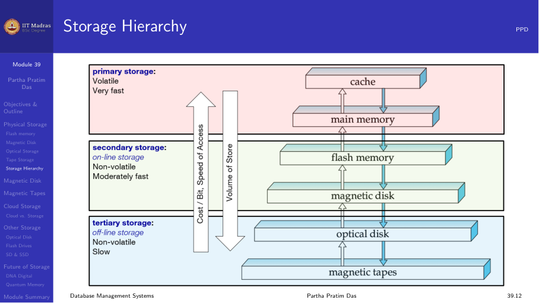
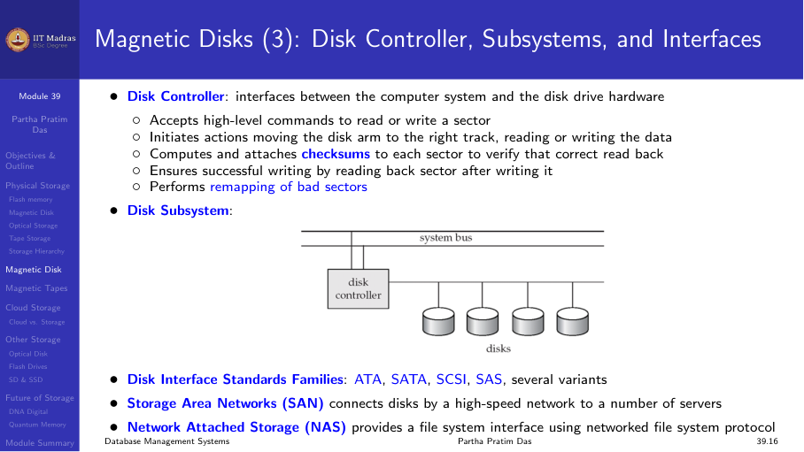
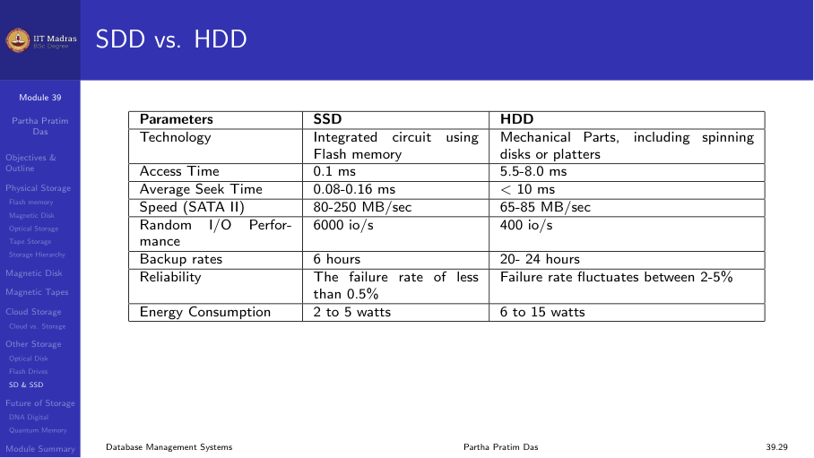

## Introduction

The B+ tree is the most widely used index structure in database systems. It
is a balanced tree that supports efficient insertion, deletion, and search,
including both equality and range queries.

Almost every major database — Oracle, PostgreSQL, MySQL (InnoDB), SQL
Server, SQLite — uses B+ trees as the default index structure.

## Structure of a B+ tree

A B+ tree has two types of nodes:

1. **Internal nodes (index nodes).** Contain search key values and pointers
   to child nodes. They guide the search from the root to a leaf.
2. **Leaf nodes.** Contain search key values and pointers to actual records
   (or to the blocks containing the records).

### Properties

- The tree is balanced: every path from root to leaf has the same length.
- Each node (except the root) must be at least half full.
- Internal nodes have between ⌈n/2⌉ and n children, where n is the fanout.
- Leaf nodes are linked together in a linked list, enabling efficient range
  scans.

### Fanout

The fanout of a B+ tree is the maximum number of children an internal node
can have. It is determined by the block size and the size of each entry.

For example, if the block size is 4 KB, a key is 8 bytes, and a pointer is
8 bytes, then each entry is 16 bytes, and the fanout is about 4000 / 16 ≈
250. With a fanout of 250, a 3-level B+ tree can index over 15 million
records (250³).

## Searching in a B+ tree

To search for a key value K:

1. Start at the root node.
2. At each internal node, find the smallest key greater than or equal to K
   and follow the corresponding pointer.
3. Repeat until a leaf node is reached.
4. In the leaf node, scan for K. If found, follow the pointer to the record.

The number of nodes accessed equals the height of the tree. For a tree
indexing millions of records, the height is typically 3 or 4. This means
any search can be done with just 3 or 4 disk accesses.

### Range queries

Range queries are efficient because leaf nodes are linked. To answer
"find all records with key between 10 and 20":

1. Search for key 10 in the B+ tree (as above).
2. Follow the leaf-node linked list to retrieve successive records until
   the key exceeds 20.

This avoids random seeks for each record in the range.

## Insertion in a B+ tree

Inserting a key value K into a B+ tree follows these steps:

1. Search for the leaf node where K should be placed.
2. If the leaf node has space, insert K in sorted order.
3. If the leaf node is full, split it:
   a. Create a new leaf node.
   b. Distribute the keys evenly between the old and new nodes.
   c. Insert the first key of the new node into the parent internal node.
4. If the parent internal node is full, split it similarly.
5. Splitting may propagate all the way to the root. If the root splits, a
   new root is created and the tree height increases by 1.

### Example: Insertion causing a split

Suppose a leaf node with capacity 4 keys is full: [10, 20, 30, 40].

Insert key 25:

1. The node is full, so split into two nodes.
2. Left node: [10, 20]. Right node: [30, 40].
3. Insert 25 into the left node: [10, 20, 25].
4. Copy the first key of the right node (30) up to the parent.

The parent now has an additional entry (30) pointing to the new right node.
If the parent is also full, the split propagates upward.

## Deletion in a B+ tree

Deleting a key K from a B+ tree:

1. Search for K in the leaf node.
2. Remove K from the leaf node.
3. If the leaf node remains at least half full, done.
4. If the leaf node falls below half full:
   a. Try to borrow a key from a sibling node (redistribution).
   b. If redistribution is not possible, merge the node with a sibling.
5. Merging may cause the parent to lose an entry. If the parent falls below
   half full, the merge propagates upward.
6. If the root node ends up with only one child, the tree height decreases
   by removing the old root.

### Redistribution versus merge

- **Redistribution.** Borrow a key from a sibling. The sibling's keys are
  rearranged, and the parent's separator key is updated. Redistribution is
  preferred because it avoids structural changes.
- **Merge.** Combine two sibling nodes into one. The separator key from the
  parent is pulled down into the merged node.

## Height of a B+ tree

The height of a B+ tree depends on the fanout n and the number of records N.

For a tree with fanout n, the maximum number of leaf nodes is n^(h-1) where
h is the height. The root is at level 1, leaves at level h.

If each leaf node holds at most L entries, the maximum number of records is:

Max records = n^(h-1) × L

For example, with n = 250 and L = 100:

| Height | Max records |
|--------|------------|
| 2 | 250 × 100 = 25,000 |
| 3 | 250² × 100 = 6,250,000 |
| 4 | 250³ × 100 = 1,562,500,000 |

In practice, a height of 3 or 4 is sufficient for most databases.

## Cost of B+ tree operations

Operation | Cost (disk accesses)
----------|--------------------
Search (equality) | O(log_{n} N) ≈ height of tree
Search (range) | O(height + number of matching records)
Insert | O(height) — may cause splits
Delete | O(height) — may cause merges

Each disk access fetches one node. Since nodes are the size of a disk block,
and B+ trees keep height low, the number of disk accesses is small.

## Why B+ trees are preferred over B trees

In a B tree, both internal and leaf nodes store actual record pointers. In a
B+ tree, only leaf nodes store record pointers; internal nodes store only
keys and child pointers.

B+ trees have two advantages:

1. **Higher fanout.** Internal nodes store only keys, not record pointers.
   More keys fit in a node, so the fanout is larger and the tree is shorter.
2. **Efficient range scans.** Leaf nodes are linked, so a range scan does
   not need to traverse the tree repeatedly.

These advantages make B+ trees the standard for database indexes.

## Summary

- A B+ tree is a balanced tree with internal nodes (for routing) and leaf
  nodes (for data pointers).
- Leaf nodes are linked for efficient range scans.
- Insertions may cause splits that propagate upward.
- Deletions may cause merges or redistribution with siblings.
- The height is small (3–4) even for millions of records.
- B+ trees are the default index structure in most database systems.
