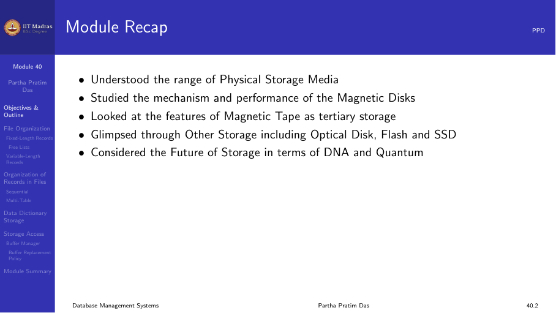
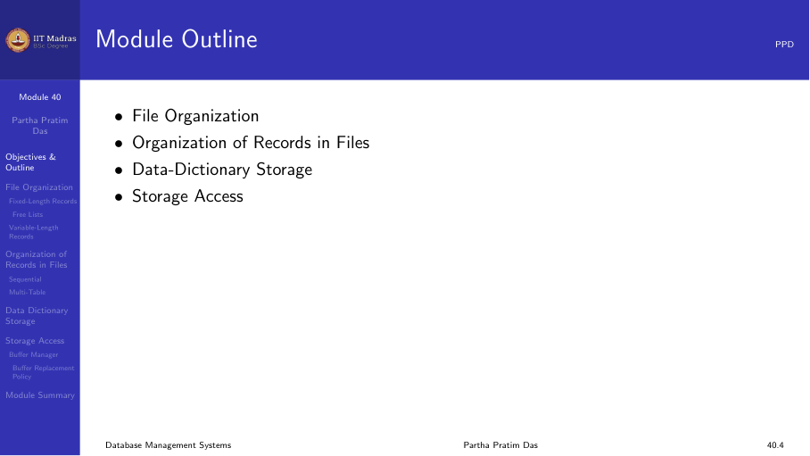
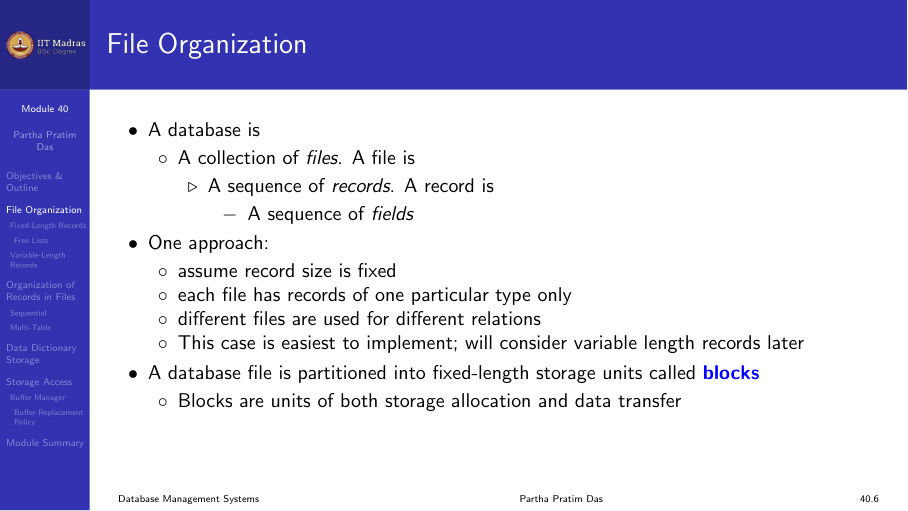
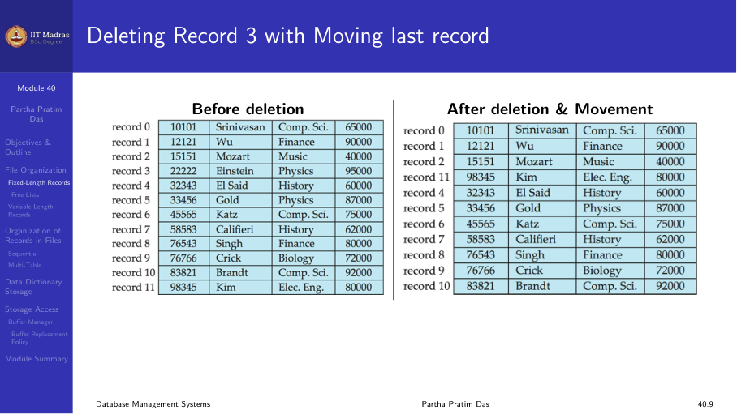
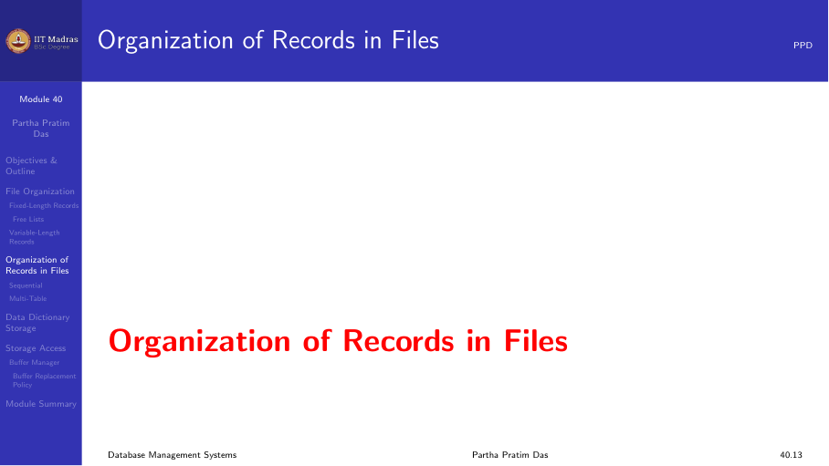
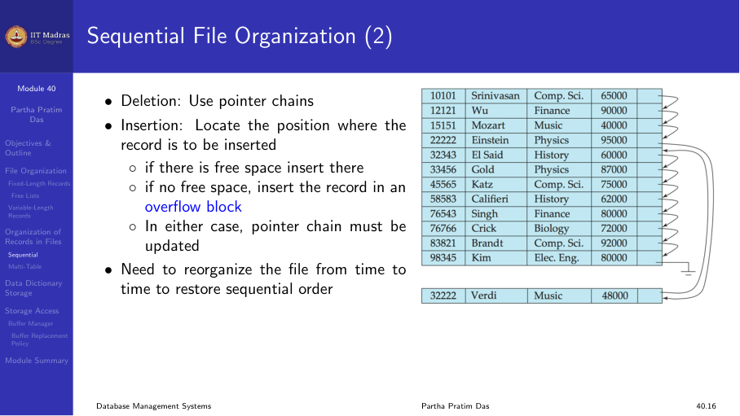

## Introduction

A hash index is designed for fast equality searches. Given a search key
value, a hash function computes the address where the record is stored.
In the best case, a single hash computation and one disk access are enough
to find any record.

Hash indexes do not support range queries. They are useful when the
workload consists mostly of point queries: "find the record with key = X."

## Hash function

A hash function h maps a search key value K to a bucket number:

h(K) → bucket number

A good hash function has these properties:

1. **Deterministic.** The same key always maps to the same bucket.
2. **Uniform.** Keys are distributed evenly across all buckets.
3. **Fast.** Computing the hash should be cheap.

Common hash functions include division (K mod B), multiplication, and
cryptographic hashes (MD5, SHA) truncated to a fixed number of bits.

## Static hashing

In static hashing, the number of buckets B is fixed when the index is
created. Each bucket corresponds to a disk block (or a chain of blocks).

### Bucket organization

Each bucket is a disk block that stores records whose keys hash to that
bucket. If a bucket overflows (multiple records hash to the same bucket),
the system uses overflow blocks chained to the primary bucket block.

### Searching

To find a record with key K:

1. Compute h(K) to get the bucket number i.
2. Read the primary block for bucket i.
3. Scan the block for K.
4. If not found, follow the overflow chain.

### Insertion

To insert a record with key K:

1. Compute h(K) to get the bucket number i.
2. Read the primary block for bucket i.
3. If there is space, insert the record.
4. If the block is full, allocate an overflow block and link it to the
   chain.

### Disadvantage: overflow chains

Over time, overflow chains grow long. Records accumulate in overflow
blocks and the average search time increases. The problem is that the
number of buckets is fixed. As the table grows, the hash function spreads
records across the same B buckets, and each bucket accumulates more
records.

### Choosing the number of buckets

If we choose B too small, overflow chains grow quickly. If we choose B too
large, space is wasted because many buckets are empty.

A common heuristic is to choose B such that each bucket holds at most two
disk blocks worth of data. But this is a guess at creation time, and the
guess may be wrong as the table grows.

## Dynamic hashing

Dynamic hashing solves the problem of static hashing by allowing the number
of buckets to grow and shrink as the table size changes. Two common forms
are extendible hashing and linear hashing.

## Extendible hashing

Extendible hashing uses a directory of pointers to buckets. The directory
can grow as needed, and buckets can split when they overflow.

### Structure

- A **directory** is an array of pointers to buckets. The directory size is
  2^d, where d is the global depth.
- A **bucket** stores records. Each bucket has a local depth d' ≤ d.
- The hash function produces an integer. The lower d bits of the hash
  determine the directory entry used.

### Searching

To find a record with key K:

1. Compute h(K) to get a bit string.
2. Take the lower d bits as the directory index.
3. Follow the directory pointer to the bucket.
4. Scan the bucket for K.

### Insertion

To insert a record with key K:

1. Compute h(K).
2. Use the lower d bits to find the directory entry and bucket.
3. If the bucket has space, insert.
4. If the bucket is full:
   a. If the bucket's local depth d' < global depth d, split the bucket
      into two. Redistribute records using (d' + 1) bits. Increment local
      depth. Update directory entries.
   b. If the bucket's local depth d' = global depth d, double the
      directory. Increment d. Then split the bucket as in (a).

### Directory doubling

When the directory doubles, its size increases from 2^d to 2^(d+1). Each
old entry is duplicated: entry i is copied to entries i and i + 2^d. Then
the bucket that caused the split is split, and its two new buckets get
different entries in the directory.

### Advantages and disadvantages

**Advantages:**
- No overflow chains. Buckets are split when they overflow.
- Performance remains consistent as the table grows.
- Space utilization is reasonable.

**Disadvantages:**
- The directory can become large for non-uniform hash distributions.
- Directory doubling is expensive (though infrequent).

## Linear hashing

Linear hashing is another dynamic hashing method. Unlike extendible
hashing, it does not use a directory. Instead, it grows buckets one at a
time in a linear fashion.

### How it works

Linear hashing uses a family of hash functions h_0, h_1, h_2, ... where:

h_i(K) = h(K) mod (2^i × B_0)

Here B_0 is the initial number of buckets. The system maintains a pointer
p that indicates which bucket will split next.

### Insertion

1. Compute h_level(K) to find the bucket.
2. If the bucket is not full, insert.
3. If the bucket is full, handle overflow (chain or split).
4. Split bucket p: redistribute its records using the next hash function.
   Create a new bucket at the end.
5. Increment p. If p reaches 2^level × B_0, reset p to 0 and increment
   level.

### Splitting one bucket at a time

Unlike extendible hashing, which splits only the overflowing bucket, linear
hashing splits buckets in a fixed order regardless of which bucket
overflowed. Over time, every bucket gets split, keeping the load balanced.

### Searching

To find a key K:

1. Compute h_level(K). If the result is less than p, use h_{level+1}(K)
   instead (because the bucket has already split).
2. Read the bucket and scan for K.

### Advantages

- No directory. Space overhead is lower than extendible hashing.
- Gradual growth. Buckets are split one at a time.
- Good for concurrent access.

## Hash index versus B+ tree

| Property | Hash index | B+ tree |
|----------|-----------|---------|
| Equality search | Very fast (O(1)) | Fast (O(log n)) |
| Range search | Not supported | Very fast |
| Insert | Fast | Fast |
| Delete | Fast | Fast |
| Space | Depends on load factor | Moderate |
| Use case | Point queries only | General purpose |

In practice, B+ trees are used more often because they support both
equality and range queries. Hash indexes are used for specific workloads
where only equality searches matter, such as in-memory key-value stores.

## Summary

- Hash indexes provide fast equality searches using a hash function.
- Static hashing has a fixed number of buckets; overflow chains grow as
  the table grows.
- Extendible hashing uses a directory that doubles as needed.
- Linear hashing grows buckets one at a time without a directory.
- Hash indexes do not support range queries.
- B+ trees are more versatile and are the default index in most systems.
