## Introduction

An index is a data structure that speeds up data retrieval. Just as the
index of a book lets you find a topic without scanning every page, a
database index lets you find records without scanning the entire table.

A search key is the attribute or set of attributes used to look up records
in a file. An index file stores entries of the form (search-key, pointer),
where the pointer gives the location of the record on disk.

Index files are typically much smaller than the original data file, so
searching them is faster than scanning the table.

## Why indexes are needed

Consider a table with millions of records. Without an index, every query
requires a full table scan. With an appropriate index, the database can
jump directly to the relevant records.

For example, a faculty table might have indexes on Name and Phone. To find
a professor by name, the index on Name is used. To find a professor by
phone number, the index on Phone is used.

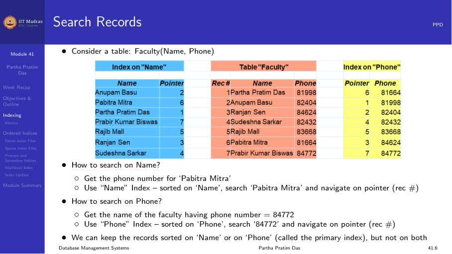

## Index evaluation metrics

When comparing index structures, database designers consider five metrics:

1. **Access types supported.** Can the index efficiently support equality
   searches (find record with value V)? Range searches (find records with
   value between V1 and V2)?
2. **Access time.** How many disk accesses are needed to find a record?
3. **Insertion time.** How much overhead does inserting a new record add?
4. **Deletion time.** How much overhead does deleting a record add?
5. **Space overhead.** How much additional storage does the index require?

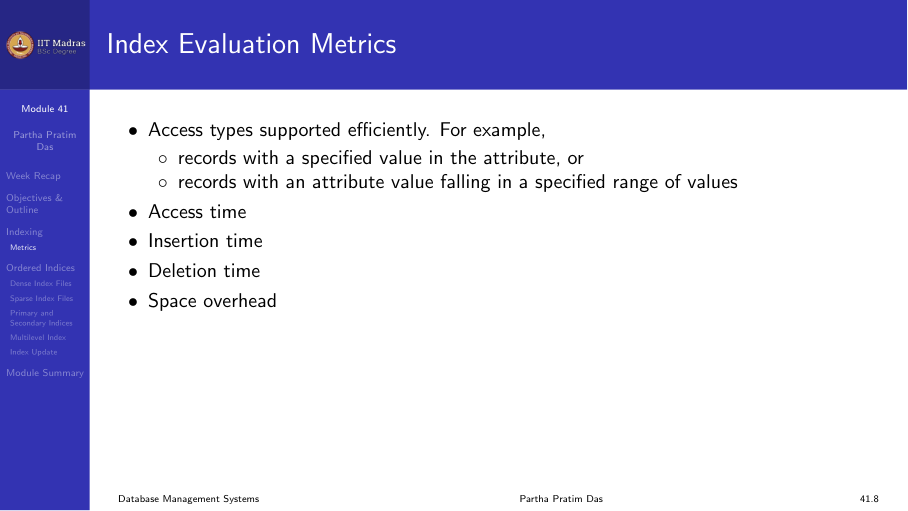

## Ordered indexes

In an ordered index, index entries are stored in sorted order on the
search-key value. This is analogous to the author catalog in a library,
where entries are alphabetized by author name.

Ordered indexes come in two main types: dense and sparse.

## Dense index

A dense index has one index entry for every search-key value in the file.
Each entry contains the search-key value and a pointer to the corresponding
record.

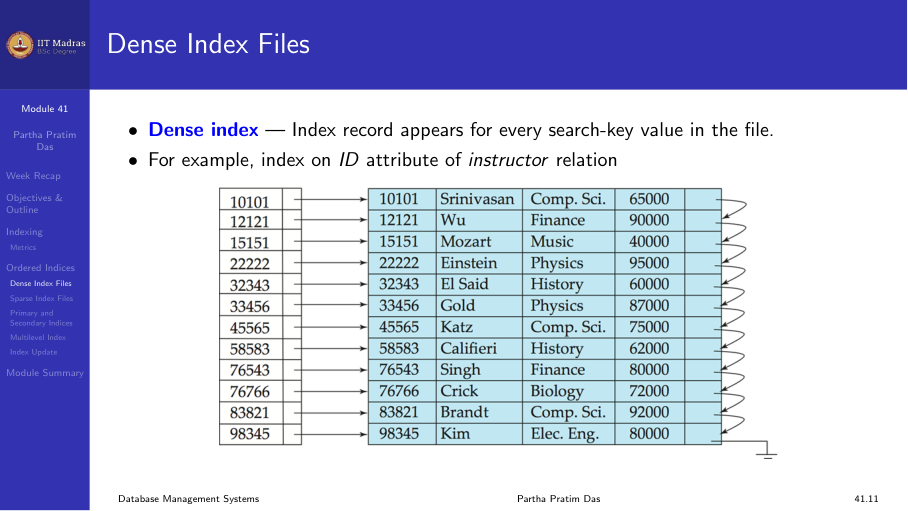

For example, a dense index on the ID attribute of an instructor table has
an entry for every instructor ID. If there are 1000 instructors, there are
1000 index entries.

A dense index can also be built on a non-unique attribute. For example, a
dense index on dept_name has an entry for every instructor, but multiple
instructors in the same department have separate entries in the index.

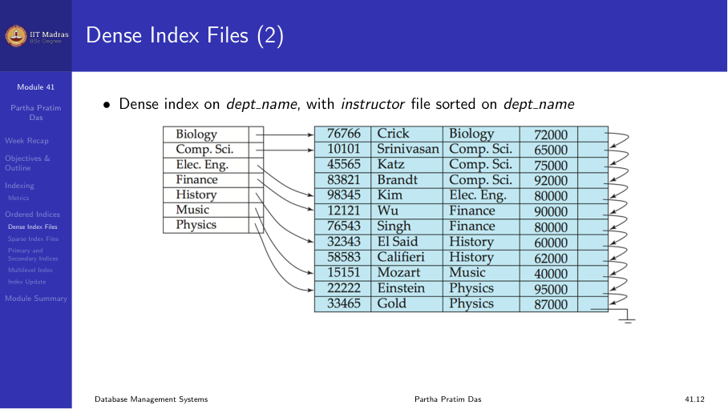

## Sparse index

A sparse index has index entries for only some search-key values. It is
applicable only when records are sequentially ordered on the search key.

To locate a record with search-key value K:

1. Find the index record with the largest search-key value less than or
   equal to K.
2. Follow the pointer to the corresponding block.
3. Scan the block sequentially to find K.

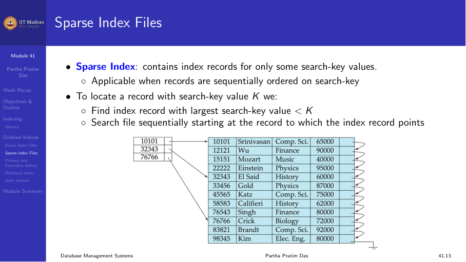

Sparse indexes use less space and have lower maintenance overhead than
dense indexes. The trade-off is that locating a record may be slightly
slower because of the sequential scan within the block.

A good compromise is a sparse index with one entry per block, using the
smallest search-key value in each block.

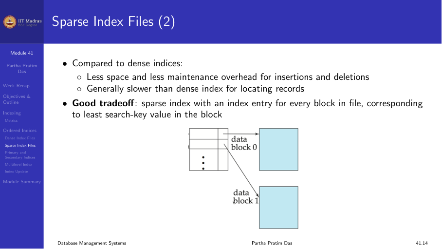

## Primary versus secondary indexes

A primary index is defined on the search key that determines the physical
order of records in the file. Since records can be physically sorted in
only one order, there can be at most one primary index per table.

A secondary index is defined on a search key whose order differs from the
physical order of records. A table can have many secondary indexes.

**Example.** Consider an instructor table sorted by ID.

- A primary index on ID is a sparse index (one entry per block).
- A secondary index on salary is a dense index (one entry per record).

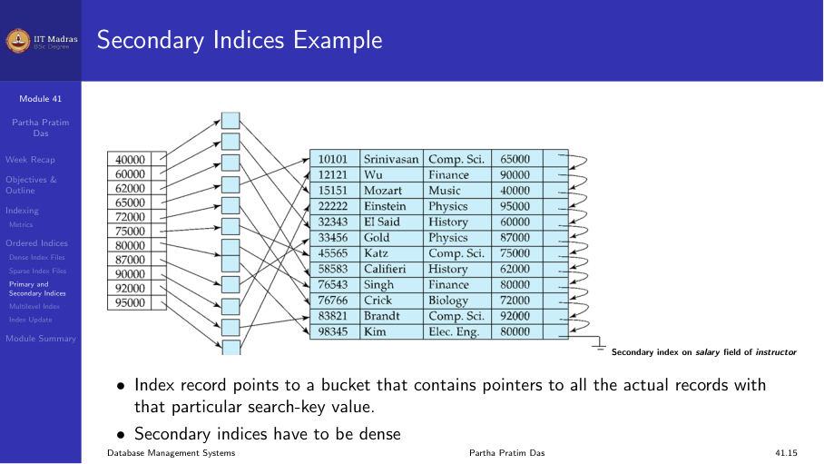

### Performance of secondary indexes

A sequential scan using the primary index is efficient because records are
stored in order on disk. A sequential scan using a secondary index is
expensive because each record access may fetch a new block from disk.

Block access times are on the order of 5–10 milliseconds, compared to
about 100 nanoseconds for memory access. This makes the difference between
a well-designed and poorly-designed index strategy dramatic.

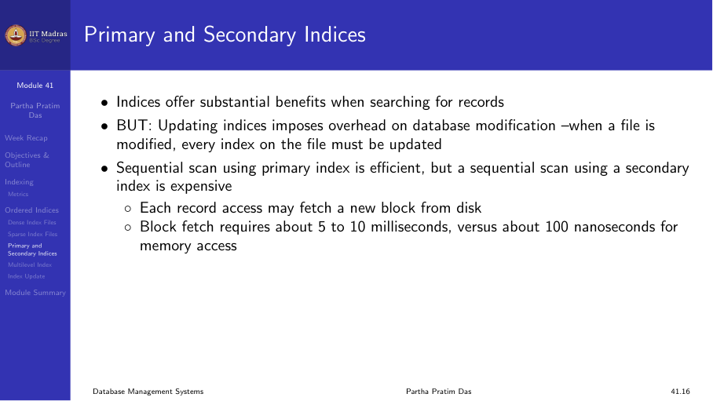

## Multilevel index

If the primary index is too large to fit in memory, even the index lookups
become expensive because each index entry access requires a disk I/O.

The solution is to treat the primary index as a sequential file and build
a sparse index on top of it:

- **Outer index.** A sparse index on the primary index file.
- **Inner index.** The primary index file itself.

If even the outer index is too large to fit in memory, another level can be
added. This creates a multilevel index.

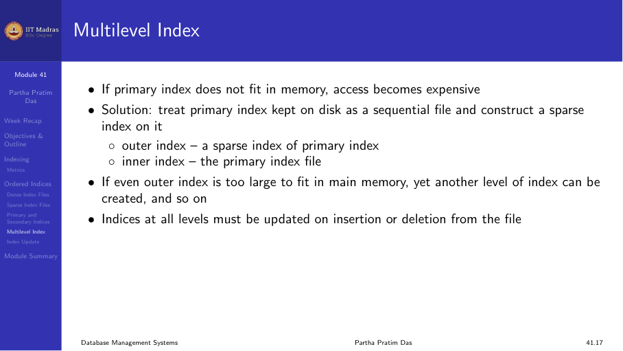

Each level is a sparse index on the level below. Searching starts at the
top level and follows pointers down through the levels.

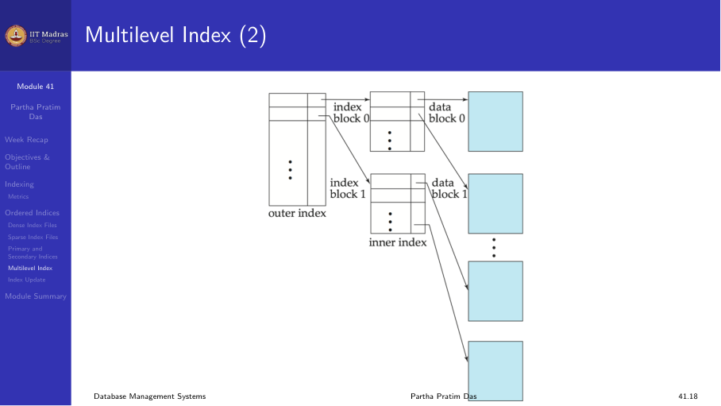

## Index update: deletion

When a record is deleted, the index must be updated:

- **Dense index.** Locate the index entry for the deleted record's
  search-key value and remove it. If multiple records share the same
  search-key value, remove only the specific pointer.
- **Sparse index.** If the deleted record was the only record with its
  search-key value in the block, the search-key is deleted from the index.

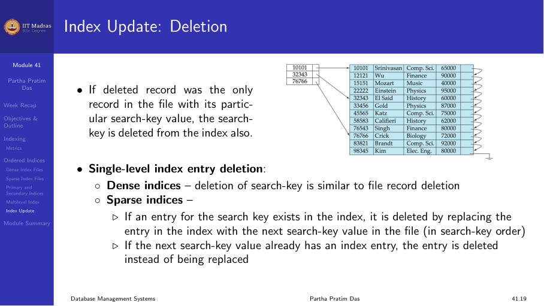

## Index update: insertion

When a record is inserted, the index must be updated:

- **Dense index.** Perform a lookup using the search-key value. If the
  value does not already appear in the index, insert a new entry.
- **Sparse index.** If the index stores one entry per block, no change is
  needed unless a new block is created. When a new block is created, the
  first search-key value in the new block is inserted into the index.

Multilevel insertion and deletion are simple extensions of the single-level
algorithms: changes at the leaf level may propagate upward.

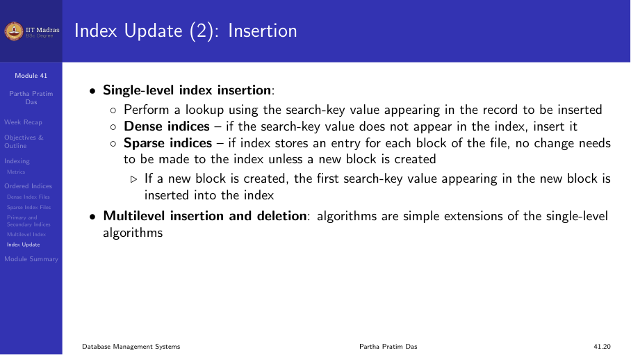

## Secondary indexes in practice

Secondary indexes are useful when we want to find records based on a field
that is not the primary search key.

**Example 1.** Find all instructors in a particular department, where the
instructor table is sorted by ID. A secondary index on dept_name provides
fast access.

**Example 2.** Find all instructors with a salary in a specified range. A
secondary index on salary supports this.

A secondary index has one index record for each search-key value.

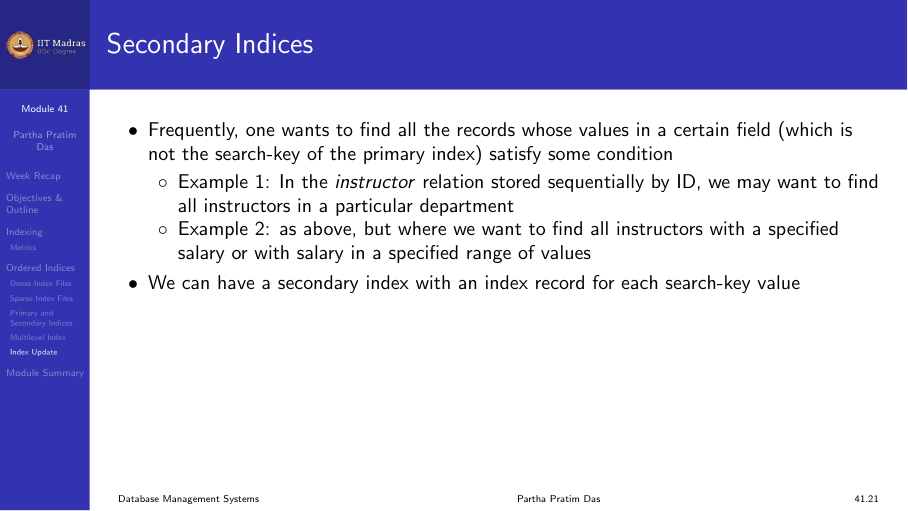

## Summary

- Indexes speed up data retrieval at the cost of storage and update
  overhead.
- Dense indexes have one entry per search-key value; sparse indexes have
  one entry per block.
- Primary indexes are on the physical sort order; secondary indexes are on
  other attributes.
- Multilevel indexes reduce the number of block accesses for searching.
- Indexes must be updated on insert and delete operations.
