## Introduction

A 2-3-4 tree is a balanced search tree that generalizes the binary search
tree. Each node can hold 1, 2, or 3 data items and can have 2, 3, or 4
children. All leaves are at the same depth, which guarantees that the tree
remains balanced.

The 2-3-4 tree is the conceptual foundation for B-trees and B+ trees,
which are the most widely used index structures in database systems.

## Limitations of binary search trees

A binary search tree (BST) has O(h) search time, where h is the height of
the tree. In the worst case, a BST can become skewed, with height O(n).

For example, inserting keys in sorted order into a BST produces a
completely skewed tree that is effectively a linked list. Searching such a
tree takes O(n) time, defeating the purpose of having an index.

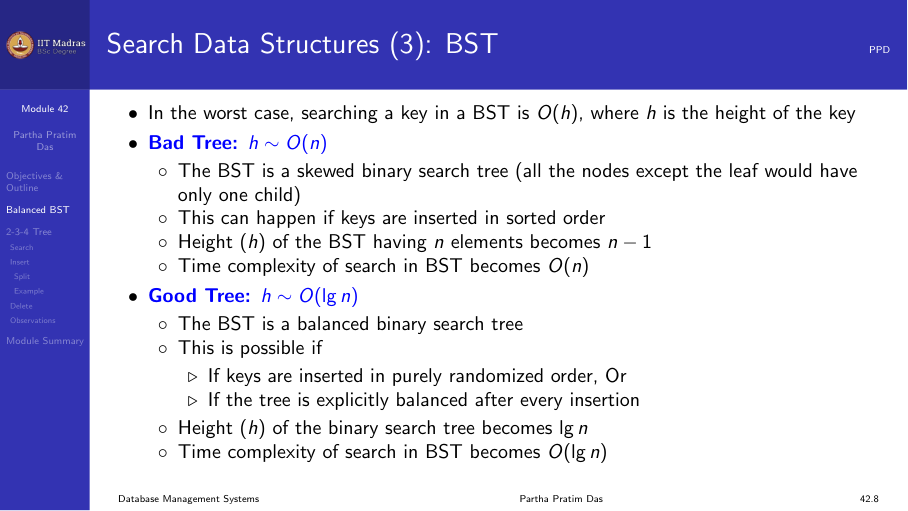

## Balanced binary search trees

A balanced BST maintains h ∼ O(log n) by restructuring after insertions and
deletions. Examples include AVL trees and red-black trees.

**AVL tree.** Named after Adelson-Velsky and Landis. In an AVL tree, the
heights of the two child subtrees of any node differ by at most one. If
they differ by more than one, rotations are performed to rebalance.

These in-memory data structures have optimal complexity:

- Search: O(log n)
- Insert: O(log n)
- Delete: O(log n)

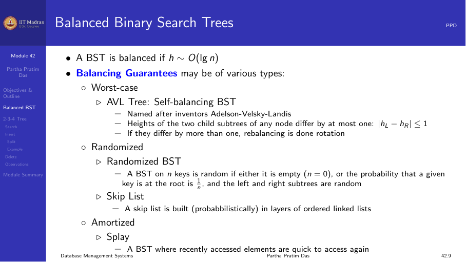

While balanced BSTs are excellent for in-memory operations, they are not
ideal for database indexes. This is because:

1. Each node contains only one key, leading to many nodes and many disk
   accesses.
2. The tree height (log₂ n) is larger than necessary for disk-based access.

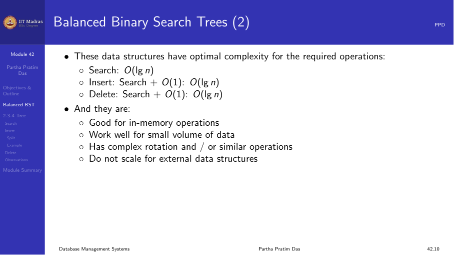

## The 2-3-4 tree structure

A 2-3-4 tree uses nodes of three types:

| Node type | Data items | Children | Search keys |
|-----------|-----------|----------|-------------|
| 2-node | 1 (S) | 2 | Keys < S, keys > S |
| 3-node | 2 (S, L) | 3 | Keys < S, S < keys < L, keys > L |
| 4-node | 3 (S, M, L) | 4 | Keys < S, S < keys < M, M < keys < L, keys > L |

All leaves are at the same depth (the bottom level). This guarantees that
the height h is O(log n), and all operations take O(log n) time.

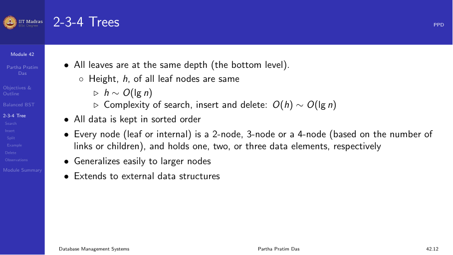

### Key properties

- All leaves are at the same depth.
- All data is kept in sorted order.
- Every node (leaf or internal) is a 2-node, 3-node, or 4-node.
- A leaf may contain 1, 2, or 3 data items.

## Searching

Searching in a 2-3-4 tree is a simple extension of searching in a BST:

1. Start at the root.
2. At each node, compare the search key K with the keys in the node.
3. If K matches a key in the node, return the record.
4. Otherwise, follow the appropriate child pointer based on the key
   comparisons.
5. Repeat until a leaf is reached (which may or may not contain K).

The search path length equals the tree height, which is O(log n).

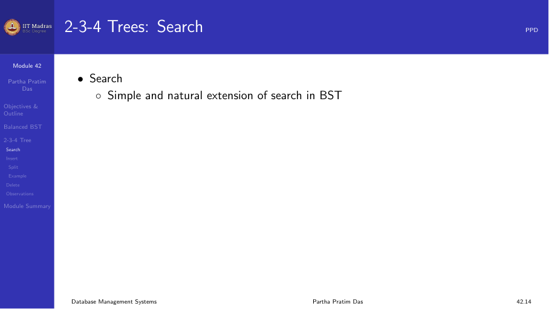

## Insertion

Insertion always happens at a leaf. The procedure depends on the type of
leaf:

1. **Search** to find the expected leaf location.
2. **If the leaf is a 2-node:** change it to a 3-node and insert.
3. **If the leaf is a 3-node:** change it to a 4-node and insert.
4. **If the leaf is a 4-node:** split the node before inserting.

### Node splitting

When a 4-node is split:

1. The middle key moves up to the parent node.
2. The 4-node becomes two 2-nodes.
3. If the parent is also a 4-node, the split propagates upward.

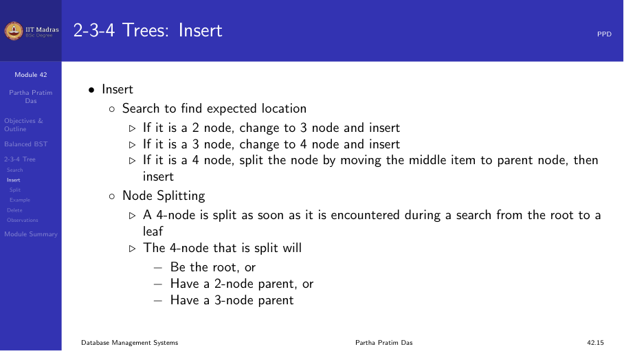

### Splitting scenarios

**Splitting at the root.** If the root is a 4-node, it splits into two
2-nodes and a new root is created with the middle key.

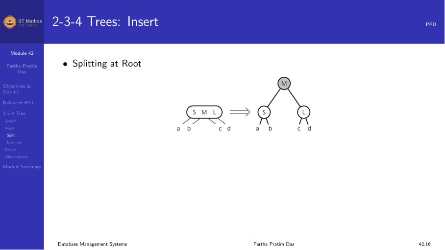

**Splitting with a 2-node parent.** The 4-node child splits. The middle
key moves up to the parent, which becomes a 3-node.

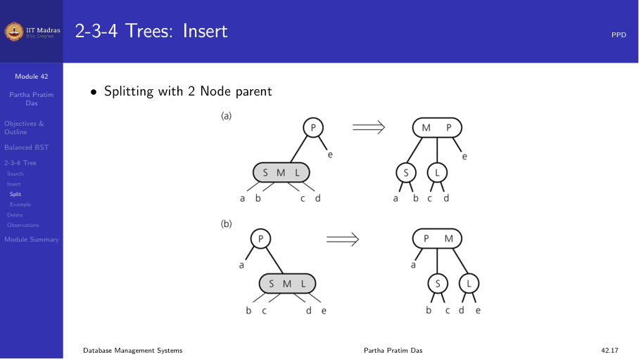

**Splitting with a 3-node parent.** The 4-node child splits. The middle
key moves up to the parent, which becomes a 4-node.

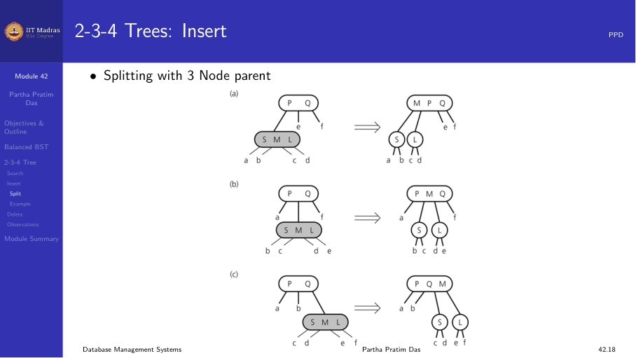

### Split strategies

Two strategies for handling splits:

1. **Early split (top-down).** Split any 4-node encountered during the
   traversal to the leaf. This ensures that the tree never has a path with
   multiple 4-nodes. The insert itself requires no further splitting.
2. **Late split (bottom-up).** Split a 4-node only when an item must be
   inserted into it. This may require O(h) splits propagating to the root
   for a single insertion.

Most implementations use the early split strategy because it bounds the
work per insertion.

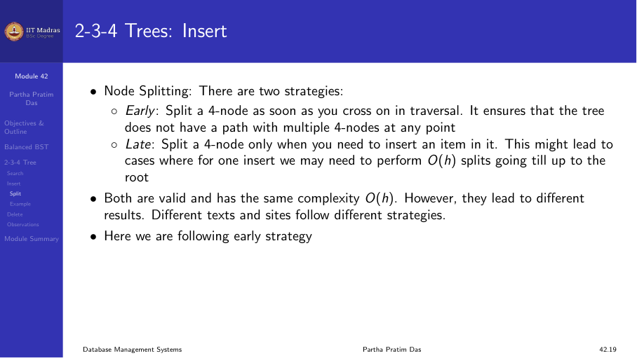

### Insertion example

Insert the sequence: 10, 30, 60, 20, 50, 40, 70, 80, 15, 90, 100.

1. Insert 10 → root is a 2-node: [10]
2. Insert 30 → root becomes 3-node: [10, 30]
3. Insert 60 → root becomes 4-node: [10, 30, 60]
4. Insert 20 → root is a 4-node, split first. New root [30], left [10],
   right [60]. Insert 20 into left: [10, 20], right [60]
5. Continue inserting, splitting as needed when 4-nodes are encountered.

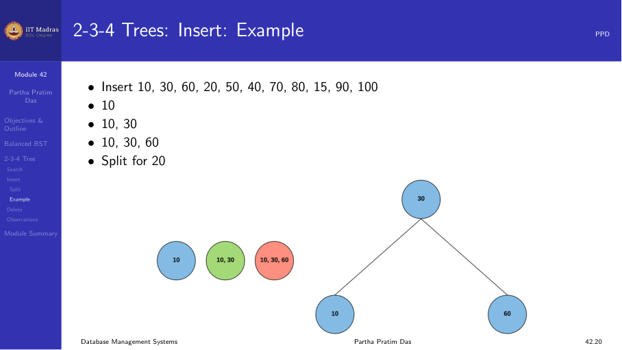

## Deletion

Deletion in a 2-3-4 tree follows these steps:

1. Locate the node n that contains the item to delete.
2. Find the inorder successor of the item and swap it with the item
   (deletion always happens at a leaf).
3. If the leaf is a 3-node or 4-node, simply remove the item.
4. To ensure the item does not occur in a 2-node (which would become empty
   after deletion), transform each 2-node encountered during the search
   into a 3-node or 4-node by borrowing from siblings or merging.

This ensures that after deletion, all nodes still satisfy the 2-3-4 tree
properties.

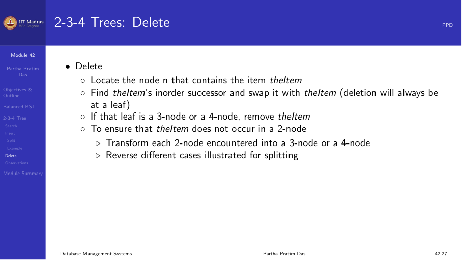

## Generalizing to larger nodes

The 2-3-4 tree generalizes naturally: instead of restricting to 2, 3, or 4
children, we can have nodes with any number of children between some
minimum and maximum.

Consider using a single node type with space for 3 items and 4 links:

- Internal nodes (non-root) have 2 to 4 children.
- Leaf nodes have 1 to 3 items.
- Wastes some space but simplifies implementation.

This generalizes easily to larger nodes, and when extended to external
data structures, it becomes the B-tree or B+ tree.

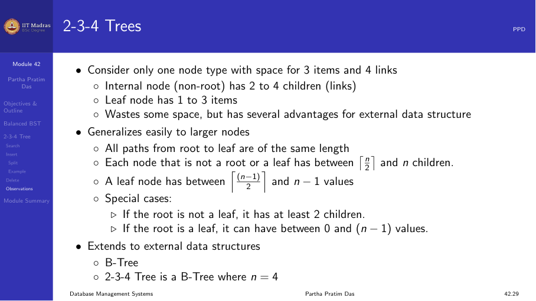

## Summary

- 2-3-4 trees are balanced search trees where every node has 2, 3, or 4
  children and all leaves are at the same depth.
- They guarantee O(log n) search, insert, and delete operations.
- Insertion splits 4-nodes when they overflow, which may propagate upward.
- Deletion merges or redistributes nodes to maintain balance.
- 2-3-4 trees are the conceptual foundation for B-trees and B+ trees used
  in database indexing.
