## Introduction

B+ trees are the most widely used index structure in database systems.
They are an extension of the 2-3-4 tree concept designed for disk-based
storage. B+ trees automatically reorganize themselves with small, local
changes when records are inserted or deleted, without requiring periodic
reorganization of the entire file.

B+ trees address the main disadvantage of indexed-sequential (ISAM) files:
as the file grows, ISAM performance degrades because overflow blocks
accumulate. B+ trees avoid this by splitting nodes when they overflow,
keeping the tree balanced at all times.

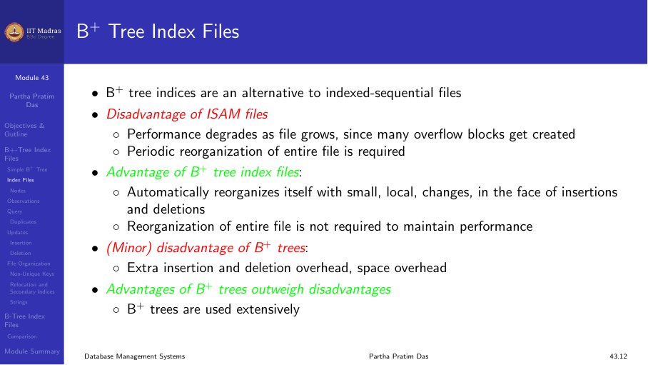

## Structure of a B+ tree

A B+ tree is a rooted tree with two types of nodes:

1. **Leaf nodes.** Contain search-key values and pointers to records (or
   buckets of records). Leaf nodes are linked in sequence for efficient
   range scans.
2. **Internal (non-leaf) nodes.** Contain separator keys and pointers to
   child nodes. They form a multilevel sparse index on the leaf nodes.

Each node is typically the size of a disk block (4 KB), and the fanout n
is typically about 100 (with 40 bytes per index entry).

| Property | Value |
|----------|-------|
| All paths from root to leaf | Same length |
| Non-leaf node children | [n/2] to n |
| Leaf node values | [(n-1)/2] to n-1 |
| Root (if not leaf) | At least 2 children |
| Root (if leaf) | 0 to n-1 values |

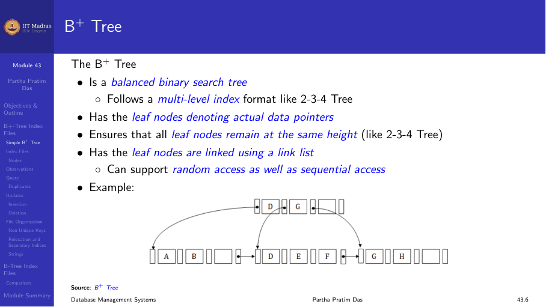

### Node structure

A typical node contains:

    P₁  K₁  P₂  K₂  ...  P_{n-1}  K_{n-1}  P_n

Where Kᵢ are search-key values (sorted: K₁ < K₂ < ... < K_{n-1}) and Pᵢ
are pointers to children (for internal nodes) or to records (for leaf
nodes).

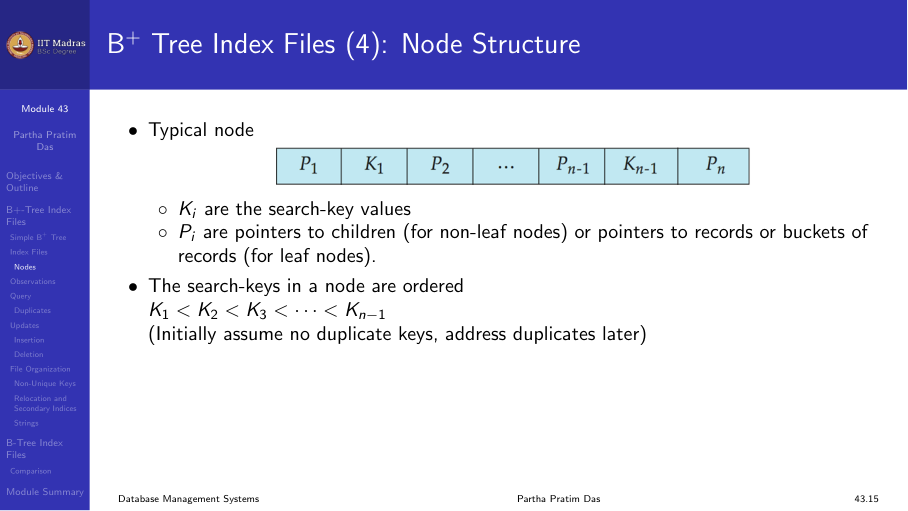

### Leaf nodes

In a leaf node:

- For i = 1, 2, ..., n-1, pointer Pᵢ points to a record with search-key
  value Kᵢ.
- P_n points to the next leaf node in search-key order.
- If Lᵢ, Lⱼ are leaf nodes and i < j, Lᵢ's search-key values are less
  than or equal to Lⱼ's search-key values.

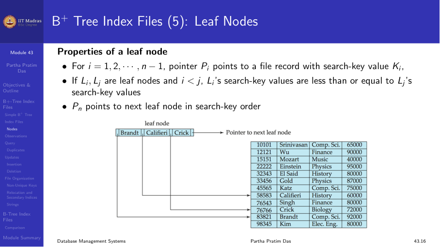

### Internal nodes

Internal nodes form a multilevel sparse index. For a node with m pointers:

- All keys in subtree P₁ are less than K₁.
- For 2 ≤ i ≤ n-1, keys in subtree Pᵢ are ≥ K_{i-1} and < Kᵢ.
- All keys in subtree P_n are ≥ K_{n-1}.

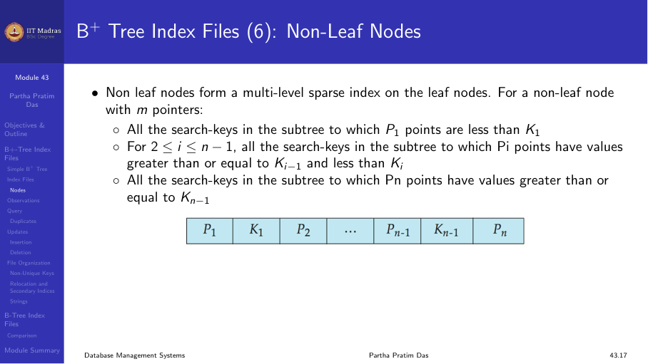

### Example

A B+ tree with n = 6:

- Leaf nodes have between 3 and 5 values: [(n-1)/2] and n-1.
- Non-leaf nodes (except root) have between 3 and 6 children: [n/2] and n.
- Root has at least 2 children.

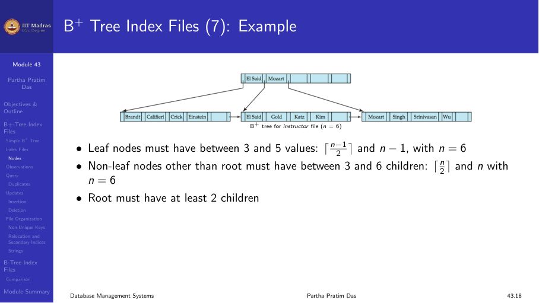

## Searching

To find a record with search-key value V:

1. Set C = root.
2. While C is not a leaf node:
   a. Find the smallest i such that V ≤ Kᵢ.
   b. If no such i exists, set C = the last non-null pointer in C.
   c. Else if V = Kᵢ, set C = P_{i+1} (or appropriate pointer).
   d. Else set C = P_i.
3. In the leaf node, find the smallest i such that Kᵢ = V.
4. If found, follow pointer Pᵢ to the record.

The number of nodes accessed equals the tree height. With 1 million
search-key values and n = 100, at most log₁₀₀(1,000,000) ≈ 4 nodes are
accessed. A balanced binary tree would require about 20 node accesses for
the same number of keys.

Every node access may require a disk I/O, so the difference (4 vs. 20) is
dramatic.

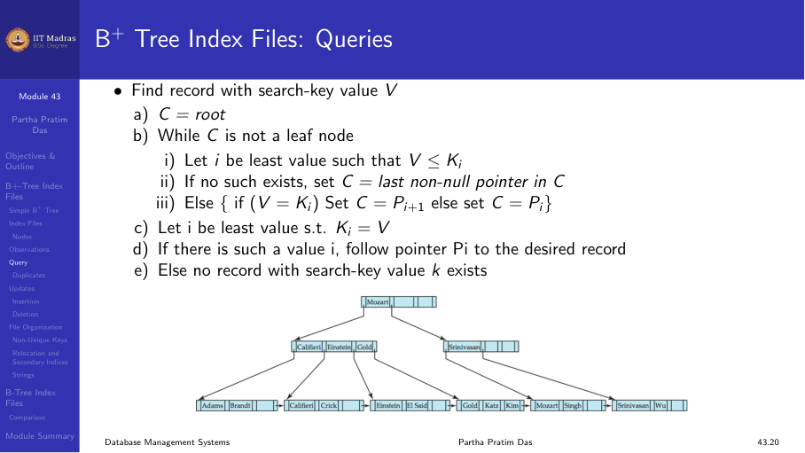

### Height of the B+ tree

If there are K search-key values in the file, the tree height is at most:

    ⌈log_{⌈n/2⌉} (K)⌉

- Level below root has at least 2 × ⌈n/2⌉ values.
- Next level has at least 2 × ⌈n/2⌉² values.
- And so on.

With n = 100 and K = 1,000,000:
- Height ≤ ⌈log₅₀ (1,000,000)⌉ ≈ 4

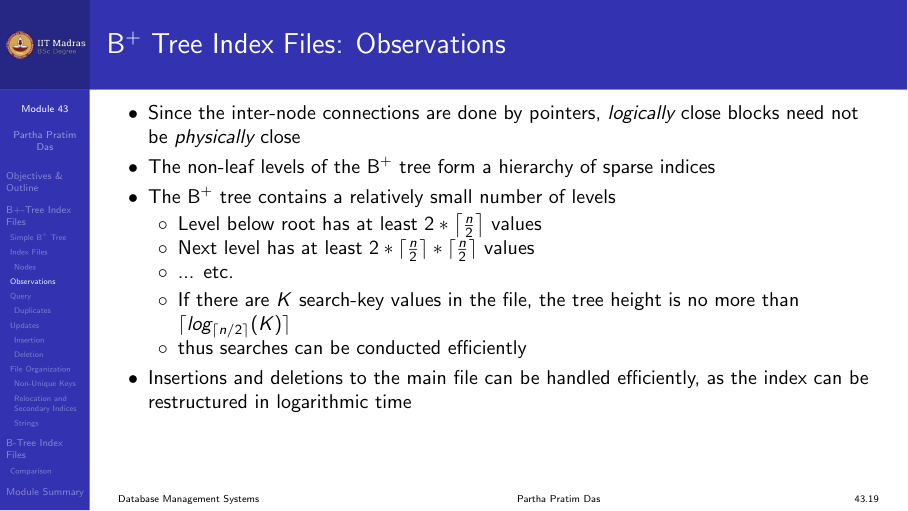

## Insertion

To insert a new record with search-key value V:

1. Search for the leaf node where V should be placed.
2. If the leaf has space, insert V in sorted order.
3. If the leaf is full (has n-1 values), split:
   a. Create a new leaf node.
   b. Distribute keys: first half stay, second half go to new node.
   c. Insert the first key of the new node into the parent internal node.
   d. If the parent is also full, split it similarly (propagate upward).
   e. If the root splits, create a new root → tree height increases by 1.

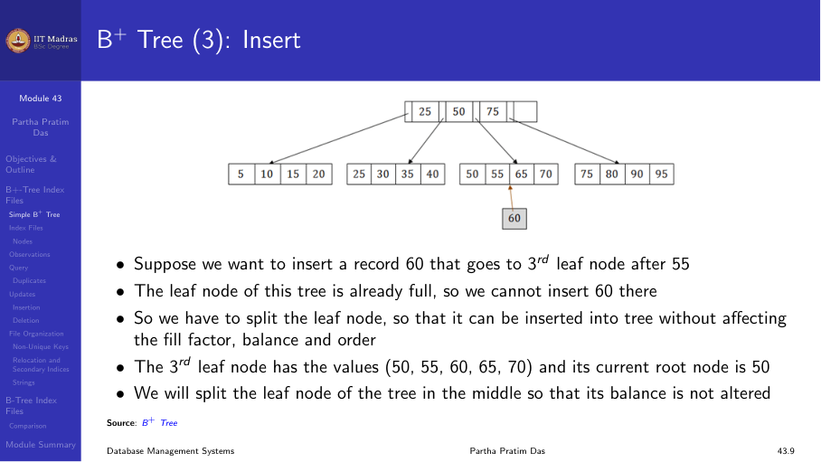

### Insertion example

Consider a B+ tree with leaf node capacity 5 values (n = 6). The leaf
node contains [50, 55, 60, 65, 70]. Insert 60.

- The leaf is full (5 values). Split into [50, 55] and [60, 65, 70].
- Insert 60 into the first leaf: [50, 55, 60].
- Copy the first key of the second leaf (60) into the parent.
- The parent now has a new child pointer and separator key.

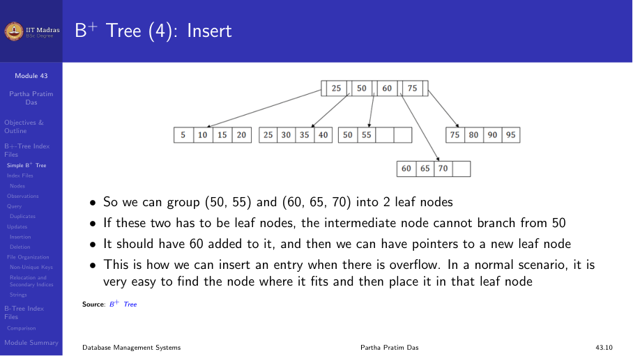

## Deletion

To delete a record with search-key value V:

1. Search for V and remove it from the leaf node.
2. If the leaf has at least ⌈(n-1)/2⌉ values, done.
3. If the leaf falls below the minimum:
   a. Try to borrow a value from a sibling (redistribution).
   b. If redistribution is not possible, merge with a sibling.
4. Merging may cause the parent to lose a key. If the parent falls below
   minimum, merge propagates upward.
5. If the root ends up with only one child, remove the root.

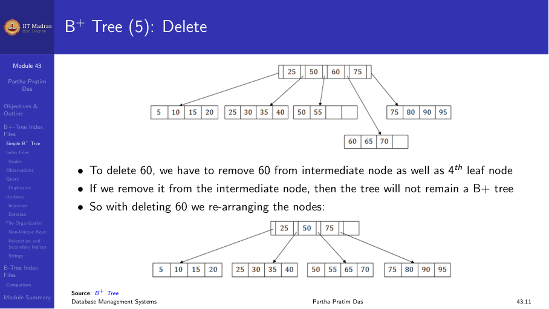

## Handling duplicates

When a B+ tree has duplicate search-key values, the ordering properties
change slightly:

- In both leaf and internal nodes, we cannot guarantee K₁ < K₂ < K₃, but
  can guarantee K₁ ≤ K₂ ≤ K₃.
- Search keys in the subtree pointed to by Pᵢ are ≤ Kᵢ, not necessarily <
  Kᵢ.
- This is because the same value V can appear in two adjacent leaf nodes,
  and the parent's separator key must equal V.

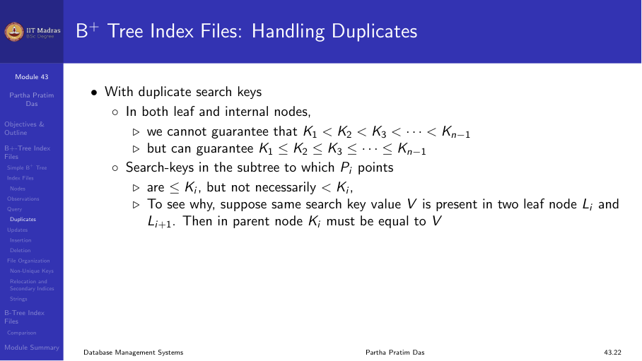

## B+ tree file organization

In a B+ tree file organization, the leaf nodes store the actual records
directly, not just pointers to records. This eliminates the need for a
separate data file; the index itself is the file organization.

This approach provides good space utilization. Since records use more space
than pointers, the fanout is smaller. To improve space utilization,
involving sibling nodes in redistribution during splits and merges can
help. With 2 siblings involved, each node has at least ⌈2n/3⌉ entries.

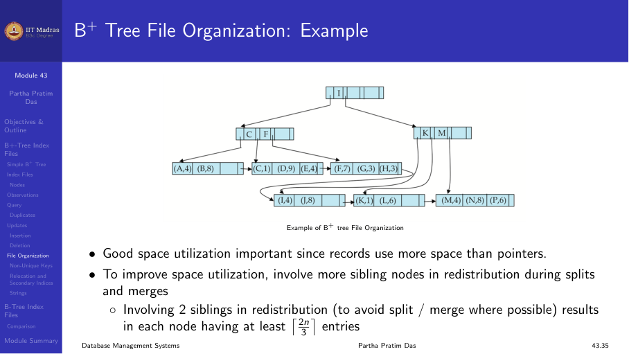

## B-tree index files

A B-tree is similar to a B+ tree, but with one key difference:

- In a B+ tree, only leaf nodes contain record pointers. Internal nodes
  contain only separator keys and child pointers.
- In a B-tree, search-key values appear only once. Internal nodes that
  contain a key also have a pointer to the corresponding record.

This eliminates redundant storage of search keys. However, B-trees have
a disadvantage: range queries are less efficient because the leaf nodes
are not linked sequentially.

### B-tree node structure

A B-tree leaf node has an additional pointer field for each search key:

    P₁  K₁  P₂  K₂  ...  P_{m-1}  K_{m-1}  P_m

Where Pᵢ points to the record for Kᵢ, and additional pointers connect
to other nodes.

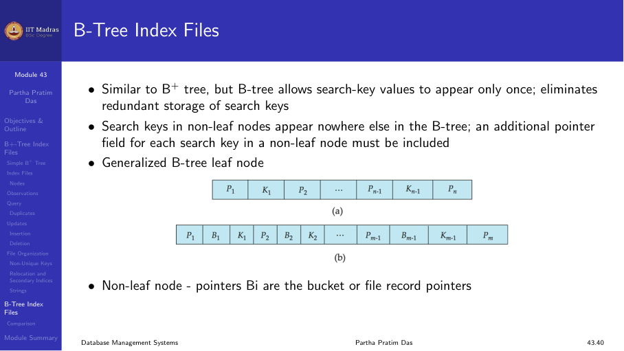

### B+ tree versus B-tree

| Aspect | B+ tree | B-tree |
|--------|---------|--------|
| Record pointers | Leaf nodes only | Every node |
| Internal node keys | Routing only | Routing + data |
| Range queries | Fast (leaf links) | Slower (no leaf links) |
| Space | More (key duplication) | Less (no duplication) |
| Fanout | Higher (smaller internal nodes) | Lower (data in internal nodes) |

In practice, B+ trees are preferred over B-trees for database indexes
because:
1. Higher fanout → shorter tree → fewer disk accesses.
2. Linked leaves → efficient range scans.

## Summary

- B+ trees are balanced, self-organizing tree structures that maintain
  performance as the database grows.
- All paths from root to leaf have the same length.
- Leaf nodes are linked for efficient range queries.
- Insertions and deletions cause local splits and merges.
- With fanout n ≈ 100, a 4-level tree can index billions of records.
- B-trees eliminate duplicate key storage but are less efficient for range
  queries.
