## Introduction

Hashing provides an alternative to ordered indexing. Instead of searching
through a sorted structure, a hash function computes the storage location
directly from the search-key value. For equality searches, hashing can be
faster than B+ tree indexing because a single hash computation and one
disk access may suffice.

However, hashing does not support range queries. It is best suited for
workloads dominated by point queries: "find the record with key = X."

## Static hashing

In static hashing, the number of buckets B is fixed when the index is
created. A hash function h maps each search-key value K to a bucket
address:

    h(K) → bucket address in {0, 1, ..., B-1}

A bucket is a unit of storage (typically a disk block) containing one or
more records. In a hash file organization, the bucket of a record is
obtained directly from its search-key value.

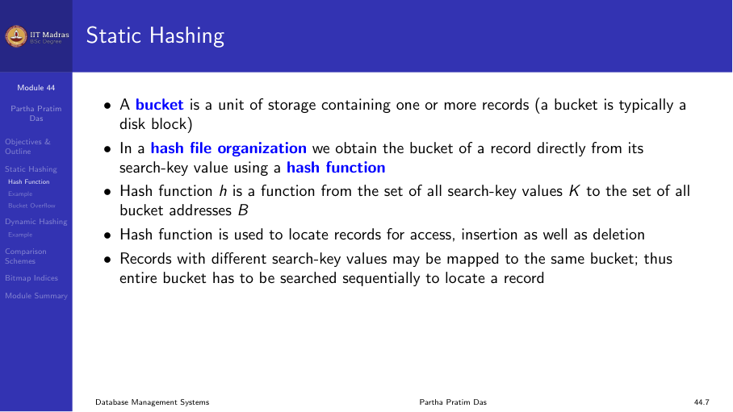

## Hash functions

A hash function maps keys from a domain D to integers in the range [0, N].
Given a key k, h(k) is called the hash value, hash code, or digest.

Properties of a good hash function:

1. **Uniform.** Each bucket is assigned the same number of search-key
   values from the set of all possible values.
2. **Random.** Each bucket has the same number of records regardless of
   the actual distribution of search-key values.
3. **Fast.** Computing the hash should be computationally cheap.

The worst hash function maps all keys to the same bucket. This degenerates
to a sequential scan.

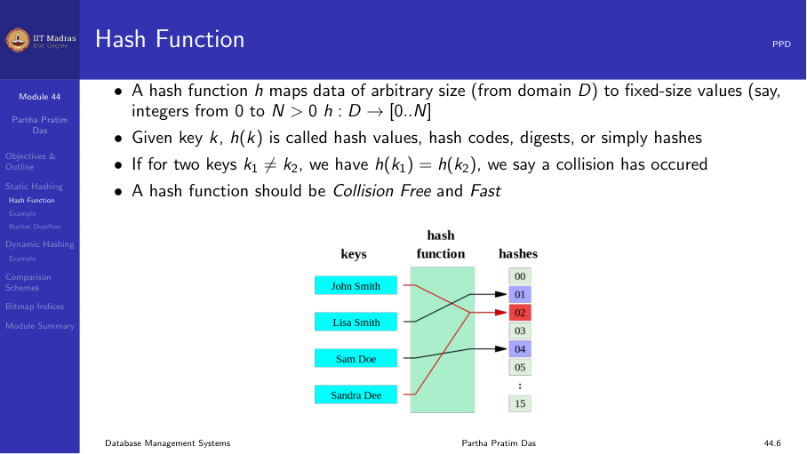

### Common hash functions

- **Division.** h(K) = K mod B (where B is the number of buckets). Simple
  and fast, but B should be chosen carefully (avoid powers of 2).
- **Multiplication.** h(K) = ⌊B × frac(K × A)⌋ where A is a constant
  between 0 and 1. Less sensitive to the choice of B.
- **Mid-square.** Square the key and extract the middle digits.

### Example

A hash file organization for an instructor table using dept_name as key:

- 10 buckets (0 through 9).
- Each character maps to its position in the alphabet (a=1, b=2, ...).
- The hash function returns the sum of positions modulo 10.
- h(Music) = (13 + 21 + 19 + 9 + 3) mod 10 = 65 mod 10 = 5
- h(History) = (8 + 9 + 19 + 20 + 15 + 18 + 25) mod 10 = 114 mod 10 = 4

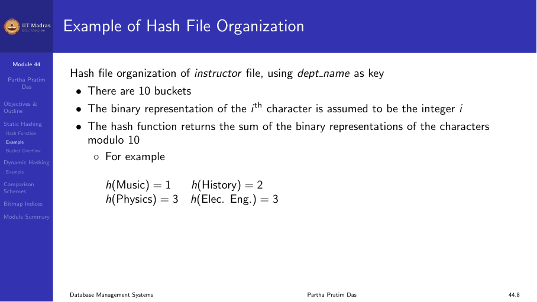

## Bucket overflow

Bucket overflow occurs when a bucket becomes full. This can happen because:

1. **Insufficient buckets.** The initial number of buckets is too small
   for the data.
2. **Skew in distribution.** Multiple records have the same search-key
   value, or the hash function produces a non-uniform distribution.

Although the probability of overflow can be reduced (by choosing a good
hash function and enough buckets), it cannot be eliminated.

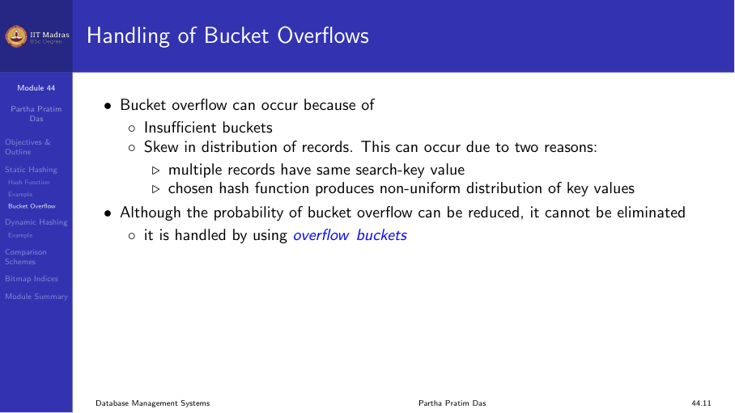

### Overflow handling: chaining

Overflow chaining uses overflow buckets linked to the primary bucket in a
linked list. This scheme is called closed hashing.

When a bucket overflows:

1. Allocate an overflow block.
2. Link the new block to the existing bucket's overflow chain.
3. Insert the new record into the overflow block.

Over time, overflow chains grow, increasing search time because each
overflow block must be read sequentially.

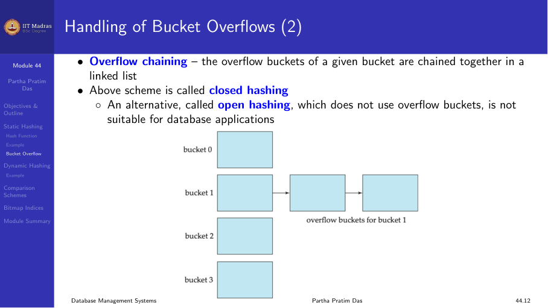

## Hash indices

Hashing can be used not only for file organization, but also for
index-structure creation. A hash index organizes the search keys, with
their associated record pointers, into a hash file structure.

Strictly speaking, hash indices are always secondary indexes. If the file
itself is organized using hashing, a separate primary hash index on the
same search-key is unnecessary. However, the term "hash index" is commonly
used to refer to both secondary index structures and hash file
organizations.

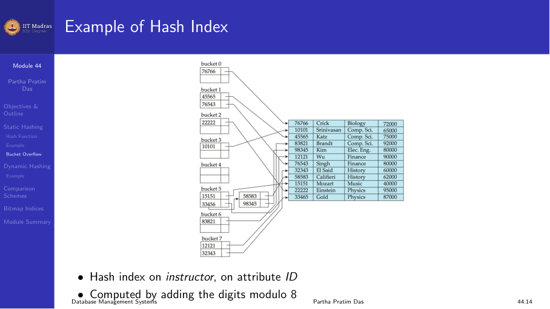

## Deficiencies of static hashing

Static hashing has a fundamental problem: the number of buckets is fixed
at creation time.

| Scenario | Problem |
|----------|---------|
| Too few buckets | Performance degrades due to excessive overflow |
| Too many buckets | Significant space wasted (buckets are underfull) |
| Database shrinks | Space waste again |
| Database grows | Overflow chains grow, performance degrades |

What we need is a hashing scheme that adapts to the size of the data. This
is the motivation for dynamic hashing.

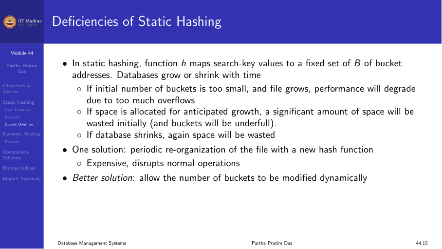

## Dynamic hashing

Dynamic hashing allows the hash function to be modified dynamically as the
database grows or shrinks. The most common form is **extendible hashing**.

### Extendible hashing

Extendible hashing uses a bucket address table (directory) that can grow
as needed.

#### Structure

- The hash function generates values over a large range — typically b-bit
  integers, with b = 32.
- At any time, only the first i bits (the hash prefix) are used to index
  into the bucket address table.
- The bucket address table has 2ⁱ entries, each pointing to a bucket.
- Each bucket j stores a value iⱼ indicating how many bits are used for
  that bucket.

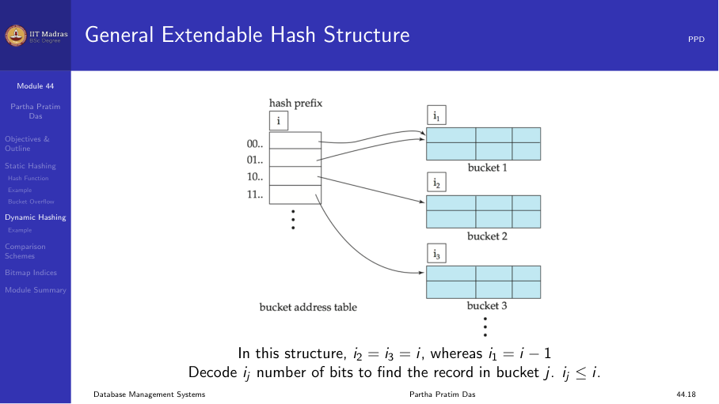

#### Searching

To locate the bucket containing search-key Kⱼ:

1. Compute h(Kⱼ) = X.
2. Use the first i high-order bits of X as a displacement into the bucket
   address table.
3. Follow the pointer to the appropriate bucket.
4. Scan the bucket for Kⱼ.

All entries that point to the same bucket have the same values in the
first iⱼ bits.

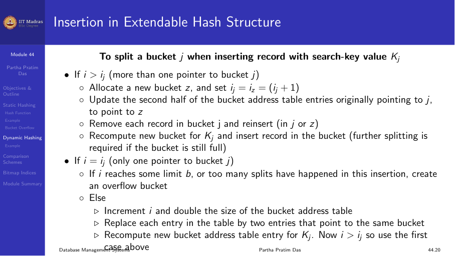

#### Insertion

To insert a record with search-key value Kⱼ:

1. Compute the hash and locate the bucket as in search.
2. If the bucket has space, insert the record.
3. If the bucket is full, split it:
   a. If i > iⱼ (multiple directory entries point to this bucket):
      - Allocate a new bucket z.
      - Set iⱼ = i_z = iⱼ + 1.
      - Update the second half of directory entries that pointed to j to
        point to z.
      - Reinsert records from bucket j into j or z.
      - Insert the new record.
   b. If i = iⱼ (only one directory entry points to this bucket):
      - Double the directory (i increases by 1).
      - Now i > iⱼ, so proceed as in case (a).

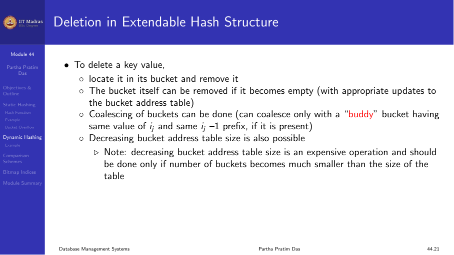

#### Deletion

To delete a key value:

1. Locate it in its bucket and remove it.
2. If the bucket becomes empty, it can be removed.
3. Coalescing of buckets is possible if a buddy bucket (with the same iⱼ
   and the same iⱼ-1 prefix) exists.
4. The bucket address table size can be reduced if possible.

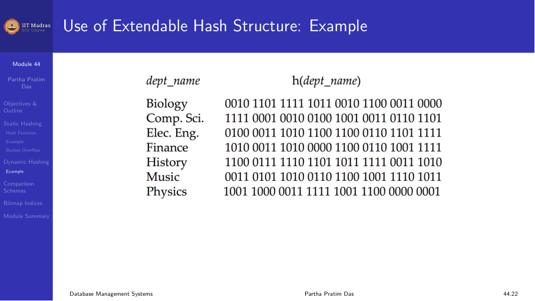

#### Example

An extendible hash structure indexed by dept_name, with i = 2 (4 directory
entries), after inserting multiple department names:

- Some buckets have iⱼ = 2 (one directory entry each).
- Some buckets have iⱼ = 1 (shared by two directory entries).

When "Einstein" is inserted and the target bucket overflows, the bucket
splits and, if needed, the directory doubles.

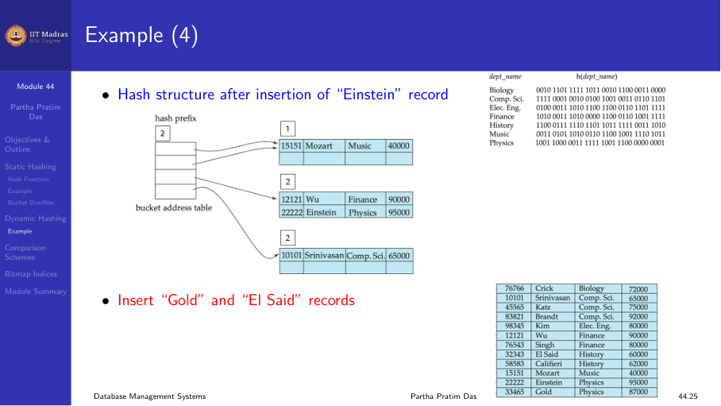

## Bitmap indices

A bitmap index is a specialized index structure for attributes with a small
number of distinct values (low cardinality).

In its simplest form, a bitmap index on an attribute has a bitmap for each
value of the attribute:

- Each bitmap has as many bits as there are records in the table.
- For a bitmap corresponding to value v, the bit for a record is 1 if the
  record has value v, and 0 otherwise.

### Example

Consider a table Student with attributes Gender (values: M, F) and
Semester (values: 1, 2, 3, 4, 5, 6, 7, 8).

- Bitmap for Gender = 'F': a sequence of bits, one per record.
- Bitmap for Semester = 4: a sequence of bits, one per record.

Query: "SELECT * FROM Student WHERE Gender = 'F' AND Semester = 4"

- Perform a bitwise AND of the two bitmaps.
- The result has 1s for records that satisfy both conditions.
- Fetch only those records.

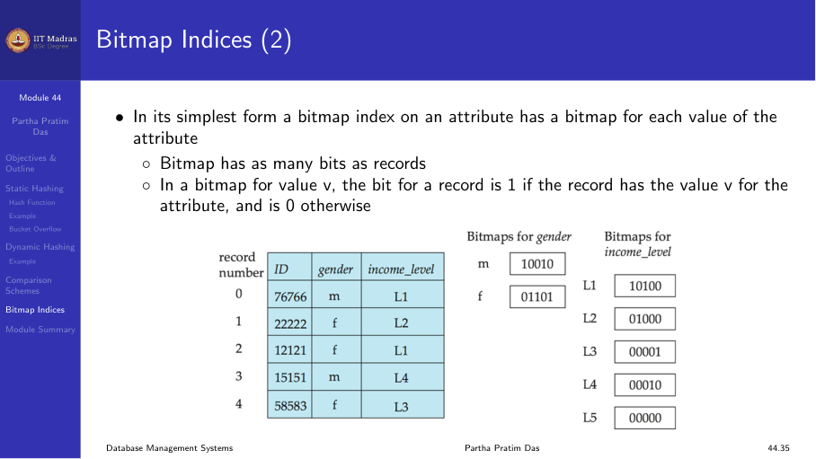

### Advantages of bitmap indices

- Very space efficient for low-cardinality attributes (each bit is 1/8
  byte).
- Bitwise operations (AND, OR, NOT) are extremely fast on modern CPUs.
- Ideal for data warehousing queries with multiple dimensions.

## Comparison: ordered indexing versus hashing

| Aspect | Ordered indexing (B+ tree) | Hashing |
|--------|---------------------------|---------|
| Equality search | O(log n) | O(1) average |
| Range search | Very fast (leaf links) | Not supported |
| Insert/Delete | O(log n) | O(1) average |
| Space | Moderate | Moderate |
| Best for | General purpose | Point queries only |
| Dynamic growth | Automatic (split/merge) | Requires extendible/linear |

In practice, B+ trees are more widely used because they support both
equality and range queries. Hash indexes are employed in specific
scenarios, such as in-memory key-value stores and data warehousing
environments.

## Summary

- Static hashing uses a fixed number of buckets; overflow chains degrade
  performance as the table grows.
- A good hash function is uniform, random, and fast.
- Extendible hashing adapts to data size by splitting buckets and doubling
  the directory as needed.
- Bitmap indices provide efficient access for low-cardinality attributes
  using bitwise operations.
- B+ trees are more versatile; hash indexes are best for point queries.
