## Introduction

SQL provides statements to create and manage indexes. While indexes are
not part of the SQL standard's logical model (they are physical
optimization structures), every major database supports them through DDL
extensions.

Creating appropriate indexes is one of the most important tuning decisions
a database designer makes. Good indexes can improve query performance by
orders of magnitude; unnecessary indexes can slow down updates and waste
space.

## Index definition in SQL

### CREATE INDEX

The basic syntax for creating an index:

```sql
CREATE INDEX <index-name> ON <relation-name> (<attribute-list>);
```

Example:

```sql
CREATE INDEX b_index ON branch (branch_name);
```

This creates a B+ tree index (the default in most databases) on the
branch_name column of the branch table.

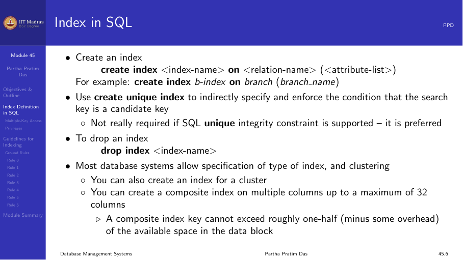

### UNIQUE INDEX

A unique index enforces uniqueness on the search key:

```sql
CREATE UNIQUE INDEX idx_email ON users (email);
```

This ensures that no two rows have the same email value. It is similar to
adding a UNIQUE constraint, which is the preferred approach in modern SQL.

### DROP INDEX

To remove an index:

```sql
DROP INDEX idx_name;
```

In some databases, the syntax requires specifying the table:

```sql
DROP INDEX idx_name ON table_name;
```

### Examples

Create an index for a single column to speed up queries that test that
column:

```sql
CREATE INDEX emp_dept_idx ON employee (dept_id);
```

Specify storage parameters explicitly (Oracle syntax):

```sql
CREATE INDEX emp_dept_idx ON employee (dept_id)
  TABLESPACE users
  STORAGE (INITIAL 20K NEXT 20K);
```

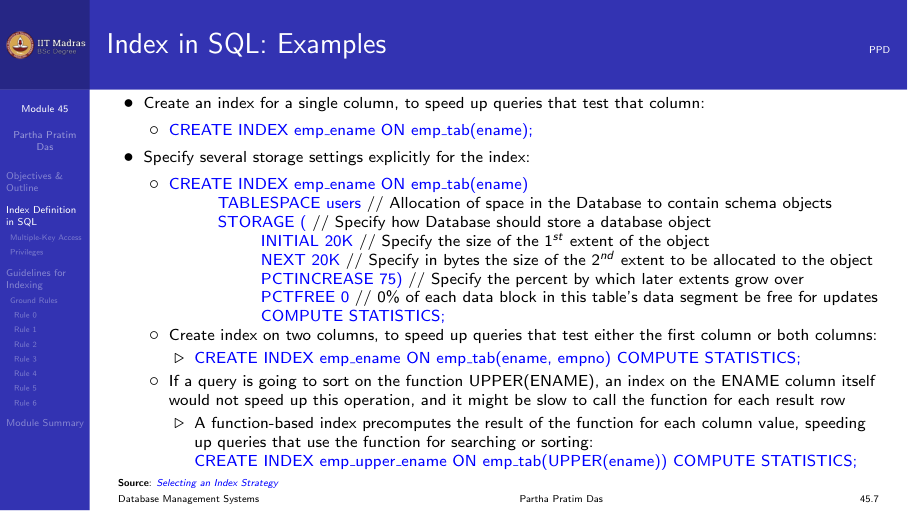

### Bitmap indexes

Bitmap indexes are available in some databases (Oracle, PostgreSQL with
extension) for low-cardinality columns:

```sql
CREATE BITMAP INDEX idx_gender ON Student (Gender);
CREATE BITMAP INDEX idx_semester ON Student (Semester);
```

These are useful for queries that combine conditions on multiple
low-cardinality columns:

```sql
SELECT * FROM Student
WHERE Gender = 'F' AND Semester = 4;
```

The database can perform a bitwise AND on the two bitmaps to quickly
identify matching rows.

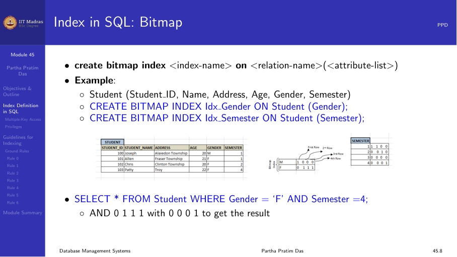

## Multiple-key access

Consider a query that filters on multiple attributes:

```sql
SELECT ID FROM instructor
WHERE dept_name = 'Finance' AND salary = 80000;
```

### Strategy 1: Separate indexes

If there are separate indexes on dept_name and salary, the database could:

1. Use the dept_name index to find all Finance instructors.
2. Use the salary index to find all instructors earning 80000.
3. Intersect the two sets of pointers.

This works but may fetch many pointers that are then discarded during
intersection.

### Strategy 2: Composite index

A composite index on both columns is more efficient:

```sql
CREATE INDEX idx_dept_salary ON instructor (dept_name, salary);
```

The index is sorted by dept_name first, then by salary. The query can use
the index to directly locate only the matching records.

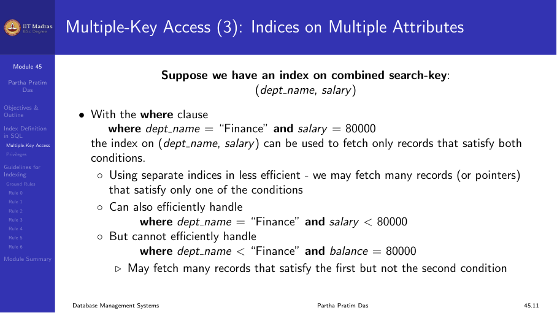

### Composite search keys

A composite search key contains more than one attribute. For example,
(dept_name, salary).

Lexicographic ordering applies: (a₁, a₂) < (b₁, b₂) if:

- a₁ < b₁, or
- a₁ = b₁ and a₂ < b₂

The order of columns in the index matters. A composite index on (A, B)
supports:

- Queries that filter on A alone.
- Queries that filter on both A and B.
- Queries that filter on A and sort by B.

It does NOT efficiently support queries that filter on B alone (without A).

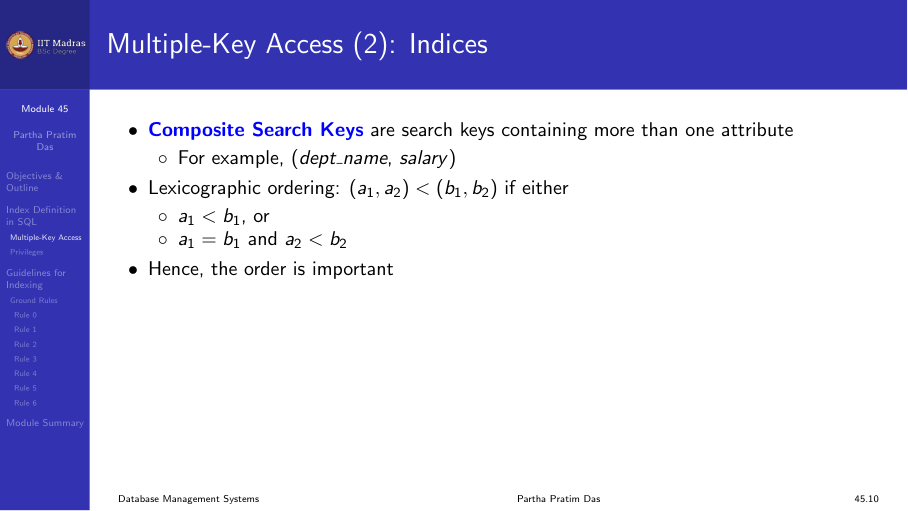

## Privileges required

Creating an index typically requires specific privileges:

- You must own the table being indexed, or have the appropriate object
  privilege.
- The schema containing the index must have a quota for the tablespace.
- To create an index in another user's schema, you need the CREATE ANY
  INDEX system privilege.

In a development environment, the DBA may need to grant these privileges
or adjust initialization parameters.

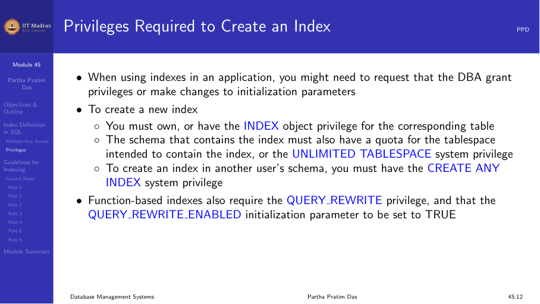

## Guidelines for indexing

In earlier weeks, we focused on database design through normalization —
reducing redundancy, enforcing constraints, and ensuring efficient access.
However, the physical organization of data (through indexing and hashing)
also has a significant impact on performance.

Unlike normalization, which is typically done once at design time, index
tuning is an ongoing process. Statistics about data distribution should
be collected periodically to guide indexing decisions.

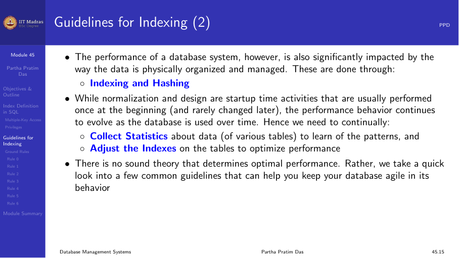

### Rule 0: Access-update trade-off

Every query benefits from appropriate indexes, but every update (insert,
delete, update) must update all indexes on the table. There is a direct
trade-off:

- More indexes → faster queries, slower updates.
- Fewer indexes → slower queries, faster updates.

Unnecessary indexes can significantly degrade update performance.

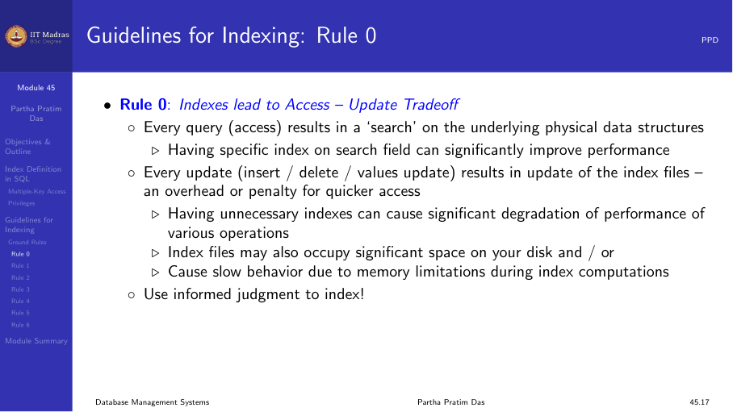

### Rule 1: Index the correct tables

Create an index if you frequently retrieve less than about 15% of the rows
in a large table. The percentage varies based on:

- The relative speed of a full table scan.
- How clustered the row data is about the index key.
  - Faster table scans → lower percentage.
  - More clustered row data → higher percentage.

For very small tables, a full table scan may be faster than using an
index. For large tables, indexes are essential for selective queries.

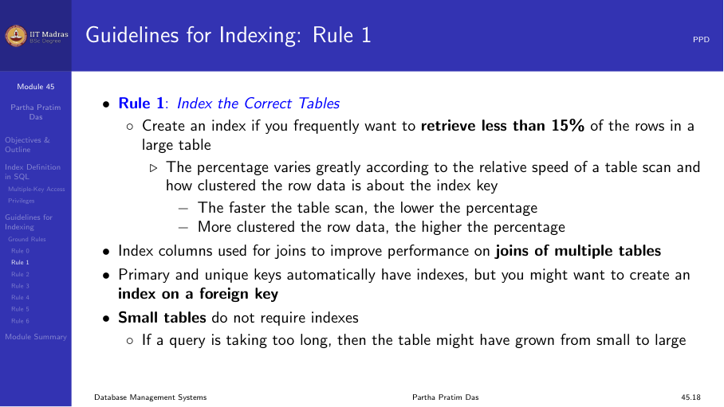

### Rule 2: Index the correct columns

Columns with the following characteristics are good candidates for
indexing:

- **High uniqueness.** Values are relatively unique in the column.
- **Wide range of values.** Good for regular (B+ tree) indexes.
- **Small range of values.** Good for bitmap indexes.
- **Many nulls.** Useful when queries select rows having a non-null value.

Avoid indexing columns with very few distinct values (e.g., a boolean
column with only true/false) using B+ tree indexes — a bitmap index is
more appropriate.

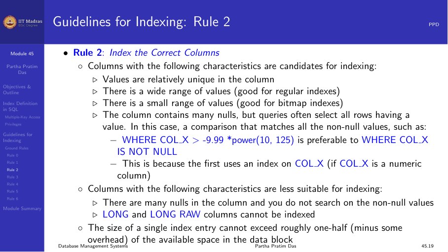

### Rule 3: Limit the number of indexes per table

Each index adds overhead for write operations:

- When rows are inserted or deleted, all indexes on the table must be
  updated.
- When a column is updated, all indexes on that column must be updated.

Weigh the performance benefit for queries against the overhead for
updates:

- Read-only or read-heavy tables → more indexes are acceptable.
- Write-heavy tables → minimize indexes to essential ones only.

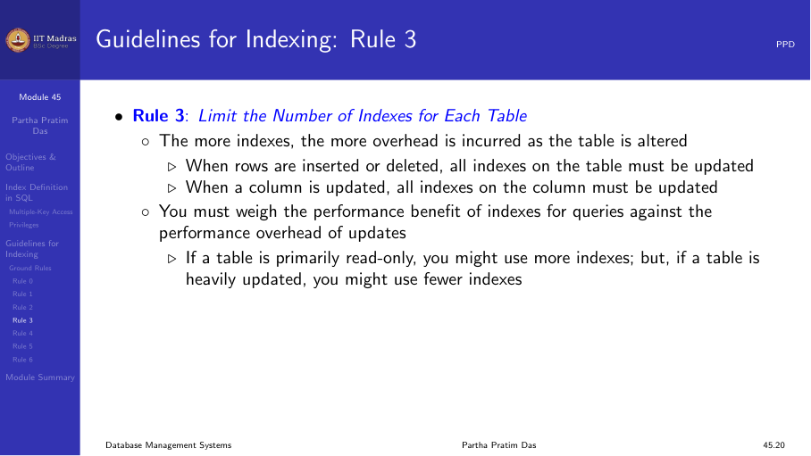

### Rule 4: Choose column order in composite indexes

The order of columns in a CREATE INDEX statement affects performance:

- Put the column used most often first.
- A composite index on (A, B) can be used for queries involving A alone,
  but not B alone.

Example: For a vendor-parts table with 5 vendors and many parts per
vendor, an index on (vendor_id, part_id) is more useful than one on
(part_id, vendor_id) if most queries filter by vendor.

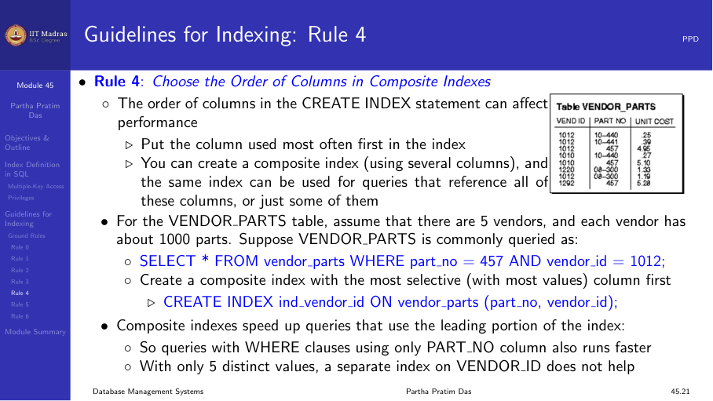

### Rule 5: Gather statistics

The database optimizer uses statistics to choose the best query plan.
Indexes are most effective when the optimizer has accurate information:

- Gather statistics when indexes are created.
- Periodically refresh statistics as data distribution changes.

In Oracle:

```sql
EXEC DBMS_STATS.GATHER_TABLE_STATS('schema', 'table');
```

In PostgreSQL:

```sql
ANALYZE table_name;
```

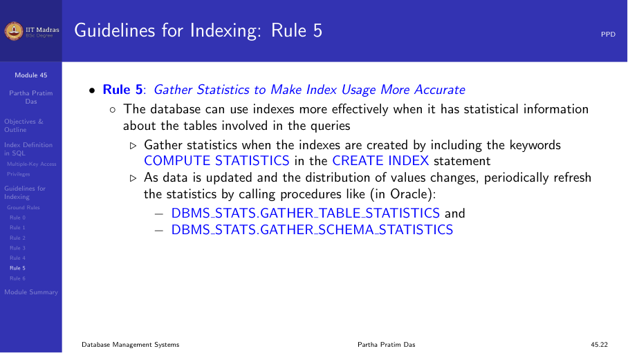

### Rule 6: Drop unused indexes

An index should be dropped if:

- It does not speed up queries (the table may be too small, or the index
  has very few entries).
- The queries in your application do not use the index.
- The index must be rebuilt (drop and recreate).

When an index is dropped, all storage extents are returned to the
tablespace.

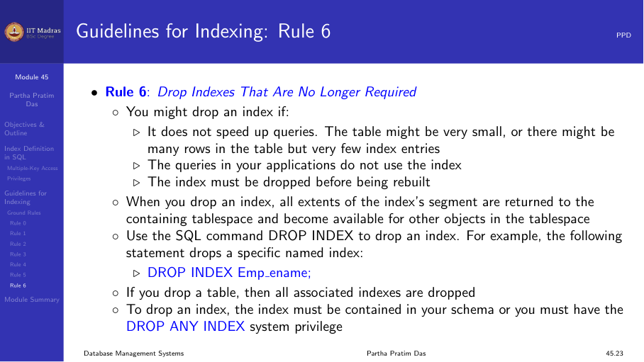

## Summary

- CREATE INDEX creates a B+ tree index by default; CREATE UNIQUE INDEX
  enforces uniqueness.
- Bitmap indexes are useful for low-cardinality columns.
- Composite indexes support multiple-key access; column order matters.
- Six ground rules guide indexing decisions: trade-offs, correct tables,
  correct columns, limiting indexes, column order, statistics, and
  dropping unused indexes.
- Index tuning is an ongoing process that should be revisited as data
  patterns change.
