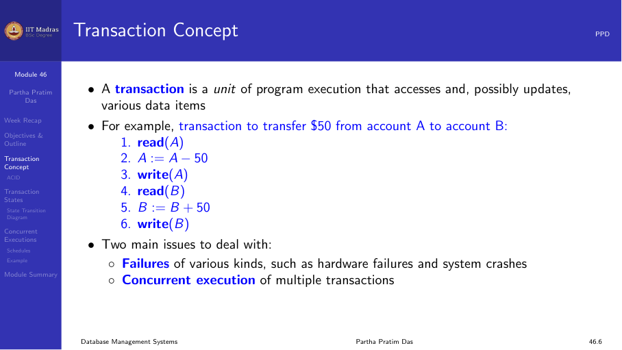
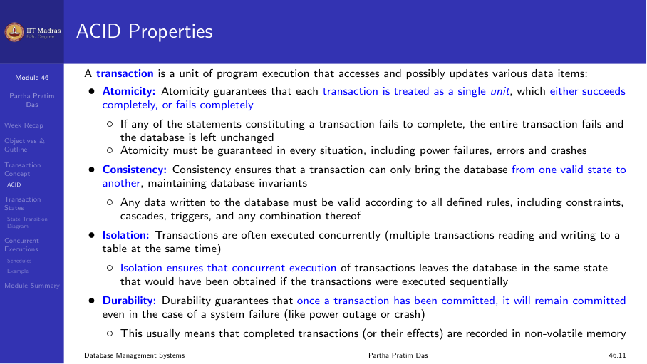
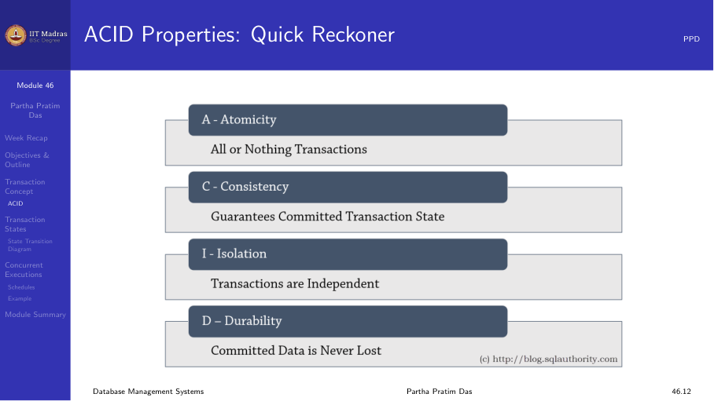
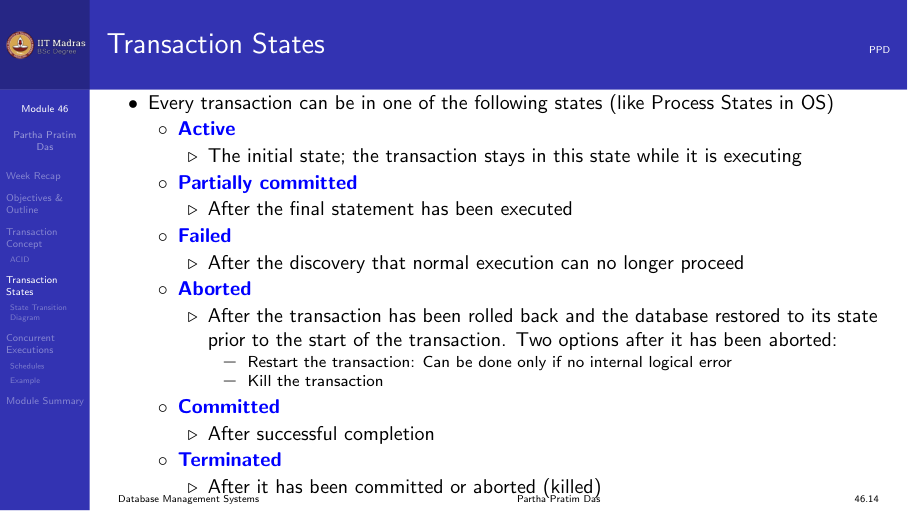
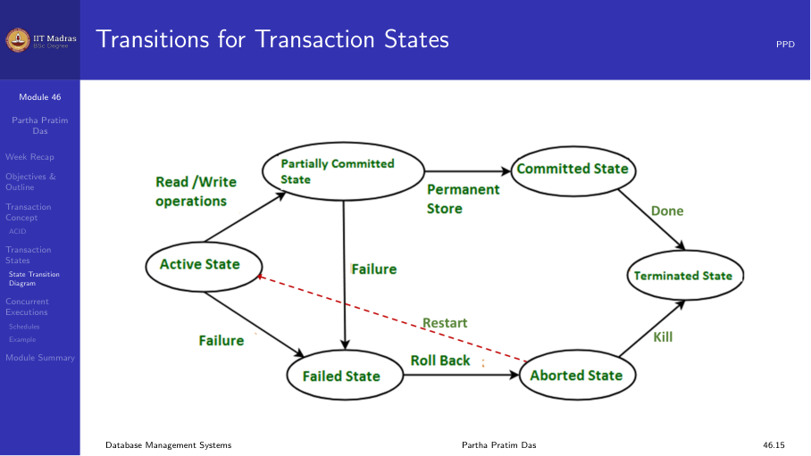
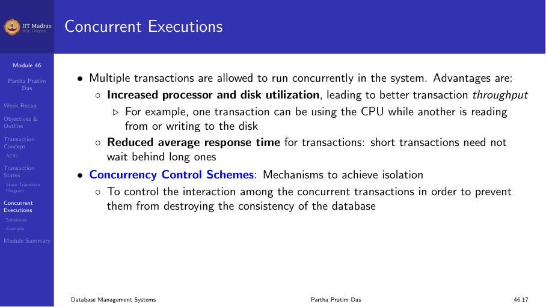
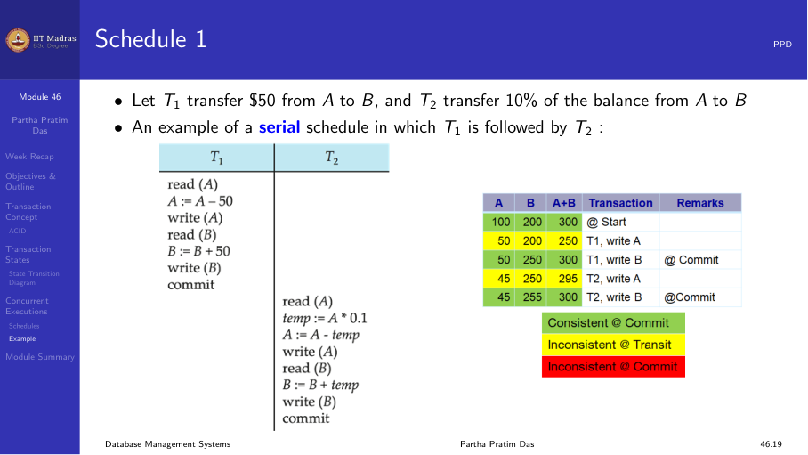
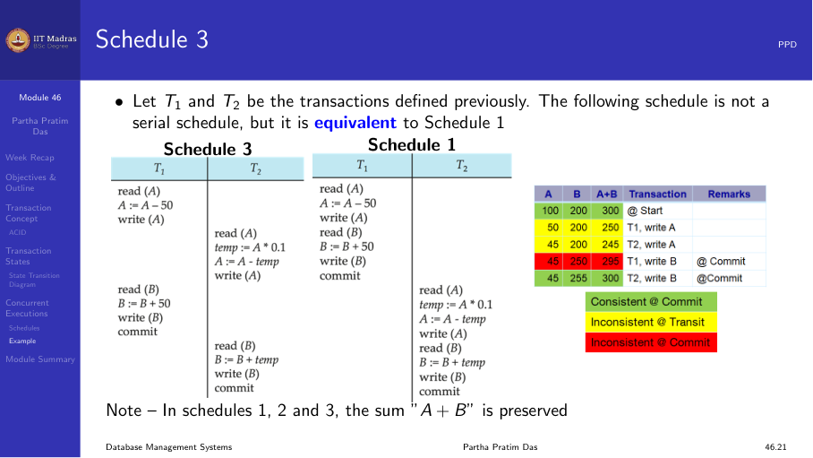
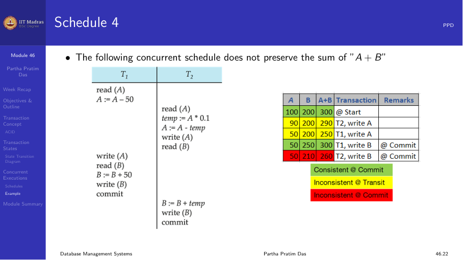

## Transaction concept

A transaction is a unit of program execution that accesses and possibly
updates various data items in a database. It consists of one or more
operations that logically belong together.

Consider a fund transfer from account A to account B:

```
read(A)
A := A - 50
write(A)
read(B)
B := B + 50
write(B)
```

This sequence of operations is a single logical unit of work. Either all
steps complete successfully, or none of them should take effect.



Two main issues arise with transactions:

1. **Failures.** Hardware failures and system crashes can interrupt a
   transaction mid-way.
2. **Concurrency.** Multiple transactions executing simultaneously can
   interfere with each other.

## ACID properties

### Atomicity

If the transaction fails after subtracting from A but before adding to B,
$50 would be lost. The system must ensure that either both updates take
effect, or neither does.

Atomicity guarantees that each transaction is treated as a single,
indivisible unit. If any statement fails, the entire transaction fails and
the database is left unchanged.

### Consistency

The sum A + B must be unchanged by the execution of the transaction.
Consistency ensures that a transaction can only bring the database from
one valid state to another, maintaining all database invariants.

Consistency requirements include:
- Explicit integrity constraints (primary keys, foreign keys)
- Implicit integrity constraints (business rules)

### Isolation

If another transaction T2 is allowed to access the partially updated
database between subtracting from A and adding to B, it will see an
inconsistent state where the sum A + B is less than it should be.

Isolation can be ensured trivially by running transactions serially —
one after the other — but this sacrifices performance.

### Durability

Once the user has been notified that the transaction has completed, the
updates must persist even if there is a software or hardware failure
immediately afterward.



### Quick reference

| Property | Meaning |
|----------|---------|
| Atomicity | All or nothing |
| Consistency | Guarantees committed transaction state |
| Isolation | Transactions are independent |
| Durability | Committed changes persist |



## Transaction states

A transaction passes through several states during its execution:

1. **Active.** The initial state. The transaction stays in this state
   while it is executing read and write operations.
2. **Partially committed.** After the final statement has been executed.
   The transaction may still fail at this point.
3. **Failed.** After the discovery that normal execution can no longer
   proceed (due to error or crash).
4. **Aborted.** The transaction has been rolled back and the database has
   been restored to its state before the transaction started.
5. **Committed.** The transaction completed successfully and all changes
   have been made permanent.



### State transitions

- Active → Partially committed (after final statement executes)
- Active → Failed (on error or crash)
- Partially committed → Committed (on successful commit)
- Partially committed → Failed (on failure during commit)
- Failed → Aborted (after rollback completes)

A transaction that has been aborted can be restarted later.



## Concurrent executions

Multiple transactions are allowed to run concurrently. This provides two
major advantages:

1. **Increased utilization.** One transaction can use the CPU while another
   reads from or writes to disk.
2. **Reduced response time.** Short transactions need not wait behind long
   ones.

These advantages improve transaction throughput.



### Schedules

A schedule is a sequence of instructions that specifies the chronological
order in which instructions of concurrent transactions are executed. A
schedule must contain all instructions of those transactions and preserve
the order of instructions within each transaction.

### Serial schedules

A serial schedule executes transactions one after another. Schedule 1: T1
followed by T2. Schedule 2: T2 followed by T1. Both preserve consistency.



### Concurrent schedule (serializable)

Schedule 3 interleaves instructions from T1 and T2 but produces the same
result as a serial schedule. This is called a serializable schedule.



### Concurrent schedule (not serializable)

Schedule 4 interleaves instructions in a way that produces an incorrect
result. The sum A + B is not preserved.



## Summary

- A transaction is a logical unit of work with ACID properties.
- Atomicity ensures all-or-nothing execution.
- Consistency maintains database invariants.
- Isolation prevents interference between concurrent transactions.
- Durability guarantees persistence of committed changes.
- Transactions go through states: Active, Partially Committed, Failed,
  Aborted, Committed.
- Concurrent execution improves throughput but requires careful scheduling.
