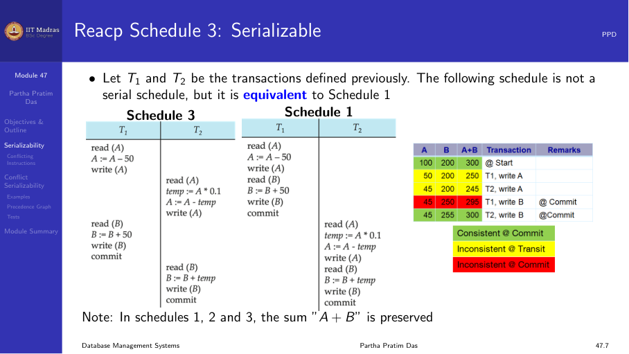
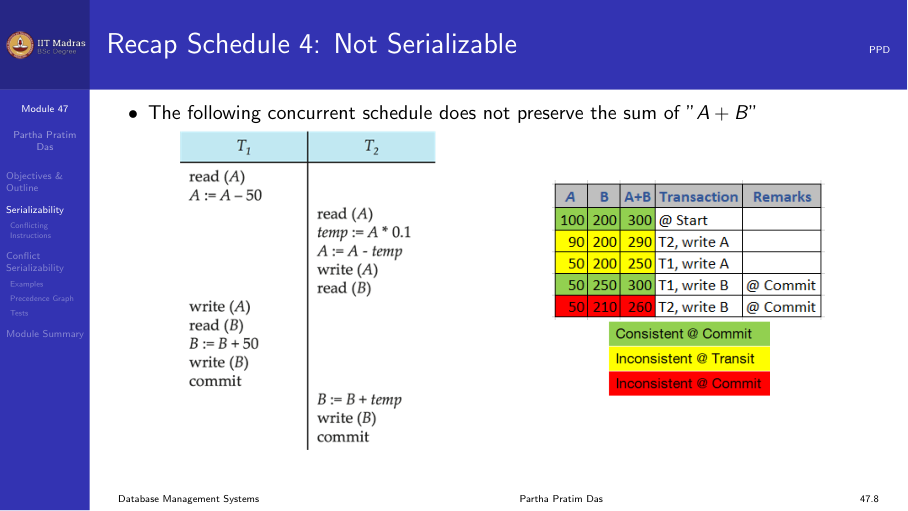
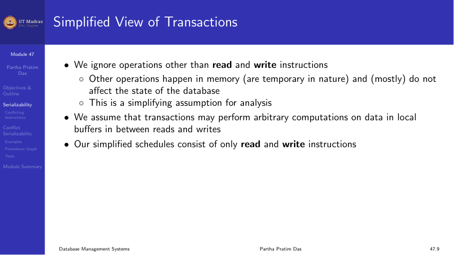
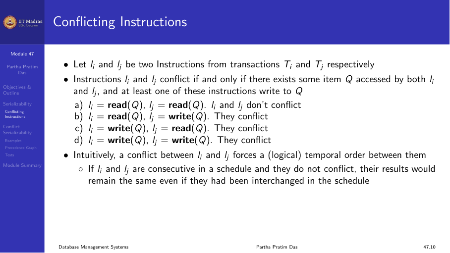
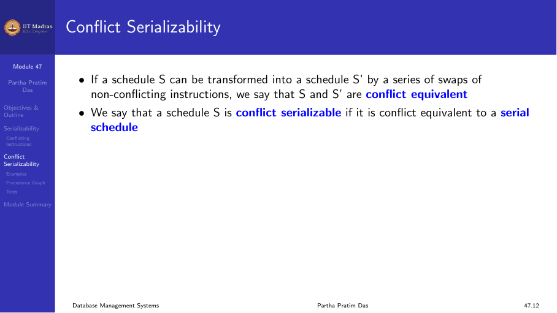
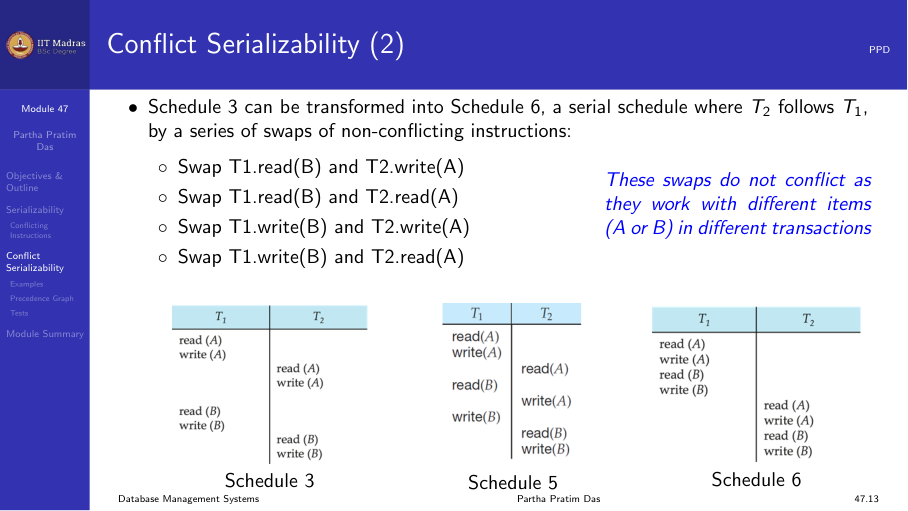
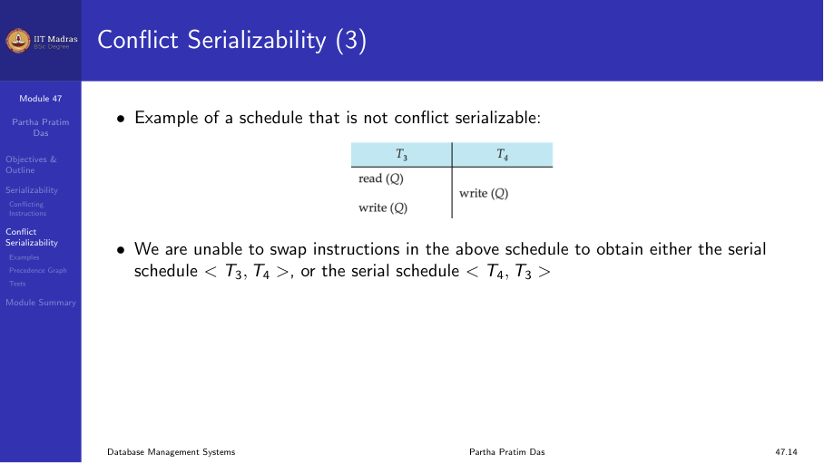
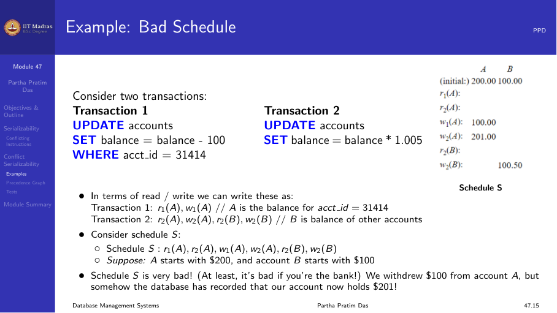
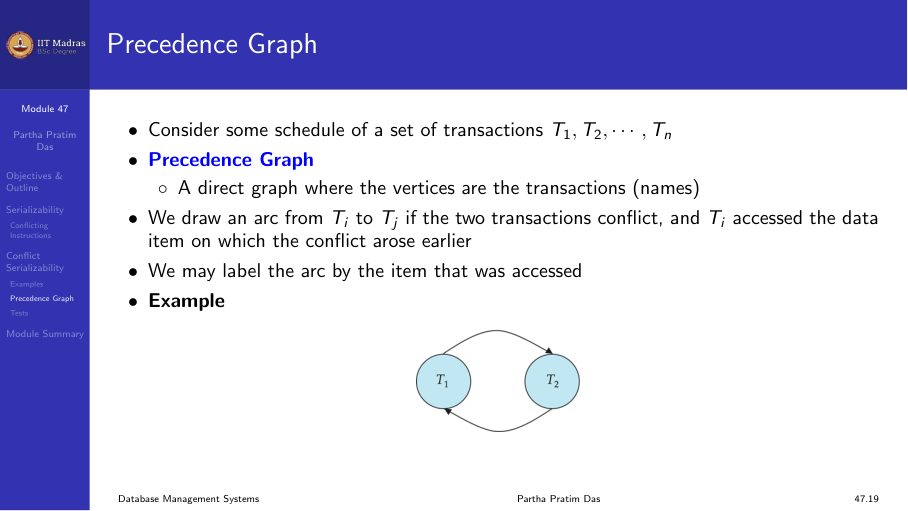
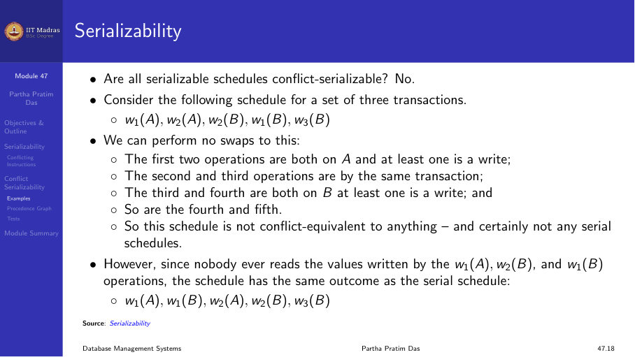

## Introduction

When transactions execute concurrently, their instructions interleave. Not
all interleavings produce correct results. A schedule is serializable if
it is equivalent to some serial schedule — that is, the result is the same
as if the transactions had run one after another.

Assumption: each transaction preserves database consistency when run alone.
Therefore, a serial schedule always preserves consistency. A serializable
schedule also preserves consistency, even though instructions are
interleaved.

## Serial schedules recap

Schedule 1 (T1 then T2) and Schedule 2 (T2 then T1) are serial. Both
produce valid results.

Schedule 3 is non-serial but equivalent to Schedule 1. It is serializable.



Schedule 4 is non-serial and NOT equivalent to any serial schedule. It
produces an incorrect result (A + B changes).



## Simplified view of transactions

For analysis, we ignore operations other than read and write instructions.
Other operations (computations in memory) are temporary and do not affect
the database state.

We assume transactions may perform arbitrary computations on data in local
buffers, but only read and write operations interact with the shared
database.



## Conflicting instructions

Two instructions Iᵢ and Iⱼ from transactions Tᵢ and Tⱼ conflict if they
access the same data item Q and at least one of them writes to Q.

| Iᵢ | Iⱼ | Conflict? |
|----|----|-----------|
| read(Q) | read(Q) | No |
| read(Q) | write(Q) | Yes |
| write(Q) | read(Q) | Yes |
| write(Q) | write(Q) | Yes |

Two conflicting instructions must be executed in the same order in any
equivalent schedule.



## Conflict serializability

A schedule S is conflict serializable if it can be transformed into a
serial schedule by swapping adjacent non-conflicting instructions.

Two schedules are conflict equivalent if one can be obtained from the
other through a series of non-conflicting swaps.



### Example

Schedule 3 can be transformed into a serial schedule (T1 then T2) by
swapping non-conflicting instructions:

1. Swap T1.read(B) and T2.write(A) — they access different items (B vs A).
2. Swap T1.read(B) and T2.read(A) — different items.
3. Swap T1.write(B) and T2.write(A) — different items.

After these swaps, all of T1's instructions come before T2's, producing a
serial schedule.



### Example of a non-conflict-serializable schedule

```
T1: read(Q), write(Q)
T2: write(Q)
```

We cannot swap any instructions because T1.read(Q) and T2.write(Q)
conflict, and T1.write(Q) and T2.write(Q) conflict. No transformation can
produce a serial schedule.



## Precedence graph

A precedence graph is a directed graph where:

- **Vertices.** One vertex for each transaction.
- **Edges.** An edge Tᵢ → Tⱼ exists if there is a conflicting pair of
  instructions where Tᵢ accesses the data item before Tⱼ.

### Example: bad schedule

Consider two transactions:

```
T1: UPDATE accounts SET balance = balance - 100
T2: UPDATE accounts SET balance = balance * 1.005
```

In a bad interleaving, T1 reads A, then T2 reads A, then T1 writes A, then
T2 writes A. The withdrawal is lost because T2's read happened before T1's
write. The precedence graph shows T1 → T2 and T2 → T1, forming a cycle.



### Testing for conflict serializability

A schedule is conflict serializable if and only if its precedence graph
is **acyclic** (no cycles).

Cycle-detection algorithms run in O(n²) time where n is the number of
vertices, or O(n + e) where e is the number of edges.

If the precedence graph has a cycle, the schedule is not conflict
serializable. The database system must reject such schedules.



### Construction algorithm

1. Create a vertex for each transaction.
2. For each conflicting pair of instructions:
   a. If Tᵢ's instruction comes before Tⱼ's instruction, add edge Tᵢ → Tⱼ.
3. Check for cycles.

If no cycles exist, the schedule is conflict serializable.

## View serializability

Not all serializable schedules are conflict serializable. Consider:

```
T1: write(A), write(B)
T2: write(A)
T3: write(A)
```

Schedule: T1.write(A), T2.write(A), T3.write(B), T1.read(B), T3.write(A)

We cannot swap any instructions (all operations conflict on A or B), but
the schedule may still be equivalent to some serial schedule.

A schedule is view serializable if it is view equivalent to a serial
schedule. View serializability is a broader notion than conflict
serializability — every conflict-serializable schedule is view
serializable, but not vice versa.



## Summary

- A serializable schedule produces the same result as a serial schedule.
- Two instructions conflict if they access the same item and at least one
  writes.
- A schedule is conflict serializable if it can be transformed into a
  serial schedule by swapping non-conflicting instructions.
- The precedence graph test: a schedule is conflict serializable iff the
  graph is acyclic.
- View serializability is broader but harder to test.
