## What is recovery?

Serializability helps ensure isolation and consistency in concurrent
schedules. However, atomicity and consistency can still be compromised
when the system fails.

Consider a single transaction:

```
read(A)
A := A - 50
write(A)
read(B)
B := B + 50
write(B)
```

What happens if the system crashes after writing A but before writing B?
The database would be inconsistent — $50 would be lost. Recovery protocols
ensure that such failures do not corrupt the database.

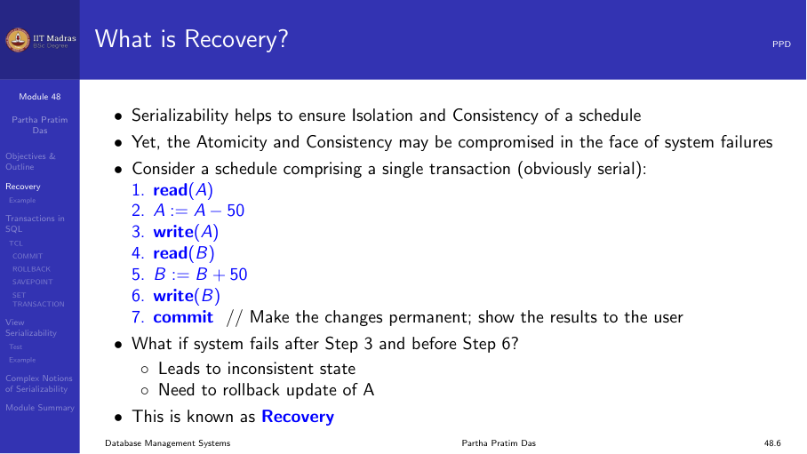

## Recoverable schedules

A schedule is recoverable if, whenever a transaction Tⱼ reads a data item
previously written by a transaction Tᵢ, the commit operation of Tᵢ appears
before the commit operation of Tⱼ.

```
T1: write(A) → commit
T2: read(A) → commit (must happen after T1 commits)
```

If T2 commits before T1 and then T1 aborts, T2 has read a value that never
existed (a dirty read). This must be prevented.

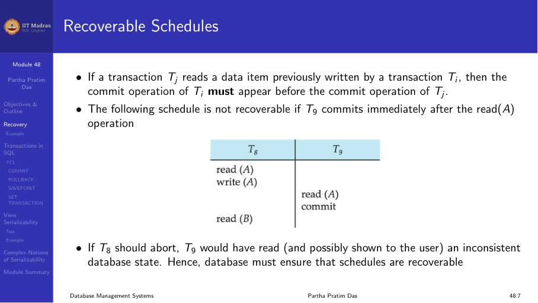

### Example: irrecoverable schedule

```
     T1            T2
     read(A)
     A = A - 1000
     write(A)      read(A)      → T2 reads uncommitted value
     abort         commit       → T2 commits based on uncommitted data
                              → Irrecoverable!
```

T2 reads A=4000 after T1 wrote it but before T1 committed. T1 then aborts,
rolling back to A=5000. But T2 has already committed using A=4000. The
database is inconsistent.

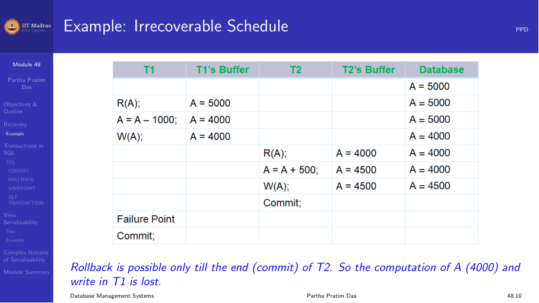

## Cascading rollbacks

A cascading rollback occurs when a single transaction failure leads to a
series of transaction rollbacks.

```
     T1            T2            T3
     write(A)
                   read(A)
                   write(B)
                                 read(B)
                                 write(C)
     abort
                   must abort    must abort
```

When T1 aborts, T2 must abort because it read A written by T1. Then T3
must abort because it read B written by T2. The rollback cascades through
the chain of dependent transactions.

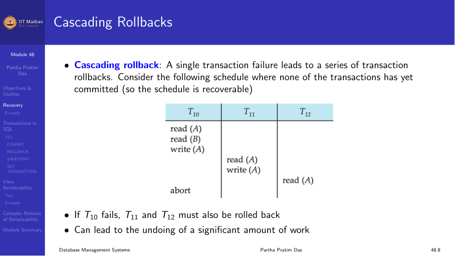

### Recoverable schedule with cascading rollback

```
T1: write(A) → (no commit)
T2: read(A)  → (no commit)
T1: commit
T2: commit
```

This schedule is recoverable (T1 commits before T2), but if T1 aborts
before committing, T2 must also be rolled back. This is cascading but
recoverable.

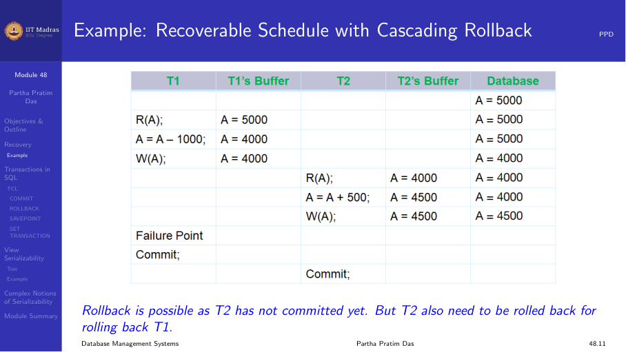

## Cascadeless schedules

A schedule is cascadeless if, for each pair of transactions Tᵢ and Tⱼ such
that Tⱼ reads a data item previously written by Tᵢ, the commit operation
of Tᵢ appears before the read operation of Tⱼ.

In other words, a transaction can only read data items that have already
been committed. This eliminates cascading rollbacks entirely.

Every cascadeless schedule is also recoverable, but not every recoverable
schedule is cascadeless.

| Property | Tⱼ reads after Tᵢ writes | Tⱼ commits after Tᵢ commits |
|----------|--------------------------|---------------------------|
| Recoverable | — | Required |
| Cascadeless | Required (commit before read) | Required |

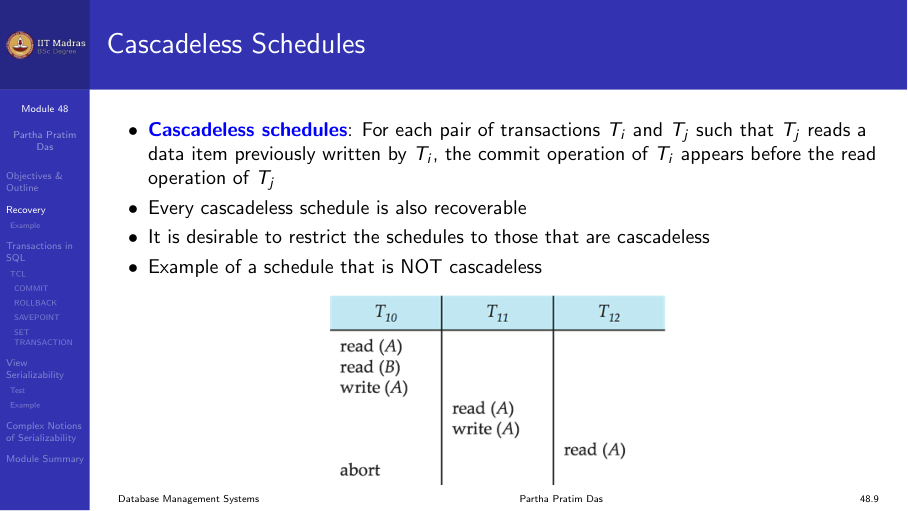

## Transaction definition in SQL

SQL provides constructs for defining and controlling transactions.

### Beginning a transaction

In SQL, a transaction begins implicitly when a user executes a statement
that accesses the database. There is no explicit BEGIN TRANSACTION
statement (though some databases support it).

### Ending a transaction

A transaction in SQL ends by:

1. **COMMIT.** Saves all changes made by the transaction to the database.
2. **ROLLBACK.** Undoes all changes made by the transaction since the
   last COMMIT or ROLLBACK.

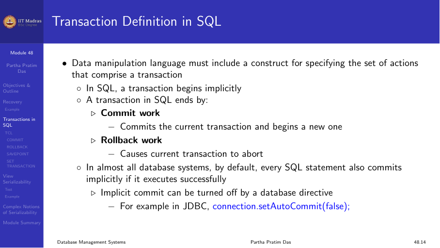

### TCL commands

Transaction Control Language (TCL) commands manage transactions:

| Command | Purpose |
|---------|---------|
| COMMIT | Save changes permanently |
| ROLLBACK | Undo changes since last COMMIT |
| SAVEPOINT | Set a point within a transaction |
| RELEASE SAVEPOINT | Remove a savepoint |

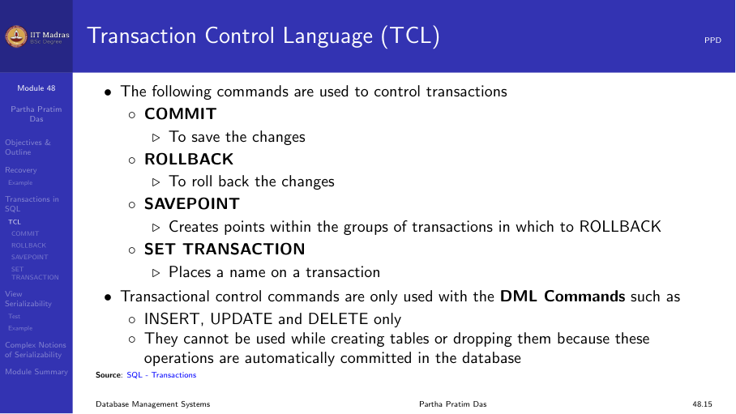

### COMMIT

COMMIT saves all transactions to the database since the last COMMIT or
ROLLBACK.

```sql
COMMIT;
```


### ROLLBACK

ROLLBACK undoes transactions since the last COMMIT or ROLLBACK.

```sql
ROLLBACK;
```

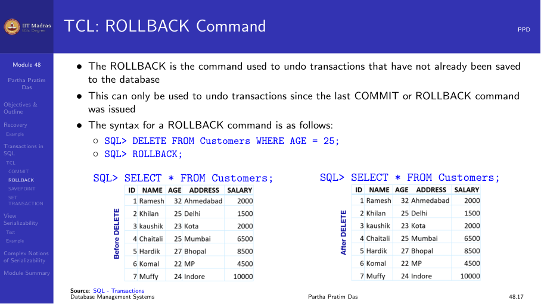

### SAVEPOINT

A SAVEPOINT is a point within a transaction to which you can roll back
without affecting the entire transaction.

```sql
SAVEPOINT sp1;
DELETE FROM student WHERE age > 25;
ROLLBACK TO sp1;  -- undo the delete, but keep earlier changes
```

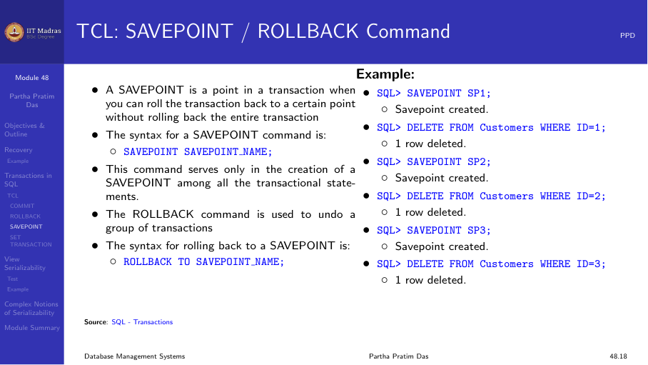

### RELEASE SAVEPOINT

Removes a savepoint. After releasing, you can no longer roll back to that
point.

```sql
RELEASE SAVEPOINT sp1;
```

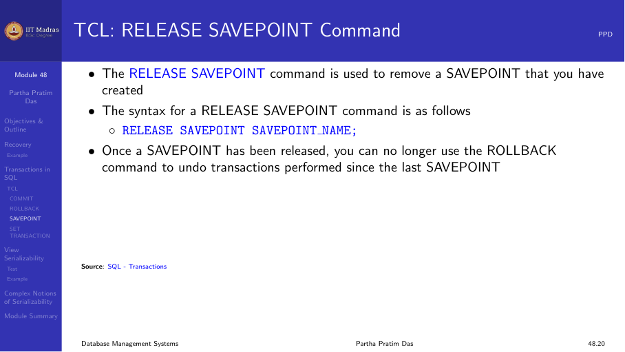

### Example

```sql
SAVEPOINT sp1;
DELETE FROM student WHERE id = 1;
DELETE FROM student WHERE id = 2;
DELETE FROM student WHERE id = 3;
ROLLBACK TO sp1;  -- undo the three deletes
```

Only the SAVEPOINT sp1 remains; the three deletes are rolled back.

## Summary

- Recoverable schedules ensure that a transaction commits only after all
  transactions whose data it read have committed.
- Cascading rollbacks occur when one transaction's abort forces others to
  abort. Cascadeless schedules prevent this.
- COMMIT makes changes permanent; ROLLBACK undoes changes.
- SAVEPOINT allows partial rollback within a transaction.
