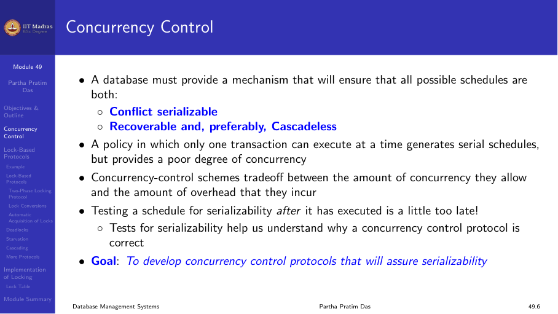
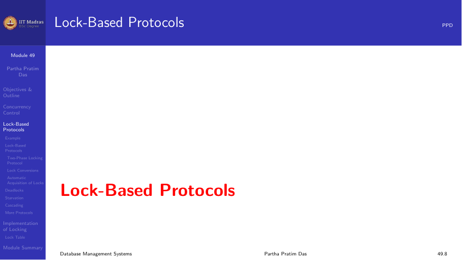
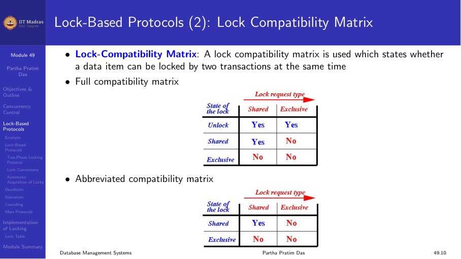
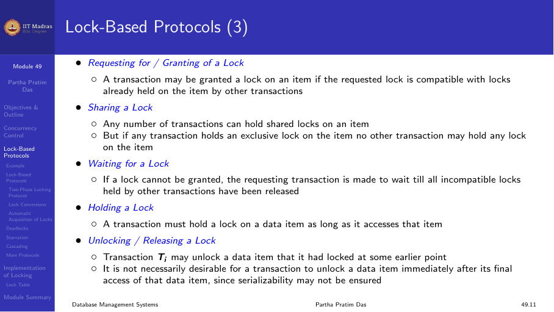
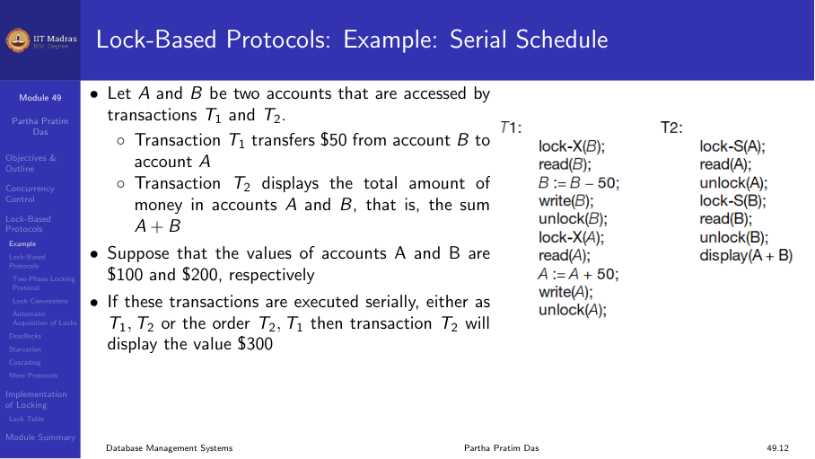
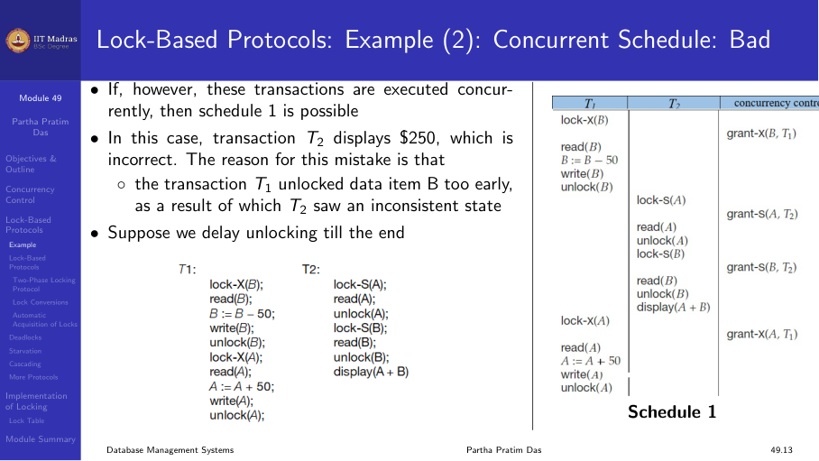
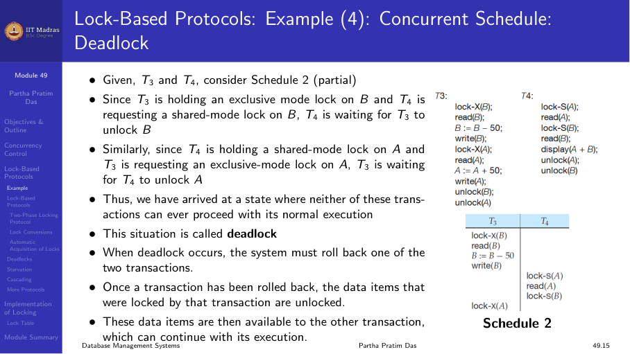
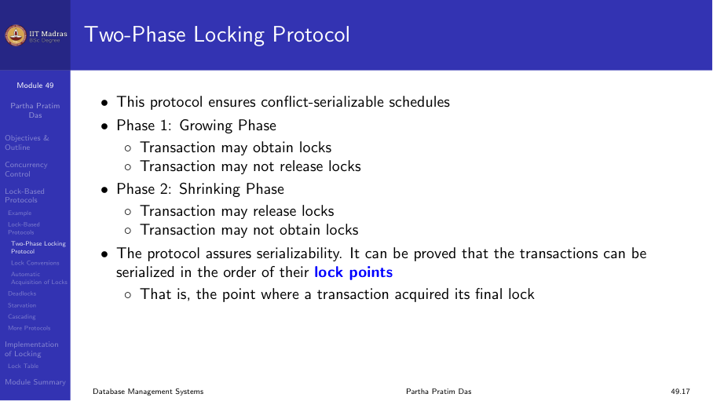
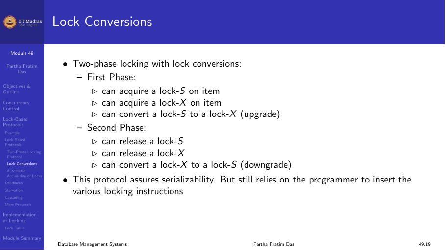
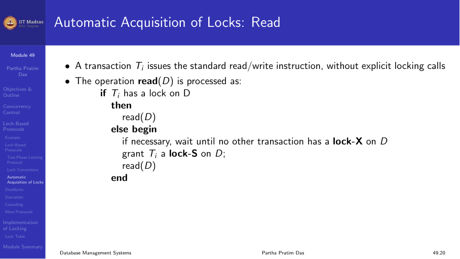

## Concurrency control

Serializability through schedule design is difficult to guarantee in
practice. Instead, database systems use concurrency control protocols that
automatically ensure serializable schedules.

A concurrency control mechanism must ensure that all possible schedules
are both:

1. **Conflict serializable** (or view serializable).
2. **Recoverable** and preferably cascadeless.

A simple policy of running transactions one at a time generates serial
schedules, but this sacrifices performance. Lock-based protocols allow
controlled concurrency.



## Lock-based protocols

One way to ensure isolation is to require that data items be accessed in a
mutually exclusive manner. While one transaction is accessing a data item,
no other transaction can modify that data item.

However, locking the entire database would lead to strictly serial
schedules and poor performance. Instead, locks are applied at the level of
individual data items.



### Lock modes

Data items can be locked in two modes:

1. **Shared (S) mode.** Data item can only be read. Multiple transactions
   can hold shared locks on the same item simultaneously (compatible).

2. **Exclusive (X) mode.** Data item can be both read and written. Only one
   transaction can hold an exclusive lock on an item at a time (not
   compatible with any other lock).

### Lock compatibility matrix

| Request | S held | X held |
|---------|--------|--------|
| Shared | Compatible | Not compatible |
| Exclusive | Not compatible | Not compatible |

An exclusive lock is requested using `lock-X` instruction. A shared lock
is requested using `lock-S` instruction.



### Lock management

A transaction may be granted a lock on an item only if the requested lock
is compatible with locks already held on that item by other transactions.

- Any number of transactions can hold shared locks on an item.
- If any transaction holds an exclusive lock, no other transaction can lock
  the item.

Transactions must wait if the requested lock is not compatible.



## Example: serial schedule with locking

T1 transfers $50 from B to A:
```
T1: lock-X(B); read(B); B := B - 50; write(B); unlock(B);
    lock-X(A); read(A); A := A + 50; write(A); unlock(A);
```

T2 displays total amount:
```
T2: lock-S(A); read(A); unlock(A);
    lock-S(B); read(B); unlock(B);
    display(A + B);
```

This is serial (T1 then T2). The result is correct.



## Example: concurrent schedule with early unlock

If T1 unlocks B too early, T2 might read an inconsistent state:

```
T1: lock-X(B); read(B); B := B - 50; write(B); unlock(B);
    lock-X(A); read(A); A := A + 50; write(A); unlock(A);

T2:                                 lock-S(A); read(A); unlock(A);
                                    lock-S(B); read(B); unlock(B); display(...)
```

If T2 executes after T1 unlocks B but before T1 locks A, T2 sees B
updated but A not yet updated. The total displayed would be incorrect.



The fix: delay unlocking until the end of the transaction.

## Example: deadlock

Two transactions holding locks and waiting for each other:

```
T3: lock-X(B); read(B); ...                    (holds B, wants A)
T4: lock-X(A); read(A); ... lock-S(B); (holds A, wants B)
```

T3 is holding exclusive lock on B and wants A. T4 is holding exclusive
lock on A and wants B. Both wait forever. This is a deadlock.



## Two-phase locking protocol

The two-phase locking (2PL) protocol ensures conflict-serializable
schedules. It has two phases:

### Phase 1: Growing phase

A transaction may obtain locks, but may not release any locks.

### Phase 2: Shrinking phase

A transaction may release locks, but may not obtain any new locks.

The point where the transaction has all its locks and has not yet started
releasing them is called the **lock point**.



### Properties of 2PL

- 2PL guarantees conflict serializability.
- However, there exist conflict-serializable schedules that cannot be
  produced by 2PL.
- Without additional information about data access ordering, 2PL is
  necessary for conflict serializability.

### Lock conversions

Two-phase locking with lock conversions allows changing lock modes:

**First phase (growing):**
- Can acquire a shared (S) lock.
- Can acquire an exclusive (X) lock.
- Can upgrade a shared lock to an exclusive lock (S → X).

**Second phase (shrinking):**
- Can downgrade an exclusive lock to a shared lock (X → S).
- Can release locks.



## Automatic acquisition of locks

In most database systems, the programmer does not issue explicit lock
calls. Instead, the system automatically locks data items when read or
write instructions are executed.

When a transaction Tᵢ issues `read(D)`:

1. If Tᵢ already has a lock on D, proceed with the read.
2. If another transaction holds a conflicting lock, Tᵢ waits.
3. Otherwise, the system acquires the appropriate lock automatically.

The `SET TRANSACTION ISOLATION LEVEL` statement in SQL controls the
locking behavior (e.g., SERIALIZABLE, READ COMMITTED, etc.).



## Summary

- Lock-based protocols use shared and exclusive locks to control concurrent
  access to data items.
- Shared locks are compatible; exclusive locks are not compatible with any
  other lock.
- Two-phase locking (2PL) ensures conflict serializability by separating
  lock acquisition (growing phase) from lock release (shrinking phase).
- Early unlocking can lead to inconsistent states; locking too long can
  cause deadlocks.
- Most databases handle locking automatically based on isolation level
  settings.
