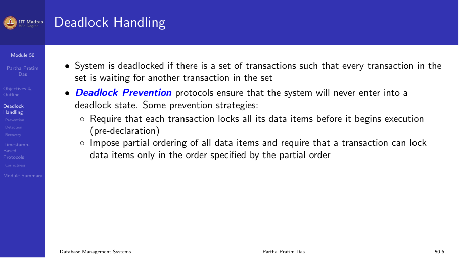
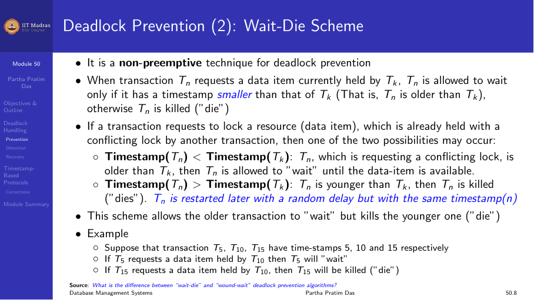
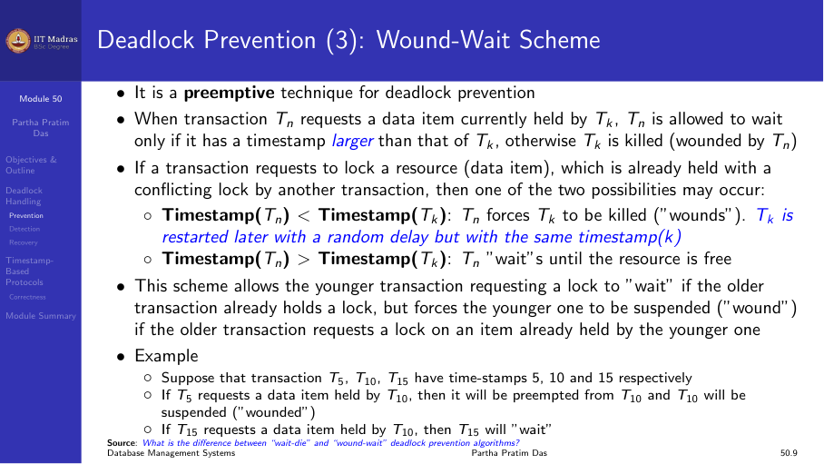
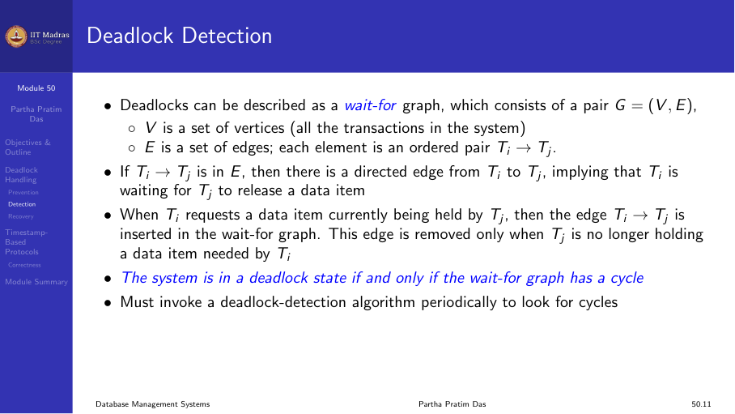
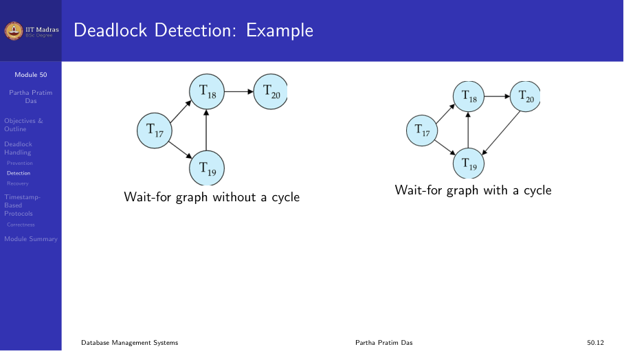
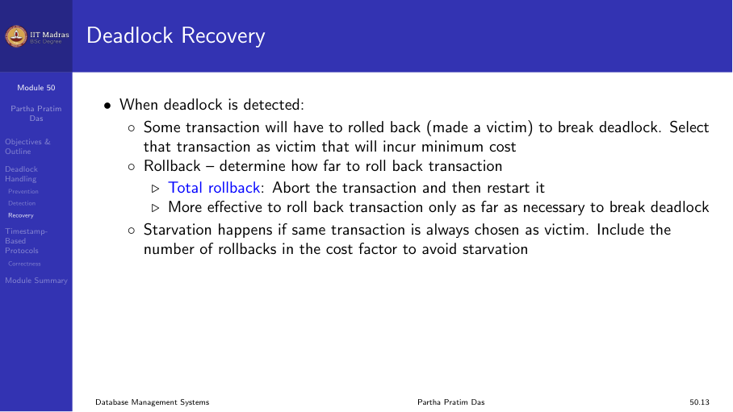
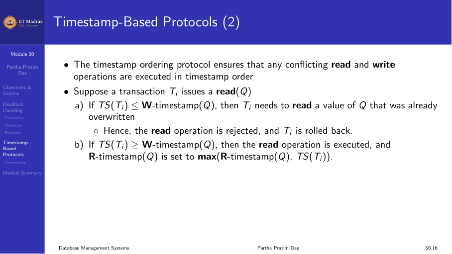
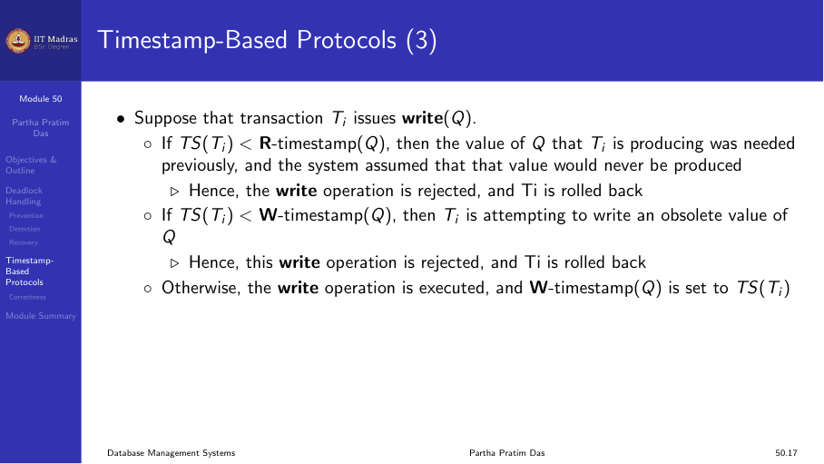
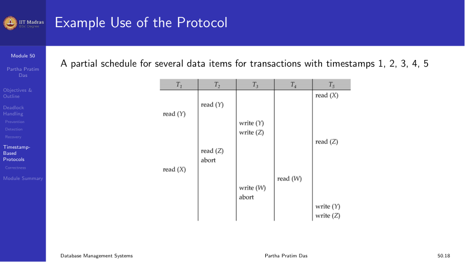
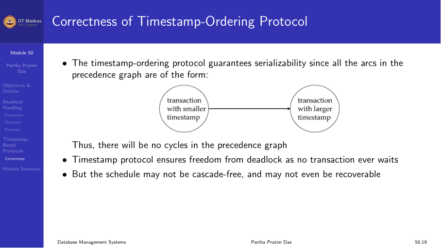

## Deadlock handling

A system is in a deadlock state if there is a set of transactions such
that every transaction in the set is waiting for another transaction in
the set to release a lock. No transaction in the set can proceed.

Three approaches to dealing with deadlocks:

1. **Deadlock prevention.** Ensure the system never enters a deadlock.
2. **Deadlock detection.** Allow deadlocks to occur, detect them, and
   recover.
3. **Deadlock avoidance.** Use additional information to avoid deadlocks.



## Transaction timestamps

A timestamp is a unique identifier assigned by the DBMS to identify the
relative starting time of a transaction. Timestamps are used in both
deadlock prevention and timestamp-based concurrency control.

Properties:
- Each transaction receives a timestamp when it enters the system.
- If Tᵢ starts before Tⱼ, then TS(Tᵢ) < TS(Tⱼ).
- Timestamps are unique and monotonically increasing.

## Deadlock prevention

Deadlock prevention protocols ensure that the system never enters a
deadlock state. One prevention strategy: require that each transaction
locks all its data items before it begins execution (pre-acquisition).

Two common timestamp-based prevention schemes:

### Wait-die scheme (non-preemptive)

When transaction Tᵢ requests a data item held by Tⱼ:

- If TS(Tᵢ) < TS(Tⱼ) (Tᵢ is older), Tᵢ is allowed to wait.
- If TS(Tᵢ) > TS(Tⱼ) (Tᵢ is younger), Tᵢ is killed (dies) and restarted
  with its original timestamp.

Older transactions wait for younger ones. Younger transactions never wait
for older ones — they die instead.



### Wound-wait scheme (preemptive)

When transaction Tᵢ requests a data item held by Tⱼ:

- If TS(Tᵢ) < TS(Tⱼ) (Tᵢ is older), Tⱼ is wounded (killed) and its locks
  are released. Tᵢ gets the lock.
- If TS(Tᵢ) > TS(Tⱼ) (Tᵢ is younger), Tᵢ is allowed to wait.

Older transactions wound younger ones and take their locks. Younger
transactions wait for older ones.



### Properties of wait-die and wound-wait

In both schemes, a rolled-back transaction is restarted with its original
timestamp. This ensures that older transactions have precedence over newer
ones, and starvation is avoided.

| Scheme | Older wants younger's lock | Younger wants older's lock |
|--------|---------------------------|---------------------------|
| Wait-die | Wait | Die |
| Wound-wait | Wound | Wait |

### Timeout-based schemes

A simpler approach: a transaction waits for a lock only for a specified
amount of time. If the lock has not been granted within the timeout, the
transaction is rolled back and restarted.

- **Advantage.** Simple to implement.
- **Disadvantage.** Difficult to choose the right timeout value. Too short
  causes unnecessary rollbacks. Too long causes long waits.

## Deadlock detection

Deadlocks can be described using a wait-for graph G = (V, E):

- V is the set of transactions in the system.
- E contains directed edges Tᵢ → Tⱼ if Tᵢ is waiting for Tⱼ to release a
  data item.

The system is in a deadlock state if and only if the wait-for graph
contains a cycle.



### Example

**No cycle (no deadlock):**
```
T1 → T2 → T3 → T4
```
T1 waits for T2, T2 waits for T3, T3 waits for T4. No cycle, so
eventually T4 finishes, then T3, then T2, then T1.

**With cycle (deadlock):**
```
T1 → T2 → T3 → T1
```
T1 waits for T2, T2 waits for T3, T3 waits for T1. No transaction can
proceed. Deadlock detected.



## Deadlock recovery

When a deadlock is detected, the system must break it:

1. **Select a victim.** Choose a transaction to roll back. The victim
   should be the transaction that incurs the minimum cost (fewest locks,
   least work, furthest from completion).

2. **Rollback.** Determine how far to roll back:
   - **Total rollback.** Abort the transaction and restart it.
   - **Partial rollback.** Roll back to a savepoint and release only the
     locks held since that point.

3. **Starvation.** A transaction selected as victim repeatedly should not
   starve. The system must ensure that the same transaction is not always
   chosen.



## Timestamp-based protocols

Timestamp-based protocols use timestamps to order transactions without
using locks. They eliminate deadlocks entirely.

The timestamp-ordering protocol ensures that conflicting read and write
operations are executed in timestamp order.

### Read operation

When transaction Tᵢ issues read(Q):

1. If TS(Tᵢ) < W-timestamp(Q), the write timestamp of Q is newer than Tᵢ.
   Tᵢ needs to read a value of Q that was already overwritten. Reject
   read and roll back Tᵢ.
2. If TS(Tᵢ) ≥ W-timestamp(Q), execute the read. Set R-timestamp(Q) =
   max(R-timestamp(Q), TS(Tᵢ)).



### Write operation

When transaction Tᵢ issues write(Q):

1. If TS(Tᵢ) < R-timestamp(Q), the value of Q that Tᵢ is producing was
   already needed by a newer transaction. Reject write and roll back Tᵢ.
2. If TS(Tᵢ) < W-timestamp(Q), Tᵢ is attempting to write an obsolete value
   of Q. Reject write and roll back Tᵢ.
3. Otherwise, execute the write. Set W-timestamp(Q) = TS(Tᵢ).



### Example

A partial schedule for transactions with timestamps 1, 2, 3, 4, 5:

```
T1: read(X)
T2: read(Y)
T3: write(Y) → T3 timestamp < R-timestamp(Y)? No. Execute.
T4: write(X) → TS(4) < R-timestamp(X)? No (set by T1). Execute.
T5: read(Y) → TS(5) < W-timestamp(Y)? TS(5)=5, W-timestamp(Y)=3. No. Execute.
```

The timestamp order ensures serializability.



### Correctness

The timestamp-ordering protocol guarantees serializability because all
edges in the precedence graph go from a transaction with a smaller
timestamp to a transaction with a larger timestamp:

TS(smaller) → TS(larger)

No cycles can form in such a precedence graph.



## Summary

- Deadlock prevention (wait-die, wound-wait) ensures the system never
  deadlocks by controlling which transactions wait.
- Deadlock detection uses a wait-for graph; a cycle indicates deadlock.
- Recovery selects a victim and rolls it back.
- Timestamp-based protocols order transactions by timestamps without locks,
  eliminating deadlocks entirely.
- Each approach has trade-offs between concurrency, overhead, and
  complexity.
