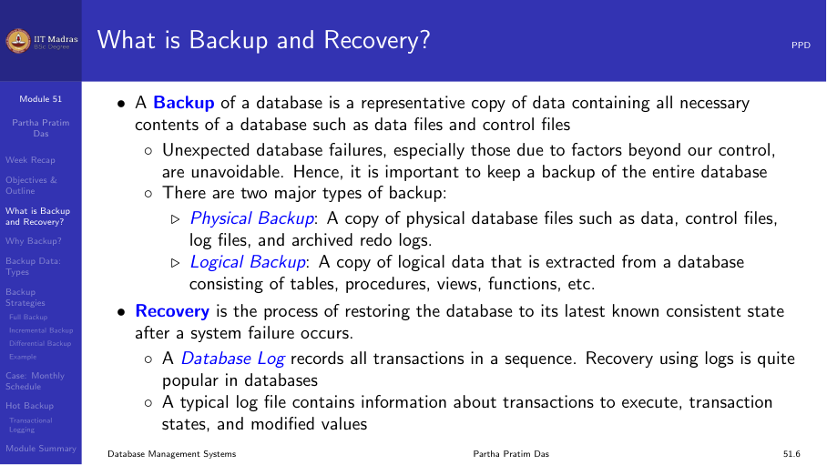
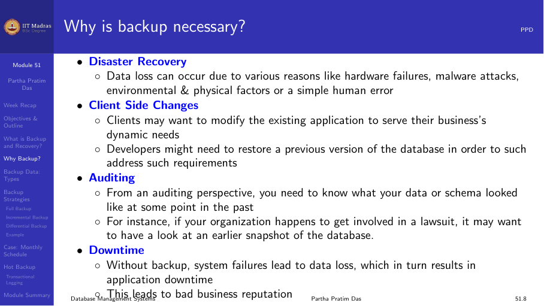
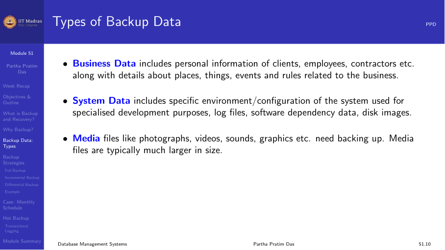
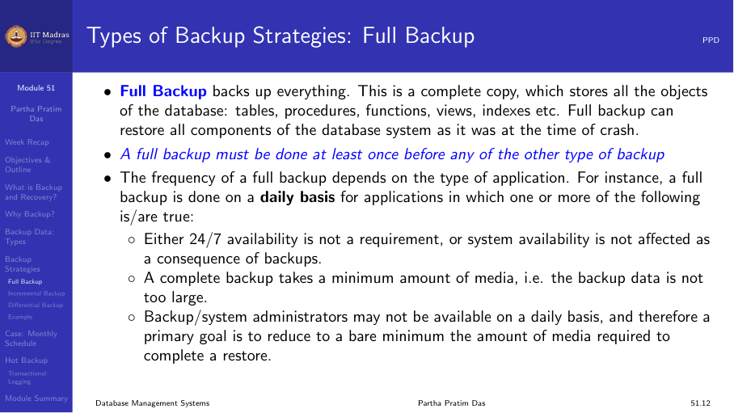
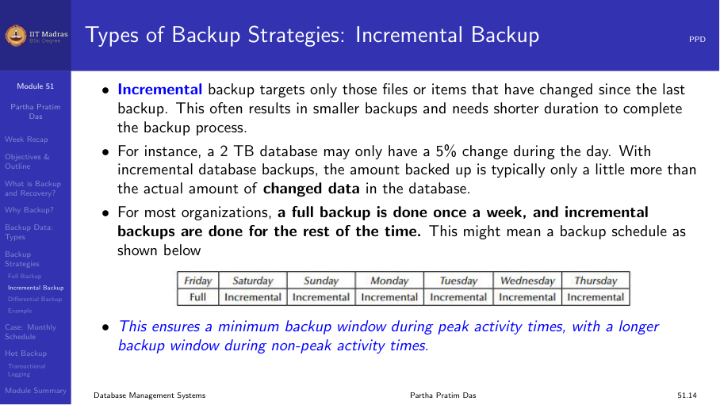
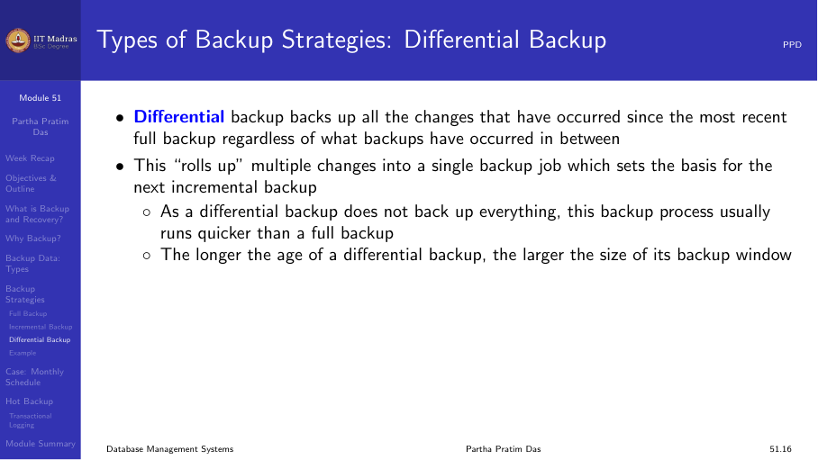
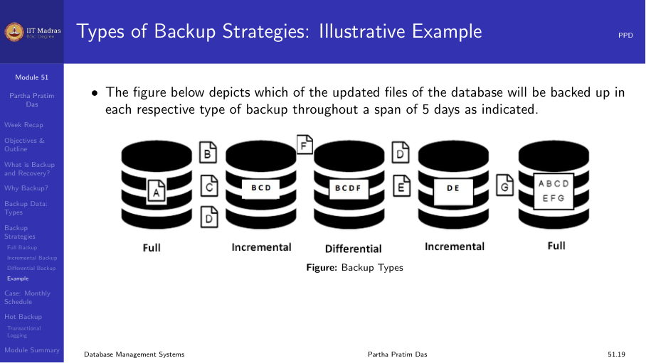
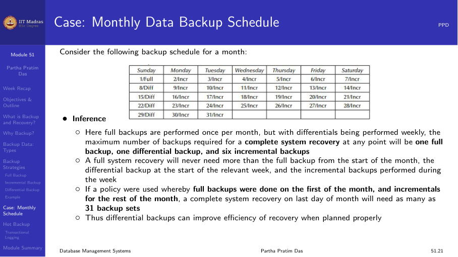
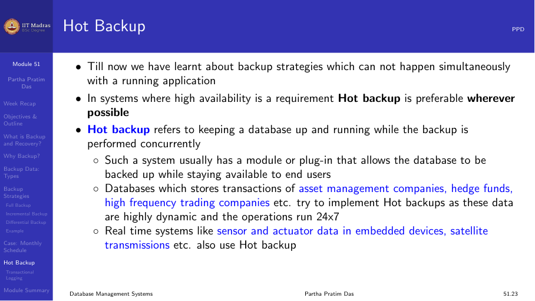
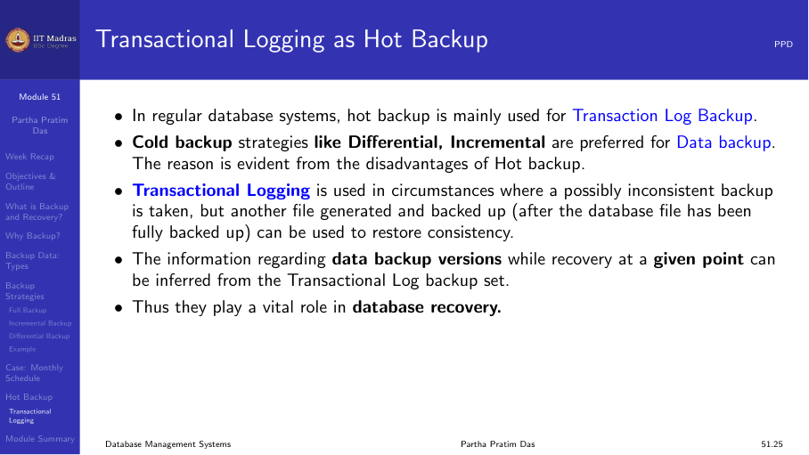

## What is backup and recovery?

A backup of a database is a representative copy of data containing all
necessary contents of a database such as data files and control files.
Backups are essential because unexpected database failures are unavoidable
— hardware failures, malware attacks, environmental factors, or simple
human error can all cause data loss.

Recovery is the process of restoring the database to a consistent state
after a failure, using the backup.

## Why backup?

Two main reasons:

1. **Disaster recovery.** Data loss can occur due to hardware failures,
   malware attacks, environmental/physical factors, or human error. A
   backup ensures the data can be restored.
2. **Client-side changes.** Clients may need to modify existing
   applications. Backups allow reverting to a known good state.

## Types of backup data

- **Business data.** Personal information of clients, employees,
  contractors, details about places, things, events, and business rules.
- **System data.** Specific environment/configuration of the system, log
  files, software dependency data, disk images.
- **Media files.** Photographs, videos, sounds, graphics.

## Backup strategies

There are three main backup strategies:

### Full backup

A full backup backs up everything — a complete copy of all database
objects: tables, procedures, functions, views, indexes. A full backup can
restore all components as they were at the time of the crash.

A full backup must be done at least once before any other type of backup.

**Advantages:**
- Recovery involves a single consolidated read from one backup.
- No dependency between consecutive backups — losing one backup does not
  affect recovery from others.

### Incremental backup

An incremental backup targets only files or items that have changed since
the last backup (full or incremental). This results in smaller backups and
shorter backup times.

For example, a 2 TB database may only have a 5% change during the day.
With incremental backup, only about 100 GB is backed up.

**Advantages:**
- Less storage used per backup.
- Minimized backup downtime.
- Cost reductions over full backups.

**Disadvantages:**
- Recovery may require applying multiple incremental backups in sequence.
- More complex restore process.

### Differential backup

A differential backup backs up all changes that have occurred since the
most recent full backup, regardless of what backups have occurred in
between. It "rolls up" multiple changes into a single backup job.

**Advantages:**
- Recoveries require fewer backup sets.
- Better recovery options when full backups are run rarely.

**Disadvantages:**
- Larger than incremental backups.
- Still depends on the last full backup.

### Comparison

The figure below shows which updated files are backed up in each strategy
over a 5-day period:

| Day | Full | Incremental | Differential |
|-----|------|-------------|--------------|
| Mon | All | Changes since Sun | All changes since Sun |
| Tue | — | Changes since Mon | All changes since Sun |
| Wed | — | Changes since Tue | All changes since Sun |
| Thu | — | Changes since Wed | All changes since Sun |
| Fri | All | — | — |

### Monthly schedule example

A typical monthly schedule might be: Full backup on the first Sunday,
incremental backups on weekdays, differential backups on Saturdays.

| Sun | Mon | Tue | Wed | Thu | Fri | Sat |
|-----|-----|-----|-----|-----|-----|-----|
| Full | Incr | Incr | Incr | Incr | Incr | Diff |
| Incr | Incr | Incr | Incr | Incr | Incr | Diff |
| Incr | Incr | Incr | Incr | Full | Incr | Incr |

## Hot backup

Hot backup refers to keeping a database up and running while the backup is
performed concurrently. In systems where high availability is required, hot
backup is preferable.

**Advantages:**
- The database is always available to end users.
- Point-in-time recovery is easier.
- Most efficient with dynamic and modularized data.

**Disadvantages:**
- More complex to implement.
- May produce slightly inconsistent backups that need transactional logging
  to resolve.

### Transactional logging as hot backup

In regular database systems, hot backup is mainly used for transaction log
backup. Cold backup strategies like differential and incremental are
preferred for data backup.

Transactional logging is used when a possibly inconsistent backup is taken,
but another file (the transaction log) is backed up after the database file
has been copied. During recovery, the log is replayed to bring the
database to a consistent state.

## Summary

- A backup is a copy of data for recovery after failures.
- Full backup copies everything; incremental copies changes since last
  backup; differential copies changes since last full backup.
- Hot backup runs while the database is online.
- Transactional logging enables recovery from inconsistent backups.
