## Failure classification

Failures in a database system fall into several categories:

### Transaction failure

Two types:

1. **Logical errors.** The transaction cannot complete due to an internal
   error condition (e.g., division by zero, constraint violation).
2. **System errors.** The database system must terminate the transaction
   due to an error condition (e.g., deadlock).

### System crash

A power failure or other hardware/software failure causes the system to
crash. The contents of main memory are lost, but non-volatile storage is
preserved.

### Disk failure

A disk head crash or similar failure destroys all or part of the contents
of the disk. Data may be completely lost.

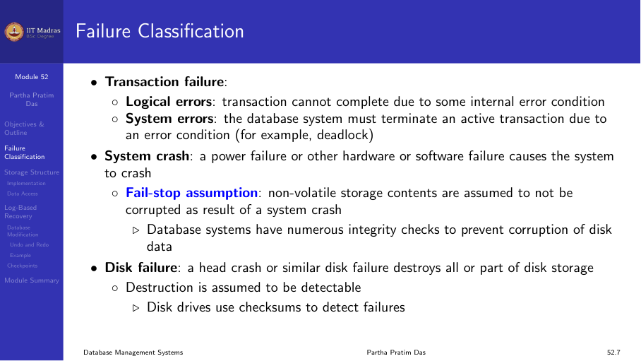

## Database system recovery

All database reads and writes occur within transactions. Transactions have
ACID properties:

- **Atomicity.** All or nothing.
- **Consistency.** Preserves database integrity.
- **Isolation.** Execute as if they were run alone.
- **Durability.** Committed changes persist.

Recovery algorithms ensure these properties in the face of failures.

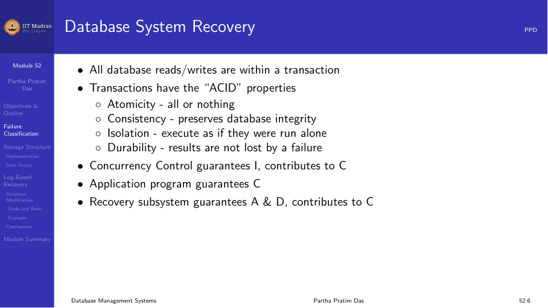

## Storage structure

Three levels of storage:

### Volatile storage

Does not survive system crashes. Examples: main memory, cache memory.

### Non-volatile storage

Survives system crashes. Examples: magnetic disk, SSD, flash storage.

### Stable storage

A resilient form of storage that survives all failures except catastrophic
disasters (e.g., fire, flood). Implemented by maintaining multiple copies
of each block on separate disks, possibly at remote sites.

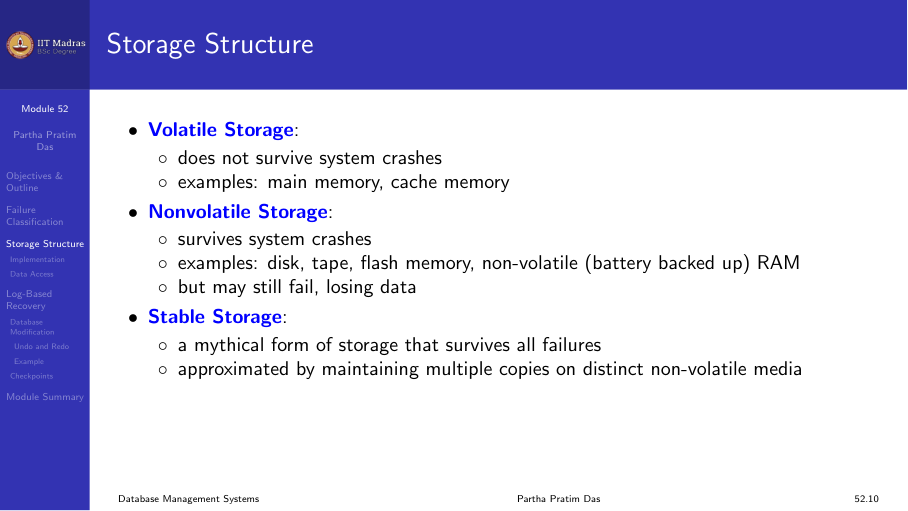

### Stable storage implementation

To protect against failures during data transfer:

1. Maintain multiple copies of each block on multiple disks.
2. After a failure, check for inconsistent blocks (where copies differ).
3. Recover inconsistent blocks by copying from a consistent copy.

This approach provides very high reliability, though it does not protect
against catastrophic disasters.

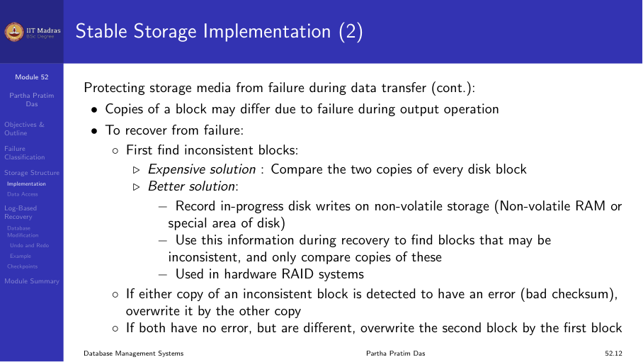

## Data access

Physical blocks reside on disk. System buffer blocks reside temporarily in
main memory.

Two operations move blocks between disk and memory:

- **input(B).** Transfers physical block B to main memory.
- **output(B).** Transfers buffer block B to disk.

Each transaction Tᵢ has a private work area with local copies of data items
it accesses. Local copy of data item X is denoted by xᵢ. Bx denotes the
block containing X.

Transfer between buffer and work area:

- **read(X).** Assigns X to xᵢ after performing input(Bx) if necessary.
- **write(X).** Assigns xᵢ to X after performing output(Bx) if necessary.

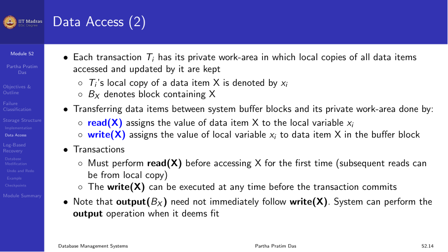

## Recovery and atomicity

To ensure atomicity despite failures, we first output information
describing the modifications to stable storage *without* modifying the
database itself. This information is recorded in a log.

If a failure occurs, the log is used to undo incomplete transactions and
redo committed ones.


## Log-based recovery

A log is kept on stable storage. The log is a sequence of log records that
maintains information about update activities on the database.

When transaction Tᵢ starts, it registers by writing `<Tᵢ start>` to the
log.

Before Tᵢ executes write(X), a log record `<Tᵢ, X, V₁, V₂>` is written,
where V₁ is the old value of X and V₂ is the new value.

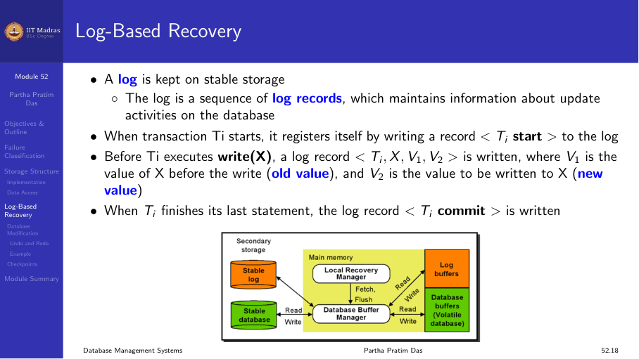

### Database modification schemes

**Immediate-modification scheme.** Allows updates of an uncommitted
transaction to be made to the buffer or disk before the transaction
commits. The update log record must be written *before* the database item
is written (write-ahead logging).

Output of updated blocks to disk can happen at any time before or after
commit.

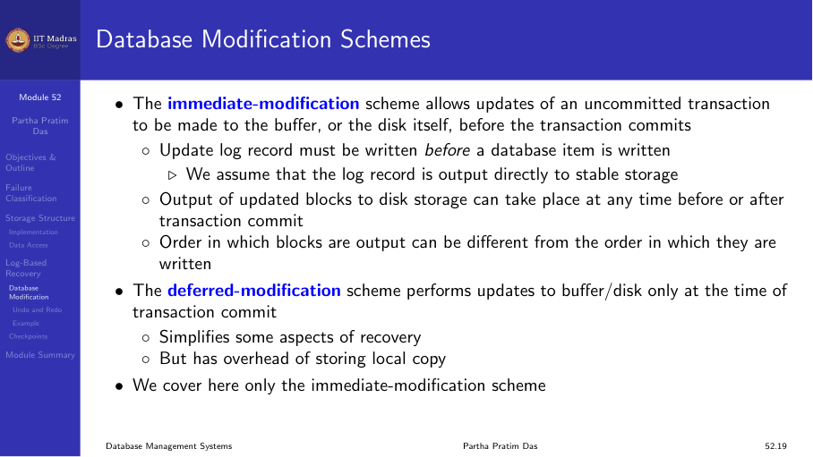

### Transaction commit

A transaction is said to have committed when its commit log record
`<Tᵢ commit>` is output to stable storage. All previous log records of the
transaction must have been output already.

Writes performed by a transaction may still be in the buffer when the
transaction commits, and may be output later.

### Example

```
<T₁ start>
<T₁, A, 1000, 950>    A goes from 1000 to 950
<T₁, B, 2000, 2050>   B goes from 2000 to 2050
<T₁ commit>
```

If a crash occurs after writing the log but before outputting A=950 to
disk, the log record ensures the change can be redone during recovery.

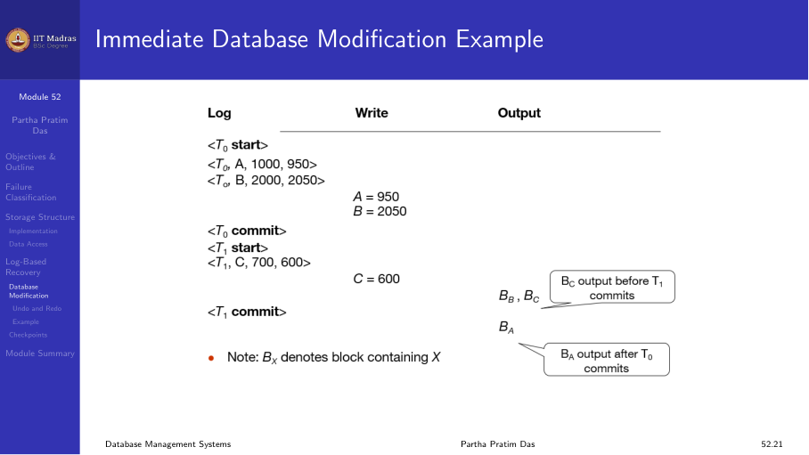

## Undo and redo operations

- **Undo** of a log record `<Tᵢ, X, V₁, V₂>` writes the old value V₁ to X.
- **Redo** of a log record `<Tᵢ, X, V₁, V₂>` writes the new value V₂ to X.

### Undo of transactions

undo(Tᵢ) restores all data items updated by Tᵢ to their old values,
scanning backwards from the last log record of Tᵢ.

### Use cases

- Undo is used for transaction rollback during normal operation (e.g., if a
  transaction cannot complete due to a logical error).
- Both undo and redo are used during recovery from failure.
- Recovery algorithms must handle the case where another failure occurs
  during recovery.

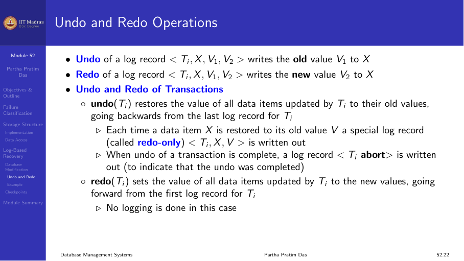

### Undo on normal transaction rollback

1. Scan log backwards from the end.
2. For each log record of Tᵢ of the form `<Tᵢ, Xⱼ, V₁, V₂>`:
   a. Perform undo by writing V₁ to Xⱼ.
   b. Write a log record `<Tᵢ, Xⱼ, V₁>` (compensation log record).

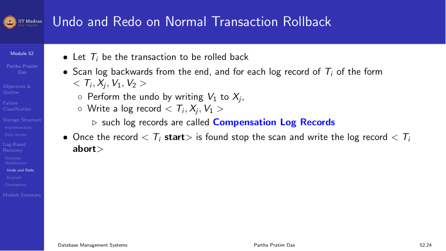

### Undo and redo on recovery from failure

When recovering after a failure:

- **Transaction Tᵢ needs to be undone** if the log contains `<Tᵢ start>`
  but does NOT contain `<Tᵢ commit>` or `<Tᵢ abort>`.
- **Transaction Tⱼ needs to be redone** if the log contains both
  `<Tⱼ start>` and `<Tⱼ commit>` (or `<Tⱼ abort>`).

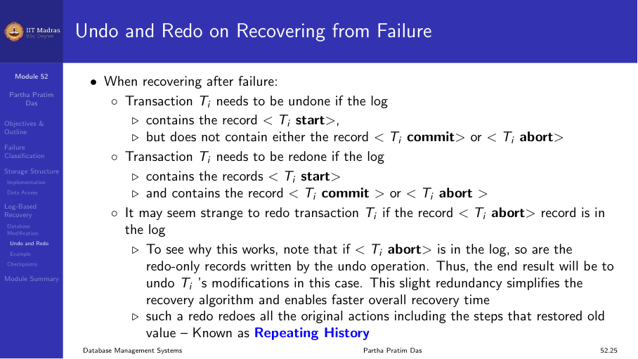

## Summary

- Failures include transaction failures, system crashes, and disk failures.
- Three storage levels: volatile, non-volatile, and stable.
- The log records all updates before they are applied to the database.
- Undo reverses uncommitted changes; redo replays committed changes.
- Recovery uses the log to determine which transactions to undo or redo.
