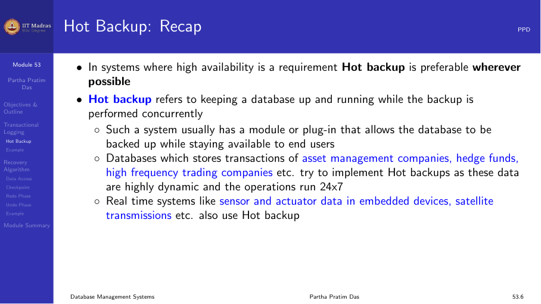
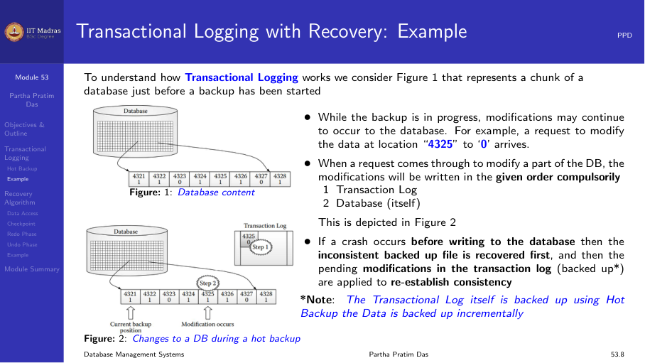
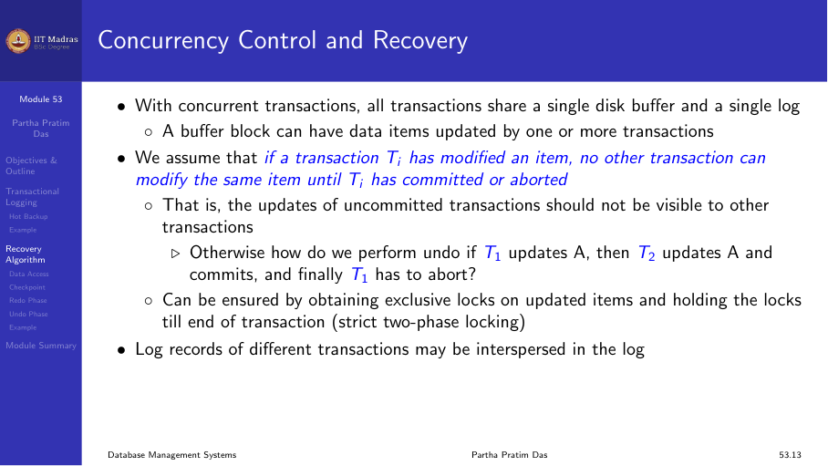
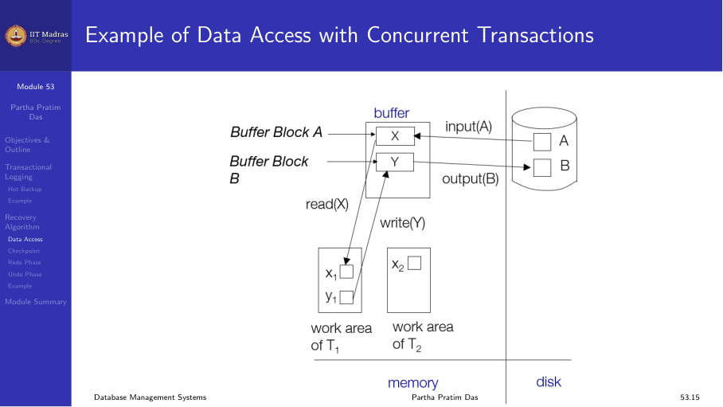
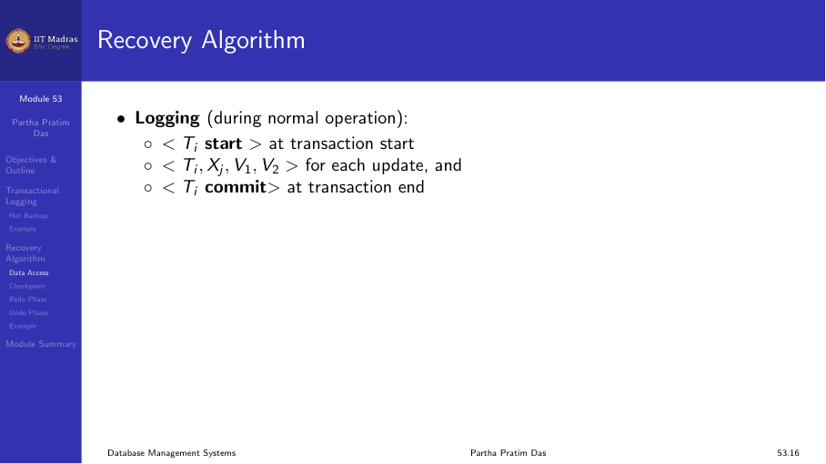
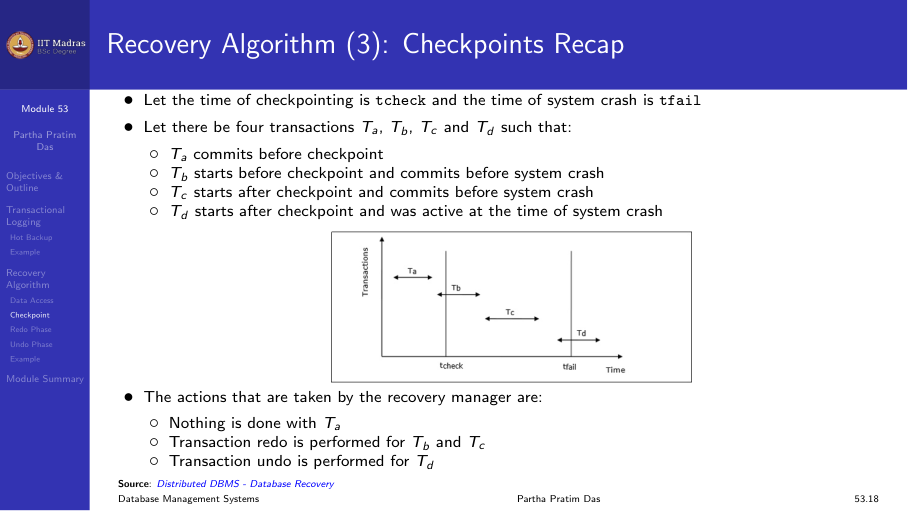
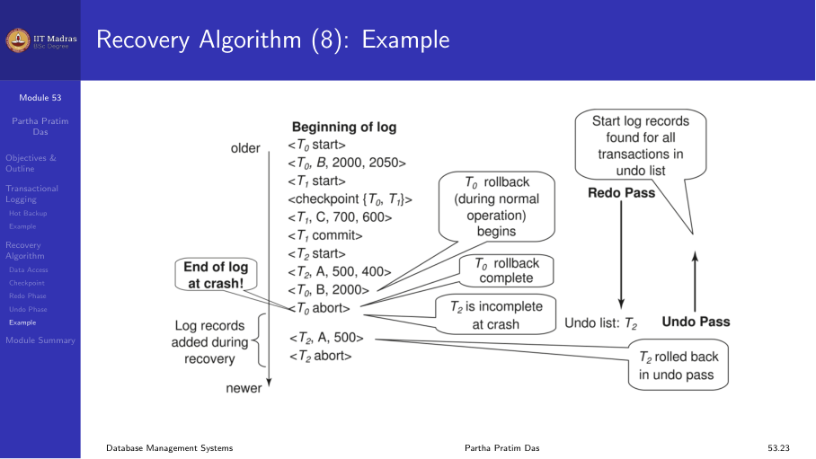

## Transactional logging as hot backup

Transactional logging is mainly used for transaction log backup. While a
possibly inconsistent backup is taken, the transaction log is separately
backed up. During recovery, the log is replayed to bring the database to a
consistent state.

Cold backup strategies (differential, incremental) are preferred for data
backup, but transactional logging handles the consistency aspect.



### Example

Consider a database where a backup is in progress. While the backup runs,
modifications may continue to occur. For example, a request to modify data
at location 4325 to '0' arrives during backup.

1. The backup copies the database files.
2. After the file copy, a second request modifies location 4321 to '0'.
3. The system crashes.

During recovery:
- **Recover.** Retrieve database files and transaction logs from backup.
- **Restore.** Reapply consistency based on transaction logs.

The recovered files are inconsistent (they contain some pre-crash
modifications but not others). The transaction log is replayed to reach
consistency.



## Recovery algorithm

### Concurrency control and recovery

With concurrent transactions, all transactions share a single disk buffer
and a single log. A buffer block can have data items updated by one or
more transactions.

If a transaction Tᵢ has modified an item, no other transaction can modify
the same item until Tᵢ has committed or aborted.



### Data access with concurrent transactions

Each transaction reads data from shared buffer blocks into its private work
area, modifies it, and writes back. Multiple transactions may have data
items in the same buffer block, but they access different items.



### Logging during normal operation

During normal operation, the system writes the following log records:

1. `<Tᵢ start>` — at transaction start.
2. `<Tᵢ, Xⱼ, V₁, V₂>` — for each update (old value, new value).
3. `<Tᵢ commit>` — at transaction commit.

### Transaction rollback during normal operation

1. Scan log backwards from the end.
2. For each log record of Tᵢ of the form `<Tᵢ, Xⱼ, V₁, V₂>`:
   a. Perform undo by writing V₁ to Xⱼ.
   b. Write a compensation log record `<Tᵢ, Xⱼ, V₁>`.



### Checkpoints

A checkpoint is a point at which the system writes all modified buffer
blocks to disk. This reduces the amount of work needed during recovery.

Consider four transactions Tₐ, T_b, T_c, T_d:

| Transaction | Starts before checkpoint | Commits before crash |
|-------------|-------------------------|---------------------|
| Tₐ | Yes | Yes (before checkpoint) |
| T_b | Yes | Yes (after checkpoint) |
| T_c | No | Yes |
| T_d | No | No |

- Tₐ: No recovery needed (committed and written to disk before checkpoint).
- T_b: Must be redone (committed after checkpoint).
- T_c: Must be redone (committed after checkpoint).
- T_d: Must be undone (did not commit).



### Redo phase

1. Find the last `<checkpoint L>` record and set undo-list to L.
2. Scan forward from that checkpoint record.
3. Whenever a record `<Tᵢ, Xⱼ, V₁, V₂>` is found, redo it by writing V₂ to
   Xⱼ.
4. Whenever `<Tᵢ start>` is found, add Tᵢ to undo-list.
5. Whenever `<Tᵢ commit>` or `<Tᵢ abort>` is found, remove Tᵢ from
   undo-list.

### Undo phase

1. Scan log backwards from the end.
2. Whenever a log record `<Tᵢ, Xⱼ, V₁, V₂>` is found where Tᵢ is in
   undo-list:
   a. Perform undo by writing V₁ to Xⱼ.
   b. Write a compensation log record `<Tᵢ, Xⱼ, V₁>`.

### Example

Consider a log with the following records at crash time:

```
... <checkpoint {T₁, T₂}> ... <T₁ commit> ... <T₂> ... <T₃ start> ... (crash)
```

- Redo phase: replay all updates from the checkpoint forward.
- T₁ committed, so remove from undo-list.
- T₂ did not commit, keep in undo-list.
- T₃ started but did not commit, keep in undo-list.
- Undo phase: undo updates of T₂ and T₃.



## Summary

- Transactional logging replays the log to restore consistency.
- The recovery algorithm has two phases: redo (replay all updates) and
  undo (reverse incomplete transactions).
- Checkpoints reduce the amount of log that must be processed during
  recovery.
- Transactions that committed before the checkpoint need no recovery.
