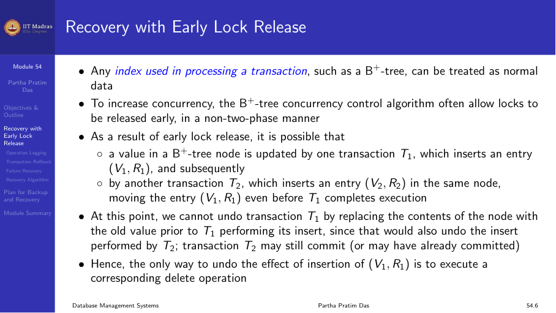
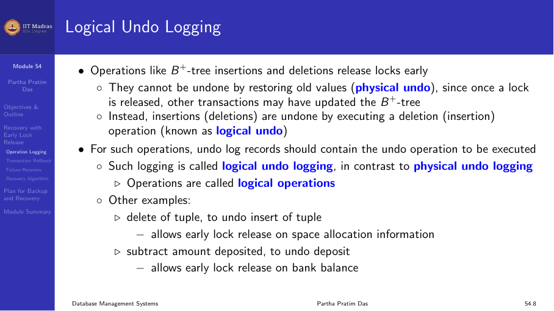
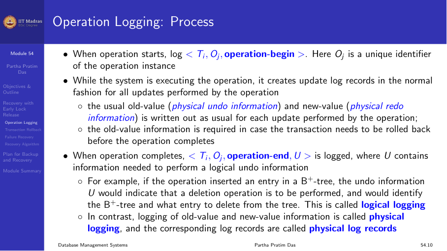
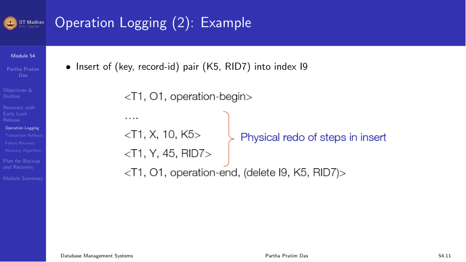
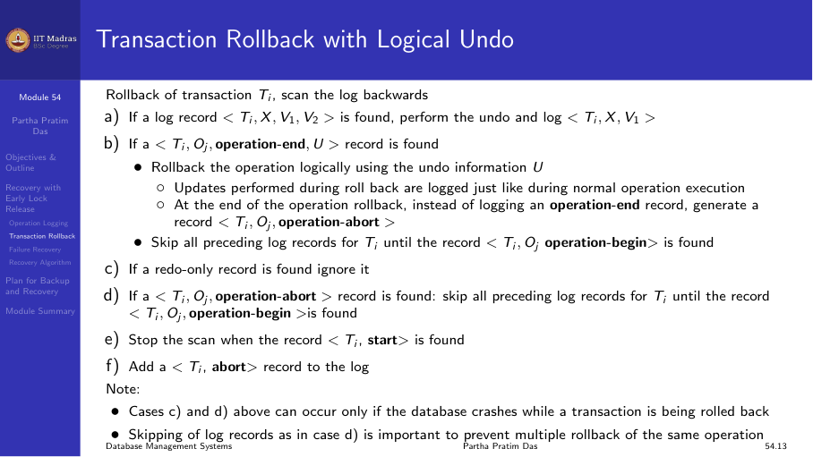
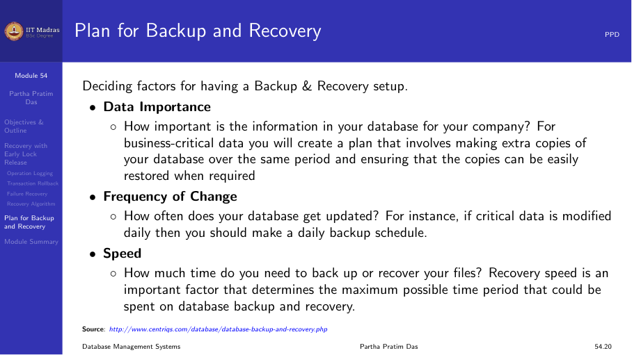
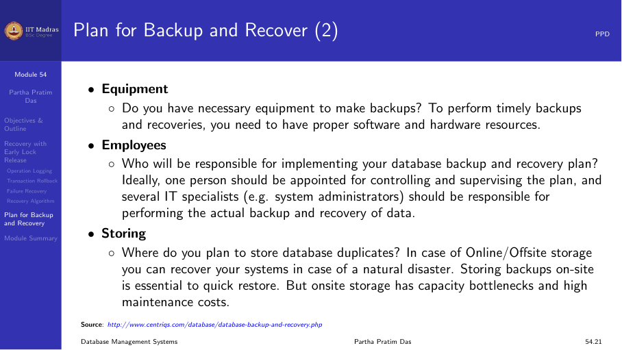

## Recovery with early lock release

Standard two-phase locking requires that all locks be held until the
transaction commits. However, some data structures (like B+ trees) can
benefit from releasing locks early to increase concurrency.

B+ tree concurrency control algorithms often allow locks to be released
early, in a non-two-phase manner. As a result, it is possible that after a
transaction releases a lock, another transaction modifies the same data
item. This complicates recovery.



### Logical undo

When locks are released early, operations like B+ tree insertions and
deletions cannot be undone by simply restoring old values (physical undo).
Once a lock is released, other transactions may have updated the B+ tree,
and restoring old values would corrupt the structure.

Instead, insertions are undone by executing a deletion operation, and
deletions are undone by executing an insertion operation. This is called
**logical undo** — the inverse operation is applied rather than restoring
the old state.

Support for high-concurrency locking techniques that release locks early
requires:

1. **Logical undo.** Reverse operations by executing inverse operations.
2. **Repeating history.** Recovery executes the same operations again to
   reach the current state.



### Physical redo

While undo is logical, redo is physical. Redo information is logged
physically (the new value for each write) even for operations with logical
undo.

Logical redo would be very complicated because the database state on disk
may not be "operation consistent" when recovery starts. Physical redo
logging does not conflict with early lock release.

## Operation logging

When an operation starts, the system logs `<Tᵢ, Oⱼ, operation-begin>`.
Here Oⱼ is a unique identifier of the operation instance.

While the system executes the operation, it creates update log records in
the normal fashion for all updates performed by the operation.

When the operation completes, it logs `<Tᵢ, Oⱼ, operation-end, U>`, where
U is the logical undo information.



### Example: Insert into a B+ tree

Insert of (key, record-id) pair (K5, RID7) into index I9:

```
<T₁, O₁, operation-begin>
<T₁, X, 10, K5>          Physical redo of steps in insert
<T₁, Y, 45, RID7>
<T₁, O₁, operation-end, (delete I9, K5, RID7)>
```

The operation-end record contains the logical undo information: to undo
this insert, delete (K5, RID7) from I9.



### Crash during operation

If a crash or rollback occurs before the operation completes:

- The operation-end log record is not found.
- Physical undo information is used to undo the operation.

If a crash occurs after the operation completes:

- The operation-end log record is found.
- Logical undo is used to reverse the operation.

### Transaction rollback with logical undo

During rollback of transaction Tᵢ, scan the log backwards:

1. If a log record `<Tᵢ, X, V₁, V₂>` is found, perform physical undo and
   log `<Tᵢ, X, V₁>`.
2. If a `<Tᵢ, Oⱼ, operation-end, U>` record is found, roll back the
   operation logically using the undo information U. Updates during
   logical rollback are logged normally.



### Recovery algorithm with logical undo

The algorithm is similar to the standard recovery algorithm, with changes
to how the undo phase handles operation log records:

**Redo phase:** Scan log forward from the last checkpoint to the end.
Repeat history by physically redoing all updates of all transactions.

**Undo phase:** Scan log backwards. For transactions in undo-list, process
log records as described for logical undo.

## Plan for backup and recovery

Planning for backup and recovery involves several factors:

### Data importance

How important is the information in your database for your company? For
business-critical data, create a plan that involves extra copies and
ensures that copies can be easily restored.

### Equipment

Do you have the necessary equipment to make backups? To perform timely
backups and recoveries, you need proper software and hardware resources.

### Employees

Who will be responsible for implementing your database backup and recovery
plan? Designated personnel should be trained in backup procedures and
recovery operations.



### Key considerations

1. **Recovery time objective (RTO).** How long can the system be down?
2. **Recovery point objective (RPO).** How much data loss is acceptable?
3. **Backup frequency.** How often should backups be taken?
4. **Storage location.** Should backups be on-site, off-site, or both?
5. **Testing.** Regularly test that backups can be restored successfully.



## Summary

- Early lock release improves concurrency but complicates recovery.
- Logical undo reverses operations by executing inverse operations.
- Operation logging tracks the begin and end of each operation.
- Physical redo and logical undo can coexist.
- Backup and recovery planning should consider data importance, equipment,
  personnel, RTO, and RPO.
