## Introduction

RAID (Redundant Array of Independent Disks) is a disk organization
technique that manages a large number of disks, providing a view of a
single disk of:

- **High capacity and high speed** by using multiple disks in parallel.
- **High reliability** by storing data redundantly, so that data can be
  recovered even if a disk fails.

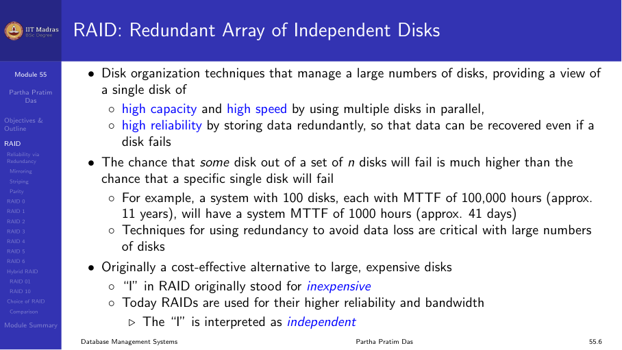

## Reliability via redundancy

### Mirroring

Store extra information (redundancy) that can be used to rebuild
information lost in a disk failure. In mirroring, each disk has an
identical copy.

Mean time to data loss depends on mean time to failure (MTTF) and mean
time to repair (MTTR). For example, MTTF of 100,000 hours and MTTR of 10
hours gives a combined MTTF much higher than a single disk.

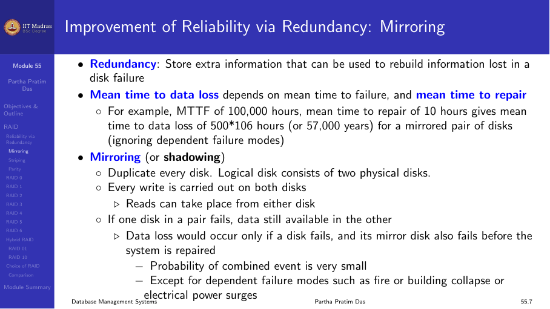

### Striping

**Bit-level striping.** Split the bits of each byte across multiple disks.
In an array of eight disks, write bit i of each byte to disk i. Each access
can read data at eight times the rate of a single disk. However, seek/access
time is worse. Bit-level striping is not used much anymore.

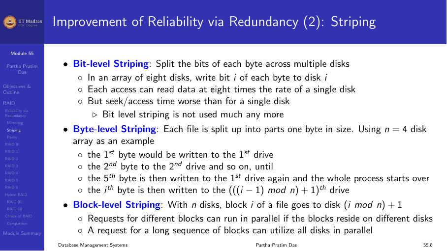

### Parity

**Bit-interleaved parity.** A single parity bit is enough for error
correction (not just detection) because we know which disk has failed.

When writing data, corresponding parity bits must also be computed and
written to a parity disk. To recover data in a damaged disk, compute XOR
of bits from other disks.

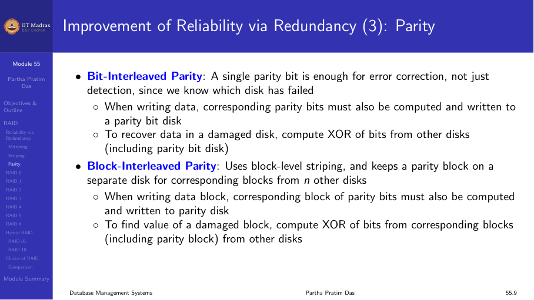

## Standard RAID levels

The most common RAID levels employ striping, mirroring, or parity:

### RAID 0: Striping

RAID 0 uses data striping only — no redundant information is maintained.
If one disk fails, all data in the array is lost. Space utilization is
100%.

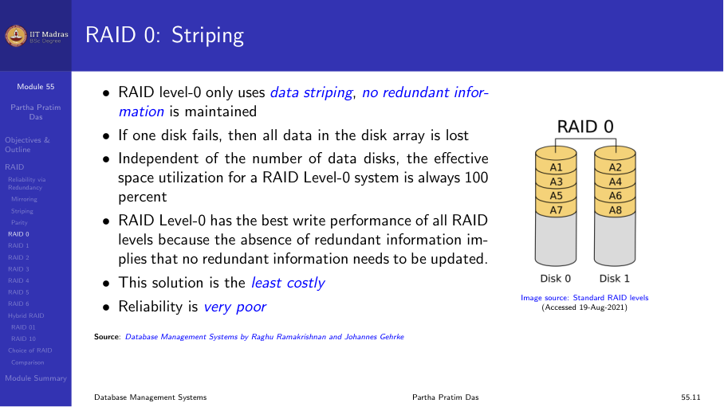

| Pros | Cons |
|------|------|
| Maximum storage capacity | No fault tolerance |
| Best write performance | Any disk failure destroys all data |

### RAID 1: Mirroring

RAID 1 employs mirroring, maintaining two identical copies of data on two
different disks. It provides excellent fault tolerance but is the most
expensive solution (50% capacity utilization).

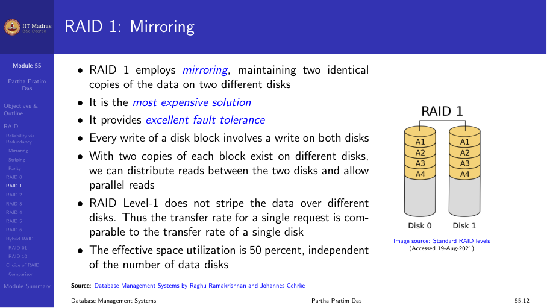

| Pros | Cons |
|------|------|
| Excellent fault tolerance | High cost (2x storage) |
| Fast reads (both copies can serve) | Write performance may be slower |

### RAID 2: Parity with Hamming code

RAID 2 uses a designated drive for parity with bit-level striping. Hamming
code is used for parity, which can detect up to two-bit errors or correct
one-bit errors.

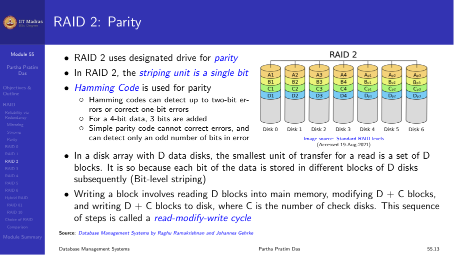

### RAID 3: Byte striping + parity

RAID 3 has a single check disk with parity information. It uses byte-level
striping. The reliability overhead is a single disk — the lowest possible.

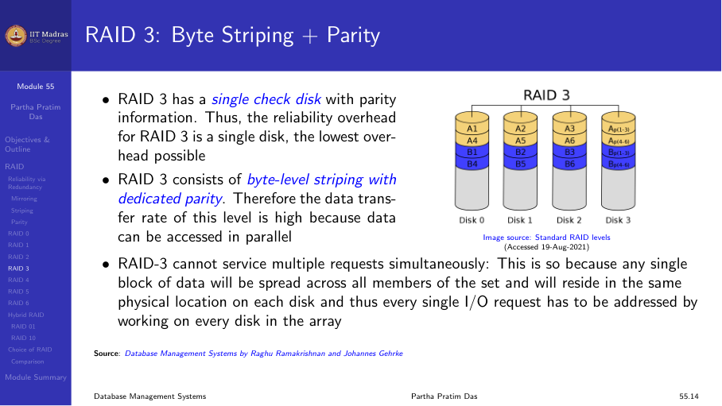

### RAID 4: Block striping + parity

RAID 4 has a striping unit of a disk block (not a single bit). Read
requests of block size can be served entirely by the disk where the
requested block resides.

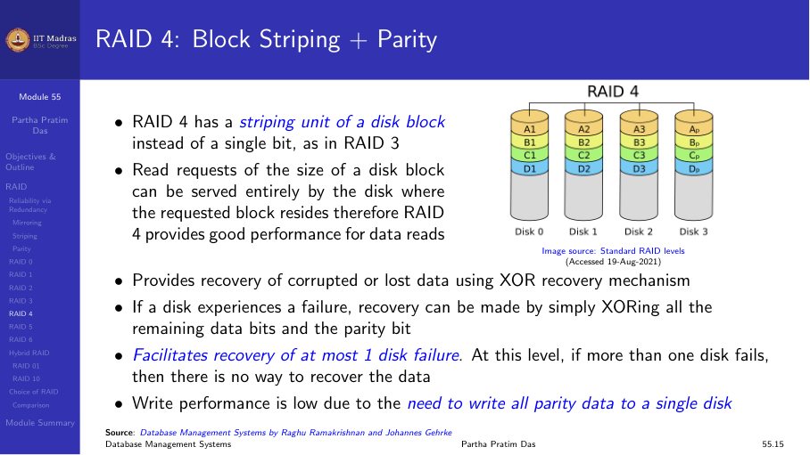

### RAID 5: Distributed parity

RAID 5 improves upon RAID 4 by distributing parity blocks uniformly over
all disks instead of storing them on a single check disk. Several write
requests can be processed in parallel.

Requires at least 3 disks. Can tolerate one disk failure.

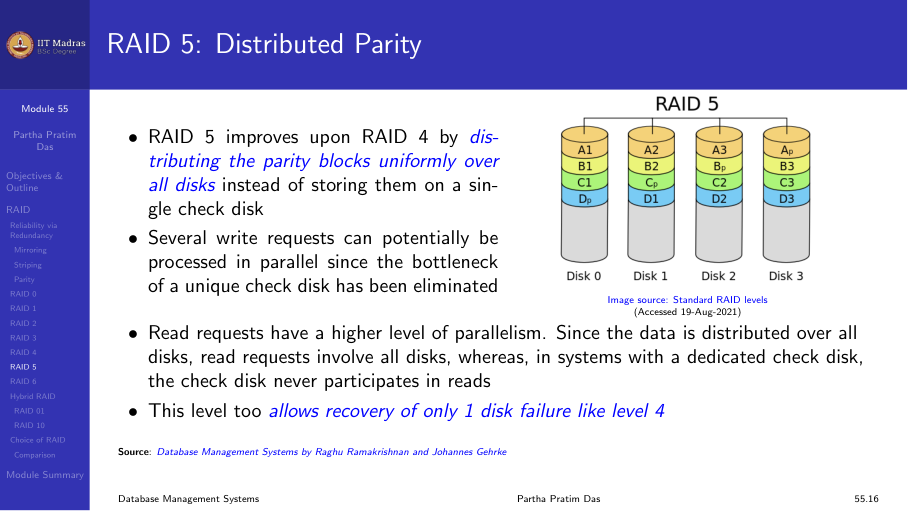

### RAID 6: Dual parity

RAID 6 extends RAID 5 by adding another parity block. It uses block-level
striping with two parity blocks distributed across all member disks. Can
tolerate two simultaneous disk failures.

Requires at least 4 disks.

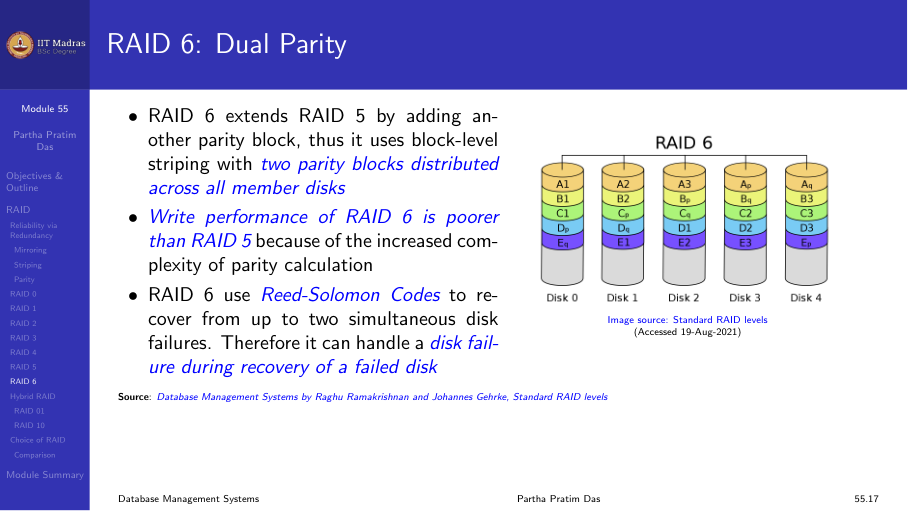

## Nested RAID levels

Nested RAID levels combine two or more standard levels to gain performance
and additional redundancy.

### RAID 01 (RAID 0+1): Mirror of stripes

A mirror of stripes. It achieves both replication and sharing of data. The
usable capacity is the same as RAID 1 (50%).

### RAID 10 (RAID 1+0): Stripe of mirrors

A stripe of mirrors. RAID 10 provides better throughput and latency than
all other levels. Requires a minimum of four drives. Can tolerate up to
one failure per mirrored pair.

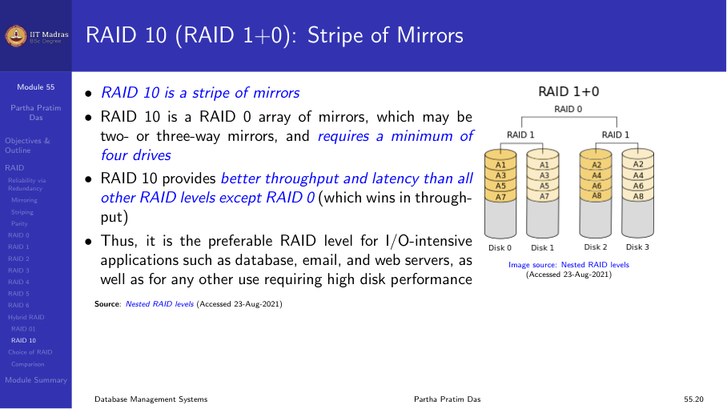

## Choice of RAID levels

Different RAID levels have different speed and fault tolerance properties:

| Level | Min drives | Fault tolerance | Read perf | Write perf | Capacity |
|-------|-----------|----------------|-----------|------------|----------|
| RAID 0 | 2 | None | Excellent | Excellent | 100% |
| RAID 1 | 2 | 1 drive | Good | Good | 50% |
| RAID 5 | 3 | 1 drive | Good | Moderate | (n-1)/n |
| RAID 6 | 4 | 2 drives | Good | Moderate | (n-2)/n |
| RAID 10 | 4 | Up to 1/pair | Excellent | Good | 50% |

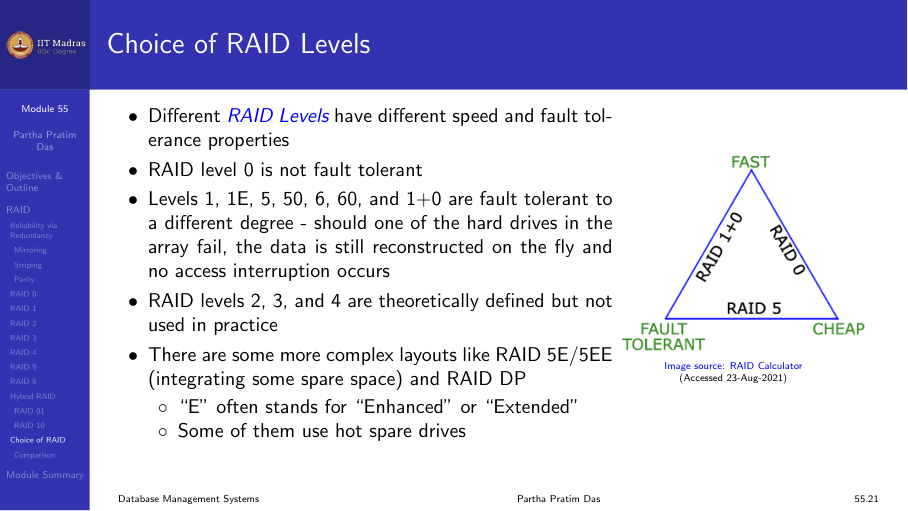

### Factors in choosing RAID level

1. **Monetary cost.** RAID 1 is most expensive; RAID 0 cheapest but no
   redundancy.
2. **Performance.** Number of I/O operations per second and bandwidth
   during normal operation.
3. **Write performance.** RAID 1 provides much better write performance
   than RAID 5. RAID 5 requires at least 2 block reads and 2 block writes
   to write a single block, whereas RAID 1 requires only 2 block writes.
4. **Use case.** RAID 1 is preferred for high-update environments such as
   log disks. RAID 5/6 is preferred for large read-heavy data stores.

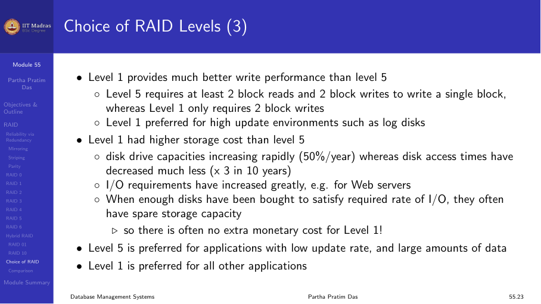

### Comparison

| Level | Description | Space efficiency | Fault tolerance | Read | Write |
|-------|-------------|-----------------|----------------|------|-------|
| 0 | Block striping | 100% | None | Fast | Fast |
| 1 | Mirroring | 50% | Single drive | Fast | Moderate |
| 5 | Distributed parity | (n-1)/n | Single drive | Fast | Slow |
| 6 | Dual parity | (n-2)/n | Two drives | Fast | Slow |
| 10 | Mirror + stripe | 50% | Up to 1/pair | Fast | Fast |

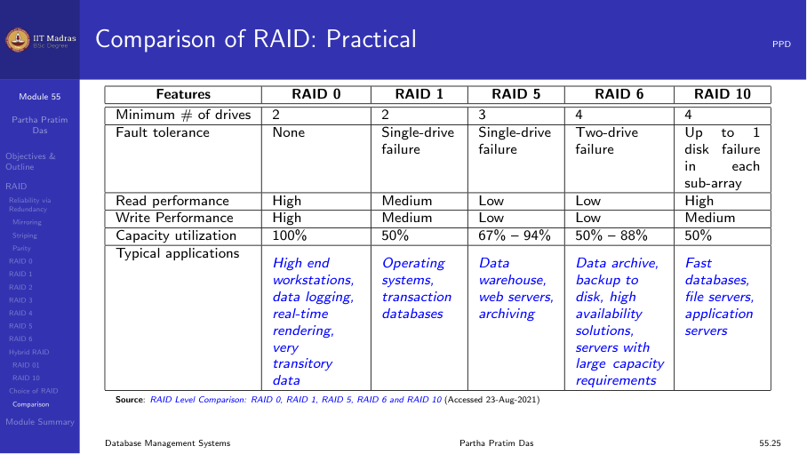

## Summary

- RAID uses multiple disks for improved performance and reliability.
- RAID 0 (striping): maximum capacity, no fault tolerance.
- RAID 1 (mirroring): excellent fault tolerance, 50% capacity.
- RAID 5 (distributed parity): good balance of capacity and fault
  tolerance.
- RAID 6 (dual parity): tolerates two disk failures.
- RAID 10: combines mirroring and striping for best performance.
- Choice depends on cost, performance, and reliability requirements.
