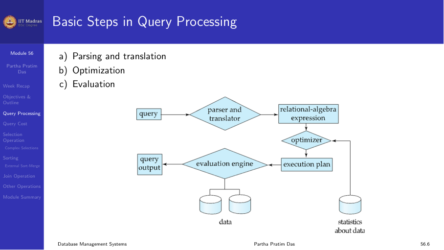
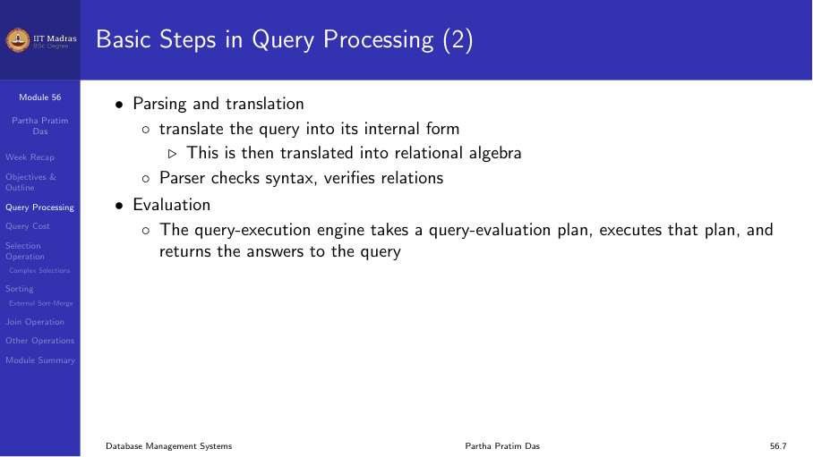
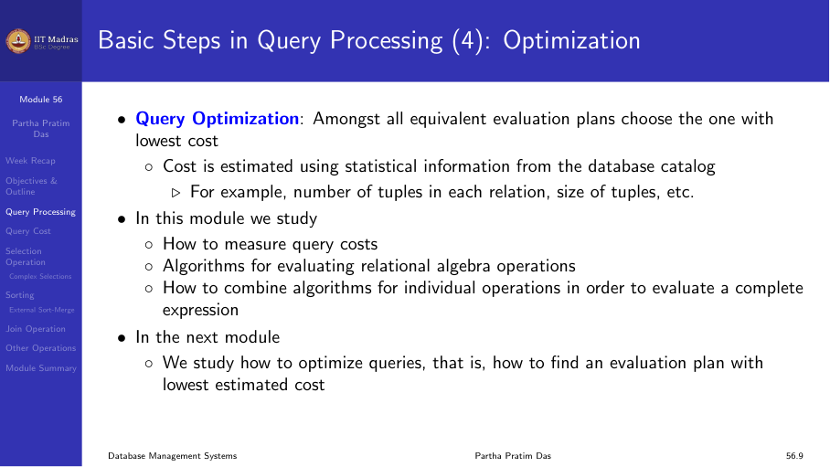
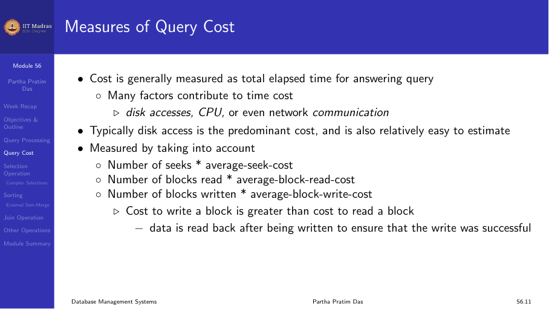
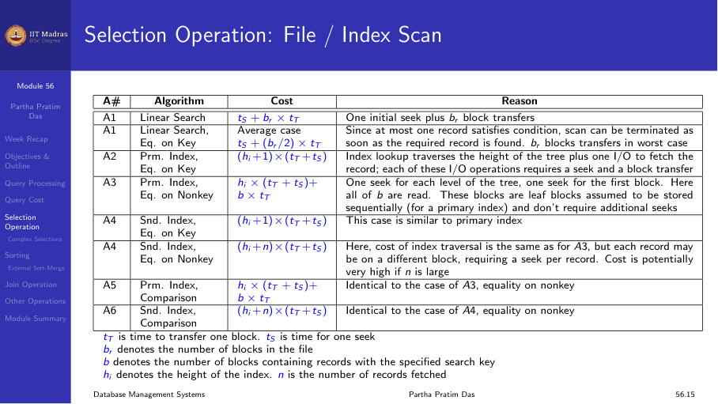
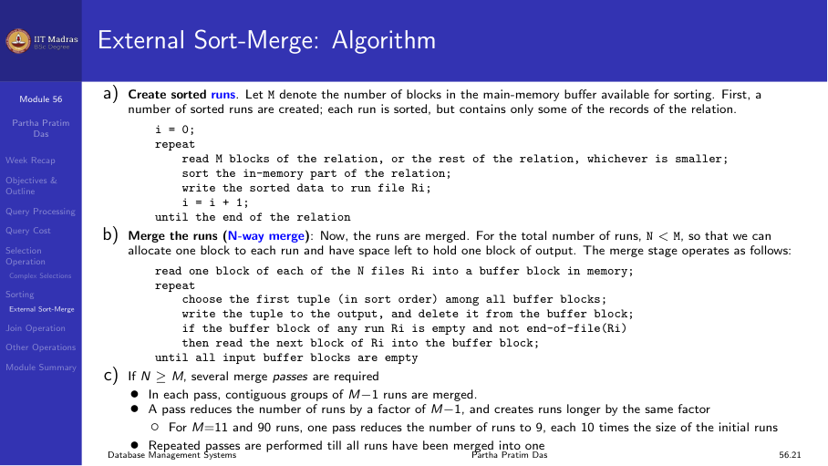
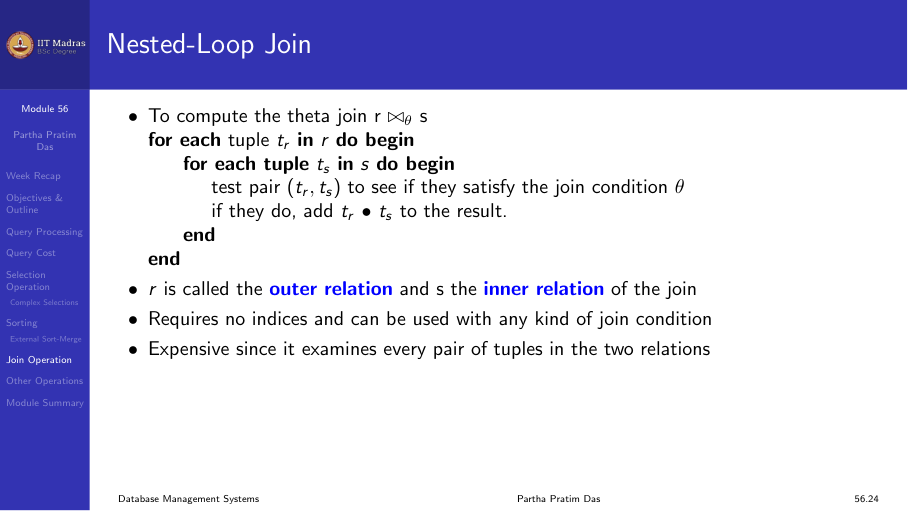

## Overview

Query processing is the set of activities involved in extracting data from
a database. It consists of three main steps:

1. **Parsing and translation.** The query is translated from SQL into an
   internal form (relational algebra).
2. **Optimization.** Among all equivalent evaluation plans, choose the one
   with the lowest cost.
3. **Evaluation.** The chosen plan is executed.



### Parsing and translation

The parser checks the SQL syntax, verifies that the relations and
attributes exist, and translates the query into relational algebra. This
internal representation is then passed to the optimizer.



### Optimization

Consider the query:

```sql
SELECT salary FROM instructor WHERE salary < 75000;
```

This can be evaluated in multiple ways:
- Scan the entire instructor table and check each tuple.
- Use an index on salary to directly locate qualifying tuples.

The optimizer estimates the cost of each alternative and picks the best
one. Cost is estimated using statistical information from the catalog:
number of tuples in each relation, size of tuples, etc.



## Measures of query cost

Cost is generally measured as total elapsed time for answering a query.
Many factors contribute:

- **Disk accesses.** The predominant cost, and relatively easy to estimate.
- **CPU time.** Processing of tuples and expression evaluation.
- **Network communication.** For distributed queries.

For simplicity, we use the number of block transfers from disk and the
number of seeks as the cost measures:

- tᵣ: time to transfer one block.
- tₛ: time for one seek.

Several algorithms can reduce disk I/O by using extra buffer space. The
amount of real memory available depends on other concurrent queries and is
only known during execution. We often use worst-case estimates.



## Selection operation

Several algorithms implement the selection operation:

| Algorithm | Cost | Notes |
|-----------|------|-------|
| Linear search | tₛ + bᵣ × tᵣ | One seek + all blocks of r |
| Linear search, equality on key | tₛ + (bᵣ / 2) × tᵣ | Average case, stop when found |
| B+ tree index, equality on key | (h + 1) × (tₛ + tᵣ) | h = height of tree |
| B+ tree index, comparison | (h + number of matching) × (tₛ + tᵣ) | For range queries |

### Complex selections

**Conjunction** (σ₀₁ ∧ ₀₂ ∧ ... ∧ ₀ₙ(r)):
- Select a combination of conditions that results in the least cost.
- Use the most selective condition first, then check remaining conditions
  in memory.

**Disjunction** (σ₀₁ ∨ ₀₂ ∨ ... ∨ ₀ₙ(r)):
- If all conditions have available indices, take the union of identifiers.
- Otherwise, use linear scan.



## Sorting

Sorting is needed for ORDER BY queries and for join algorithms (sort-merge
join). For relations that fit in memory, standard in-memory sorting can be
used. For large relations, external sort-merge is required.

### External sort-merge

1. **Create sorted runs.** Read M blocks at a time (M = available buffer
   blocks), sort in memory, and write each sorted run to disk.
2. **Merge runs.** Merge the sorted runs in multiple passes until one
   sorted output remains.

### Cost analysis

With bᵣ blocks and M buffer blocks:
- Number of initial runs: ⌈bᵣ / M⌉
- Number of merge passes: ⌈log_{M-1} (bᵣ / M)⌉
- Total block transfers: bᵣ × (2 + number of merge passes)
- Total seeks: 2 × ⌈bᵣ / M⌉ + (number of merge passes) × ⌈bᵣ / M⌉



## Join operation

Several algorithms implement joins. The choice depends on the sizes of the
relations and available indices.

### Nested-loop join

For each tuple tᵣ in r, check all tuples tₛ in s:

```
for each tuple tᵣ in r:
    for each tuple tₛ in s:
        if (tᵣ, tₛ) satisfies join condition, add to result
```

Worst-case cost (only one block of each in memory): nᵣ × bₛ + bᵣ block
transfers, plus nᵣ + bᵣ seeks.

If the smaller relation fits entirely in memory, use that as the inner
relation to minimize cost.



### Block nested-loop join

Process blocks instead of tuples:

```
for each block Bᵣ in r:
    for each block Bₛ in s:
        for each tuple tᵣ in Bᵣ:
            for each tuple tₛ in Bₛ:
                ...
```

Cost: bᵣ × bₛ + bᵣ block transfers (much better than N×M!).

### Indexed nested-loop join

If an index exists on the inner relation's join attribute, use it instead
of scanning the entire inner relation. Cost reduces dramatically,
especially for large inner relations.

## Summary

- Query processing consists of parsing, optimization, and evaluation.
- Cost is measured in terms of block transfers and seeks.
- Selection can use linear scan or various index structures.
- Sorting large relations requires external sort-merge.
- Join algorithms range from nested-loop to indexed nested-loop, with
  significant cost differences.
