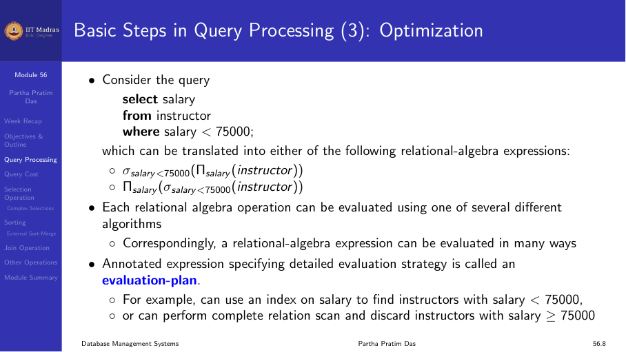

## Query processing steps

When a query is submitted, the database system processes it through several
stages:
1. **Parsing and translation.** Convert SQL to an internal representation.
2. **Optimization.** Choose the most efficient execution plan.
3. **Evaluation.** Execute the plan and return results.

## Query cost

Query cost is measured in terms of:
- Number of disk accesses (I/O operations).
- CPU time.
- Memory usage.
- Network overhead (for distributed databases).

Disk I/O dominates in most database systems.

## Selection operation

Different algorithms implement the selection (WHERE) operation:

- **Linear scan.** Read every block, check the condition. Good when no
  index exists or when many records qualify.
- **Index scan.** Use an index (B+-tree or hash) to locate qualifying
  records. Good for selective queries.

## Sorting: external sort-merge

When data does not fit in memory, external sorting is needed. The
external sort-merge algorithm:
1. Create sorted runs of data in memory.
2. Write each run to disk.
3. Merge runs in parallel.

## Join operation

Join is the most expensive operation in query processing. Algorithms:
- **Nested-loop join.** O(n × m) for tables of size n and m.
- **Indexed nested-loop join.** Use an index on the inner table.
- **Merge join.** Sort both tables, then merge.
- **Hash join.** Partition tables using a hash function.
