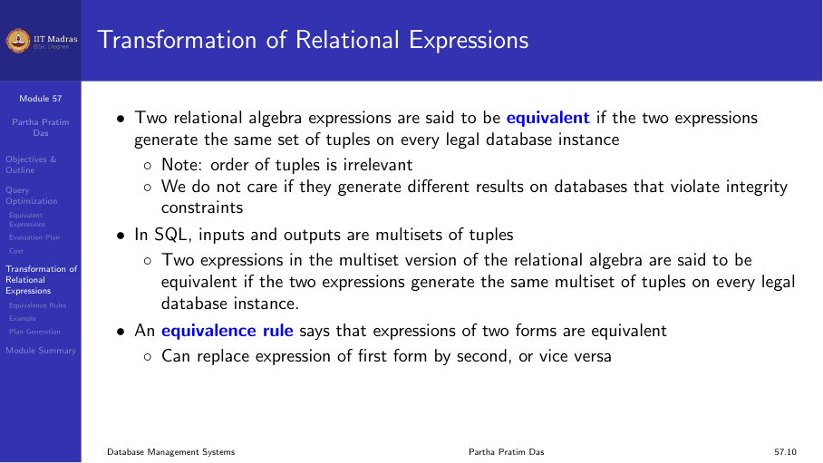

## Query optimization

The query optimizer finds the most efficient execution plan among many
equivalent plans. It considers different join orders, access methods, and
algorithm choices.

## Equivalent expressions

Relational algebra expressions can be transformed into equivalent forms
using rules:

- **Selection pushdown.** Apply selections as early as possible.
- **Projection pushdown.** Reduce the number of columns early.
- **Join reordering.** Different join orders can have vastly different
  costs.

## Evaluation plan

An evaluation plan specifies:
- The algorithm for each operation.
- The order of operations.
- The access methods (index scan, full scan).
- Materialization vs pipelining.

## Cost-based optimization

The optimizer estimates the cost of each plan using:
1. **Statistical metadata.** Table cardinalities, attribute distributions,
   index sizes.
2. **Cost formulas.** Estimates for each operation based on statistical
   metadata.
3. **Plan enumeration.** Generate and compare candidate plans.

## Transformation rules

Common heuristic transformations:
- Perform selections early to reduce intermediate results.
- Perform projections early to reduce tuple sizes.
- Replace Cartesian products followed by selections with joins.
- Combine multiple selections into a single scan.
