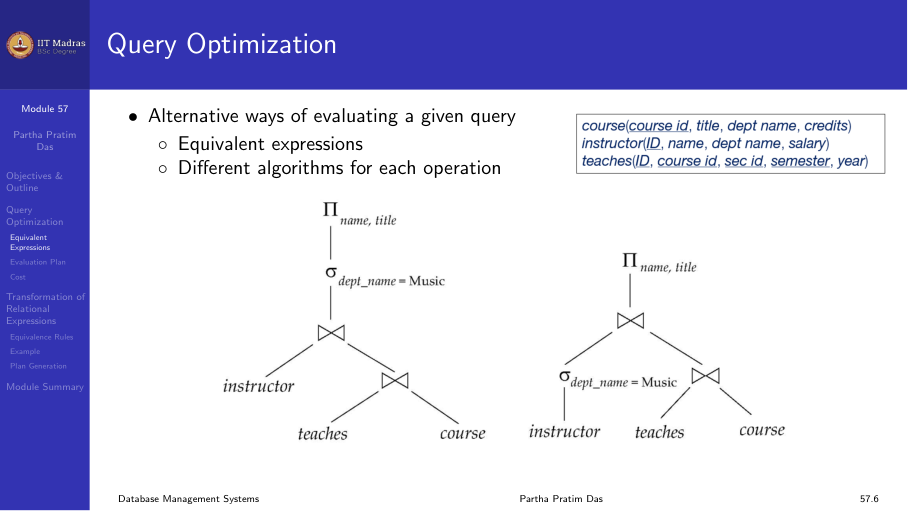
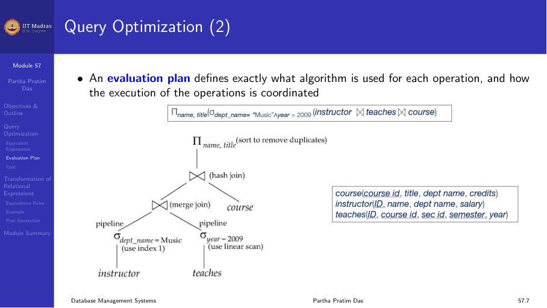
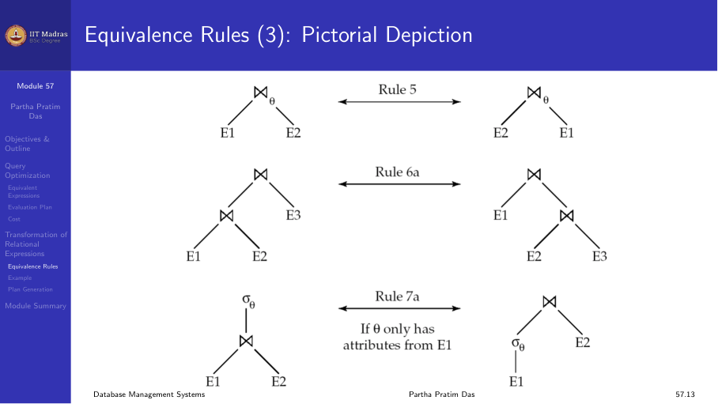
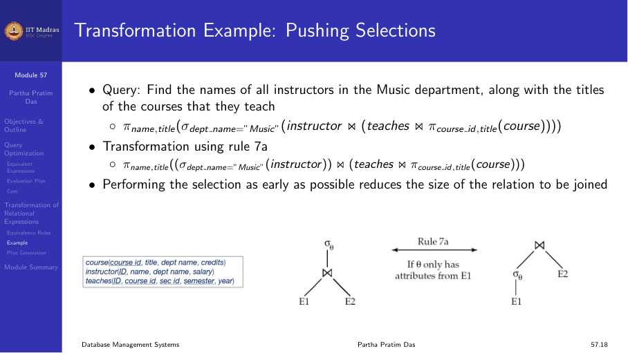
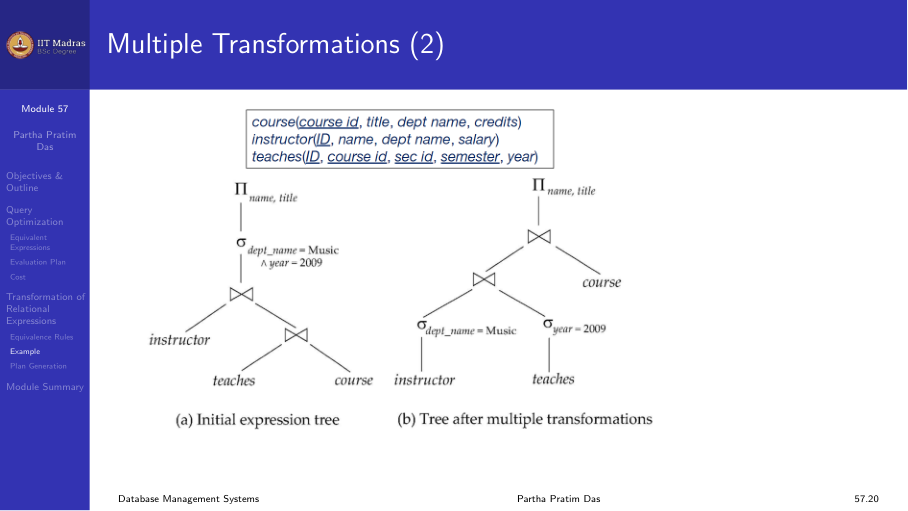
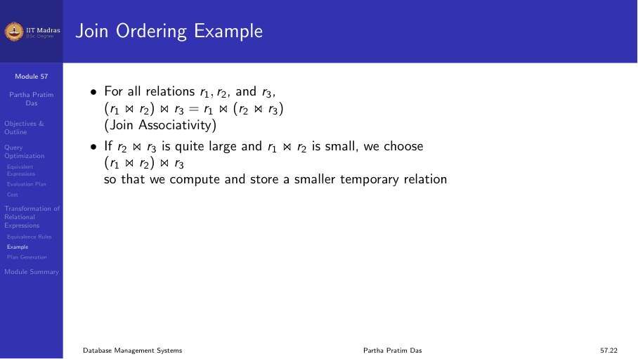
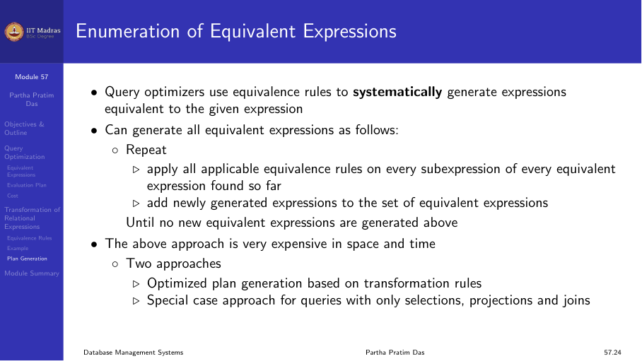

## Introduction

For a given query, there are many alternative evaluation plans. These
differ in:

1. The order of operations (which join to perform first).
2. The algorithm used for each operation (nested-loop vs. hash join).
3. The use of indexes.

The cost difference between evaluation plans can be enormous — seconds
versus days in some cases.



### Evaluation plan

An evaluation plan defines exactly what algorithm is used for each
operation, and how the execution of the operations is coordinated.

Example: Find the names of all instructors in the Music department, along
with the titles of the courses they teach:

```
Π_name, title (σ_dept-name="Music" (instructor ⋈ teaches ⋈ course))
```

The optimizer may choose to:
- Apply the selection first (reduce instructor tuples).
- Choose different join orders.
- Use nested-loop or hash join depending on sizes.



## Transformation of relational expressions

Two relational algebra expressions are equivalent if they generate the
same set of tuples on every legal database instance. The order of tuples
is irrelevant.

The optimizer uses equivalence rules to transform one expression into
another, cheaper one.


## Equivalence rules

### Rule 1: Cascading selection

Conjunctive selection operations can be deconstructed into a sequence of
individual selections:

σ₀₁ ∧ ₀₂ (E) = σ₀₁ (σ₀₂ (E))

### Rule 2: Selection commutativity

Selection operations are commutative:

σ₀₁ (σ₀₂ (E)) = σ₀₂ (σ₀₁ (E))

### Rule 5: Theta-join commutativity

Theta-join (and natural join) are commutative:

E₁ ⋈₀ E₂ = E₂ ⋈₀ E₁

### Rule 6: Join associativity

Natural join is associative:

(E₁ ⋈ E₂) ⋈ E₃ = E₁ ⋈ (E₂ ⋈ E₃)



### Rule 7: Selection distribution over join

Selection distributes over theta-join when all attributes in the selection
condition involve only attributes of one of the joined expressions:

σ₀ (E₁ ⋈ E₂) = (σ₀ (E₁)) ⋈ E₂   (if 0 involves only attributes of E₁)

This is called **pushing selections** — applying selection early reduces
the size of intermediate results.

### Rule 8: Projection distribution over join

Projection distributes over theta-join. Only the attributes needed for the
join and the final result need to be kept:

Π_{L₁ ∪ L₂} (E₁ ⋈₀ E₂) = (Π_{L₁}(E₁)) ⋈₀ (Π_{L₂}(E₂))

This is called **pushing projections** — reducing the size of tuples early.


### Rule 9: Set operation commutativity

Union and intersection are commutative:

E₁ ∪ E₂ = E₂ ∪ E₁  (set difference is not commutative)

## Transformation example: pushing selections

Query: Find the names of all instructors in the Music department, along
with the titles of the courses they teach.

Original expression:

Π_name, title (σ_dept-name="Music" (instructor ⋈ (teaches ⋈ Π_course-id, title (course))))

By pushing the selection into the join, we reduce the size of the
instructor relation before joining, making the query cheaper.



### Multiple transformations

Query: Find the names of all instructors in the Music department who have
taught a course in 2009, along with the titles of the courses they taught.

With multiple selection conditions (dept-name="Music" AND year=2009), the
optimizer can push both selections down independently, reducing both
relations before the join.



## Join ordering

Join is associative, so (r₁ ⋈ r₂) ⋈ r₃ = r₁ ⋈ (r₂ ⋈ r₃). But the cost
differs enormously.

If r₂ ⋈ r₃ is small, compute it first, then join with r₁. If r₁ ⋈ r₂ is
small, do that first.

The optimizer estimates the sizes of intermediate results and chooses the
join order with the lowest cost.



## Enumeration of equivalent expressions

Query optimizers use equivalence rules to systematically generate
expressions equivalent to the given expression. The process:

1. Generate all equivalent expressions by applying rules bottom-up.
2. Estimate the cost of each.
3. Choose the cheapest.

Space requirements are reduced by sharing common sub-expressions. When E₁
is generated from E₂ by an equivalence rule, only the top level differs;
subtrees below can be shared using pointers.



## Summary

- Query optimization chooses the cheapest evaluation plan from many
  equivalent alternatives.
- Equivalence rules (selection cascading, commutativity, associativity,
  distribution) allow transforming expressions.
- Pushing selections and projections early reduces intermediate result
  sizes.
- Join ordering has a huge impact on query cost.
- Optimizers enumerate equivalent expressions and estimate costs using
  catalog statistics.
