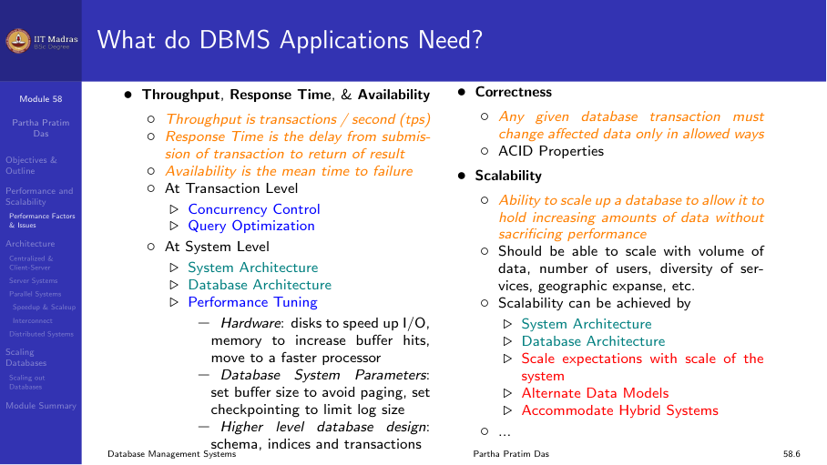
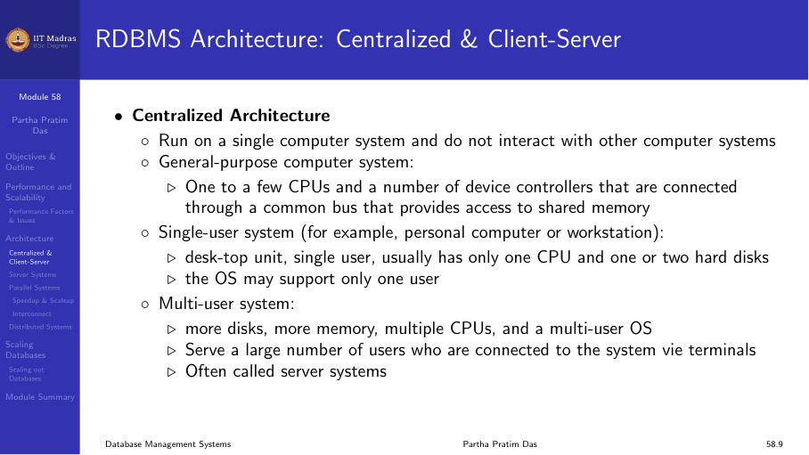
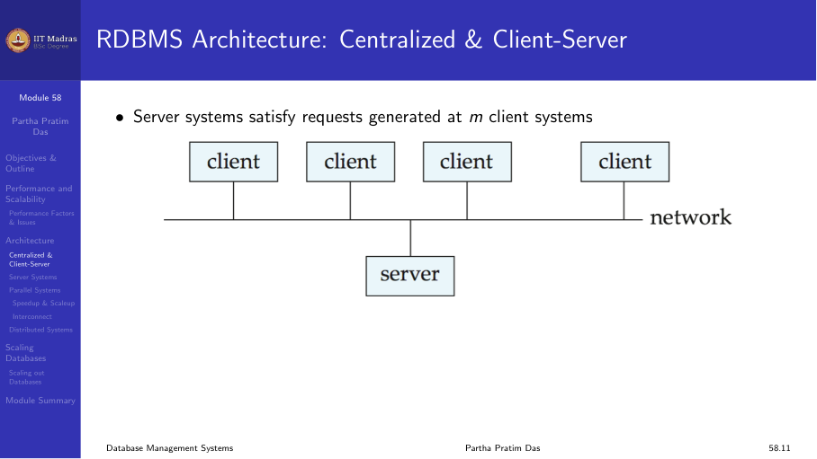
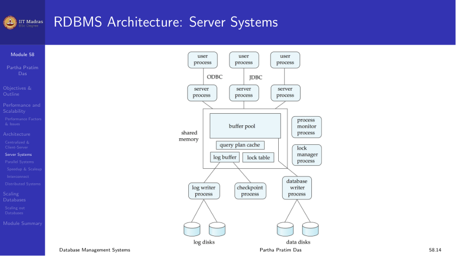
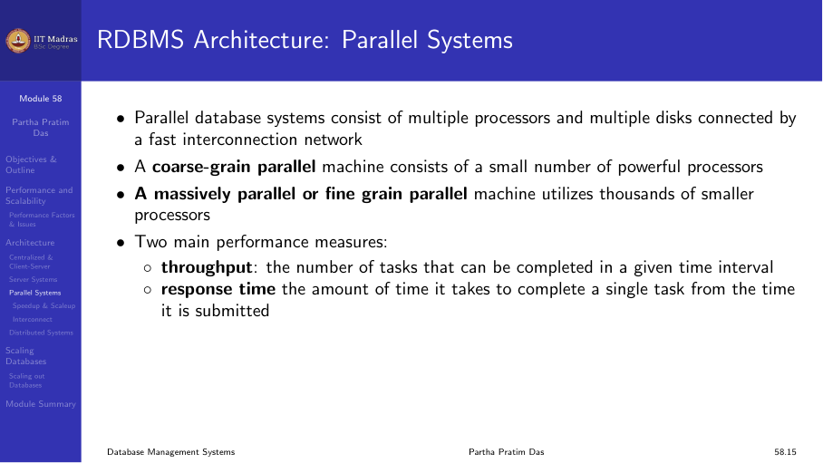
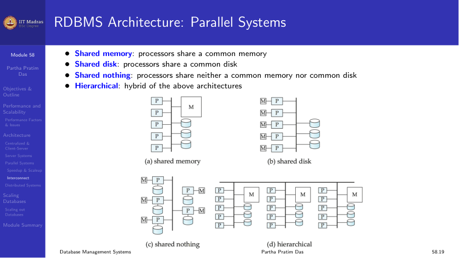
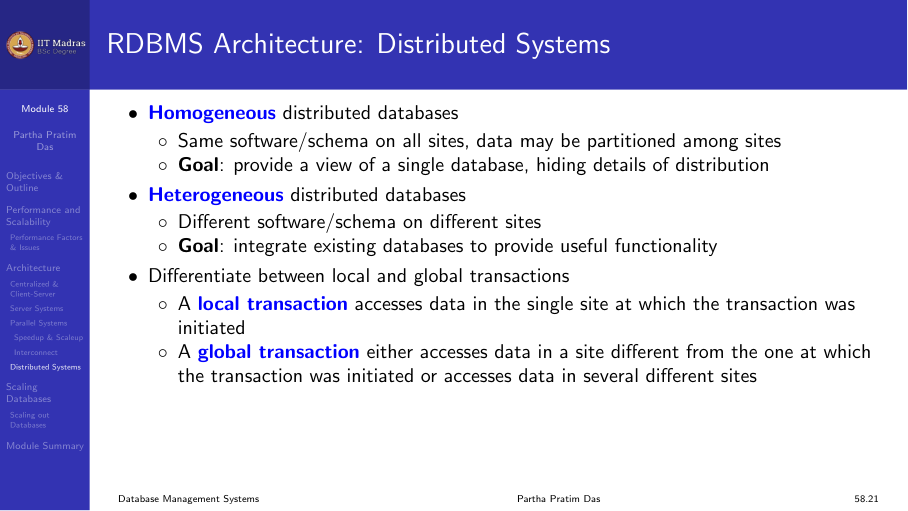
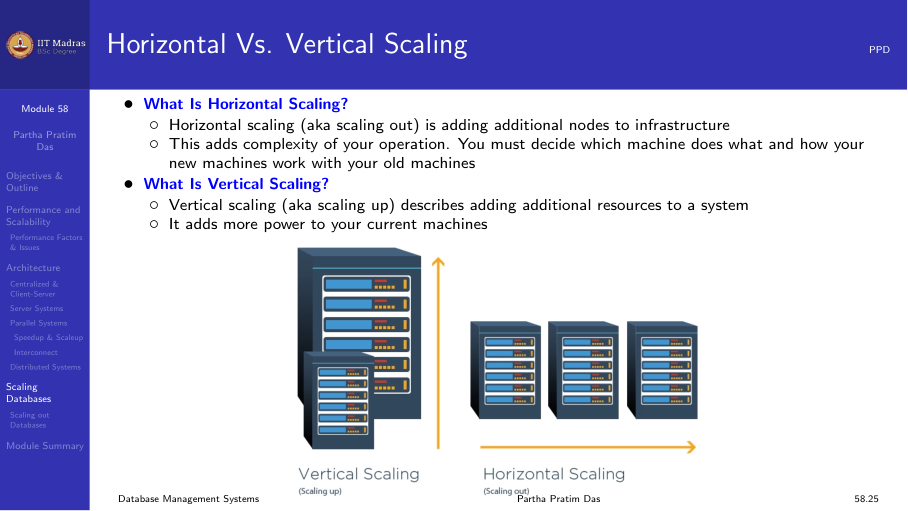

## What do DBMS applications need?

Modern database applications require:

- **Throughput, response time, and availability.** The system must process
  many transactions quickly and be available when needed.
- **Correctness.** ACID properties must be maintained.
- **Scalability.** The system should handle growing data volumes and user
  loads.

## RDBMS architecture

Several architectural models exist for deploying relational databases:

### Centralized architecture

The database runs on a single computer system. One to a few CPUs and a
number of device controllers are connected through a common bus. This is
the simplest architecture, suitable for small to medium workloads.

### Client-server architecture

The database functionality is divided into:

- **Back-end.** Manages access structures, query evaluation and
  optimization, concurrency control, and recovery. Runs on the server.
- **Front-end.** Tools such as forms, report-writers, and graphical user
  interfaces. Run on client machines.

Clients send requests over the network, and the server processes them.

### Transaction server

In a transaction server (also called query server) system:

1. Clients send requests to the server.
2. Transactions are executed at the server.
3. Results are sent back to the client.

The server manages the buffer pool, concurrency control, and recovery.

### Parallel systems

Parallel database systems consist of multiple processors and multiple disks
connected by a fast interconnection network.

**Speedup.** A fixed-sized problem runs N times faster on an N-times
larger system.

**Scaleup.** An N-times larger problem runs in the same time on an N-times
larger system.

In practice, speedup and scaleup are sublinear due to communication
overhead and contention.

#### Interconnect architectures

- **Bus.** Components send and receive data on a single communication bus.
  Does not scale well with increasing parallelism.
- **Mesh.** Components are arranged as nodes in a grid; each is connected
  to its neighbors.

#### Memory architectures

- **Shared memory.** All processors share a common memory.
- **Shared disk.** All processors share a common disk.
- **Shared nothing.** Processors share neither common memory nor common
  disk. Each has its own memory and disk.
- **Hierarchical.** Hybrid of the above.

### Distributed systems

Data is spread over multiple machines (sites or nodes) connected by a
network. Data is shared by users on multiple machines.

#### Homogeneous distributed databases

Same software and schema on all sites. Data may be partitioned among
sites. The goal is to provide a view of a single database, hiding the
details of distribution.

#### Heterogeneous distributed databases

Different software and schemas on different sites. More complex to manage.

#### Advantages of distributed databases

- **Sharing data.** Users at one site can access data at other sites.
- **Autonomy.** Each site retains control over its local data.
- **Higher availability.** Data can be replicated at multiple sites.

## Scaling databases

Relational databases are the mainstay of business. However, web-based
applications caused spikes in demand, and the explosion of social media
sites (Facebook, Twitter) created large data needs. Cloud-based solutions
(Amazon S3, etc.) emerged to address these challenges.

### Horizontal versus vertical scaling

**Vertical scaling (scaling up).** Adding more power to a single machine
(more CPUs, more memory, faster disks). Limited by the maximum capacity
of a single machine.

**Horizontal scaling (scaling out).** Adding more machines to the
infrastructure. This adds complexity — you must decide which machine does
what and how new machines work with existing ones.

## Summary

- DBMS applications need throughput, availability, correctness, and
  scalability.
- Architectures range from centralized to client-server to parallel to
  distributed.
- Parallel systems use shared memory, shared disk, or shared nothing
  designs.
- Distributed systems provide data sharing and autonomy across sites.
- Horizontal scaling (adding more machines) is the primary approach for
  handling large-scale workloads.
