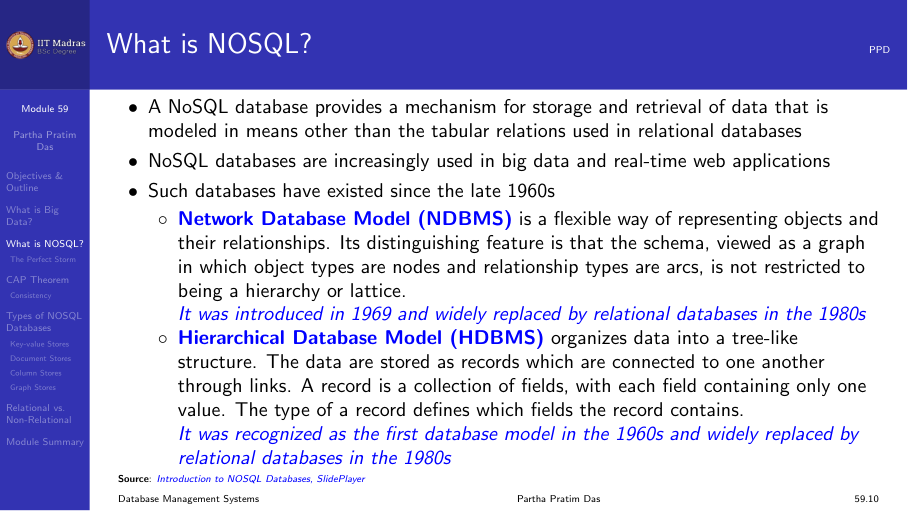

## What is big data

Big data is characterized by three Vs:
- **Volume.** Massive amounts of data (terabytes to petabytes).
- **Velocity.** Data arrives at high speed (streaming, IoT).
- **Variety.** Data types include structured, semi-structured, and
  unstructured.

Traditional RDBMS cannot easily handle all three Vs simultaneously.

## What is NoSQL

NoSQL databases are designed for specific use cases where relational
databases fall short. They typically sacrifice ACID properties for
scalability and performance.

## CAP theorem

The CAP theorem states that a distributed database can guarantee at most
two of three properties:

- **Consistency.** Every read returns the most recent write.
- **Availability.** Every request receives a response.
- **Partition tolerance.** The system continues despite network partitions.

## Types of NoSQL databases

| Type | Example | Use case |
|------|---------|----------|
| Key-value | Redis, DynamoDB | Caching, sessions |
| Document | MongoDB, CouchDB | Content management |
| Column-family | Cassandra, HBase | Time-series, analytics |
| Graph | Neo4j | Social networks, recommendations |

## Consistency models

- **Strong consistency.** All reads return the latest write.
- **Eventual consistency.** Reads may return stale data but will converge.
- **Weak consistency.** No guarantee of recency.
