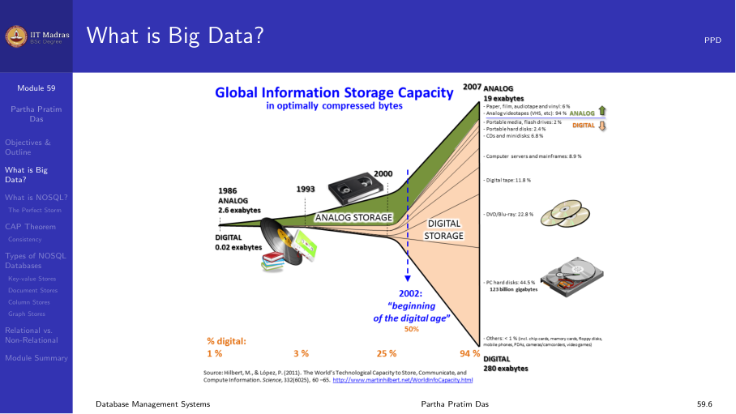
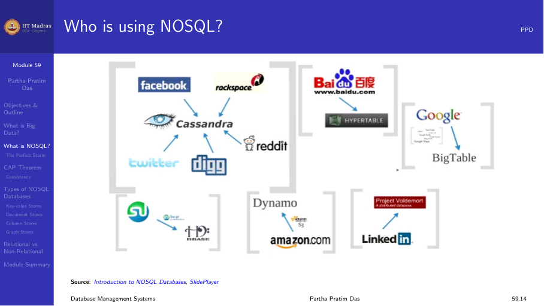
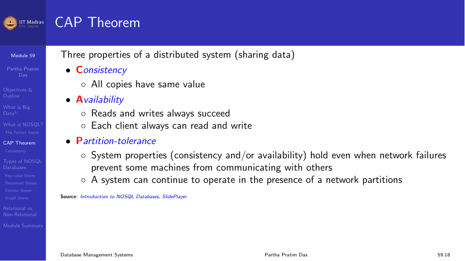
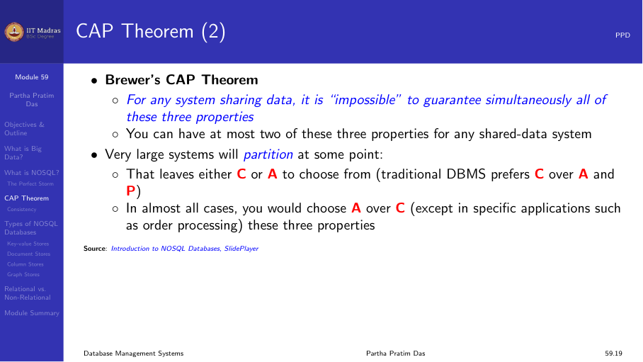

## What is Big Data?

Big Data refers to datasets that are too large or complex for traditional
relational databases to handle efficiently. Key characteristics (the three
Vs):

1. **Volume.** The amount of data generated is massive (terabytes to
   exabytes).
2. **Velocity.** Data is generated rapidly and needs to be processed
   quickly.
3. **Variety.** Data comes in many formats: structured, semi-structured
   (JSON, XML), and unstructured (text, images, video).

### Sources of Big Data

- Social media feeds (Facebook, Twitter, Instagram).
- Sensor data from IoT devices.
- Web server logs.
- Scientific data (genomics, astronomy).
- Financial transactions.

## Beyond the relational model

Relational databases were designed for structured data with well-defined
schemas. Big Data challenges exposed limitations:

- **Schema rigidity.** Adding new attributes requires ALTER TABLE.
- **Scaling difficulty.** ACID compliance makes horizontal scaling hard.
- **Performance.** Joins across large distributed datasets are expensive.
- **Unstructured data.** Relational databases don't handle text, images,
  and nested data well.

## NoSQL databases

NoSQL (Not only SQL) databases emerged to address these challenges. They
relax some of the constraints of relational databases to achieve
scalability and flexibility.

### Types of NoSQL databases

#### 1. Key-value stores

Simplest NoSQL model. Data is stored as key-value pairs, similar to a
dictionary or hash map. The key uniquely identifies a record, and the
value is arbitrary data (often JSON or binary).

**Examples:** Redis, DynamoDB, Riak.

**Use cases:** Session management, caching, user profiles.

#### 2. Document stores

Data is stored as documents, typically in JSON or BSON format. Each
document can have a different structure, providing schema flexibility.
Documents are grouped into collections (analogous to tables).

**Examples:** MongoDB, CouchDB.

**Use cases:** Content management, catalogs, real-time analytics.

#### 3. Column-family stores

Data is stored in column families rather than rows. Related columns are
grouped together, and each row can have different columns. This is
inspired by Google's Bigtable.

**Examples:** Cassandra, HBase.

**Use cases:** Time-series data, logging, IoT data.

#### 4. Graph databases

Data is modeled as nodes (entities) and edges (relationships). Optimized
for traversing relationships between entities.

**Examples:** Neo4j, Amazon Neptune.

**Use cases:** Social networks, recommendation engines, fraud detection.

### NoSQL and ACID

NoSQL databases typically relax one or more ACID properties:

- **Eventually consistent.** Instead of strong consistency, the system
  guarantees that if no updates are made, all replicas will eventually
  converge to the same state.
- **BASE model** (Basically Available, Soft state, Eventually consistent).
  A looser model compared to ACID.

## The CAP theorem

The CAP theorem, proved by Eric Brewer in 2000, states that a distributed
system can guarantee only two of the following three properties:

1. **Consistency (C).** All nodes see the same data at the same time. A
   read returns the most recent write.
2. **Availability (A).** Every request receives a response (success or
   failure), even if some nodes are down.
3. **Partition tolerance (P).** The system continues to function despite
   network partitions (communication breakdowns between nodes).

### CAP theorem trade-offs

Since network partitions are inevitable in distributed systems, the choice
is typically between CP and AP:

- **CP (Consistency + Partition tolerance).** Sacrifice availability (some
  nodes are unavailable during a partition). Example: HBase.
- **AP (Availability + Partition tolerance).** Sacrifice consistency (data
  may be stale during a partition, but the system stays up). Example:
  DynamoDB, Cassandra.

### Real-world considerations

The CAP theorem is not binary — there are degrees of consistency and
availability. Modern distributed databases offer tunable consistency:
- Strong consistency (linearizability).
- Eventual consistency.
- Causal consistency.

## Big Data processing frameworks

### MapReduce

A programming model for processing large datasets in parallel across many
machines. Developed by Google (2004). The model has two phases:

1. **Map.** Processes input key-value pairs and produces intermediate
   key-value pairs.
2. **Reduce.** Aggregates the intermediate pairs by key.

**Hadoop** is the open-source implementation of MapReduce.

### Apache Spark

A successor to MapReduce that keeps data in memory for faster processing.
Supports batch processing, streaming, machine learning, and graph
processing.

## CAP theorem and RDBMS

Traditional RDBMS systems prioritize consistency and availability (CA).
In a distributed setting, this means they cannot tolerate network
partitions gracefully. This is why scaling RDBMS across multiple data
centers is difficult.

## Summary

- Big Data is characterized by volume, velocity, and variety.
- NoSQL databases (key-value, document, column-family, graph) address
  limitations of relational databases for Big Data.
- The CAP theorem limits distributed systems: you can choose only two of
  Consistency, Availability, and Partition tolerance.
- MapReduce and Spark enable distributed processing of large datasets.
