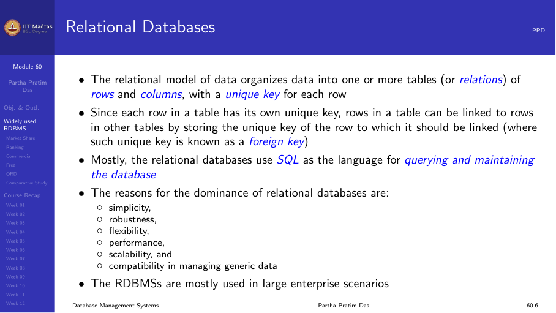

## Looking back

This course covered the full breadth of database management systems — from
the relational foundations to advanced topics in indexing, transactions,
recovery, and Big Data.

### Weeks 1–3: Relational foundations

- **Week 1.** Database architecture, relational model, keys (primary,
  foreign, candidate, super keys).
- **Week 2.** Relational algebra (selection, projection, join,
  set operations) and tuple relational calculus.
- **Week 3.** SQL DDL (CREATE, ALTER, DROP), DML (SELECT, INSERT, UPDATE,
  DELETE), integrity constraints, nested queries, views.

### Weeks 4–6: Database design and programming

- **Week 4.** Database design: ER diagrams, entity sets, relationship
  sets, weak entities, generalization, specialization, aggregation.
- **Week 5.** Functional dependencies, normalization (1NF, 2NF, 3NF,
  BCNF), Joins, views, indexes, integrity, security, SQL injections.
- **Week 6.** Database connectivity: ODBC, JDBC, embedded SQL, psycopg2
  (Python library for PostgreSQL access).

### Weeks 7–9: Advanced SQL and indexing

- **Week 7.** Advanced SQL: triggers, assertions, aggregate functions,
  GROUP BY and HAVING, pivot/unpivot, ranking functions, window
  functions, OLAP, recursive queries.
- **Week 8.** Storage and indexing: physical storage media, RAID, file
  organization, indexing concepts, B+ trees, hash indexes.
- **Week 9.** Advanced indexing: ordered indexing, 2-3-4 trees, B+ trees
  and B-trees, static and dynamic hashing, index design in SQL (CREATE
  INDEX, bitmap indexes).

### Week 10: Transaction management

- **Week 10.** Transaction concepts, ACID properties, schedule,
  serializability, conflict and view serializability, recoverability,
  TCL (COMMIT, ROLLBACK, SAVEPOINT), lock-based protocols, deadlock,
  timestamp-based protocols.

### Week 11: Backup and recovery

- **Week 11.** Backup concepts and strategies, failure classification,
  log-based recovery (undo and redo logging), checkpoints, recovery
  algorithm, recovery with early lock release, RAID levels and
  reliability.

### Week 12: Query optimization and modern topics

- **Week 12.** Query processing steps, cost estimation, sorting, join
  algorithms, equivalence rules, join ordering, RDBMS performance and
  scalability (parallel and distributed architectures), Big Data, NoSQL,
  CAP theorem.

## Key takeaways

### The relational model works

The relational model, with its foundation in set theory and predicate
logic, remains the dominant paradigm for structured data storage. SQL,
despite being decades old, continues to be the most widely used database
language.

### ACID is the gold standard

Atomicity, Consistency, Isolation, and Durability define what it means to
process transactions reliably. Understanding these properties is essential
for building correct applications.

### Normalization prevents anomalies

Functional dependencies and normalization (up to BCNF) are the tools for
designing databases that avoid redundancy and update anomalies.

### Indexes make queries fast

Access methods like B+ trees and hash indexes are the reason relational
databases can answer queries on millions of rows in milliseconds. Choosing
the right index is a critical skill.

### Transactions need concurrency control

Without locks and protocols, concurrent transactions would corrupt data.
Serializability, recoverability, and the various locking protocols ensure
correctness under concurrency.

### Recovery ensures durability

Log-based recovery, checkpoints, and RAID protect data from failures.
These mechanisms guarantee that committed transactions survive crashes.

### New challenges require new solutions

Big Data, NoSQL, and the CAP theorem show that the relational model is not
the answer to every problem. Different workloads require different trade-
offs between consistency, availability, and partition tolerance.

## Final thought

Databases are the invisible backbone of modern computing. Every
transaction, every web page, every mobile app relies on a database
somewhere. Understanding how they work — from the relational algebra to
B+ trees to distributed consistency — gives you the ability to build
robust, scalable, and correct data-driven applications.

This course has given you the vocabulary, the concepts, and the practical
knowledge to work with databases effectively. The journey does not end
here — database technology continues to evolve, but the fundamentals you
have learned will serve you well.

